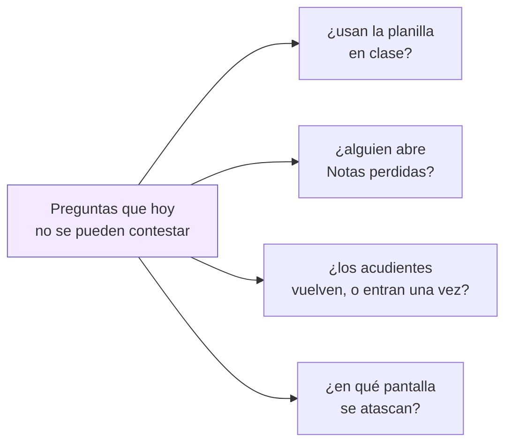
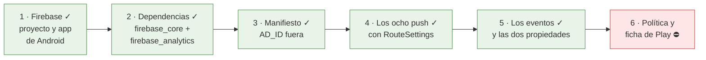

# Analítica: saber si la app se usa, sin recoger a nadie

Google Analytics (el de Firebase) en la app. Escrito el 23 de agosto de 2026 a
petición de Joseth, y **construido el mismo día**: el proyecto de Firebase es
`micolevirtual-mobile` y la app de Android está registrada. Lo que queda es de
consola y de texto legal, no de código; ver «Cómo está ahora mismo».

## Para qué, en una línea

Todo el plan de notas se escribió alrededor de una apuesta —«la fase 3 es la que
quita el portátil de en medio»— y **hoy no hay forma de saber si es verdad**. La
analítica es cómo se comprueba: cuántos docentes abren la planilla, si la abren
en horario de clase, si guardan notas desde ahí o siguen entrando por la web.

No es para vigilar a nadie. Es para saber qué construir después.



## Lo que cuesta: nada

Google Analytics para Firebase es **gratis y sin límite de eventos**, y está en
la lista de servicios «siempre sin coste» del plan Spark, el mismo que ya usa
[notificaciones.md](notificaciones.md). No pide método de pago y no hay tramo a
partir del cual empiece a cobrar.

Dos límites que sí existen, y que a esta app le sobran de largo: **500 nombres
de evento distintos** por app y 25 parámetros por evento. Aquí van a ser unos
quince eventos.

Lo único que se paga sigue siendo lo de siempre: los USD 25 de Play y, solo si
se quiere iOS, los USD 99 al año de Apple.

## La línea roja: ni un dato de un menor sale de aquí

Esto no es un adorno del documento, es la regla que decide todo lo demás.

**A Analytics no se manda nada que identifique a una persona.** Ni nombres, ni
documentos, ni el `alumno_id`, ni una nota, ni el nombre del grupo. Por tres
razones, y cualquiera de las tres basta:

1. **Los términos de Google lo prohíben.** Subir datos personales a Analytics es
   causa de cierre de la cuenta, no una recomendación.
2. **Son menores.** Es el mismo argumento que ya cerró el diseño de las
   notificaciones: [notificaciones.md](notificaciones.md) decidió que ningún
   aviso lleve la nota dentro. Sería incoherente que la nota no viaje en una
   notificación y sí en un evento de analítica.
3. **No hace falta.** Ninguna de las preguntas de arriba necesita saber *quién*.
   «Se guardaron 28 notas de golpe» contesta lo mismo que «Ana guardó 28 notas»
   y no arrastra a nadie.

### Qué sí se manda

**Eventos**, con parámetros que son cantidades y nombres de pantalla:

| Evento | Parámetros | Qué contesta |
|---|---|---|
| `screen_view` | nombre de pantalla | por dónde se anda |
| `notas_guardadas` | `cuantas`, `fallidas` | ¿se pasa una columna entera desde el móvil? |
| `planilla_abierta` | `hora_del_dia` | ¿en clase, o por la noche corrigiendo? |
| `notas_perdidas_abierta` | — | ¿le sirve a alguien esa pantalla? |
| `situacion_creada` | `tipo` (1, 2 o 3) | ¿se usa disciplina desde el teléfono? |
| `refresco_manual` | `pantalla` | dónde la gente no se fía de lo que ve (los diez `RefreshIndicator`) |

**Propiedades de usuario**, dos, y ninguna identifica a nadie:

- `rol` — `docente`, `alumno`, `acudiente`, `admin`. Es lo que permite separar
  «los docentes no la usan» de «los acudientes no la usan», que son dos
  problemas distintos con dos soluciones distintas.
- `colegio` — cuál de los dieciséis. Sin esto, dieciséis colegios se mezclan en
  un solo número y ninguno se puede mirar por separado.

`colegio` es una institución, no una persona. Aun así conviene decirlo: en un
colegio pequeño, «rol = docente, colegio = X» puede ser poca gente. Por eso no
se añade ninguna tercera dimensión —ni grupo, ni asignatura, ni jornada— que al
cruzarse deje a una persona sola en una casilla.

## Lo que se apaga a propósito

### Los permisos de publicidad — y son tres, no uno

El SDK de Analytics **añade solo** permisos de publicidad al manifiesto, aunque
la app no tenga un anuncio. Aquí no se quieren: no hay publicidad, no hay
perfiles y es una app de menores.

Lo que casi todas las guías dicen es que hay que quitar
`com.google.android.gms.permission.AD_ID`. **Eso ya no basta.** Medido en el
manifiesto fusionado de un *build* de verdad, el SDK de hoy trae **tres**: ese y
los dos del Privacy Sandbox de Android.

En `android/app/src/main/AndroidManifest.xml`:

```xml
<manifest xmlns:tools="http://schemas.android.com/tools">
    <uses-permission android:name="com.google.android.gms.permission.AD_ID"
                     tools:node="remove" />
    <uses-permission android:name="android.permission.ACCESS_ADSERVICES_AD_ID"
                     tools:node="remove" />
    <uses-permission android:name="android.permission.ACCESS_ADSERVICES_ATTRIBUTION"
                     tools:node="remove" />
    <application>
        <meta-data android:name="google_analytics_adid_collection_enabled"
                   android:value="false" />
    </application>
</manifest>
```

El `meta-data` apaga la recogida y los `tools:node` impiden que los permisos
lleguen al *bundle*. Hacen falta las dos cosas: solo con el `meta-data`, los
permisos siguen declarados y Play los señala — y declarar permisos de publicidad
en una app de colegio es exactamente lo que no queremos explicar.

**Cómo se comprueba**, que es lo único que vale aquí:

```
flutter build apk --debug
grep -o 'uses-permission android:name="[^"]*"' \
  build/app/intermediates/merged_manifest/debug/processDebugMainManifest/AndroidManifest.xml \
  | sort -u
```

Y quedan cinco, ninguno de publicidad y **ninguno de los que Android pide al
usuario** —son todos de nivel normal, sin diálogo—:

| Permiso | Por qué se queda |
|---|---|
| `INTERNET` | nuestro, de siempre |
| `ACCESS_NETWORK_STATE` | mirar si hay red antes de subir un lote de eventos |
| `WAKE_LOCK` | no dormirse a mitad de una subida |
| `…BIND_GET_INSTALL_REFERRER_SERVICE` | de dónde vino la instalación |
| `…DYNAMIC_RECEIVER_NOT_EXPORTED_PERMISSION` | interna de Flutter, ya estaba |

Los dos primeros son funcionales: quitarlos rompería la subida en vez de
proteger a nadie.

**Ojo con lo que esto cambia en Play.** [publicacion-play.md](publicacion-play.md)
§9 decía «solo `INTERNET` — no hay que justificar nada», y **eso dejó de ser
verdad**: ya está corregido allí, con esta misma tabla.

### La retención de datos

En la consola de Analytics, la retención a nivel de usuario viene en 2 meses por
defecto y se puede subir a 14. **Se deja en 2.** Las preguntas de este documento
son sobre tendencias agregadas, no sobre seguir a nadie durante un año, y el
dato agregado no caduca con esa opción.

## Cómo está ahora mismo

| | |
|---|---|
| Proyecto de Firebase | `micolevirtual-mobile`, app de Android `com.micolevirtual.app` |
| `google-services.json` | en `android/app/`, **en el repositorio** |
| Paquetes | `firebase_core` y `firebase_analytics` |
| Permisos de publicidad | los **tres** fuera del *bundle*, comprobado en el manifiesto fusionado |
| Permisos que quedan | 5, ninguno de los que Android pide al usuario |
| `flutter build apk` | ✓ compila |
| Dónde mide | **solo en Android**; en web y en las pruebas es un no-op |
| Eventos puestos | los seis de la tabla de arriba |
| Pruebas | `test/analitica_test.dart`, 3 |
| Política de privacidad | ⛔ **sigue diciendo que no hay analítica** |

**El `google-services.json` va al repositorio a propósito.** No es un secreto:
viaja dentro del APK y cualquiera lo extrae. Lo que protege una app de Firebase
no es esconder ese archivo —es imposible— sino las reglas del lado del
servidor. El que **sí** es secreto es el JSON de la cuenta de servicio, el de
las notificaciones, y ese no entra aquí ni entrará.

**En web no se mide, y es a propósito.** En Firebase hay registrada una sola
app, la de Android. `Firebase.initializeApp()` sin opciones explícitas no
encuentra proyecto en la web, así que encenderla ahí habría roto un sitio donde
la app hoy funciona. `Analitica` se queda callada y la app se comporta igual que
siempre. Si se quiere medir también la web, hay que registrar la app web en la
consola y generar `firebase_options.dart`; entonces es cambiar una línea.

## Una trampa del código, ya arreglada

`FirebaseAnalyticsObserver` registra `screen_view` leyendo el **nombre** de la
ruta. Y en esta app hay **ocho `MaterialPageRoute` fuera de
[RouteGenerator](../lib/Screens/RouteGenerator.dart), y ninguno lleva
`settings:`**. Comprobado:

```
grep -rn "MaterialPageRoute(" lib/Screens/*.dart | grep -v RouteGenerator   → 8
                                                  ... | grep -c settings    → 0
```

Son justo las pantallas que más interesa medir: la ficha de disciplina, el
editor de situación, los uniformes, la planilla, la ficha de notas del alumno.
Con el observador tal cual, **habrían salido todas como huecos**: se vería
entrar a `/disciplina` y desaparecer.

Es a propósito que no tengan ruta con nombre —[disciplina.md](disciplina.md) lo
explica: reciben modelos ya cargados y devuelven el alumno recalculado, y por
una ruta con nombre eso viaja como `Object?`—. Así que la salida no fue darles
ruta, sino `settings: const RouteSettings(name: …)` en los ocho `push`. Ocho
líneas, ningún cambio de comportamiento, y ahora son ocho y ocho.

**Al añadir una pantalla nueva que se abra con `push`, hay que ponerle el
`settings`.** Es lo único de esto que hay que recordar.

## Y otra que salió al probar

`Analitica.arrancar()` no estaba protegido, y `FirebaseAnalytics.instance`
**lanza `[core/no-app]` en cuanto se toca sin haber inicializado Firebase**. Lo
tapaba el `try` de `main.dart`, así que en producción no se habría notado — pero
significaba que el único sitio que impedía que la analítica tumbara el arranque
estaba fuera de la clase que debía garantizarlo.

Lo encontró `test/analitica_test.dart`, y no de casualidad: en `flutter test` la
plataforma se presenta como Android, así que la prueba recorre exactamente el
camino que recorrería un teléfono donde `initializeApp` fallara —sin red al
abrir, o un `google-services.json` que no llegó al *build*—. Ahora se protege
sola, y hay tres pruebas que lo fijan.

## Lo que hay que cambiar fuera del código

Y esto **no es opcional**: hoy la política de privacidad dice lo contrario.

**[politica-privacidad.md](politica-privacidad.md) se contradice en dos sitios**
en cuanto entre Analytics:

- «Lo que NO recogemos … **No usa publicidad, no incorpora herramientas de
  analítica ni de seguimiento**, y no crea perfiles publicitarios.»
- «Con quién los compartimos … **no hay servicios de publicidad, analítica ni
  redes sociales integrados** en la aplicación.»

Las dos frases dejan de ser verdad el día que se añada el paquete. Hay que
reescribirlas para decir qué se manda a Google, qué no, y que no hay publicidad
ni perfiles publicitarios —lo cual **seguirá siendo cierto**, y es lo que
salva el párrafo—. Como el texto lo tiene que revisar quien lleve el tema legal
del colegio, mejor que llegue ya con esto dentro y no en una segunda vuelta.

**La ficha de Play** ([ficha-play.md](ficha-play.md)) y el formulario de
seguridad de datos: hay que declarar que se recogen datos de uso y diagnóstico,
que van a un tercero (Google) y que no están vinculados a la identidad del
usuario. Es la misma casilla que ya hay que tocar por las notificaciones.

Y lo mismo que dice [notificaciones.md](notificaciones.md): son menores, y
merece la pena que el colegio lo comunique a las familias aunque legalmente
baste con la política.

## Los pasos



**Del 1 al 5 están hechos.** Queda el 6, que no es código: la política de
privacidad y el formulario de seguridad de datos de Play, y los dos hay que
tocarlos antes de enviar la app a revisión.

Y queda, cuando se quiera, comprobar en la consola que los eventos llegan:
*Analytics ▸ DebugView* los enseña en directo con la app corriendo en un
teléfono. Es la única forma de saber que la tubería está entera, igual que en
las notificaciones el paso 3 era mandar un aviso de muro de verdad.

## Lo que esto NO es

- **No es Crashlytics.** Analytics dice qué se usa; los fallos que revientan la
  app son otro producto, también gratis, y otro paquete. Si lo que se quiere es
  enterarse de las caídas, eso es `firebase_crashlytics` y merece su propia
  decisión.
- **No es medir a un docente.** No hay identificador de persona en ningún
  evento, así que la pregunta «¿cuánto usa la app el profesor Pérez?» no se
  puede contestar con esto. Es deliberado: es una herramienta de producto, no de
  supervisión laboral, y el día que alguien la pida para eso, la respuesta es
  que no está construida así.
