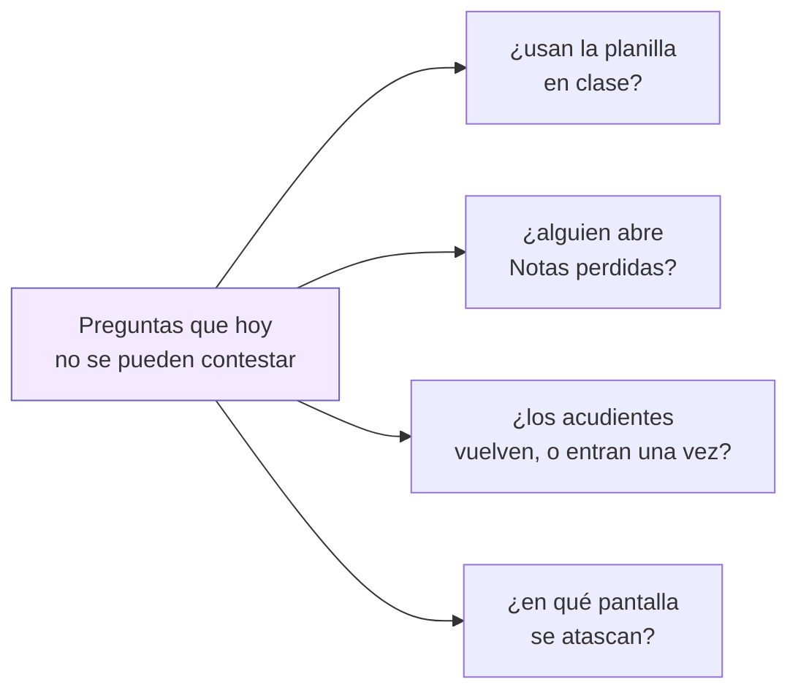
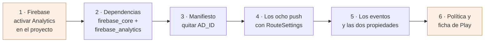

# Analítica: saber si la app se usa, sin recoger a nadie

Plan para poner Google Analytics (el de Firebase) en la app. Escrito el 23 de
agosto de 2026, a petición de Joseth.

## Para qué, en una línea

Todo el plan de notas se escribió alrededor de una apuesta —«la fase 3 es la que
quita el portátil de en medio»— y **hoy no hay forma de saber si es verdad**. La
analítica es cómo se comprueba: cuántos docentes abren la planilla, si la abren
en horario de clase, si guardan notas desde ahí o siguen entrando por la web.

No es para vigilar a nadie. Es para saber qué construir después.



## Lo que cuesta: nada

Google Analytics para Firebase es **gratis y sin límite de eventos**, y está en
la lista de servicios «siempre sin coste» del plan Spark, el mismo que ya usa
[notificaciones.md](notificaciones.md). No pide método de pago y no hay tramo a
partir del cual empiece a cobrar.

Dos límites que sí existen, y que a esta app le sobran de largo: **500 nombres
de evento distintos** por app y 25 parámetros por evento. Aquí van a ser unos
quince eventos.

Lo único que se paga sigue siendo lo de siempre: los USD 25 de Play y, solo si
se quiere iOS, los USD 99 al año de Apple.

## La línea roja: ni un dato de un menor sale de aquí

Esto no es un adorno del documento, es la regla que decide todo lo demás.

**A Analytics no se manda nada que identifique a una persona.** Ni nombres, ni
documentos, ni el `alumno_id`, ni una nota, ni el nombre del grupo. Por tres
razones, y cualquiera de las tres basta:

1. **Los términos de Google lo prohíben.** Subir datos personales a Analytics es
   causa de cierre de la cuenta, no una recomendación.
2. **Son menores.** Es el mismo argumento que ya cerró el diseño de las
   notificaciones: [notificaciones.md](notificaciones.md) decidió que ningún
   aviso lleve la nota dentro. Sería incoherente que la nota no viaje en una
   notificación y sí en un evento de analítica.
3. **No hace falta.** Ninguna de las preguntas de arriba necesita saber *quién*.
   «Se guardaron 28 notas de golpe» contesta lo mismo que «Ana guardó 28 notas»
   y no arrastra a nadie.

### Qué sí se manda

**Eventos**, con parámetros que son cantidades y nombres de pantalla:

| Evento | Parámetros | Qué contesta |
|---|---|---|
| `screen_view` | nombre de pantalla | por dónde se anda |
| `notas_guardadas` | `cuantas`, `fallidas` | ¿se pasa una columna entera desde el móvil? |
| `planilla_abierta` | `hora_del_dia` | ¿en clase, o por la noche corrigiendo? |
| `notas_perdidas_abierta` | — | ¿le sirve a alguien esa pantalla? |
| `situacion_creada` | `tipo` (1, 2 o 3) | ¿se usa disciplina desde el teléfono? |
| `refresco_manual` | `pantalla` | dónde la gente no se fía de lo que ve |

**Propiedades de usuario**, dos, y ninguna identifica a nadie:

- `rol` — `docente`, `alumno`, `acudiente`, `admin`. Es lo que permite separar
  «los docentes no la usan» de «los acudientes no la usan», que son dos
  problemas distintos con dos soluciones distintas.
- `colegio` — cuál de los dieciséis. Sin esto, dieciséis colegios se mezclan en
  un solo número y ninguno se puede mirar por separado.

`colegio` es una institución, no una persona. Aun así conviene decirlo: en un
colegio pequeño, «rol = docente, colegio = X» puede ser poca gente. Por eso no
se añade ninguna tercera dimensión —ni grupo, ni asignatura, ni jornada— que al
cruzarse deje a una persona sola en una casilla.

## Lo que se apaga a propósito

### El identificador de publicidad

El SDK de Analytics **añade solo** el permiso
`com.google.android.gms.permission.AD_ID` al manifiesto, aunque la app no tenga
un solo anuncio. Aquí no se quiere: no hay publicidad, no hay perfiles y es una
app de menores, así que se apaga y se quita el permiso.

En `android/app/src/main/AndroidManifest.xml`:

```xml
<manifest xmlns:tools="http://schemas.android.com/tools">
    <uses-permission android:name="com.google.android.gms.permission.AD_ID"
                     tools:node="remove" />
    <application>
        <meta-data android:name="google_analytics_adid_collection_enabled"
                   android:value="false" />
    </application>
</manifest>
```

Las dos cosas, no una: el `meta-data` apaga la recogida, y el `tools:node`
impide que el permiso llegue al *bundle*. Si solo se pone el primero, el permiso
sigue declarado y Play lo señala en el formulario de seguridad de datos — y
declarar un permiso de publicidad en una app de colegio es exactamente lo que no
queremos explicar.

Hoy [publicacion-play.md](publicacion-play.md) §9 puede decir «solo `INTERNET` —
no hay que justificar nada». **Eso hay que mantenerlo cierto**, y esta es la
forma.

### La retención de datos

En la consola de Analytics, la retención a nivel de usuario viene en 2 meses por
defecto y se puede subir a 14. **Se deja en 2.** Las preguntas de este documento
son sobre tendencias agregadas, no sobre seguir a nadie durante un año, y el
dato agregado no caduca con esa opción.

## Una trampa del código que hay que arreglar antes

`FirebaseAnalyticsObserver` registra `screen_view` leyendo el **nombre** de la
ruta. Y en esta app hay **ocho `MaterialPageRoute` fuera de
[RouteGenerator](../lib/Screens/RouteGenerator.dart), y ninguno lleva
`settings:`**. Comprobado:

```
grep -rn "MaterialPageRoute(" lib/Screens/*.dart | grep -v RouteGenerator   → 8
                                                  ... | grep -c settings    → 0
```

Son justo las pantallas que más interesa medir: la ficha de disciplina, el
editor de situación, los uniformes, la planilla, la ficha de notas del alumno.
Con el observador tal cual, **saldrían todas como huecos**: se vería entrar a
`/disciplina` y desaparecer.

Es a propósito que no tengan ruta con nombre —[disciplina.md](disciplina.md) lo
explica: reciben modelos ya cargados y devuelven el alumno recalculado, y por
una ruta con nombre eso viaja como `Object?`—. La salida no es darles ruta, es
ponerles `settings: const RouteSettings(name: 'ficha-disciplina')` al `push`.
Ocho líneas, ningún cambio de comportamiento.

## Lo que hay que cambiar fuera del código

Y esto **no es opcional**: hoy la política de privacidad dice lo contrario.

**[politica-privacidad.md](politica-privacidad.md) se contradice en dos sitios**
en cuanto entre Analytics:

- «Lo que NO recogemos … **No usa publicidad, no incorpora herramientas de
  analítica ni de seguimiento**, y no crea perfiles publicitarios.»
- «Con quién los compartimos … **no hay servicios de publicidad, analítica ni
  redes sociales integrados** en la aplicación.»

Las dos frases dejan de ser verdad el día que se añada el paquete. Hay que
reescribirlas para decir qué se manda a Google, qué no, y que no hay publicidad
ni perfiles publicitarios —lo cual **seguirá siendo cierto**, y es lo que
salva el párrafo—. Como el texto lo tiene que revisar quien lleve el tema legal
del colegio, mejor que llegue ya con esto dentro y no en una segunda vuelta.

**La ficha de Play** ([ficha-play.md](ficha-play.md)) y el formulario de
seguridad de datos: hay que declarar que se recogen datos de uso y diagnóstico,
que van a un tercero (Google) y que no están vinculados a la identidad del
usuario. Es la misma casilla que ya hay que tocar por las notificaciones.

Y lo mismo que dice [notificaciones.md](notificaciones.md): son menores, y
merece la pena que el colegio lo comunique a las familias aunque legalmente
baste con la política.

## Los pasos



El paso 1 es de consola y no lo puede hacer esta sesión: hay que crear el
proyecto de Firebase —**el mismo de las notificaciones, uno solo para los
dieciséis colegios**— y bajar el `google-services.json`. Del 2 al 5 es trabajo
de app, y no depende del backend para nada: **es lo único del roadmap que se
puede empezar sin esperar al servidor.**

Si Analytics se activa al crear el proyecto, el paso 1 sale gratis: es una
casilla en el asistente. Si el proyecto ya existe sin Analytics, se añade desde
*Configuración del proyecto ▸ Integraciones*.

## Lo que esto NO es

- **No es Crashlytics.** Analytics dice qué se usa; los fallos que revientan la
  app son otro producto, también gratis, y otro paquete. Si lo que se quiere es
  enterarse de las caídas, eso es `firebase_crashlytics` y merece su propia
  decisión.
- **No es medir a un docente.** No hay identificador de persona en ningún
  evento, así que la pregunta «¿cuánto usa la app el profesor Pérez?» no se
  puede contestar con esto. Es deliberado: es una herramienta de producto, no de
  supervisión laboral, y el día que alguien la pida para eso, la respuesta es
  que no está construida así.
