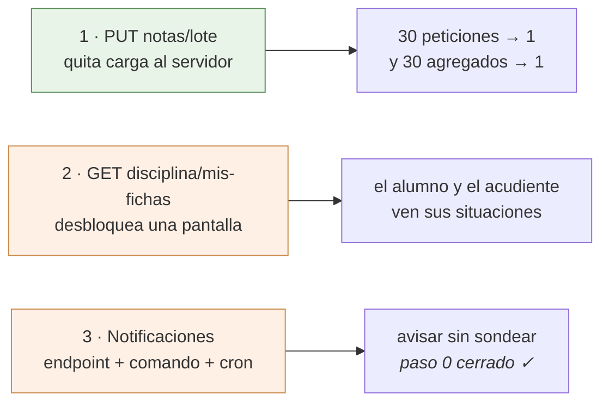

# Lo que la app necesita del servidor

Tres cosas, y ninguna se puede hacer desde el lado Flutter. El backend
(`~/DESARROLLOS/8myvc`) es **de solo lectura** para esta app: se lee para saber
qué devuelve cada endpoint y nunca se edita. Esto es la petición, escrita con el
detalle suficiente para que se pueda decidir sin volver a investigar, y para que
el día que se autorice no haya que redescubrir nada.

Están ordenadas por lo que dan a cambio de lo que cuestan.



---

## 1. `PUT notas/lote` — guardar varias notas de una vez

**Lo que pasa hoy.** No hay endpoint de lote: `PUT notas/update/{id}` es de una
en una, así que pasar una columna de treinta alumnos son treinta peticiones. La
app ya hace lo que puede desde su lado —manda solo las que cambiaron y de tres
en tres, ver [notas.md §1.5](notas.md)— pero el fondo no lo puede arreglar.

**Y el coste real no son las treinta peticiones.** Es lo que hace cada una.
`NotasController::putUpdate` termina llamando a
`DefinitivasDeAsignatura::recalcularPorNota`, que acaba en `recalcular(...)`, y
ahí está lo que importa:

```php
$calculadas = self::calcular($asignaturaId, $periodoId);   // TODA la asignatura

if ($soloAlumno !== null) {
    $calculadas = array_values(array_filter(...));          // y el filtro, después
}
```

`calcular()` es un agregado sobre **todas** las notas de la asignatura y el
periodo, con tres *joins* y un `GROUP BY`; el recorte a un solo alumno se hace
en PHP, **después**, y dentro de una transacción. O sea que pasar una columna de
treinta notas dispara **treinta agregados de la asignatura entera**, veintinueve
de ellos para tirar el resultado.

En un VPS eso no se nota. En un hosting compartido es justo lo que hay que no
hacer ([hosting compartido](notas.md) §5).

**Lo que se pide.**

| | |
|---|---|
| Ruta | `PUT notas/lote`, con `auth.personal` |
| Cuerpo | `{"notas": [{"id": 900, "nota": 85}, {"id": 901, "nota": 40}]}` |
| Permiso | el mismo de una en una: `User::pueden_editar_notas` con `PeriodoDeLaFila::deNota($id)`, **por nota**, no una vez para el lote |
| Bitácoras | una por nota, idénticas a las de hoy: son el rastro que mira el colegio cuando alguien reclama, y el historial de la app las lee |
| Recálculo | **uno solo al final**, por cada par (asignatura, periodo) tocado, con `recalcular(...)` sin `soloAlumno` |
| Respuesta | `{"guardadas": 28, "fallidas": [{"id": 901, "motivo": "..."}]}` |

Lo de la respuesta no es capricho: la app ya sabe reintentar solo lo que falló
sin que el docente vuelva a teclear nada, y para eso necesita saber **cuáles**
fallaron. Que un lote entero se caiga por una nota sería peor que lo de ahora.

**Existe, y el lado de la app está escrito** (24 ago 2026). Vive en
`_guardarEnLote` de [LibroNotasApi](../lib/Http/LibroNotasApi.dart), detrás de
`Interruptores.notasLote`, **apagado**: se enciende el día que el endpoint esté
desplegado en los dieciséis colegios, no el día que se fusione. Ver
[Interruptores](../lib/Utils/Interruptores.dart).

Tres cosas salieron de leer el controlador en vez de fiarse de este contrato, y
las tres cambian lo que la app tenía que hacer:

- **El lote tiene tope de 200, y pasarse no recorta: aborta el lote entero con
  un 422.** El propio controlador dejó anotado que el número se justificó
  «dando por hecha una capacidad del cliente que no existe» — ningún cliente
  partía en tandas. Ahora la app trocea de **cien en cien**, con margen por
  debajo del tope para que bajarlo no la rompa. Una columna de cuarenta y cinco
  sigue siendo una sola petición.
- **La respuesta trae `definitivas`**, que este documento no pedía: la
  definitiva de cada alumno tocado, calculada por el mismo recalculador que la
  escribe. Se parsea, viaja en `ResultadoGuardado.definitivas` y **ya se usa**:
  la planilla la devuelve al libro y `LibroDeNotas.conDefinitivaDelLote` la
  aplica. Eso quita las dos verdades — antes, después de pasar una columna, la
  definitiva de la pestaña «Por alumno» era la que la app se calculaba sola.
  Se copia **encima de la fila que ya existe**, porque el lote no devuelve el
  `nf_id` y una fila con `nf_id` cero apaga el control de nivelar: se habría
  perdido el botón por refrescar un número.
- **`manual` y `recuperada` llegan como booleanos de verdad**, no como el `1/0`
  de PDO que usa el resto del archivo, porque esta respuesta la arma PHP con un
  `(bool)` delante. Leerlas con `entero(x) == 1` pintaría una definitiva manual
  como automática.

---

## 2. `GET disciplina/mis-fichas` — que el alumno vea lo suyo

**Lo que pasa hoy.** La pantalla de disciplina existe y funciona para el
personal; el alumno y el acudiente no entran. No es pudor: se comprobó que en
todo el backend solo cuatro controladores tocan `dis_procesos` —`Disciplina`,
`Comportamiento`, `NotaComportamiento` y `Grupos`— y **todas** sus rutas llevan
`auth.personal`, que aborta con 403 a `Alumno` y `Acudiente`.

El único endpoint de notas abierto a ellos, `GET notas/alumno/{id}`, trae por
periodo las asignaturas, sus ausencias de clase y `nota_comportamiento` —que es
**la nota**, no las fichas—. Uniformes y tardanzas de institución, igual de
cerrados.

**Lo que se pide.**

| | |
|---|---|
| Ruta | `GET disciplina/mis-fichas/{alumno_id?}` |
| Guarda | `boletin.propio:sin-paz-y-salvo`, **no** `auth.personal` |
| Respuesta | `{"alumno": {…}, "config": {…}, "ordinales": [ … ]}` |

Sobre la guarda: ya existe y hace exactamente esto. `ExigirBoletinPropio` deja
pasar de largo a quien no es alumno ni acudiente, y a los que lo son les
comprueba que el `alumno_id` pedido sea el suyo o el de un acudido; sin id
significa «lo mío». El modo `sin-paz-y-salvo` es el correcto: **retener el
boletín de quien debe es una cosa y esconderle a una familia la situación
disciplinaria de su hijo es otra, y esa nadie la ha pedido.** Es la misma
decisión que ya se tomó para `notas/alumno` y para `matriculas/prematricular`.

Sobre la forma: **que `alumno` sea igual que un elemento de
`PUT disciplina/alumnos`**, con sus `periodoN[]`, sus `proceso_ordinales`, sus
`uniformes_perN[]` y sus contadores. No por comodidad, sino porque así la app
reutiliza [AlumnoDisciplinaModel](../lib/Models/AlumnoDisciplinaModel.dart) y
[FichaDisciplinaScreen](../lib/Screens/FichaDisciplinaScreen.dart) tal cual, en
modo lectura: la pantalla ya está escrita y probada. Con otra forma habría que
escribir un modelo nuevo y una pantalla nueva para enseñar lo mismo.

`config` y `ordinales` van porque la ficha los necesita para pintar: los tres
tipos se llaman como los llame el colegio —`falta_tipoN_displayname`— y los
ordinales de cada situación se resuelven contra el catálogo del año. **No** hace
falta mandar `grupos` ni `descripciones_typeahead`: eso es del editor, y aquí no
se escribe nada.

**Lo que cambia en la app cuando exista.** Una pantalla corta —la ficha en modo
lectura— y la opción del menú para alumnos y acudientes. Ver
[disciplina.md](disciplina.md) → «Lo que queda pendiente».

---

## 3. Notificaciones — un endpoint, un comando y una línea de cron

El plan entero, con el porqué de cada decisión, está en
[notificaciones.md](notificaciones.md). Resumido, hace falta:

1. **Un endpoint que devuelva los temas** que le tocan a quien se identifica —los
   suyos y los de sus acudidos—. Es la pieza de seguridad de todo el diseño: el
   nombre del tema se deriva con `HMAC-SHA256(alumno_id, secreto)` y **eso vive
   solo en el servidor**. Si el teléfono pudiera calcularlo, cualquiera se
   suscribiría a los avisos de un menor que no es suyo.
2. **Un comando de artisan**, `notificaciones:enviar`, con cuatro consultas
   agrupadas sobre datos que ya se registran —`bitacoras`, `ausencias`,
   `dis_procesos`, `publicaciones`—, una marca de por dónde iba, y el envío.
3. **La línea de cron**: `*/15 * * * * php artisan notificaciones:enviar`.

**El paso 0 ya está comprobado, el 23 de agosto de 2026, y sale bien:** el
hosting deja salir por HTTPS a `oauth2.googleapis.com` y a `fcm.googleapis.com`
—los dos contestan— y ejecuta artisan (Laravel 13.26.1). Y **el cron dispara**, comprobado con
una tarea de prueba que corrió cuatro veces. O sea que el push es viable, no
hace falta el plan B y **no queda nada por comprobar**: lo que falta es escribir
las tres piezas.

Ese cron **no es uno, es un bucle sobre los dieciséis colegios**: cada uno es un
directorio con su `.env` y su base. El detalle, en
[notificaciones.md](notificaciones.md) → «Lo comprobado en el servidor».

No hace falta añadir el SDK de Google: se firma un JWT con `openssl_sign` y se
pide el token con Guzzle, que ya está en el `composer.json`.

---

## 4. La versión mínima — un campo, no una ruta

**El lado de la app está hecho; falta la mitad del servidor.** Joseth autorizó
el 24 de agosto de 2026 que la app compruebe la versión y que **bloquee** —ver
[VersionMinima](../lib/Utils/VersionMinima.dart) y
[ActualizarScreen](../lib/Screens/ActualizarScreen.dart)—. Lo que falta es que
el backend **mande el número**, y hasta que lo mande esto es código dormido:
sin el campo no se bloquea a nadie, que es justo lo que lo hace inofensivo de
publicar.

**El problema no es de esta app, es de todos.** `myvc_flutter` **no comprueba en
ninguna parte** que su versión siga siendo aceptable. Un teléfono con la versión
del año pasado sigue llamando a los mismos endpoints indefinidamente y nadie se
entera. Mientras eso sea así, **retirar cualquier endpoint depende de que
dieciséis colegios se actualicen por su cuenta**: es la condición de entrada de
la fase 7 de `18-auditoria.md` y de la fase 5 de `00`, y por eso esas fases hoy
no tienen fecha —que no es lo mismo que tenerla lejos—.

### Lo que se pide: un campo en una respuesta que ya existe

    POST /login  →  { ..., "version_minima_app": 1 }

> **El ejemplo dice 1 y no un número redondo, a propósito.** La app publicada
> es el `versionCode` **1** —`version: 1.0.0+1`— y ni siquiera está en Play. Un
> colegio que copie un «12» de cualquier ejemplo **bloquea a todos sus usuarios
> de golpe y no hay ninguna versión a la que puedan actualizar**: la pantalla
> de bloqueo les manda a la tienda y en la tienda no hay nada. Desde el cliente
> no se distingue eso de un colegio que de verdad exige la última. El número
> que se ponga tiene que ser el de una versión **que exista en la tienda**.

**Un entero, el `versionCode`** —el `+N` de `pubspec.yaml`—, no la versión con
puntos: es el número que Play compara y el único que no admite interpretación.

**Y en `login`, no en una ruta nueva.** Cuesta cero peticiones y cero rutas: la
app ya llama a `POST /login` en los dos únicos momentos donde el dato sirve
—`LoginController` al entrar con usuario y contraseña, y
`ContextoAcademico.refrescar()` al recuperar la sesión guardada al arrancar—.
Una ruta nueva sería una petición más en cada arranque, en un hosting
compartido, para leer un número que cambia dos veces al año. Si aun así se
prefiere ruta aparte, la app se adapta; pero entonces que sea cacheable.

Opcional, y solo si sale gratis: `"version_minima_mensaje": "..."`, para poder
decir *por qué* hay que actualizar. Sin él, la app pone un texto genérico.

### Lo que hace la app, y lo que NO hace pase lo que pase

| Situación | Qué hace |
|---|---|
| Su `versionCode` ≥ el mínimo | nada, ni un aviso |
| Su `versionCode` < el mínimo | pantalla que explica y lleva a Play. **No deja entrar** |
| El campo no viene | **entra** |
| El campo no es un entero positivo | **entra** |
| No hay red, o el servidor no contesta | **entra** |
| Ya está dentro trabajando | **no se le echa**; se comprueba al arrancar y al entrar |
| Está bloqueado y tiene cuenta en otro colegio | **puede llegar al login**; ver abajo |

**Las cuatro filas de «entra» son la parte importante del contrato, no la letra
pequeña.** Un campo mal puesto en el `.env` de un colegio no puede dejar a ese
colegio entero fuera de la app: el fallo por defecto tiene que ser dejar pasar.
Bloquear es lo excepcional y solo con un número que se entienda.

**Y «absurdo» no se puede programar**, así que lo implementado es lo único que
sí: **no es un entero positivo → entra**. Un número altísimo —999999999— **sí
bloquea**, y tiene que hacerlo: desde el cliente no hay forma de distinguir un
`.env` con un dedazo de un colegio que de verdad exige la última versión, y
adivinarlo sería justo lo contrario de lo que hace fiable esta comprobación.
**La defensa contra el dedazo está en el servidor**: ese número se sube una vez
por retirada, con la misma ceremonia que un despliegue.

**Y esto es lo que hay que leer antes de tocar ese número, no después:** un `99`
donde iba un `9` **deja al colegio entero fuera de la app hasta que alguien
vuelva a tocar el servidor**. Desde el teléfono no hay arreglo —la app hace lo
que se le dijo— y la única salida que ofrece la pantalla es salir e ingresar en
**otro** colegio, que solo le sirve a quien tenga cuenta en dos. No es un motivo
para no hacerlo; es el motivo por el que ese campo no se edita a la ligera ni se
copia de un colegio a otro sin mirar.

**La pantalla de entrar es la única que se deja pasar bloqueado**, y no es una
rendija. Son dieciséis colegios con una sola app y **el número lo pone cada
colegio en su servidor**, así que quien tenga cuenta en dos puede estar
bloqueado por el que va atrasado y no por el otro; sin esa salida no le quedaría
forma de llegar a la pantalla de entrar. No debilita nada, porque entrar vuelve
a leer el número: si el colegio nuevo también lo exige, la puerta se cierra otra
vez en cuanto se sale del login. Y al cerrar sesión el número se olvida, por lo
mismo: es del colegio del que se sale, no de este teléfono.

**Y bloquear de verdad, no sugerir.** Un aviso que se puede cerrar no permite
retirar nada, que es justo para lo que existe esto: si la versión vieja puede
seguir entrando, el endpoint viejo sigue haciendo falta. La contrapartida es que
el número hay que subirlo con cuidado —una vez por retirada, no en cada
publicación— y eso es de quien despliega, no de la app.

### Lo que costó del lado Flutter, ya hecho

Dos dependencias —`package_info_plus`, que lee el `versionCode` del paquete
instalado, y `url_launcher` para llevar a Play— y tres enganches.

Lo del `versionCode` merece una línea: se lee del paquete y no de una constante
en el código **porque una constante se queda vieja el día que alguien publique
sin acordarse de subirla**, que es exactamente el fallo que esto viene a evitar.

Los enganches son los tres sitios por los que pasa una respuesta de `/login`:
`tomarUsuarioDe` —que comparten entrar con contraseña y recuperar la sesión
guardada— y `ContextoAcademico.refrescar`, que es la única llamada a `/login`
que la app hace ya estando dentro, y por tanto donde se entera de que el colegio
subió el número sin tener que salir y volver a entrar.

**La comprobación vive en el router**, no en cada pantalla: una puerta que se
mira en veinte sitios es una puerta que un día se queda sin mirar en uno.

### Lo que esto desbloquea, para que se vea qué se compra

Con esto, retirar un endpoint pasa a ser comprobable: se publica la versión que
ya no lo llama, se sube el mínimo, y el servidor sabe que nadie por debajo entra.
Sin esto, la única forma honesta es mirar el reparto por versión de Play Console
y decidir a ojo — que también vale, pero es un dato de tienda y no un contrato.

---

## Cómo arrancar la sesión que hace esto

Se trabaja **desde dentro del backend** —`cd ~/DESARROLLOS/8myvc && claude`—, no
desde la sesión de Flutter: ese repo tiene su `CLAUDE.md`, su
`docs/migracion/ESTADO-ACTUAL.md` y su docker con las pruebas, y hacerlo desde
fuera se salta sus convenciones.

El texto de arranque, para pegar tal cual:

```
Vengo de la app (myvc_flutter). Joseth autorizó el 23 ago 2026 hacer aquí tres
cosas que la app necesita y no se pueden resolver desde el lado Flutter.

Lee primero, en este orden:
  1. docs/migracion/ESTADO-ACTUAL.md (de este repo)
  2. ~/DESARROLLOS/myvc_flutter/docs/backend-pendiente.md — los tres contratos,
     con la evidencia que los justifica y lo ya investigado

Hazlas en este orden, cada una con sus tests y actualizando ESTADO-ACTUAL.md en
el mismo commit:

1. PUT notas/lote. Lo que ahorra NO son las peticiones: cada notas/update llama
   a recalcularPorNota -> recalcular(), que agrega TODAS las notas de la
   asignatura y el periodo y sólo después se queda con un alumno. Una columna de
   30 notas son 30 agregados de la asignatura entera. El lote debe recalcular
   UNA vez por par (asignatura, periodo), al final y fuera de la transacción de
   escritura. Ya comprobado: pueden_editar_notas() acepta un array de periodos y
   los cruza con AND, así que el permiso se comprueba una sola vez y antes de
   escribir nada; la bitácora debe ser idéntica a la de putUpdate, y
   bitacoras.historial_id admite null (putUpdate lo resuelve con un cross join y
   por eso revienta con 422 si el usuario no tiene historial).

2. GET disciplina/mis-fichas/{alumno_id?} con la guarda que YA existe,
   boletin.propio:sin-paz-y-salvo. Debe devolver {alumno, config, ordinales} con
   `alumno` en la MISMA forma que un elemento de PUT disciplina/alumnos: así la
   app reutiliza AlumnoDisciplinaModel y FichaDisciplinaScreen tal cual, en modo
   lectura, y esa pantalla ya está escrita y probada. Sin `grupos` ni
   `descripciones_typeahead`: eso es del editor y aquí no se escribe.

3. Las tres piezas de notificaciones (endpoint de temas con HMAC, comando
   notificaciones:enviar, entrada de cron). El paso 0 está CERRADO y las cuatro
   comprobaciones salieron bien el 23 ago: el hosting sale por HTTPS a
   oauth2.googleapis.com y fcm.googleapis.com, ejecuta artisan (Laravel 13.26.1,
   PHP 8.4.24 en /usr/local/bin/php) y el cron dispara. El plan entero, con el
   porqué de cada decisión, está en ~/DESARROLLOS/myvc_flutter/docs/notificaciones.md.
   El cron NO es uno: cada colegio es un directorio con su .env y su base, y son
   dieciséis, así que va un bucle secuencial con $HOME.

Y una restricción de despliegue que hay que dejar anotada donde toque: `app/` es
copia por colegio y myvc_flutter es UNA sola app para los dieciséis. La app no
puede llamar a notas/lote hasta que esté desplegado en todos, o gastaría un 404
antes de caer al método viejo. Avísame cuando esté desplegado y hago el lado
Flutter.
```

---

## Lo que la app necesita que NO se rompa

Esto no es una petición: es lo contrario. Son endpoints que **hoy funcionan** y
que alguien está a punto de estrechar por seguridad, con razón. Queda escrito
para que el recorte se haga sabiendo qué se rompe.

### `GET contratos` — el mínimo para alumno y acudiente

Lo trajo la sesión del front web el 23 de agosto de 2026: `contratos` responde
200 a un alumno y a un acudiente, y devuelve de cada docente el documento de
identidad, el barrio, la dirección de casa, el fijo y el móvil. Se va a recortar
por rol, y hace bien.

**De los treinta y tantos campos, esta app lee cuatro:**

    profesor_id · nombre_completo · foto_nombre · user_id

Se parsea en tres sitios y en ninguno más: `traerDocentesDelColegio()` de
[UnidadesApi](../lib/Http/UnidadesApi.dart), `traerDocentesPorProfesor()` de
[NotasApi](../lib/Http/NotasApi.dart) y
[AsistenciaClaseScreen](../lib/Screens/AsistenciaClaseScreen.dart).
`traerNombresPorUsuario()` no es una cuarta llamada: reindexa la misma respuesta
por `user_id`, porque `added_by` y `created_by` guardan la numeración de usuario
y no la de profesor.

**Con rol de alumno o acudiente se llama desde una sola pantalla**, `/mis-notas`,
y lo único que hace con ella es poner **el nombre del titular del grupo** —el
boletín trae `titular_id` y no su nombre—. Así que ahí bastan `profesor_id` y
`nombre_completo`; `foto_nombre` solo si algún día se quiere el avatar.

**Ninguno de los campos sensibles se pinta en ninguna pantalla**, comprobado con
un `grep` sobre todo `lib/`. No hay una decisión previa de enseñar el móvil del
profesor que haya que respetar: quitar esos campos es quitar lo que nadie lee.

**Lo que sí rompería es cerrarlo con un 403.** No tumba la pantalla —el mapa de
docentes va en un `catch` y se queda vacío— pero deja a todo alumno y acudiente
sin el nombre de su titular, en los dieciséis colegios a la vez.

### `GET perfiles/username/{u}` — hoy no limita a cuáles

Medido por el front web el mismo día: contesta 200 **a cualquier docente para
cualquier usuario**; la guarda solo estrecha a alumnos y acudientes. No lo
llamamos, así que no nos afecta hoy. Queda anotado porque el día que haya una
pantalla de personal que consulte fichas, no hay nada que limite **cuáles** — y
eso hay que decidirlo antes de escribirla, no después.

`GET perfiles/usernames`, que devuelve los 2.355 nombres de usuario del colegio
a cualquiera con sesión, **esta app no lo llama**: cero referencias en `lib/`.

### `historiales/nota-detalle` — el historial de una nota

Lo levantó la sesión del front web el 23 de agosto de 2026: la auditoría del
backend se está reescribiendo (`docs/migracion/18-auditoria.md`, sesión
`8myvc-7b`), con cuatro rutas `auditoria/*` nuevas, y entre lo que se retiraría
está esta. **En la fase 5 no se retira nada** —las nuevas son aditivas y los
alias siguen— y la retirada es una fase 7 cuya condición de entrada no es
«desplegado en los dieciséis» sino **«Flutter publicado y adoptado»**. Esto es
lo que la app puede decir de eso, comprobado sobre el código y no sobre la
memoria.

**Qué usa la app, exactamente.** Una ruta, no dos: `PUT historiales/nota-detalle`
con `{nota_id}`, en [HistorialNotaApi](../lib/Http/HistorialNotaApi.dart), y se
llama desde un solo sitio —[HojaDetalleNota](../lib/Widgets/HojaDetalleNota.dart),
la hoja que se abre tocando una casilla del libro—. De la respuesta lee siete
campos y ni uno más:

    cambios[].bit_id · old_value · new_value · creado_por · created_at
    nota.creado_por · nota.modificado_por

**`historiales/nota-final-detalle` esta app NO la llama**: cero referencias en
`lib/`, comprobado con grep. Retirarla no nos toca.

**Y sobre «publicado y adoptado», la respuesta honesta es que hoy no hay número,
por dos razones que conviene separar.**

La primera: **la app todavía no está publicada.** `pubspec.yaml` dice
`version: 1.0.0+1` y no ha subido nunca a Play. El camino está en
[publicacion-play.md](publicacion-play.md) y lo que marca el calendario no es la
revisión sino el requisito de la cuenta personal: **doce probadores durante
catorce días seguidos** antes de poder pedir producción. Las actualizaciones
posteriores sí son rápidas —de horas a tres días de revisión—.

La segunda, y es la que de verdad importa para planificar una retirada: **la app
no tiene forma de obligar a nadie a actualizarse.** No hay comprobación de
versión mínima en ninguna parte de `lib/`. O sea que «adoptada» no es una fecha
que llegue sola: un teléfono con la versión vieja sigue llamando a
`nota-detalle` indefinidamente, y nadie se entera. Solo hay dos maneras de que
esa condición se pueda cumplir de verdad, y las dos son decisiones que no toma
esta sesión:

1. **Que la app aprenda a exigir una versión mínima** —el servidor dice cuál es
   la más vieja que acepta y la app manda a actualizar—. Es trabajo de la app y
   de un endpoint diminuto, y hasta que exista, cualquier plan de retirada de
   cualquier endpoint depende de la buena voluntad de dieciséis colegios.
2. **Que la retirada se decida mirando Play Console**, que enseña el reparto de
   usuarios por versión. Es un dato de tienda: lo tiene Joseth, no el código.

**Lo que se pide, entonces:** que `nota-detalle` siga contestando con los mismos
alias hasta que las dos cosas se cumplan —una versión de Flutter que lea la ruta
nueva, publicada, y el reparto de Play diciendo que la vieja ya no se usa—, y
que cuando exista la tabla de `auditoria/entidad/{tipo}/{id}` nos lleguen los
nombres de campo. Portar `HistorialNotaApi` es corto: son siete campos y un
único sitio que los pinta.

**Un detalle del esquema nuevo que sale de aquí.** La bitácora de hoy guarda las
notas como enteros —las columnas se llaman `..._value_int`—, así que **un 85,5
quedó registrado como 85**, y la app lo enseña como entero a propósito: enseñar
decimales que no se guardaron sería inventarlos. Si la tabla nueva guarda
decimales, el historial viejo y el nuevo **no son comparables**, y eso lo van a
tener que decir las dos pantallas, la de la app y la del front web. No es un
problema del cambio: es una cicatriz que el cambio hace visible.

## Y una cosa que NO se pide

`NotasController::putSubunidad` tiene el SQL roto —`'.$sub_id.'` dentro de una
cadena de comillas dobles, así que a MySQL le llega `.5.` donde iba el número— y
revienta con un 500 si al alumno le falta la fila en `notas`. Está anotado en
[notas.md §6](notas.md) y **no hace falta arreglarlo para la app**: se esquiva
llamando una vez a `notas/detailed`, que sí usa parámetros ligados y de paso
materializa las filas. Queda escrito porque el día que alguien lo toque conviene
que sepa que está así, no porque bloquee nada.
