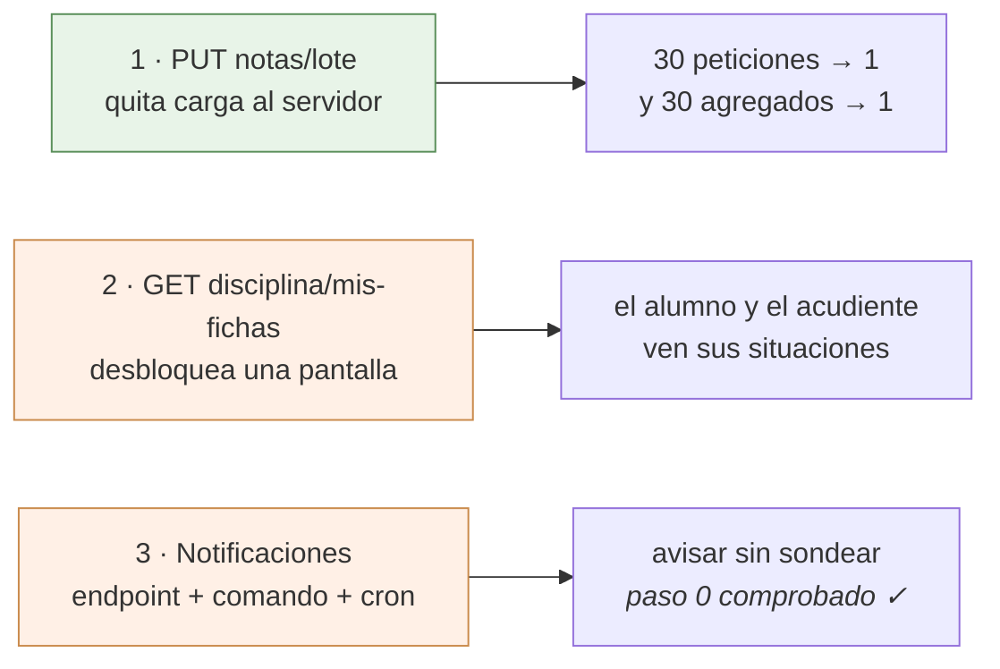

# Lo que la app necesita del servidor

Tres cosas, y ninguna se puede hacer desde el lado Flutter. El backend
(`~/DESARROLLOS/8myvc`) es **de solo lectura** para esta app: se lee para saber
qué devuelve cada endpoint y nunca se edita. Esto es la petición, escrita con el
detalle suficiente para que se pueda decidir sin volver a investigar, y para que
el día que se autorice no haya que redescubrir nada.

Están ordenadas por lo que dan a cambio de lo que cuestan.



---

## 1. `PUT notas/lote` — guardar varias notas de una vez

**Lo que pasa hoy.** No hay endpoint de lote: `PUT notas/update/{id}` es de una
en una, así que pasar una columna de treinta alumnos son treinta peticiones. La
app ya hace lo que puede desde su lado —manda solo las que cambiaron y de tres
en tres, ver [notas.md §1.5](notas.md)— pero el fondo no lo puede arreglar.

**Y el coste real no son las treinta peticiones.** Es lo que hace cada una.
`NotasController::putUpdate` termina llamando a
`DefinitivasDeAsignatura::recalcularPorNota`, que acaba en `recalcular(...)`, y
ahí está lo que importa:

```php
$calculadas = self::calcular($asignaturaId, $periodoId);   // TODA la asignatura

if ($soloAlumno !== null) {
    $calculadas = array_values(array_filter(...));          // y el filtro, después
}
```

`calcular()` es un agregado sobre **todas** las notas de la asignatura y el
periodo, con tres *joins* y un `GROUP BY`; el recorte a un solo alumno se hace
en PHP, **después**, y dentro de una transacción. O sea que pasar una columna de
treinta notas dispara **treinta agregados de la asignatura entera**, veintinueve
de ellos para tirar el resultado.

En un VPS eso no se nota. En un hosting compartido es justo lo que hay que no
hacer ([hosting compartido](notas.md) §5).

**Lo que se pide.**

| | |
|---|---|
| Ruta | `PUT notas/lote`, con `auth.personal` |
| Cuerpo | `{"notas": [{"id": 900, "nota": 85}, {"id": 901, "nota": 40}]}` |
| Permiso | el mismo de una en una: `User::pueden_editar_notas` con `PeriodoDeLaFila::deNota($id)`, **por nota**, no una vez para el lote |
| Bitácoras | una por nota, idénticas a las de hoy: son el rastro que mira el colegio cuando alguien reclama, y el historial de la app las lee |
| Recálculo | **uno solo al final**, por cada par (asignatura, periodo) tocado, con `recalcular(...)` sin `soloAlumno` |
| Respuesta | `{"guardadas": 28, "fallidas": [{"id": 901, "motivo": "..."}]}` |

Lo de la respuesta no es capricho: la app ya sabe reintentar solo lo que falló
sin que el docente vuelva a teclear nada, y para eso necesita saber **cuáles**
fallaron. Que un lote entero se caiga por una nota sería peor que lo de ahora.

**Lo que cambia en la app cuando exista.** Poco, y está preparado:
`guardarNotas` de [LibroNotasApi](../lib/Http/LibroNotasApi.dart) ya recibe la
lista de cambios y devuelve `ResultadoGuardado` con las fallidas dentro. Es
cambiar el cuerpo de esa función y borrar el `_aLaVez = 3`.

---

## 2. `GET disciplina/mis-fichas` — que el alumno vea lo suyo

**Lo que pasa hoy.** La pantalla de disciplina existe y funciona para el
personal; el alumno y el acudiente no entran. No es pudor: se comprobó que en
todo el backend solo cuatro controladores tocan `dis_procesos` —`Disciplina`,
`Comportamiento`, `NotaComportamiento` y `Grupos`— y **todas** sus rutas llevan
`auth.personal`, que aborta con 403 a `Alumno` y `Acudiente`.

El único endpoint de notas abierto a ellos, `GET notas/alumno/{id}`, trae por
periodo las asignaturas, sus ausencias de clase y `nota_comportamiento` —que es
**la nota**, no las fichas—. Uniformes y tardanzas de institución, igual de
cerrados.

**Lo que se pide.**

| | |
|---|---|
| Ruta | `GET disciplina/mis-fichas/{alumno_id?}` |
| Guarda | `boletin.propio:sin-paz-y-salvo`, **no** `auth.personal` |
| Respuesta | `{"alumno": {…}, "config": {…}, "ordinales": [ … ]}` |

Sobre la guarda: ya existe y hace exactamente esto. `ExigirBoletinPropio` deja
pasar de largo a quien no es alumno ni acudiente, y a los que lo son les
comprueba que el `alumno_id` pedido sea el suyo o el de un acudido; sin id
significa «lo mío». El modo `sin-paz-y-salvo` es el correcto: **retener el
boletín de quien debe es una cosa y esconderle a una familia la situación
disciplinaria de su hijo es otra, y esa nadie la ha pedido.** Es la misma
decisión que ya se tomó para `notas/alumno` y para `matriculas/prematricular`.

Sobre la forma: **que `alumno` sea igual que un elemento de
`PUT disciplina/alumnos`**, con sus `periodoN[]`, sus `proceso_ordinales`, sus
`uniformes_perN[]` y sus contadores. No por comodidad, sino porque así la app
reutiliza [AlumnoDisciplinaModel](../lib/Models/AlumnoDisciplinaModel.dart) y
[FichaDisciplinaScreen](../lib/Screens/FichaDisciplinaScreen.dart) tal cual, en
modo lectura: la pantalla ya está escrita y probada. Con otra forma habría que
escribir un modelo nuevo y una pantalla nueva para enseñar lo mismo.

`config` y `ordinales` van porque la ficha los necesita para pintar: los tres
tipos se llaman como los llame el colegio —`falta_tipoN_displayname`— y los
ordinales de cada situación se resuelven contra el catálogo del año. **No** hace
falta mandar `grupos` ni `descripciones_typeahead`: eso es del editor, y aquí no
se escribe nada.

**Lo que cambia en la app cuando exista.** Una pantalla corta —la ficha en modo
lectura— y la opción del menú para alumnos y acudientes. Ver
[disciplina.md](disciplina.md) → «Lo que queda pendiente».

---

## 3. Notificaciones — un endpoint, un comando y una línea de cron

El plan entero, con el porqué de cada decisión, está en
[notificaciones.md](notificaciones.md). Resumido, hace falta:

1. **Un endpoint que devuelva los temas** que le tocan a quien se identifica —los
   suyos y los de sus acudidos—. Es la pieza de seguridad de todo el diseño: el
   nombre del tema se deriva con `HMAC-SHA256(alumno_id, secreto)` y **eso vive
   solo en el servidor**. Si el teléfono pudiera calcularlo, cualquiera se
   suscribiría a los avisos de un menor que no es suyo.
2. **Un comando de artisan**, `notificaciones:enviar`, con cuatro consultas
   agrupadas sobre datos que ya se registran —`bitacoras`, `ausencias`,
   `dis_procesos`, `publicaciones`—, una marca de por dónde iba, y el envío.
3. **La línea de cron**: `*/15 * * * * php artisan notificaciones:enviar`.

**El paso 0 ya está comprobado, el 24 de agosto de 2026, y sale bien:** el
hosting deja salir por HTTPS a `oauth2.googleapis.com` y a `fcm.googleapis.com`
—los dos contestan— y ejecuta artisan (Laravel 13.26.1). O sea que el push es
viable y no hace falta el plan B. Falta solo confirmar que se puede programar el
cron, y ese cron **no es uno, es un bucle sobre los dieciséis colegios**: cada
uno es un directorio con su `.env` y su base. El detalle, en
[notificaciones.md](notificaciones.md) → «Lo comprobado en el servidor».

No hace falta añadir el SDK de Google: se firma un JWT con `openssl_sign` y se
pide el token con Guzzle, que ya está en el `composer.json`.

---

## Y una cosa que NO se pide

`NotasController::putSubunidad` tiene el SQL roto —`'.$sub_id.'` dentro de una
cadena de comillas dobles, así que a MySQL le llega `.5.` donde iba el número— y
revienta con un 500 si al alumno le falta la fila en `notas`. Está anotado en
[notas.md §6](notas.md) y **no hace falta arreglarlo para la app**: se esquiva
llamando una vez a `notas/detailed`, que sí usa parámetros ligados y de paso
materializa las filas. Queda escrito porque el día que alguien lo toque conviene
que sepa que está así, no porque bloquee nada.
