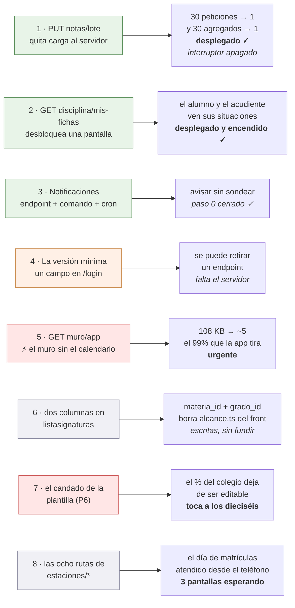

# Lo que la app necesita del servidor

Ocho cosas, y ninguna se puede hacer desde el lado Flutter — **tres de ellas
ya entregadas**. La octava (§8) es la más grande y la más nueva: **las ocho rutas
de las estaciones de matrícula**, sin las cuales tres pantallas ya escritas no se
pueden encender. La sexta (§6) **no es una ruta ni bloquea nada**: son dos
columnas en un `SELECT` que ya existe, y su apartado conserva la ruta nueva que se
pidió primero y se retiró el mismo día, porque la lección de por qué se retiró es
reutilizable. La quinta es la única con prisa: se anotó el 2 de septiembre de
2026 y es el 99 % de una respuesta que la app descarta, pagado en cada apertura
por un hosting compartido de un núcleo. El backend (`~/DESARROLLOS/8myvc`) es **de solo lectura** para esta
app: se lee para saber qué devuelve cada endpoint y nunca se edita. Esto es la
petición, escrita con el detalle suficiente para que se pueda decidir sin volver
a investigar, y para que el día que se autorice no haya que redescubrir nada. Lo
entregado se conserva aquí, marcado, porque explica por qué se pidió así.

Están ordenadas por lo que dan a cambio de lo que cuestan.

**Al día 26 de agosto de 2026, las dos primeras están escritas y desplegadas.**
Entraron en la tanda `eb95cbc`, que se desplegó el 25 ago **con el mismo hash en
los quince colegios**, y esta página no se enteró hasta el día siguiente. La
lección queda escrita arriba del todo porque es la que costó: **«desplegado» se
comprueba contra el hash de la tanda, no contra `main`**, y preguntar «¿está en
`main`?» da la respuesta equivocada en los dos sentidos —`main` va por delante de
lo que corre, y lo que corre puede tener de sobra lo que aquí se pide.

~~**Son quince colegios y no dieciséis** desde el 25 ago 2026~~ — **y volvió a
ser dieciséis el 30 de agosto de 2026**, cuando entró `lal`, montado en la otra
cuenta de cPanel (`lalvirtual.edu.co`). Este párrafo estuvo mal veinte días y se
corrige aquí por lo mismo que se corrigió en
[Interruptores.dart](../lib/Utils/Interruptores.dart): **un recuento escrito a
mano envejece en silencio y falla del lado peligroso**. La condición buena no
lleva número: *«todos los que recorre el bucle de despliegue»*, que hoy devuelve
diecisiete carpetas —dieciséis colegios y `demo`—. Y ojo con la segunda cuenta:
el `for` de `micolev1` **no alcanza a `lal`**.



---

## 1. `PUT notas/lote` — guardar varias notas de una vez

**Lo que pasa hoy.** No hay endpoint de lote: `PUT notas/update/{id}` es de una
en una, así que pasar una columna de treinta alumnos son treinta peticiones. La
app ya hace lo que puede desde su lado —manda solo las que cambiaron y de tres
en tres, ver [notas.md §1.5](notas.md)— pero el fondo no lo puede arreglar.

**Y el coste real no son las treinta peticiones.** Es lo que hace cada una.
`NotasController::putUpdate` termina llamando a
`DefinitivasDeAsignatura::recalcularPorNota`, que acaba en `recalcular(...)`, y
ahí está lo que importa:

```php
$calculadas = self::calcular($asignaturaId, $periodoId);   // TODA la asignatura

if ($soloAlumno !== null) {
    $calculadas = array_values(array_filter(...));          // y el filtro, después
}
```

`calcular()` es un agregado sobre **todas** las notas de la asignatura y el
periodo, con tres *joins* y un `GROUP BY`; el recorte a un solo alumno se hace
en PHP, **después**, y dentro de una transacción. O sea que pasar una columna de
treinta notas dispara **treinta agregados de la asignatura entera**, veintinueve
de ellos para tirar el resultado.

En un VPS eso no se nota. En un hosting compartido es justo lo que hay que no
hacer ([hosting compartido](notas.md) §5).

**Lo que se pide.**

| | |
|---|---|
| Ruta | `PUT notas/lote`, con `auth.personal` |
| Cuerpo | `{"notas": [{"id": 900, "nota": 85}, {"id": 901, "nota": 40}]}` |
| Permiso | el mismo de una en una: `User::pueden_editar_notas` con `PeriodoDeLaFila::deNota($id)`, **por nota**, no una vez para el lote |
| Bitácoras | una por nota, idénticas a las de hoy: son el rastro que mira el colegio cuando alguien reclama, y el historial de la app las lee |
| Recálculo | **uno solo al final**, por cada par (asignatura, periodo) tocado, con `recalcular(...)` sin `soloAlumno` |
| Respuesta | `{"guardadas": 28, "fallidas": [{"id": 901, "motivo": "..."}]}` |

Lo de la respuesta no es capricho: la app ya sabe reintentar solo lo que falló
sin que el docente vuelva a teclear nada, y para eso necesita saber **cuáles**
fallaron. Que un lote entero se caiga por una nota sería peor que lo de ahora.

**Existe, está desplegado, y el lado de la app está escrito** (24 ago 2026). Vive
en `_guardarEnLote` de [LibroNotasApi](../lib/Http/LibroNotasApi.dart), detrás de
`Interruptores.notasLote`, **todavía apagado**.

La condición de encendido —desplegado en los quince, no fusionado— **ya está
cumplida**: la ruta viajó en la misma tanda `eb95cbc` del 25 ago que subió las
rutas de 539 a 542. Sigue apagado por una razón distinta y deliberada: **esto
toca la pantalla del trabajo diario de un docente**, la de pasar una columna de
treinta notas, y encenderlo es decisión de Joseth y no algo que se haga de paso
mientras se enciende otra cosa. La sesión del backend ofreció una comprobación
fina del contrato antes de encenderlo; conviene pedírsela ese día. Ver
[Interruptores](../lib/Utils/Interruptores.dart).

Tres cosas salieron de leer el controlador en vez de fiarse de este contrato, y
las tres cambian lo que la app tenía que hacer:

- **El lote tiene tope de 200, y pasarse no recorta: aborta el lote entero con
  un 422.** El propio controlador dejó anotado que el número se justificó
  «dando por hecha una capacidad del cliente que no existe» — ningún cliente
  partía en tandas. Ahora la app trocea de **cien en cien**, con margen por
  debajo del tope para que bajarlo no la rompa. Una columna de cuarenta y cinco
  sigue siendo una sola petición.
- **La respuesta trae `definitivas`**, que este documento no pedía: la
  definitiva de cada alumno tocado, calculada por el mismo recalculador que la
  escribe. Se parsea, viaja en `ResultadoGuardado.definitivas` y **ya se usa**:
  la planilla la devuelve al libro y `LibroDeNotas.conDefinitivaDelLote` la
  aplica. Eso quita las dos verdades — antes, después de pasar una columna, la
  definitiva de la pestaña «Por alumno» era la que la app se calculaba sola.
  Se copia **encima de la fila que ya existe**, porque el lote no devuelve el
  `nf_id` y una fila con `nf_id` cero apaga el control de nivelar: se habría
  perdido el botón por refrescar un número.
- **`manual` y `recuperada` llegan como booleanos de verdad**, no como el `1/0`
  de PDO que usa el resto del archivo, porque esta respuesta la arma PHP con un
  `(bool)` delante. Leerlas con `entero(x) == 1` pintaría una definitiva manual
  como automática.

---

## 2. `GET disciplina/mis-fichas` — HECHO, desplegado y encendido

> **Ya no es un pendiente.** La ruta entró con el commit `83bf717` (23 ago 2026),
> viajó en la tanda `eb95cbc` desplegada el 25 ago en los quince colegios, y el
> interruptor de la app se encendió el 26 ago. Se entregó **exactamente con el
> contrato que se pedía aquí**, guarda incluida, y con un test de contrato,
> `tests/Contrato/FichaDisciplinaPropiaTest.php`, que compara las claves de
> `mis-fichas` contra un elemento de `PUT disciplina/alumnos` **pidiendo las dos
> rutas en la misma ejecución** — no contra una lista escrita a mano, que se
> quedaría vieja el día que alguien añada una columna.
>
> Lo que sigue se conserva porque explica **por qué** se pidió así, y porque las
> tres correcciones del final son cosas del endpoint real que este contrato no
> preveía. Lo que la app hace con él está en
> [disciplina.md](disciplina.md) → «La ficha del alumno y del acudiente».

**De dónde venía.** La pantalla de disciplina existía y funcionaba para el
personal; el alumno y el acudiente no entraban. No era pudor: se comprobó que en
todo el backend solo cuatro controladores tocan `dis_procesos` —`Disciplina`,
`Comportamiento`, `NotaComportamiento` y `Grupos`— y **todas** sus rutas llevaban
`auth.personal`, que aborta con 403 a `Alumno` y `Acudiente`.

El único endpoint de notas abierto a ellos, `GET notas/alumno/{id}`, trae por
periodo las asignaturas, sus ausencias de clase y `nota_comportamiento` —que es
**la nota**, no las fichas—. Uniformes y tardanzas de institución, igual de
cerrados.

**Lo que se pidió, y lo que se entregó.**

| | |
|---|---|
| Ruta | `GET disciplina/mis-fichas/{alumno_id?}` ✓ |
| Guarda | `boletin.propio:sin-paz-y-salvo`, **no** `auth.personal` ✓ |
| Respuesta | `{"alumno": {…}, "config": {…}, "ordinales": [ … ]}` ✓ |

Sobre la guarda: ya existe y hace exactamente esto. `ExigirBoletinPropio` deja
pasar de largo a quien no es alumno ni acudiente, y a los que lo son les
comprueba que el `alumno_id` pedido sea el suyo o el de un acudido; sin id
significa «lo mío» — **y eso último resultó ser falso para un acudiente; ver las
correcciones al final de este apartado**. El modo `sin-paz-y-salvo` es el
correcto: **retener el boletín de quien debe es una cosa y esconderle a una
familia la situación
disciplinaria de su hijo es otra, y esa nadie la ha pedido.** Es la misma
decisión que ya se tomó para `notas/alumno` y para `matriculas/prematricular`.

Sobre la forma: **que `alumno` sea igual que un elemento de
`PUT disciplina/alumnos`**, con sus `periodoN[]`, sus `proceso_ordinales`, sus
`uniformes_perN[]` y sus contadores. No por comodidad, sino porque así la app
reutiliza [AlumnoDisciplinaModel](../lib/Models/AlumnoDisciplinaModel.dart) y
[FichaDisciplinaScreen](../lib/Screens/FichaDisciplinaScreen.dart) tal cual, en
modo lectura: la pantalla ya está escrita y probada. Con otra forma habría que
escribir un modelo nuevo y una pantalla nueva para enseñar lo mismo.

`config` y `ordinales` van porque la ficha los necesita para pintar: los tres
tipos se llaman como los llame el colegio —`falta_tipoN_displayname`— y los
ordinales de cada situación se resuelven contra el catálogo del año. **No** hace
falta mandar `grupos` ni `descripciones_typeahead`: eso es del editor, y aquí no
se escribe nada.

**Lo que cambió en la app.** Una pantalla corta —la ficha en modo lectura, que es
`FichaDisciplinaScreen` con `soloLectura: true`— y la opción del menú para
alumnos y acudientes. Ver [disciplina.md](disciplina.md) → «La ficha del alumno y
del acudiente».

### Tres correcciones a este contrato, del endpoint que se entregó

Ninguna se supo escribiendo la petición; las tres salieron de leer el
controlador desplegado, y la sesión del backend las confirmó ejecutando sus
pruebas contra el esquema real.

1. **«Sin id significa lo mío» NO vale para un acudiente: recibe 400.** El
   controlador solo resuelve `persona_id` cuando `tipo == 'Alumno'`; cualquier
   otro tipo se lleva `400 'No hay id de alumno'`
   (`DisciplinaController.php:142-147`). Es deliberado y tiene su prueba: «lo
   mío» no significa nada para quien tiene varios acudidos y no es alumno. La
   guarda deja pasar la petición sin id porque no hay alumno concreto que
   proteger, así que el 400 lo pone el controlador. **En sesión de acudiente hay
   que mandar siempre el id**, y por eso
   [MiDisciplinaScreen](../lib/Screens/MiDisciplinaScreen.dart) pregunta de qué
   acudido antes de llamar, con la misma hoja que «Mis notas» y «Asistencia».
2. **`config` llega como objeto o `null`, no como lista.** Sale del backend como
   `$config[0] ?? null`, y esa lectura **no crea la fila del año a propósito**,
   porque una lectura que escribe deja de ser de solo lectura. Un año recién
   abierto llega nulo, y leer `falta_tipoN_displayname` sin defensa reventaría en
   la primera ficha. `traerMisFichas` cae a los valores por defecto de
   `ConfigDisciplinaModel`. Los `ordinales` sí son lista.
3. **El año sale del alumno, no de quien pregunta.** Si el colegio pasa de año y
   la familia no ha vuelto a entrar, `users.periodo_id` sigue en el año viejo y
   la ficha habría dado 404 sobre una ficha que existe — justo cuando la familia
   abre la app a ver el curso nuevo. Se prefiere el año activo si hay matrícula
   viva, y si no el más reciente, que es lo que hace que la ficha de un egresado
   siga saliendo.

Y el aviso del coste se atendió: `fichaConFormaDeGrupo()` **copia la lista de
columnas de `Grupo::alumnos` pero parte del alumno**, no del grupo. Se copió en
vez de reutilizar la consulta precisamente para no armar el grupo entero y
quedarse con uno.

---

## 3. Notificaciones — un endpoint, un comando y una línea de cron

El plan entero, con el porqué de cada decisión, está en
[notificaciones.md](notificaciones.md). Resumido, hace falta:

1. **Un endpoint que devuelva los temas** que le tocan a quien se identifica —los
   suyos y los de sus acudidos—. Es la pieza de seguridad de todo el diseño: el
   nombre del tema se deriva con `HMAC-SHA256(alumno_id, secreto)` y **eso vive
   solo en el servidor**. Si el teléfono pudiera calcularlo, cualquiera se
   suscribiría a los avisos de un menor que no es suyo.
2. **Un comando de artisan**, `notificaciones:enviar`, con cuatro consultas
   agrupadas sobre datos que ya se registran —`bitacoras`, `ausencias`,
   `dis_procesos`, `publicaciones`—, una marca de por dónde iba, y el envío.
3. **La línea de cron**: `*/15 * * * * php artisan notificaciones:enviar`.

**El paso 0 ya está comprobado, el 23 de agosto de 2026, y sale bien:** el
hosting deja salir por HTTPS a `oauth2.googleapis.com` y a `fcm.googleapis.com`
—los dos contestan— y ejecuta artisan (Laravel 13.26.1). Y **el cron dispara**, comprobado con
una tarea de prueba que corrió cuatro veces. O sea que el push es viable, no
hace falta el plan B y **no queda nada por comprobar**: lo que falta es escribir
las tres piezas.

Ese cron **no es uno, es un bucle sobre los quince colegios**: cada uno es un
directorio con su `.env` y su base. El detalle, en
[notificaciones.md](notificaciones.md) → «Lo comprobado en el servidor».

No hace falta añadir el SDK de Google: se firma un JWT con `openssl_sign` y se
pide el token con Guzzle, que ya está en el `composer.json`.

### 3.bis Los avisos no dicen de qué hijo son — pedido el 23 de septiembre de 2026

**Las tres piezas de arriba están hechas y desplegadas desde el 25 de agosto, y
el lado de la app se enchufó el 22 de septiembre.** Lo que sigue es lo único que
se pide ahora, y son cuatro textos.

`EnviarNotificaciones.php` ya decidió la regla buena y **la aplicó en una sola
fuente**:

| Fuente | Texto de hoy | ¿Dice de quién? |
|---|---|---|
| `avisosDeMatricula` | «Laura pasó a Tesorería» | **sí** |
| `avisosDeNotas` | «Hay 3 notas nuevas en Matemáticas» | no |
| `avisosDeAsistencia` | «Se registraron 2 novedades de asistencia» | no |
| `avisosDeDisciplina` | «Se anotó una situación. Ábrela para verla» | no |

La regla está escrita en el docblock de `avisosDeMatricula`, con estas palabras:
**«EL NOMBRE SÍ, EL MOTIVO NO»**, y razonada — `notificaciones.md` permite
nombrar al menor y prohíbe el contenido. Las otras tres se escribieron antes y
se quedaron sin ella.

**Lo que cuesta, que es el motivo de pedirlo.** Un acudiente con dos hijos recibe
«Hay 3 notas nuevas en Matemáticas» y **no sabe de cuál de los dos**. El aviso le
obliga a abrir la app para saber **si le importa**, que es distinto de abrirla
para ver el detalle — y lo segundo es el trato de este diseño, lo primero es un
aviso que no cumple. Con tres acudidos, dos de cada tres avisos son para otro.

**Lo que se pide**: el primer nombre del alumno delante, igual que en matrícula,
que ya tiene el helper `primerNombreDe($alumnoId)` escrito y usado.

```
Notas        «Laura tiene 3 notas nuevas en Matemáticas»
             «Laura tiene 1 nota nueva en Matemáticas»
Asistencia   «Se registraron 2 novedades de asistencia de Laura»
Disciplina   «Se anotó una situación de Laura. Ábrela para verla»
```

**Lo que NO se pide, y conviene que quede dicho porque es la tentación de al
lado:** la nota, el motivo de la situación, ni si fue falta o tardanza. Joseth lo
preguntó el 23 de septiembre —«cuando el anuncio solo es una cosa, ¿sí daría el
detalle?»— y la respuesta es no, por tres razones que no dependen del gusto:

1. El aviso se ve en la **pantalla bloqueada**, en un bus, y puede no ser el
   teléfono del acudiente.
2. El push llegaría **aunque el colegio tenga las notas bloqueadas**
   (`alumnos_can_see_notas = 0`): la app le negaría la nota a quien la
   notificación ya se la dijo.
3. La política de privacidad **ya está redactada y sin publicar**, y dice que el
   cuerpo del aviso no lleva nada personal. Se publica el mismo día que la
   versión `1.1.0`. Cambiar el contenido obliga a reescribirla antes de ese día.

El nombre no entra en ninguna de las tres: es lo que ya hace matrícula.

**El coste en consultas, que en un hosting compartido se pregunta siempre.**
`primerNombreDe` es un `SELECT` por alumno avisado, no por aviso. Las tres
fuentes agrupan por `alumno_id`, así que son tantas como familias avisadas en esa
pasada — y el comando corre cada quince minutos, no por petición. Si aun así
sobra, sale gratis uniendo `alumnos` en las tres consultas, que ya filtran por
`alumno_id`.

---

## 4. La versión mínima — un campo, no una ruta

**El lado de la app está hecho; falta la mitad del servidor.** Joseth autorizó
el 24 de agosto de 2026 que la app compruebe la versión y que **bloquee** —ver
[VersionMinima](../lib/Utils/VersionMinima.dart) y
[ActualizarScreen](../lib/Screens/ActualizarScreen.dart)—. Lo que falta es que
el backend **mande el número**, y hasta que lo mande esto es código dormido:
sin el campo no se bloquea a nadie, que es justo lo que lo hace inofensivo de
publicar.

**El problema no es de esta app, es de todos.** `myvc_flutter` **no comprueba en
ninguna parte** que su versión siga siendo aceptable. Un teléfono con la versión
del año pasado sigue llamando a los mismos endpoints indefinidamente y nadie se
entera. Mientras eso sea así, **retirar cualquier endpoint depende de que
quince colegios se actualicen por su cuenta**: es la condición de entrada de
la fase 7 de `18-auditoria.md` y de la fase 5 de `00`, y por eso esas fases hoy
no tienen fecha —que no es lo mismo que tenerla lejos—.

### Lo que se pide: un campo en una respuesta que ya existe

    POST /login  →  { ..., "version_minima_app": 1 }

> **El ejemplo dice 1 y no un número redondo, a propósito.** La app publicada
> es el `versionCode` **1** —`version: 1.0.0+1`— y ni siquiera está en Play. Un
> colegio que copie un «12» de cualquier ejemplo **bloquea a todos sus usuarios
> de golpe y no hay ninguna versión a la que puedan actualizar**: la pantalla
> de bloqueo les manda a la tienda y en la tienda no hay nada. Desde el cliente
> no se distingue eso de un colegio que de verdad exige la última. El número
> que se ponga tiene que ser el de una versión **que exista en la tienda**.

**Un entero, el `versionCode`** —el `+N` de `pubspec.yaml`—, no la versión con
puntos: es el número que Play compara y el único que no admite interpretación.

**Y en `login`, no en una ruta nueva.** Cuesta cero peticiones y cero rutas: la
app ya llama a `POST /login` en los dos únicos momentos donde el dato sirve
—`LoginController` al entrar con usuario y contraseña, y
`ContextoAcademico.refrescar()` al recuperar la sesión guardada al arrancar—.
Una ruta nueva sería una petición más en cada arranque, en un hosting
compartido, para leer un número que cambia dos veces al año. Si aun así se
prefiere ruta aparte, la app se adapta; pero entonces que sea cacheable.

Opcional, y solo si sale gratis: `"version_minima_mensaje": "..."`, para poder
decir *por qué* hay que actualizar. Sin él, la app pone un texto genérico.

### Lo que hace la app, y lo que NO hace pase lo que pase

| Situación | Qué hace |
|---|---|
| Su `versionCode` ≥ el mínimo | nada, ni un aviso |
| Su `versionCode` < el mínimo | pantalla que explica y lleva a Play. **No deja entrar** |
| El campo no viene | **entra** |
| El campo no es un entero positivo | **entra** |
| No hay red, o el servidor no contesta | **entra** |
| Ya está dentro trabajando | **no se le echa**; se comprueba al arrancar y al entrar |
| Está bloqueado y tiene cuenta en otro colegio | **puede llegar al login**; ver abajo |

**Las cuatro filas de «entra» son la parte importante del contrato, no la letra
pequeña.** Un campo mal puesto en el `.env` de un colegio no puede dejar a ese
colegio entero fuera de la app: el fallo por defecto tiene que ser dejar pasar.
Bloquear es lo excepcional y solo con un número que se entienda.

**Y «absurdo» no se puede programar**, así que lo implementado es lo único que
sí: **no es un entero positivo → entra**. Un número altísimo —999999999— **sí
bloquea**, y tiene que hacerlo: desde el cliente no hay forma de distinguir un
`.env` con un dedazo de un colegio que de verdad exige la última versión, y
adivinarlo sería justo lo contrario de lo que hace fiable esta comprobación.
**La defensa contra el dedazo está en el servidor**: ese número se sube una vez
por retirada, con la misma ceremonia que un despliegue.

**Y esto es lo que hay que leer antes de tocar ese número, no después:** un `99`
donde iba un `9` **deja al colegio entero fuera de la app hasta que alguien
vuelva a tocar el servidor**. Desde el teléfono no hay arreglo —la app hace lo
que se le dijo— y la única salida que ofrece la pantalla es salir e ingresar en
**otro** colegio, que solo le sirve a quien tenga cuenta en dos. No es un motivo
para no hacerlo; es el motivo por el que ese campo no se edita a la ligera ni se
copia de un colegio a otro sin mirar.

**La pantalla de entrar es la única que se deja pasar bloqueado**, y no es una
rendija. Son quince colegios con una sola app y **el número lo pone cada
colegio en su servidor**, así que quien tenga cuenta en dos puede estar
bloqueado por el que va atrasado y no por el otro; sin esa salida no le quedaría
forma de llegar a la pantalla de entrar. No debilita nada, porque entrar vuelve
a leer el número: si el colegio nuevo también lo exige, la puerta se cierra otra
vez en cuanto se sale del login. Y al cerrar sesión el número se olvida, por lo
mismo: es del colegio del que se sale, no de este teléfono.

**Y bloquear de verdad, no sugerir.** Un aviso que se puede cerrar no permite
retirar nada, que es justo para lo que existe esto: si la versión vieja puede
seguir entrando, el endpoint viejo sigue haciendo falta. La contrapartida es que
el número hay que subirlo con cuidado —una vez por retirada, no en cada
publicación— y eso es de quien despliega, no de la app.

### Lo que costó del lado Flutter, ya hecho

Dos dependencias —`package_info_plus`, que lee el `versionCode` del paquete
instalado, y `url_launcher` para llevar a Play— y tres enganches.

Lo del `versionCode` merece una línea: se lee del paquete y no de una constante
en el código **porque una constante se queda vieja el día que alguien publique
sin acordarse de subirla**, que es exactamente el fallo que esto viene a evitar.

Los enganches son los tres sitios por los que pasa una respuesta de `/login`:
`tomarUsuarioDe` —que comparten entrar con contraseña y recuperar la sesión
guardada— y `ContextoAcademico.refrescar`, que es la única llamada a `/login`
que la app hace ya estando dentro, y por tanto donde se entera de que el colegio
subió el número sin tener que salir y volver a entrar.

**La comprobación vive en el router**, no en cada pantalla: una puerta que se
mira en veinte sitios es una puerta que un día se queda sin mirar en uno.

### Lo que esto desbloquea, para que se vea qué se compra

Con esto, retirar un endpoint pasa a ser comprobable: se publica la versión que
ya no lo llama, se sube el mínimo, y el servidor sabe que nadie por debajo entra.
Sin esto, la única forma honesta es mirar el reparto por versión de Play Console
y decidir a ojo — que también vale, pero es un dato de tienda y no un contrato.

---

## 5. ⚡ URGENTE — `GET muro/app`: el muro sin el calendario del colegio

**Es la única de esta página que tiene fecha límite, y la pone la propia app.**
Las demás desbloquean algo. Ésta evita que el hosting compartido pague por
mandar, en cada apertura, cien kilobytes que la app tira sin mirar.

Anotada el 2 de septiembre de 2026 al medir qué le cuesta al servidor que la app
deje de ser de docentes y pase a ser de toda la comunidad.

### Antes que nada: el backend ya hizo una pasada hoy, y hay que partir de ahí

**El commit `805e08f` del 2 sep 2026** —«el panel de un alumno baja de 620 ms a
24 ms»— ya recortó tres cosas de `ChangesAsked/to-me`, y su medición rol por rol
está en `docs/migracion/24-el-panel-de-inicio.md` del backend. Esto es lo que
midió, que **no es lo que esta página estimó**:

| rol | consultas | tiempo | respuesta |
|---|---:|---:|---:|
| `Usuario` | 39 | ~700 ms | 274 → 157 KB |
| `Profesor` | 75 → 17 | ~30 → ~13 ms | 279 → 162 KB |
| `Alumno` | 49 → 24 | ~620 → ~24 ms | 225 → 112 KB |
| `Acudiente` | 8 | ~8 ms | 218 → **108 KB** |

**Corrección, y va con nombre:** esta página había estimado «unas dieciocho
consultas» para un acudiente a partir de leer el bucle. La medición dice 8 y ~8
ms. La estimación no era del todo falsa —el propio doc del backend avisa de que
**«el acudiente medido no tiene acudidos en el año en curso, así que sus 8
consultas son el suelo, no el caso normal: uno con dos acudidos paga seis
consultas más por cada uno»**— pero el número que se citó era una cuenta de
código, no una medición, y no estaba marcado como tal. **Lo que se mide manda.**

Y sobre todo: **la medición mueve el argumento a otro sitio**, que es lo que
sigue.

### Lo que de verdad cuesta no son las consultas: es el calendario

Del desglose de la respuesta por clave, para un acudiente:

| clave | KB | ¿la lee la app? |
|---|---:|---|
| **`eventos`** | **215,5** → ~108 tras el recorte de columnas | **no** |
| `publicaciones` | 2,1 | sí |
| `alumnos` | ~0 con cero acudidos; unos pocos KB con dos | sí, ocho campos |
| `comportamiento` · `ausencias_periodo` · `libro` | 0,0–4,2 | solo `ausencias_periodo` |

**El calendario es el 99 % de la respuesta y la app no lo lee.** La consulta es
`SELECT * FROM calendario WHERE solo_profes=0 and deleted_at is null`, **sin
filtro de año y sin filtro de fecha**: 593 filas, de las que 123 serían de 2019
a 2023.

> **Ese 123 está en duda y pierde.** La sesión del backend contó **86**
> anteriores a 2024 con `YEAR(start)`, sobre el mismo rango. El 123 de aquí
> **no lleva anotado de dónde salió** —ni la columna ni la consulta—, y en esta
> casa lo que se mide manda sobre lo que está escrito sin fuente. Se queda el
> 86 hasta que alguien encuentre la consulta del 123.
>
> Y lo que de verdad añade su medición no es el número: **ninguna de las 593
> filas es de 2026**. Van de 2019 a 2025. O sea que el problema del calendario
> no es sólo que viaje entero, es que **nadie ha curado esa tabla**.
>
> De paso midieron una que no nos toca pero conviene que esté escrita:
> **`calendario/this-year` no filtra por año pese al nombre** y sigue mandando
> **215,5 KB** con `SELECT *`. El recorte del 2 sep arregló `to-me` y a ella
> no. La app no la llama; el panel web sí, al pulsar «Actualizar». El recorte de columnas de hoy lo dejó en la mitad, y sigue siendo el 99 %
de lo que la app descarta.

O sea que cada vez que alguien abre la app se serializan y se mandan ~108 KB
para que Flutter lea unos 5.

### Lo que se pide

Un endpoint propio para la app.

> ### ⚠️ Corrección del 19 sep 2026: son CINCO claves, no tres
>
> Aquí ponía tres —`publicaciones`, `alumnos`, `horario_hoy`— y **la app lee
> cinco**. Lo levantó la sesión del backend al escribirlo, y se comprueba en un
> grep sobre [MuroApi](../lib/Http/MuroApi.dart):
>
> ```
> cuerpo['horario_hoy']        cuerpo['publicaciones']    cuerpo['alumnos']
> cuerpo['horario_version_id'] cuerpo['ausencias_periodo']
> ```
>
> Las dos que faltaban no son adorno:
>
> - **`horario_version_id`**, que decide si se sabe algo del horario. Ver
>   abajo, porque la consecuencia de omitirla no es la que parece.
> - **`ausencias_periodo`** en la raíz: sin ella `asistenciaPropia` vuelve a ser
>   lista vacía para el rol Alumno.
>
> Se corrige aquí porque el contrato, tal como estaba, **invitaba a entregar
> tres**.

    GET muro/app  →  { "publicaciones": [...], "alumnos": [...],
                       "horario_hoy": [...], "horario_version_id": 12,
                       "ausencias_periodo": [...] }

**Sin `eventos`** —que es todo el peso—, y con `alumnos` trayendo solo lo que
[AcudidoModel.fromJson](../lib/Http/MuroApi.dart) lee: `alumno_id`, `nombres`,
`apellidos`, `foto_nombre`, `nombre_grupo`, `grupo_abrev`, `pazysalvo` y
`ausencias_periodo`.

### Lo que omitir `horario_version_id` haría de verdad, que no es lo que se dijo

La sesión del backend lo justificó diciendo que sin esa clave *«vuestro `seSabe`
volvería a valer `true` con cero clases»*, o sea que volvería el mensaje falso.
**Es al revés**, y conviene que quede escrito porque de ahí puede salir una
prueba que afirme lo contrario de lo que pasa.

`HorarioDeHoy.tomar` hace `_clases = versionOficial == null ? null : clasesDeHoy`
y `seSabe => _clases != null`. Sin la clave, `versionOficial` llega **null**, así
que `seSabe` vale **`false`**: la app no dice «hoy no tienes clases», **no dice
nada** —el muro esconde el bloque y el filtro «sólo las de hoy» de
`NotasScreen` se queda apagado—.

O sea que la función **se apagaría en silencio**, que es un fallo más barato que
el de agosto pero igual de invisible. Y es a propósito: el docblock de
[HorarioDeHoy](../lib/Utils/HorarioDeHoy.dart) dice que la clave ausente cuenta
como null porque *«un servidor que todavía no tiene ese commit desplegado es
exactamente un servidor del que no se sabe si hay horario»*. La conclusión no
cambia —la clave tiene que ir—, el motivo sí.

### La forma por rol, tal como quedó escrita

Cada rol recibe **lo que hoy recibe en `to-me`, ni una clave más**:

| rol | claves |
|---|---|
| Acudiente | `publicaciones`, `alumnos` (cada acudido con `alumno_id, nombres, apellidos, pazysalvo, foto_id, foto_nombre, nombre_grupo, grupo_abrev, orden` + `ausencias_periodo`) |
| Profesor | `publicaciones`, `horario_hoy`, `horario_version_id` |
| Alumno | `publicaciones`, `ausencias_periodo` |
| nadie | `eventos` |

Hay un test allí que falla si se cuela una columna de más en un acudido, y **no
es por peso: son datos personales de un menor**.

> **Y una decisión de producto que queda abierta**: un Alumno **no** recibe
> `horario_hoy`, igual que hoy en `to-me`. Dárselo sería probablemente una
> mejora, pero una ruta que se estrena para ahorrar peso no es donde se decide
> eso. Es de Joseth, y aparte.

### Por qué hizo falta la ruta nueva y no bastaba la línea barata

Esta página ofrecía como salida *«no mandar `eventos` a quien no lo pinta»*, sin
estrenar ruta. **No vale, y el motivo es del backend**: ese servidor **no
distingue la app del front web** —mismo token, mismo `tipo`, y no hay cabecera
de cliente; `version_minima_app` viaja hacia la app, no desde ella—. Vaciar
`eventos` para un acudiente se lo quitaría también al acudiente que abre el
panel **en el navegador**, cuya carga inicial sale de ese mismo
`ChangesAsked/to-me`. La ruta nueva no era la cara: era la única que no le quita
nada a nadie. La vieja no se tocó, y hay un test que lo ata.

Eso quita del bucle por acudido `comportamiento`, `situaciones`, `libro`,
`uniformes`, `prematricula` y `matri_next` —seis de las siete llamadas—, y deja
`Ausencia::deAlumnoYear`, que es la única cuyo resultado se mira.

**El endpoint viejo no se toca**: lo usa el panel del front web y ahí sí se
pintan esas cosas. Es uno nuevo al lado.

> Si `muro/app` resulta ser más de lo que se quiere hacer ahora, **el 90 % del
> beneficio está en una línea**: no mandar `eventos` a quien no lo pinta, igual
> que hoy `profes_actuales` ya vuelve vacío para un alumno. La app no lee esa
> clave en ningún rol, comprobado en `MuroApi.traerMuro`.

### Cuándo la puede llamar la app, que no es cuando esté fundida

**`app/` es una copia por colegio**, así que `muro/app` no se puede llamar hasta
que esté desplegada en **los diecisiete** —los dieciséis colegios y `demo`—. Antes
de eso, cada apertura en un colegio rezagado gasta un 404 antes de caer a la ruta
vieja, que es justo la carga que este endpoint existe para quitar.

O sea que la mitad de app va detrás de su interruptor, como todo lo demás, y se
enciende por el hash de la tanda y no por «ya está fundido».

**Estado al 19 sep 2026**: escrita y en verde en el worktree `.worktrees/muro`
del backend, rama `feat/muro-para-la-app` (`eb13d8e`, más `f357db0` que corrige
el docblock del `seSabe`). **Sin fundir.**

> Si algún día leéis `eb13d8e` suelto, **su mensaje de commit lleva el error
> dentro** —dice que sin `horario_version_id` la app enseñaría cero clases— y
> no se reescribió a propósito, porque la rama podía estar ya en el árbol de
> quien funde. La corrección va encima.

**Y la mitad de app ya está escrita**, detrás de `Interruptores.muroApp`
(apagado): es un `?:` en la dirección y nada más, porque la respuesta nueva es
un subconjunto de la vieja con los mismos nombres de clave. Lo que se probó no
es la ruta sino que **las cinco claves se siguen leyendo igual**, que es lo que
hace barato encender el interruptor el día del despliegue.

### Por qué corre prisa

No es el coste medio, es **el pico, y lo fabrica el push**. Una notificación de
«ya están las notas» hace que unos cuantos cientos de teléfonos abran la app en
el mismo medio minuto. Con el hosting en **un núcleo** —ver la ficha del
servidor—, lo que se paga en ese medio minuto es serializar y mandar 108 KB por
cada uno, más el ancho de banda.

Mientras la app era de docentes esto no existía: eran cincuenta personas y
entraban repartidas por la mañana.

### Lo que ya se hizo del lado Flutter, y por qué no basta

El 2 de septiembre de 2026, el mismo día:

- [MuroEnMemoria](../lib/Utils/MuroEnMemoria.dart) — **cuatro** pantallas pedían
  el muro en una sola visita (el muro, Mis notas, Mi disciplina y Mi asistencia)
  y las tres últimas solo querían la lista de acudidos. Ahora una.
- [VerificacionSesion](../lib/Utils/VerificacionSesion.dart) — `GET /years` en
  cada arranque en frío, ahora una vez cada seis horas.
- `cached_network_image` — las fotos, guardadas en disco entre arranques.

**Eso divide entre cuatro cuántas veces se pide; no toca los 108 KB de cada
vez**, y la que llega en ráfaga detrás de una notificación es justamente la
primera de la visita, que nunca sale de la caché.

### Antes de dar esto por hecho

Lo de hoy está en `main` del backend, **no necesariamente desplegado**. Se
comprueba contra el hash de la tanda y no contra `main`, que es la lección del
principio de esta página:

```bash
git merge-base --is-ancestor 805e08f <hash-de-la-tanda>
```

### De paso: `GET /years` también es N+1

`YearsController::getIndex` trae todos los años y luego, **año por año**, lanza
otra consulta por sus periodos. La app lo usaba en cada arranque en frío solo
para comprobar que el token sigue valiendo —mira el código de estado y tira la
respuesta—. Del lado Flutter ya se espació a una vez cada seis horas; lo barato
de verdad sería un `GET auth/ping` que devuelva 200 o 401 y nada más. **No es
urgente**, pero si alguien abre ese controlador por otra cosa, el `foreach` con
un `DB::select` dentro se arregla con un solo `WHERE year_id IN (...)`.

---

## 6. Dos columnas en `listasignaturas` — ESCRITAS, sin fundir

> **Pedido y aprobado el 19 sep 2026.** Joseth lo autorizó con el precio delante y
> la sesión de la API lo escribió el mismo día: commit **`fe95da8`**, rama
> `feat/materia-id-y-grado-id-en-asignaturas`. **Sin fundir a `main` y sin
> desplegar** — las dos cosas son de Joseth y van por separado.
>
> **Y ninguna ruta nueva: el router sigue en 600**, que es donde empezó todo esto.
>
> Lo que lleva dentro:
>
> - `a.materia_id` y `g.grado_id` en `Profesor::asignaturas` **y en el gemelo de
>   Piars, en el mismo commit** — que era la mitad que muerde;
> - **tres** instantáneas regeneradas, `+2` claves cada una. La tercera es
>   `muestreo-piars-asignaturas`, y **sólo se mueve porque se tocó el gemelo**: en
>   la medición previa no se había movido. Ésa es la prueba de que sin tocarlo la
>   ruta habría contestado dos formas con la suite en verde;
> - los dos ficheros quedan con un aviso apuntando al otro, para que el próximo
>   que añada una columna ahí no repita el agujero.
>
> ```
> Tests: 2116 passed, 1 skipped (19747 assertions)   --testsuite=Contrato
> Tests: 147 passed (Unit) · 9 passed (Feature) · larastan nivel 7: [OK] 651 ficheros
> ```
>
> **Lo que sigue abierto y no es de este repositorio**: borrar `alcance.ts` del
> front —que no se puede hasta que esto esté **desplegado** en los dieciséis, no
> fundido— y el hash de `lal`, que se comprueba mirando y es de Joseth.
>
> **Para la app esto todavía no cambia nada**: escrito no es desplegado. Ver «Lo
> que hace la app mientras tanto», al final.
>
> La pantalla que lo usa está en [competencias.md](competencias.md) §3.

### Lo que pasa hoy, medido

La pantalla «Mis competencias» del docente necesita, por clase, el par
**(`materia_id`, `grado_id`)**: el plan de área se dirige por ids.

`GET asignaturas/listasignaturas[/{profesor_id}]` sale de `Profesor::asignaturas`
(`8myvc/app/Models/Profesor.php:110`). Hace **los tres `JOIN`** —`materias`,
`grupos`, `grados`— y **no nombra `a.materia_id` ni `g.grado_id`**. Sus trece
claves son `asignatura_id · grupo_id · profesor_id · creditos · orden · materia ·
alias_materia · nombre_grupo · abrev_grupo · titular_id · caritas ·
nivel_educativo_id · unidades`.

**El front se lo encontró igual y lo resolvió en el cliente**, en
`myvc_front/app2/src/app/paginas/docente-competencias/alcance.ts`:

```
grupo_id        ->  GET grupos    ->  grado_id     exacto: es la clave primaria
materia+alias   ->  GET materias  ->  id           POR NOMBRE, que es lo que hay
```

Y si el par `materia`+`alias` no es único, **descarta esa asignatura** y lo cuenta
(`sinEmparejar`), porque *«callarlo convierte una limitación nuestra en “el sistema
no me deja”»*.

### Lo que se pide

**Dos columnas en un `SELECT` que ya tiene las tres tablas dentro.**

| | |
|---|---|
| Dónde | `Profesor::asignaturas`, `app/Models/Profesor.php:108` (en `ebbae74`) |
| Qué | `a.materia_id` y `g.grado_id` — los dos `JOIN` ya están puestos |
| Guarda | ninguna nueva — `listasignaturas` ya lleva `persona.propia` |
| Ruta nueva | **no**. El contador de rutas no se mueve |
| Compatibilidad | claves **añadidas** a una lectura: una app vieja las ignora. No es el caso de `notas/nivelar`, que era escritura |

> ### Pero el precio NO es «una respuesta», son ONCE — medido por la sesión de la API
>
> Lo que se comparte no es la ruta: **es el método**, y lo llaman **once sitios en
> nueve controladores**, todos devolviendo esas filas en su respuesta:
>
> ```
> AsignaturasController ×3   listasignaturas · listasignaturas-alone · listasignaturas-year
> NotasController:413 · UnidadesController:257 · PlanillasController:116
> PiarsAsignaturasController:19 · PlanillasAusenciasController:84 · NotasPerdidasController:164
> ```
>
> **Eso no lo mata** —dos ids no son datos de nadie, y ninguno de los cuatro
> clientes pinta estas filas recorriendo sus claves— pero el precio que hay que
> ponerle delante a Joseth es **«once respuestas»**, no «una». Esta página decía
> «una» y era mi encuadre, no la medida.
>
> **Y hay una trampa que no habíamos visto ninguno de los dos**:
> `PiarsAsignaturasController` tiene un **gemelo copiado a mano** del mismo
> `SELECT` para su rama `Usuario` (líneas 23-31). Tocar sólo el método deja esa
> ruta contestando **dos formas distintas según quién pregunte**: un `Profesor`
> con los ids y un `Usuario` sin ellos. Se tocan los dos, o el gemelo se borra y
> llama al método.

### El precio, MEDIDO — 19 sep 2026

Lo corrió la sesión de la API sobre `main` (`ebbae74`), en árbol y base propios,
con las dos columnas puestas. Queda commiteado como medición en
`medicion/dos-columnas-en-listasignaturas` (`7a2df03`), con **NO FUSIONAR** en el
mensaje:

```
Tests: 2 failed, 1 skipped, 2114 passed (19747 assertions)   --testsuite=Contrato
Duration: 921.02s
```

**Dos instantáneas se mueven**, y su diff es literalmente
`+ 'materia_id' => 'int'` y `+ 'grado_id' => 'int'`:
`muestreo-notas-perdidas-show-profesor.json` y
`muestreo-planillas-ausencias-show-profesor.json`. **Ni un rojo más en 2.117
pruebas.**

> ### Y el hallazgo no es el dos: es lo que NO se pone rojo
>
> De los once llamantes, **la suite mira dos**. Las otras nueve
> —`listasignaturas` ×3, notas, unidades, planillas y la rama `Profesor` de
> `piars/asignaturas`— **cambian de forma en silencio**.
>
> **Y la ruta que motiva esta petición es una de las nueve**: `listasignaturas`
> **no tiene instantánea de forma**, así que hoy nadie notaría si su respuesta
> cambiara. Ver abajo, en «Lo que la app necesita que NO se rompa».
>
> **El gemelo de Piars queda demostrado y no supuesto**:
> `muestreo-piars-asignaturas.json` **no se movió**, porque esa instantánea es de
> la rama `Usuario` —la del `SELECT` copiado a mano—. O sea que aplicar esto
> tocando sólo el método dejaría esa ruta contestando **dos formas según quién
> pregunte, con la suite en verde**. Eso no se dedujo: se contó.

**Y no es para la app solamente: borra `alcance.ts` del front**, y con él el
emparejamiento de materias por nombre. Es una deuda que hoy pagan los dos clientes.

#### El argumento fuerte no es el mantenimiento: es que el rodeo del front no está garantizado

Esto lo aportó la sesión de la API y **es mejor que lo que yo tenía escrito**.
Medido en el colegio de desarrollo: **35 materias vivas y cero pares
(`materia`, `alias`) repetidos**, o sea que el emparejamiento por nombre funciona
ahí. Lo que le faltaba a mi argumento es que **el esquema no lo impide**:
`materias` **no tiene ningún índice único sobre `(materia, alias)`**, sólo la
clave primaria de `id`.

O sea que la premisa del rodeo es **una casualidad de los datos de un colegio, no
una garantía**, y son dieciséis. El día que un colegio tenga dos materias que se
llamen y se abrevien igual, el front **descarta esas asignaturas en silencio** y el
docente ve que «el sistema no le deja».

Con eso la pantalla se arma con **dos peticiones a rutas que existen**: ésa —que
la app ya llama en otras pantallas— y `GET desempenos?periodo_id=`, filtrando en
el cliente como hace el front. Y las escrituras **ya están**: `POST desempenos`,
`PUT`/`DELETE desempenos/{id}` y `PUT desempenos/copiar`, así que la función queda
entera y no a medias — que es la lección de `horario/versiones`.

### La ruta que se retiró, y por qué — porque la lección es reutilizable

Lo pedido primero fue `GET desempenos/mis-clases`: una petición que devolvía las
clases del docente ya resueltas, con `puede_escribir` por clase y `editable` por
fila. **El argumento que la sostenía era falso y se cayó al ir a comprobarlo** para
contestar a la sesión de la API, que pidió justificarla punto por punto.

El argumento era: *«sin la ruta, la app tiene que reimplementar
`Autoriza::puedeEscribirDesempenos`, y una regla de autorización escrita dos veces
se separa»*. Comprobado, **la app puede calcular esa regla exacta** —no aproximada—
con lo que ya recibe:

| parte de la regla | de dónde la saca la app |
|---|---|
| rama 1 · `can_edit_plantilla_notas` | `Autoriza::puedeEditarPlantillaNotas` (`Autoriza.php:576` en `ebbae74`) lo lee de `$user->perms`, y **`perms` viaja en el `/login`** (`ContextoDeUsuario.php:408`, y su comentario lo dice). La app parsea `roles` y **no** parsea `perms`: eso es trabajo de este lado |
| rama 2 · «doy esa materia en ese grado» | es **la propia lista de asignaturas**, en cuanto traiga los ids. `Autoriza::puedeEscribirDesempenos` (`Autoriza.php:640`) filtra literalmente por `a.materia_id = ? AND g.grado_id = ?` — **el par que falta es exactamente el que se pide** |
| el periodo cerrado | `profes_pueden_editar_notas`, que ya lee [ConfiguracionColegio](../lib/Utils/ConfiguracionColegio.dart) |
| `grado_id IS NULL` es del colegio | una constante |

Queda un argumento de **mantenimiento** —la regla escrita en dos idiomas puede
separarse el día que el backend la cambie— y ése no paga una ruta nueva: en ese
repositorio estrenar una mueve el contador de `CLAUDE.md` y tres o cuatro
instantáneas, y es una decisión de Joseth con el precio delante.

> **La lección, que es la que costó las dos veces**: medí **lo que al endpoint le
> falta** y no miré **si lo que faltaba era una ruta o una columna**. Es la misma
> forma del error de §5 de [competencias.md](competencias.md) —dar algo por
> bloqueado sin abrir el cliente que ya lo hace—, cometida dos veces seguidas en
> el mismo trazo. La pregunta que las dos veces habría bastado: **¿esto existe y
> devuelve de menos, o no existe?**

### La pregunta abierta, ya más pequeña de lo que la dejé

Aquí ponía que la app se traería *«el catálogo del colegio entero»* y que el techo
era ése. **Es más débil que eso, y el dato estaba en un fichero que yo había
leído**: `GET desempenos` **ya acepta `materia_id` y `grado_id` como filtros**
(`DesempenosController:104-115`). Así que la app **no está obligada** a bajarse
nada del colegio entero — puede acotar por clase hoy mismo, al precio de N
peticiones en vez de una.

O sea que el techo real es *«una petición por clase»* —cinco o seis—, no *«el
colegio entero»*. Un `?mias=1` en esa misma ruta seguiría ahorrando viajes, pero
**ahorra viajes, no evita un desastre**, y por eso **no se pide**. Queda escrito
con su salida elegida por si alguna vez estorba.

### Una trampa para quien busque un atajo en la app

`listasignaturas/{id}` trae un bloque **`grados_comp` que sí lleva `grado_id`**, y
es tentador. **No sirve**: su consulta filtra `g.titular_id = :profe_id`, o sea
**sólo los grupos de los que el docente es titular**, no los que da. Quien lo tome
por el mapa completo se queda corto **sin enterarse**. Lo levantó la sesión de la
API y se apunta aquí para que nadie lo proponga como alternativa a la columna.

---

## 7. El candado de la plantilla, y un interruptor que no viaja — ESCRITAS, sin desplegar

> **Decidido por Joseth el 19 sep 2026**, mirando el banco de pruebas: *«los
> porcentajes de las unidades ahora no serían por asignatura sino por colegio, y
> cada asignatura tiene subunidades/logros que se enlazan a ese porcentaje hecho
> por la coordinadora o docente»*. Y a la pregunta de si el docente deja de poder
> cambiarlos: **sí, pero primero el backend**.
>
> **No es una idea nueva: es P6**, que ya está escrita en
> `myvc_front/CORRECCIONES-MODELO-DE-EVALUACION.md`. Esto la pide desde el lado
> de la app y añade lo que se midió aquí.

### 7.1 · El candado de `por_defecto` — **la más delicada de todo el trazo**

**Lo que pasa hoy, medido.** `unidades.por_defecto` y `subunidades.por_defecto`
existen en el **esquema desplegado** (`tinyint(1) DEFAULT '0'`) y **ya viajan** a
los clientes: `AsignaturasController::putDetalleAsignatura` las nombra en sus dos
`SELECT` (líneas 71 y 83). O sea que el dato está.

Lo que no está es el candado. Medido el 13 sep con el token de un docente **sin**
`can_edit_plantilla_notas`: `PUT unidades/update/18501` contesta **200**. Puede
cambiar su «Seguimiento 70 %» a 60 en su asignatura, y el colegio **no puede
verlo**: cree que tiene un reparto y tiene ciento treinta y cuatro.

**Lo que se pide** (es P6 tal cual, y se copia aquí para no depender de otro repo):

| | |
|---|---|
| `unidades/update`, `subunidades/update`, `unidades/update-orden` | **rechazar** el cambio de **nombre** y de **porcentaje** cuando `por_defecto = 1` y quien llama no tiene `can_edit_plantilla_notas` |
| lo que **sigue permitido** | **añadir subunidades dentro** de una unidad del colegio. Es el trabajo del docente (D14) y es justo lo que Joseth describe: *«cada asignatura tiene subunidades/logros que se enlazan a ese porcentaje»* |
| ruta nueva | «volver a aplicar»: actualiza las copias **de los periodos no cerrados** en vez de saltárselas, y contesta con su recuento como `sembrar` |

> **HECHO en el backend el 19 sep 2026 — y cambia lo que la app tendrá que
> hacer.** `CandadoDeLaPlantillaTest`, 9 casos en verde, con un control:
> quitando el candado caen las 4 que lo afirman y siguen verdes las 5 que
> protegen al docente. **Sin desplegar.** Cuando llegó este aviso, la suite de
> Contrato entera seguía corriendo allí, así que «verde» es de esos 230 y no de
> las 2.100.
>
> **Lo que más importa para la app: rechaza el CAMBIO, no la presencia del
> campo.** El servidor compara contra el valor actual y sólo corta 403 si
> cambiaría de verdad, así que **`UnidadesScreen` puede seguir mandando el
> objeto entero** —`definicion` y `porcentaje` incluidos— cuando el docente
> sólo toca `nota_default` o el orden. Un candado por presencia habría obligado
> a podar el cuerpo en el cliente y habría dado 403 a docentes que no estaban
> cambiando nada. La prueba que lo fija allí se llama
> `test_mandar_el_mismo_valor_no_es_un_cambio_y_pasa`, y es la primera que hay
> que mirar si algo se rompe.
>
> Lo mismo al reordenar: se puede mandar la rejilla entera con las del colegio
> dentro, y sólo corta si una del colegio **se movería de sitio**.
>
> **Y una asimetría deliberada que conviene saber antes de pintar nada**:
> `subunidades/update-orden` y `subunidades/update-varias` **no** se bloquean,
> aunque `subunidades_por_defecto` también tenga `orden`. El contrato de aquí
> nombraba tres rutas y ensancharlo le quitaría al docente algo más el mismo
> día — que es exactamente lo que P6 manda anunciar colegio a colegio **antes**.
> Dejarlo abierto es reversible; cerrarlo no.
>
> Sobre la tercera ruta: **`unidades/update-orden` sólo escribe `orden`**, así
> que «rechazar el cambio de nombre y de porcentaje» era literalmente un no-op
> ahí. Se bloqueó igual, pero con evidencia propia y no por simetría:
> `unidades_por_defecto` **tiene columna `orden`** y el sembrador la copia junto
> con `por_defecto`, o sea que el orden de la rejilla también viene de la
> plantilla.

### 7.2 · Por qué esto no se hace sólo en la app, y no es pereza

**Bloquear el campo aquí sería teatro**: la misma cuenta abre la web y hace el
`PUT` sin candado. Y hay algo peor que el teatro —**le quita a un docente algo que
hoy hace de verdad**—, que es exactamente lo que P6 dice con todas las letras:

> *«Un docente que hoy ajusta sus porcentajes deja de poder hacerlo. Eso es una
> decisión de producto, no un arreglo: hay que decirlo colegio a colegio antes, no
> después.»*

Por eso la app no pinta nada hasta que el servidor lo rechace. **El día que lo
haga**, aquí es una entrega corta: `UnidadModel` y `SubunidadModel` leen
`por_defecto` —que ya viene—, `UnidadesScreen` deja el nombre y el porcentaje en
gris con su motivo, y el botón de añadir subunidad **se queda encendido**.

### 7.3 · Y lo que NO se pide, que es la mitad de la respuesta

Joseth preguntó si los porcentajes pasan a ser «del colegio y no de la
asignatura». **La respuesta escrita es que se copian, no se comparten**, y está
decidida en P6.bis con su medición: `unidades.asignatura_id` es `NOT NULL`, once
modelos calculan sobre él, y con el 70 % en una sola fila del año **corregirlo en
octubre recalcularía los boletines del periodo 1 que ya fueron a casa**.

La tabla del colegio ya existe y **está desplegada** —`unidades_por_defecto`— y
`UnidadesController` siembra desde ella la primera vez que alguien abre una
asignatura sin unidades. O sea que «se define arriba y se lee abajo» **ya ocurre**:
lo que falta es que se *comporte* así, y eso es el candado de §7.1.

### 7.4 · `reparto_subunidades` no viaja, y su hermano sí

> **HECHO en el backend el 19 sep 2026.** Las cuatro consultas de
> `ContextoDeUsuario` llevan `y.reparto_subunidades`, **sin atarla a
> `modelo_evaluacion`**, y las cuatro instantáneas `login-contexto-*` se
> movieron una línea. Sigue **sin desplegar**, como todo lo demás.

Lo pequeño, y es una asimetría que sólo se ve desde aquí.
`years.reparto_subunidades` —`porcentaje` | `promedio`, el interruptor que hace
que **las subunidades dejen de llevar porcentaje**— no salía en ninguna de las
cuatro consultas de `ContextoDeUsuario`:

```bash
grep -c reparto_subunidades 8myvc/app/Services/ContextoDeUsuario.php # 0 → 5
```

> **Aquí había una segunda línea de evidencia y era mala.** Decía
> `grep -c reparto_subunidades …/mysql-schema.sql # 0` y lo presentaba como
> prueba de que la columna no estaba, frente a `modelo_evaluacion` que sí. Lo
> levantó la sesión del backend al hacer esto: **`modelo_evaluacion` también da
> 0 en el volcado**. Las dos llegan por migración
> —`2026_09_14_200000_reparto_de_las_subunidades` y
> `2026_09_13_100000_modelo_de_evaluacion_del_anio`— y el volcado se congeló el
> 17 de agosto (`1d0d5c4`) sin regenerarse desde entonces. La evidencia que sí
> separaba las dos era la del `ContextoDeUsuario`, que es la que queda.
>
> Se corrige aquí porque tal como estaba **mandaba a la sesión siguiente a
> buscar una migración que no falta**. Y el mismo error, en grande, estaba en
> [competencias.md](competencias.md) §5.3.

Su hermano `modelo_evaluacion` **sí salía en las cuatro**. Los dos son columnas de
`years` que gobiernan lo que ve un docente, así que se pide **la misma línea**: que
`reparto_subunidades` viaje en el contexto del login.

Sin eso la app no puede esconder el campo de porcentaje de la subunidad, que es lo
que el colegio va a notar el primer día. Lo que la app hará con él ya está escrito
en [plantilla-y-competencias.md](plantilla-y-competencias.md) §3.2.bis.

> **Y no se atan a `modelo_evaluacion`** — Joseth, 19 sep 2026. Un año puede ir por
> competencias y seguir ponderando. El motivo es **D3**: *«el interruptor gobierna
> lo que se ve, nunca el cálculo»*, y `modelo_evaluacion` hoy no mueve ninguna
> definitiva. Atarlos habría hecho que encender el boletín por competencias
> recalculara las notas de todo un año, que es una clase de sorpresa que este
> sistema no se puede permitir.

---

## 7.bis El aviso de matrícula y «mi recorrido» — FUNDIDO en `main`, sin desplegar

> ## ✅ YA SE PUEDE CONSTRUIR CONTRA ESTO — pero sigue sin desplegar
>
> **Fundido el 20 sep 2026 en el merge `74d5028`**, «el proceso de matrículas — el
> portal de la familia, el tablero y las dos respuestas de Joseth». Comprobado, no
> supuesto: `git grep mi-recorrido main -- routes/` devuelve
> `routes/api/alumnos.php`. Queda **el despliegue**, que es el otro estado.
>
> ### Y este rótulo caducó en una vuelta, que es justo lo que enseña
>
> Esta misma sección decía, hace unas horas, *«EN UNA RAMA, SIN FUNDIR»*, y antes de
> eso *«ESCRITOS el 20 sep, sin desplegar»* — la misma frase que usa el §8 para las
> nueve de `estaciones/*`, que sí estaban fundidas. Aquel rótulo **mandaba a este repo
> a construir contra una ruta que no existía ni desplegando `main`**, y el de después
> **envejeció al revés en menos de un día**: manda a esperar una fusión que ya ocurrió.
>
> | | dónde está |
> |---|---|
> | §8 · las nueve de `estaciones/*` | fundidas en `main`, **sin desplegar** |
> | §7.bis · esto | fundido en `main` (`74d5028`), **sin desplegar** |
>
> **La lección no es «poner bien el rótulo»: es que el rótulo no es el dato.** «Fundido»
> y «desplegado» son dos estados distintos y los dos se mueven solos, sin que nadie
> toque este documento. Lo que no caduca es la orden de medir:
> `git grep <ruta> main` y `git log origin/main..main`. **Créele a eso, no a esta
> caja.**

> **Esta sección no pide nada al backend: dice qué va a llegar y qué le tocará a esta
> app.** Escrita por la sesión de `8myvc` el 20 sep 2026, junto con el portal de la
> familia (`8myvc/docs/migracion/47-el-portal-de-la-familia.md`).
>
> ### ⚠️ Y OJO AL NOMBRE, que se parece demasiado al de su vecina
>
> ```
> GET requisitos/recorrido/{alumno_id}      auth.personal                   <- el PERSONAL
> GET requisitos/mi-recorrido/{alumno_id}   boletin.propio:sin-paz-y-salvo  <- la FAMILIA
> ```
>
> **Tres caracteres de diferencia y públicos opuestos.** El nombre **se conserva**, y el
> argumento que cerró la discusión es que el prefijo **ya es un idioma en ese `routes/`**:
> `disciplina/mis-fichas` hace exactamente lo mismo. Renombrar rompería una convención
> que un lector decodifica sin pensar.
>
> **Pero equivocarse de ruta no falla igual en los dos sentidos, y la asimetría es lo
> que hay que saber antes de cablear nada:**
>
> ```
> familia   -> requisitos/recorrido      403 SIEMPRE                        ruidoso, seguro
> personal  -> requisitos/mi-recorrido   200 SIEMPRE, con dos campos menos  SILENCIOSO
> ```
>
> El motivo está en `ExigirBoletinPropio.php:70`, y es deliberado: el guard **deja pasar
> de largo a todo el que no sea `Alumno` ni `Acudiente`**, para que secretaría pueda
> abrir la vista de la familia y enseñársela a una madre por teléfono. Comprobado contra
> el código, y comprobados también los campos. **Ojo aquí, que hay dos columnas que se
> llaman igual en dos tablas y es donde se equivoca todo el mundo —yo el primero:**
>
> | | `requisitos_matricula.descripcion` | `requisitos_alumno.descripcion` |
> |---|---|---|
> | qué es | **lo que se le pide** a la familia | la **observación interna** del personal |
> | `getRecorrido` (personal) | viaja como `descripcion` | viaja **con el alias `observacion`** |
> | `getMiRecorrido` (familia) | **viaja** — y la familia la necesita | **no viaja** |
>
> O sea que `mi-recorrido` **sí trae `descripcion`**, además de `requisito`, `bloquea`,
> `estado`, `motivo_devolucion`, `cerrado_at` y `marca_id`. Lo que **no** trae es
> `observacion` y `cerrado_por`. Escribí antes que traía «solo estado, motivo y
> cerrado_at» y era falso por defecto: habría dejado la pantalla de la familia sin poder
> decir **qué le están pidiendo**. Lo corrigió `8myvc-fc`.
>
> **Así que una pantalla de personal mal cableada a `mi-recorrido` no se cae nunca.**
> Devuelve 200, y el síntoma no es un error: son **la observación interna y el nombre
> del docente, que dejan de aparecer**. Eso no lo caza una prueba con usuarios
> sintéticos. Se descubre el día que alguien en el patio pregunta por qué no ve la
> observación.
>
> > **Y al revés no ocurre, pero por un motivo que puede caducar.** La fuga inversa
> > —una pantalla de familia leyendo la observación interna— no existe porque el
> > personal y los acudientes son **cuentas distintas**: en la copia de desarrollo,
> > cuentas de personal que además tengan ficha de acudiente son **cero**. Pero eso es
> > **un colegio de diecisiete y en los otros dieciséis no ha mirado nadie**. Lo que lo
> > impide no es una regla del código: es que ningún colegio le haya puesto ficha de
> > acudiente a una cuenta de personal. *Un `0` sin su condición al lado se lee como un
> > invariante.*
>
> Medido por `8myvc-6f` y verificado aquí; el riesgo lo levantó `myvc-flutter-1a`, que
> es el repo que las va a llamar, y la primera versión del escenario era **la contraria
> a la real**.

**Lo que se decidió el 20 sep y no lo escribía nadie**: *«al acudiente se le avisa en
CADA estación»* ([estaciones.md](estaciones.md) §2.2 bis). Ya está escrito, y trae dos
cosas para esta app:

```
GET requisitos/mi-recorrido/{alumno_id}     boletin.propio:sin-paz-y-salvo
```

### 1 · Hay un CUARTO tema de notificación, y el contrato de `temas` cambió

`GET notificaciones/temas` devolvía tres claves por alumno —`notas`, `asistencia`,
`disciplina`— y ahora devuelve **cuatro**: entra `matricula`.

**Tiene que ser un interruptor propio** y no colgarse de ninguno de los tres: metido
dentro de `disciplina`, apagar las situaciones apagaría el aviso de que la devolvieron
en Documentos. Son cinco avisos en una mañana de sábado una vez al año contra un goteo
de todo el curso.

**Una app vieja simplemente no se apunta al tema nuevo y no recibe estos avisos**, así
que esto **no rompe ninguna versión desplegada**. Lo que hay que hacer aquí es incluir
`matricula` en la pantalla de preferencias cuando se suscriba a los temas.

### 2 · El aviso NO lleva el motivo dentro, y por eso hace falta una pantalla

Los textos son **«Laura pasó a Tesorería»** y **«Laura fue devuelta en Documentos. Abre
la app para ver por qué.»** — con el nombre, que `notificaciones.md` permite, y **sin el
motivo**, que prohíbe: una notificación se ve en la pantalla bloqueada de un bus.

El motivo lo escribió un docente **para que lo lea la familia**, y se lee abriendo la
app. `GET requisitos/mi-recorrido/{alumno_id}` es lo que la app abre: los N pasos con
`cumplido`, `devuelto`, `motivo_devolucion` y `cerrado_at`. **No lleva la observación
interna ni el nombre del docente**, que son entre el personal.

> **Un aviso que apunta a una pantalla que no existe es peor que no avisar**, porque
> enseña que los avisos no sirven. Eso era lo que faltaba para cerrar el círculo, y
> **ya está escrito**: `MiMatriculaScreen` —«Mi proceso»—, la pantalla trece, que es la
> primera de la familia. Las doce de [estaciones.md](estaciones.md) §1 son todas del que
> atiende; ésta va aparte, en [estaciones.md](estaciones.md) §7, y **apagada tras
> `Interruptores.miMatricula`** hasta que la ruta se despliegue.
>
> **No depende del push**, que quedó descartado: sirve igual entrando a mano, que es
> como se va a usar el primer año.

### 3 · Y el push sigue sin poder llegar, por DOS motivos y no uno

**El de esta app:** `firebase_messaging` no está en `pubspec.yaml`, medido otra vez el
20 sep.

**Y el del servidor, que aporta `myvc-flutter-1a`, pero como sospecha fundada y no como
hecho:** es **probable** que en los dieciséis colegios no haya credenciales de Firebase
puestas, y entonces hoy no llegaría un push ni metiendo el paquete en la app.

> **Va en condicional porque no hay medición, y ya no la finge nadie.** El comentario
> que lo decía fue reescrito en origen el 20 sep (`e2988fd`) y ahora dice lo que de
> verdad se sabe: *«cuántas las tienen HOY no se sabe desde aquí»*. **Saberlo es mirar
> el `.env` de cada instalación**, y eso sólo puede hacerlo Joseth — como el barrido de
> `tools/correo-de-los-colegios.sh`.
>
> Decía antes *«es lo que **va a pasar** en los dieciséis hasta que se pongan»*,
> escrito el **23 ago 2026** (`98e6311`) el día que se desplegó el módulo. Una
> expectativa fechada que **envejeció a afirmación sin que nadie la reescribiera**:
> veintiocho días después esta app la citó como censo. *Un comentario en futuro
> describe un día que ya pasó, y no lleva la fecha dentro.*
>
> *Un comentario en futuro envejece a afirmación sin que nadie lo reescriba.*

Mientras tanto, lo que sostiene el día de matrículas sigue siendo **la cola sondeada**
(§2.1), no el push.

---

## 8. Las nueve rutas de `estaciones/*` — ESCRITAS el 20 sep, sin desplegar

> **Esta sección cambió de naturaleza la misma tarde en que se escribió.** Nació
> pidiendo ocho rutas que no existían, y para cuando se cerró el día **existían
> las nueve, fundidas en `main` de `8myvc`** (`routes/api/estaciones.php`). Lo
> que pide ahora no es una decisión: es **un despliegue**. Se conserva entera
> porque explica por qué se pidió así, y porque **dos de sus peticiones siguen
> abiertas**.
>
> **La novena la encontró esta app escribiendo las pantallas**, y no estaba en el
> contrato: `PUT estaciones/nota/{id}/resuelta`. Sin ella, `resuelta_por` y
> `resuelta_at` no las escribía nadie y el globo ámbar **no se apagaba nunca**.
>
> **Y la línea de `cerrado_at` está arreglada**, con una mejora que aquí no se
> había pedido: `RequisitosController.php:305-308` limpia `cerrado_por` y
> `cerrado_at` al reabrir, y **cuenta `devuelto` como reabrir** — un paso
> devuelto es un paso que se sigue debiendo.

**Es la más grande de esta página y la única que tiene pantallas esperándola.**
Anotada el 20 de septiembre de 2026. El contrato entero, con su precio contado en
el árbol del backend, está en `8myvc/docs/migracion/46-las-estaciones-en-la-app.md`;
el diseño de las doce pantallas y el porqué de cada decisión, en
[estaciones.md](estaciones.md).

### Lo que se pide

```
GET  estaciones                     el recorrido del colegio y cuál atiendo yo
GET  estaciones/{n}/cola            los que me llegan
GET  estaciones/huella              ~300 bytes: ¿cambió algo?
GET  estaciones/alumno/{id}         la ficha: los N pasos + lo mío
GET  estaciones/codigo/{codigo}     lo mismo, por el QR de la hoja
PUT  estaciones/{n}/marcar          cumple | observación | devolver(motivo)
PUT  estaciones/{n}/enviar-a/{m}    el salteado: registra el intento y avisa
POST estaciones/{n}/nota            una nota en CUALQUIER estación, la tuya o no
```

Todas con `auth.personal`. **Las ocho entran en un commit o no entran**: son una
familia nueva, y el censo de rutas del backend las recogería mal a trozos.

### Por qué la huella es una ruta aparte, y no «pedir la cola otra vez»

La pantalla de la estación pregunta *«¿ha llegado alguien?»* cada veinte segundos
durante ocho horas. **Ninguna de las lecturas de arriba manda `ETag` ni
`Last-Modified`**, así que hoy preguntar barato no se puede.

Es exactamente el caso de `GET sincronizacion/huella`
(`8myvc/docs/migracion/34-la-huella-de-sincronizacion.md`), que contesta en **345
bytes** en vez de los 121 KB que costaba traerse los datos. Con diez estaciones
abiertas una jornada son unas **14.400 peticiones de 300 bytes** — menos que abrir
la app dos veces. Pedir la cola entera cada veinte segundos serían las mismas
peticiones multiplicadas por cien, y esto corre sobre un hosting de un núcleo.

**Y la regla dura del 34 se hereda entera: la huella se calcula sobre lo que
devuelve la cola, no sobre la tabla.** Una nota escrita en la estación 5 tiene que
hacer aparecer el globo al que atiende la 2 —es él quien tiene delante a esa
familia—, y eso sólo pasa si la huella de la 2 mira lo que la 2 devuelve.

### El conteo de notas viaja dentro, no en una llamada aparte

Cada paso de la ficha trae `notas:{total, pendientes, reservadas}` y cada fila de
la cola trae `notas_total` y `notas_pendientes`. Una pantalla que tuviera que
preguntar «¿y notas?» alumno por alumno no dibujaría la cola: la dibujaría cuatro
segundos después, en un patio con mala señal.

### Lo que YA está, medido el 20 sep 2026, para que no se pida dos veces

- Las dos tablas (`requisitos_matricula`, `requisitos_alumno`), y ya con
  `bloquea`, `cerrado_por` y `cerrado_at` — migración `2026_09_20_300000`.
- `GET requisitos/recorrido/{alumno_id}` y seis rutas más de `requisitos/*`.
- `PUT buscar/por-nombre` y `por-apellido`: **la pantalla de buscar no necesita
  ruta nueva.**
- El código y el QR del formulario (`8myvc/docs/migracion/41`). La pantalla de
  escanear lee **ese** código; acuñar otro sería un segundo papel para la misma
  familia.

### ~~Una línea del backend que va antes que las ocho rutas~~ — HECHA

`cerrado_at` se escribe con `COALESCE`, o sea **una sola vez**. Si alguien reabre
un paso, la fecha se queda puesta y **la cola lo vería cerrado**. Limpiarla al
reabrir es una línea en `postAlumno`, y sin ella la cola miente en silencio, que
es el modo de fallo que este módulo entero existe para evitar.

Es más barato que la alternativa que esta página consideró primero —cerrarle el
vocabulario a `requisitos_alumno.estado`, que hoy es un `varchar` sin lista
cerrada—. Ese trabajo sigue haciendo falta, pero **ya no bloquea**: el desacuerdo
de mayúsculas existe hoy —`AlumnosController:899` inserta `"falta"` y el defecto
de la tabla es `'Falta'`— y sin embargo `cerrado_at` es inmune, porque `postAlumno`
compara con `mb_strtolower`.

### DOS HUECOS DEL CONTRATO, encontrados escribiendo las pantallas

No son opiniones de diseño: son cosas que el contrato promete en un sitio y no
entrega en otro. Salieron al construir, que es para lo que sirve construir antes
de pedir.

**1. ~~No hay ninguna ruta para dar por resuelta una nota.~~ — RESUELTO el mismo
día, y con la ruta exacta que se propuso aquí:**

```
PUT  estaciones/nota/{id}/resuelta    →  EstacionesController::putNotaResuelta
```

`Autoriza::puedeResolverNotaDeEstacion` (`Autoriza.php:883`) implementa la regla
de Joseth tal cual: **quien la escribió**, un superusuario, o los roles `Admin`,
`Secretario` y `Rector`.

> **Y una lección de coordinación que vale más que la ruta.** La sesión del
> backend avisó de que esta ruta **no** filtraba por dentro y de que el botón lo
> vería todo el personal. Comprobado contra el código, era al revés: es **la
> única de las nueve con candado dentro**. Su error no vino de leer `routes/`
> —donde las nueve llevan el mismo `auth.personal`— sino de leer bien una frase
> del `CLAUDE.md` del backend y entenderla al revés: la frase nombraba **cuál**
> lleva permiso, y se leyó como cuál es la excepción que no lo lleva.
>
> **Lo que lo hacía peligroso no era el error, era su arreglo natural**: quien
> crea que es abierta, «corrige» quitando la comprobación por coherencia con las
> otras ocho — y eso rompe una decisión de Joseth sin que nadie lo note.
> **Comprobar contra el código lo que dice otra sesión no es desconfianza: es
> barato y aquí evitó eso.**

**El 403 trae el motivo dentro**, así que el texto del botón apagado lo da el
servidor: la app no tiene que escribirlo ni mantenerlo sincronizado.

**2. La cola no devuelve las tres cifras que la pantalla enseña arriba.** El
diseño pide **atendidos hoy**, **esperando** y **espera media**, y de las tres
solo `esperando` se puede sacar de lo que hay (contando la lista). Las otras dos
**no se pueden calcular en el teléfono**: «atendidos hoy» son los que ya salieron
de la cola —que por definición no están en ella— y la espera media necesita las
horas de entrada y salida de todos, no de los cuatro que quedan.

La pantalla, hoy, **enseña solo la que sabe** en vez de inventarse las otras dos.
Si se quieren, van dentro de la respuesta de la cola y no en una llamada aparte:

```
GET estaciones/{nro}/cola
  -> { nro, nombre, al_dia_at, atendidos_hoy, espera_media_min, cola:[…] }
```

Son dos agregados sobre una tabla pequeña y ya filtrada por estación y por día.

**3. El buscador solo sabe buscar por nombre y por apellido.** El diseño pide
*«nombre, apellido, documento o código»*, y de los cuatro, dos no existen:
`BuscarController` hace `WHERE a.nombres LIKE ?` en una ruta y `a.apellidos` en
la otra, y ya. Por documento y por el código de la hoja **no hay por dónde**.

La pantalla lo dice en su sitio en vez de fingirlo —*«hoy el servidor solo sabe
buscar por esos dos; por documento o por el código todavía no. Está pedido»*—,
porque quien lo lee es quien puede pedirlo.

Y una cosa que ya está mal hoy y que esta pantalla **no empeora pero sí destapa**:
`buscar/por-nombre` hace `LIKE '%texto%'` **sin límite de filas**. Buscar «a»
devuelve el colegio entero. La app se defiende exigiendo tres letras y esperando
400 ms desde la última tecla, pero **eso es un parche del lado del cliente**: la
web puede seguir pidiéndolo sin límite. Un `LIMIT` ahí es una línea.

### SEIS HALLAZGOS MÁS, de escribir las doce pantallas (20 sep, tarde)

Todos salieron de comparar campo por campo lo que el controlador emite contra lo
que la app lee. Ninguno es opinión de diseño.

**1. Ninguna de las nueve rutas sabe DESHACER un paso.** `RESULTADOS` es una
lista cerrada de tres —cumple, observado, devuelto— y **ninguna es el estado de
partida `Falta`**; tampoco hay ruta de borrado. Eso decide el diseño del
deshacer de ocho segundos de §2.7: **no se puede deshacer después de escribir**,
así que la marca se retiene en el teléfono durante esos ocho segundos y deshacer
es *no mandarla*. Un deshacer posterior sólo podría encadenar un `devuelto`, que
le manda un aviso a la familia y le deja escrito un motivo falso.

**2. `siguiente` apunta hacia adelante también al devolver.** `putMarcar` llama a
`siguienteDe($nro, …)` sin mirar el resultado, y esa función sólo mira
`$candidato > $nro`. Tras un devuelto —que reabre **esta** estación— la respuesta
nombra la siguiente, o sea **manda a la familia a la estación equivocada**. La
app lo descarta con un `if` y dice «vuelve contigo»; en el servidor es también un
`if` en `putMarcar`, y ahí estaría mejor.

**3. «Atenderlo de todas formas» no tiene dónde registrarse.** §2.5 exige que
quede **con el nombre de quien lo autorizó**, y `envios_estacion` sólo tiene
`enviado_por` —quien manda a la familia a otra estación—, mientras que
`putMarcar` firma con quien cierra. **Falta una columna.** El botón nace apagado
diciéndolo: encenderlo sin ella sería el mismo papel que se quiere evitar, pero
con la app de coartada.

**4. El aviso `salteado` de la cola sólo lo emite la PRIMERA estación.**
`quienesEsperan` filtra por el paso inmediatamente anterior, así que el caso
típico —alguien se presenta en la 4 sin haber cerrado la 3— **nunca aparece en la
cola de la 4**. La pantalla 08 está escrita y lo detecta bien, pero por la vía de
la cola sólo cubre el caso de la estación 1; al resto se llega por ficha,
búsqueda o código.

**5. `ficha()` nunca devuelve `Observado` a nivel de paso**:
`'estado' => $devuelto ? 'Devuelto' : ($cerrada ? 'Cumple' : 'Falta')`. Un paso
marcado como observado vuelve como `Cumple`, y la observación sólo sobrevive
dentro de `requisitos[].observacion`. O sea que el ámbar del diseño **no puede
venir nunca de un paso**, sólo de un requisito.

**6. La firma de la cabecera y la del `recorrido` pueden contradecirse.**
`putMarcar` contesta siempre `cerrado_por` = quien pulsó, pero `escribirElPaso`
la guarda con `COALESCE`, o sea sólo la primera vez. Volver a marcar un paso ya
cerrado devuelve en la cabecera la firma del segundo y deja en la base la del
primero. La app lee la del `recorrido`, que es la de la base.

### Lo que ya está hecho del lado Flutter

**Tres pantallas, escritas y apagadas** detrás de
[`Interruptores.estaciones`](../lib/Utils/Interruptores.dart): elegir estación, la
cola y la ficha. Apagadas no salen en el menú —ni siquiera vacías— porque *«el
colegio no configuró estaciones»* y *«esto todavía no existe»* se leen igual y no
son lo mismo.

**Encenderlo es cambiar un `false` por un `true`**, con la condición de siempre:
desplegado en todos los colegios que recorre el bucle, comprobado por el hash de
la tanda y no por `main`.

---

## Cómo arrancar la sesión que hace esto

Se trabaja **desde dentro del backend** —`cd ~/DESARROLLOS/8myvc && claude`—, no
desde la sesión de Flutter: ese repo tiene su `CLAUDE.md`, su
`docs/migracion/ESTADO-ACTUAL.md` y su docker con las pruebas, y hacerlo desde
fuera se salta sus convenciones.

El texto de arranque, para pegar tal cual:

```
Vengo de la app (myvc_flutter). Joseth autorizó el 23 ago 2026 hacer aquí tres
cosas que la app necesita y no se pueden resolver desde el lado Flutter.

Lee primero, en este orden:
  1. docs/migracion/ESTADO-ACTUAL.md (de este repo)
  2. ~/DESARROLLOS/myvc_flutter/docs/backend-pendiente.md — los tres contratos,
     con la evidencia que los justifica y lo ya investigado

Hazlas en este orden, cada una con sus tests y actualizando ESTADO-ACTUAL.md en
el mismo commit:

1. PUT notas/lote. Lo que ahorra NO son las peticiones: cada notas/update llama
   a recalcularPorNota -> recalcular(), que agrega TODAS las notas de la
   asignatura y el periodo y sólo después se queda con un alumno. Una columna de
   30 notas son 30 agregados de la asignatura entera. El lote debe recalcular
   UNA vez por par (asignatura, periodo), al final y fuera de la transacción de
   escritura. Ya comprobado: pueden_editar_notas() acepta un array de periodos y
   los cruza con AND, así que el permiso se comprueba una sola vez y antes de
   escribir nada; la bitácora debe ser idéntica a la de putUpdate, y
   bitacoras.historial_id admite null (putUpdate lo resuelve con un cross join y
   por eso revienta con 422 si el usuario no tiene historial).

2. GET disciplina/mis-fichas/{alumno_id?} con la guarda que YA existe,
   boletin.propio:sin-paz-y-salvo. Debe devolver {alumno, config, ordinales} con
   `alumno` en la MISMA forma que un elemento de PUT disciplina/alumnos: así la
   app reutiliza AlumnoDisciplinaModel y FichaDisciplinaScreen tal cual, en modo
   lectura, y esa pantalla ya está escrita y probada. Sin `grupos` ni
   `descripciones_typeahead`: eso es del editor y aquí no se escribe.

3. Las tres piezas de notificaciones (endpoint de temas con HMAC, comando
   notificaciones:enviar, entrada de cron). El paso 0 está CERRADO y las cuatro
   comprobaciones salieron bien el 23 ago: el hosting sale por HTTPS a
   oauth2.googleapis.com y fcm.googleapis.com, ejecuta artisan (Laravel 13.26.1,
   PHP 8.4.24 en /usr/local/bin/php) y el cron dispara. El plan entero, con el
   porqué de cada decisión, está en ~/DESARROLLOS/myvc_flutter/docs/notificaciones.md.
   El cron NO es uno: cada colegio es un directorio con su .env y su base, y son
   quince, así que va un bucle secuencial con $HOME.

Y una restricción de despliegue que hay que dejar anotada donde toque: `app/` es
copia por colegio y myvc_flutter es UNA sola app para los quince. La app no
puede llamar a notas/lote hasta que esté desplegado en todos, o gastaría un 404
antes de caer al método viejo. Avísame cuando esté desplegado y hago el lado
Flutter.
```

---

## Lo que la app necesita que NO se rompa

Esto no es una petición: es lo contrario. Son endpoints que **hoy funcionan** y
que alguien está a punto de estrechar por seguridad, con razón. Queda escrito
para que el recorte se haga sabiendo qué se rompe.

### `GET contratos` — el mínimo para alumno y acudiente

Lo trajo la sesión del front web el 23 de agosto de 2026: `contratos` responde
200 a un alumno y a un acudiente, y devuelve de cada docente el documento de
identidad, el barrio, la dirección de casa, el fijo y el móvil. Se va a recortar
por rol, y hace bien.

**De los treinta y tantos campos, esta app lee cuatro:**

    profesor_id · nombre_completo · foto_nombre · user_id

Se parsea en tres sitios y en ninguno más: `traerDocentesDelColegio()` de
[UnidadesApi](../lib/Http/UnidadesApi.dart), `traerDocentesPorProfesor()` de
[NotasApi](../lib/Http/NotasApi.dart) y
[AsistenciaClaseScreen](../lib/Screens/AsistenciaClaseScreen.dart).
`traerNombresPorUsuario()` no es una cuarta llamada: reindexa la misma respuesta
por `user_id`, porque `added_by` y `created_by` guardan la numeración de usuario
y no la de profesor.

**Con rol de alumno o acudiente se llama desde una sola pantalla**, `/mis-notas`,
y lo único que hace con ella es poner **el nombre del titular del grupo** —el
boletín trae `titular_id` y no su nombre—. Así que ahí bastan `profesor_id` y
`nombre_completo`; `foto_nombre` solo si algún día se quiere el avatar.

**Ninguno de los campos sensibles se pinta en ninguna pantalla**, comprobado con
un `grep` sobre todo `lib/`. No hay una decisión previa de enseñar el móvil del
profesor que haya que respetar: quitar esos campos es quitar lo que nadie lee.

**Lo que sí rompería es cerrarlo con un 403.** No tumba la pantalla —el mapa de
docentes va en un `catch` y se queda vacío— pero deja a todo alumno y acudiente
sin el nombre de su titular, en los quince colegios a la vez.

### `GET asignaturas/listasignaturas` — y nadie lo vigila, medido

**Es la única puerta de la app a las asignaturas de un docente**: de ahí salen
[NotasScreen](../lib/Screens/NotasScreen.dart),
[UnidadesScreen](../lib/Screens/UnidadesScreen.dart) y
[AsignaturaModel](../lib/Models/AsignaturaModel.dart), que lee `asignatura_id`,
`grupo_id`, `profesor_id`, `materia`, `alias_materia`, `nombre_grupo` y
`abrev_grupo`.

**No tiene instantánea de forma en el backend.** No es una sospecha: salió de la
medición de §6 —al añadirle dos columnas se movieron dos instantáneas y **ninguna
era la suya**—. O sea que **si esa respuesta cambiara, no se pondría rojo nada, ni
allí ni aquí**, y el síntoma sería la pantalla de poner notas vacía para todos los
docentes a la vez.

Lo que la app necesita que no se mueva son esas siete claves. Añadir es seguro
—`JsonBackend` ignora lo que no conoce—; **renombrar o quitar, no**.

### `GET perfiles/username/{u}` — hoy no limita a cuáles

Medido por el front web el mismo día: contesta 200 **a cualquier docente para
cualquier usuario**; la guarda solo estrecha a alumnos y acudientes. No lo
llamamos, así que no nos afecta hoy. Queda anotado porque el día que haya una
pantalla de personal que consulte fichas, no hay nada que limite **cuáles** — y
eso hay que decidirlo antes de escribirla, no después.

`GET perfiles/usernames`, que devuelve los 2.355 nombres de usuario del colegio
a cualquiera con sesión, **esta app no lo llama**: cero referencias en `lib/`.

### `historiales/nota-detalle` — el historial de una nota

Lo levantó la sesión del front web el 23 de agosto de 2026: la auditoría del
backend se está reescribiendo (`docs/migracion/18-auditoria.md`, sesión
`8myvc-7b`), con cuatro rutas `auditoria/*` nuevas, y entre lo que se retiraría
está esta. **En la fase 5 no se retira nada** —las nuevas son aditivas y los
alias siguen— y la retirada es una fase 7 cuya condición de entrada no es
«desplegado en los quince» sino **«Flutter publicado y adoptado»**. Esto es
lo que la app puede decir de eso, comprobado sobre el código y no sobre la
memoria.

**Qué usa la app, exactamente.** Una ruta, no dos: `PUT historiales/nota-detalle`
con `{nota_id}`, en [HistorialNotaApi](../lib/Http/HistorialNotaApi.dart), y se
llama desde un solo sitio —[HojaDetalleNota](../lib/Widgets/HojaDetalleNota.dart),
la hoja que se abre tocando una casilla del libro—. De la respuesta lee siete
campos y ni uno más:

    cambios[].bit_id · old_value · new_value · creado_por · created_at
    nota.creado_por · nota.modificado_por

**`historiales/nota-final-detalle` esta app NO la llama**: cero referencias en
`lib/`, comprobado con grep. Retirarla no nos toca.

**Y sobre «publicado y adoptado», la respuesta honesta es que hoy no hay número,
por dos razones que conviene separar.**

La primera: **la app todavía no está publicada.** `pubspec.yaml` dice
`version: 1.0.0+1` y no ha subido nunca a Play. El camino está en
[publicacion-play.md](publicacion-play.md) y lo que marca el calendario no es la
revisión sino el requisito de la cuenta personal: **doce probadores durante
catorce días seguidos** antes de poder pedir producción. Las actualizaciones
posteriores sí son rápidas —de horas a tres días de revisión—.

La segunda, y es la que de verdad importa para planificar una retirada: **la app
no tiene forma de obligar a nadie a actualizarse.** No hay comprobación de
versión mínima en ninguna parte de `lib/`. O sea que «adoptada» no es una fecha
que llegue sola: un teléfono con la versión vieja sigue llamando a
`nota-detalle` indefinidamente, y nadie se entera. Solo hay dos maneras de que
esa condición se pueda cumplir de verdad, y las dos son decisiones que no toma
esta sesión:

1. **Que la app aprenda a exigir una versión mínima** —el servidor dice cuál es
   la más vieja que acepta y la app manda a actualizar—. Es trabajo de la app y
   de un endpoint diminuto, y hasta que exista, cualquier plan de retirada de
   cualquier endpoint depende de la buena voluntad de quince colegios.
2. **Que la retirada se decida mirando Play Console**, que enseña el reparto de
   usuarios por versión. Es un dato de tienda: lo tiene Joseth, no el código.

**Lo que se pide, entonces:** que `nota-detalle` siga contestando con los mismos
alias hasta que las dos cosas se cumplan —una versión de Flutter que lea la ruta
nueva, publicada, y el reparto de Play diciendo que la vieja ya no se usa—, y
que cuando exista la tabla de `auditoria/entidad/{tipo}/{id}` nos lleguen los
nombres de campo. Portar `HistorialNotaApi` es corto: son siete campos y un
único sitio que los pinta.

**Un detalle del esquema nuevo que sale de aquí.** La bitácora de hoy guarda las
notas como enteros —las columnas se llaman `..._value_int`—, así que **un 85,5
quedó registrado como 85**, y la app lo enseña como entero a propósito: enseñar
decimales que no se guardaron sería inventarlos. Si la tabla nueva guarda
decimales, el historial viejo y el nuevo **no son comparables**, y eso lo van a
tener que decir las dos pantallas, la de la app y la del front web. No es un
problema del cambio: es una cicatriz que el cambio hace visible.

## Y una cosa que NO se pide

`NotasController::putSubunidad` tiene el SQL roto —`'.$sub_id.'` dentro de una
cadena de comillas dobles, así que a MySQL le llega `.5.` donde iba el número— y
revienta con un 500 si al alumno le falta la fila en `notas`. Está anotado en
[notas.md §6](notas.md) y **no hace falta arreglarlo para la app**: se esquiva
llamando una vez a `notas/detailed`, que sí usa parámetros ligados y de paso
materializa las filas. Queda escrito porque el día que alguien lo toque conviene
que sepa que está así, no porque bloquee nada.
