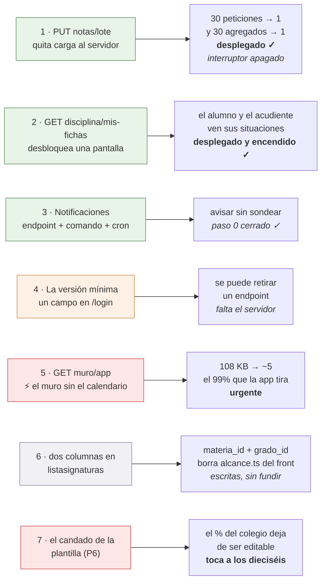

# Lo que la app necesita del servidor

Siete cosas, y ninguna se puede hacer desde el lado Flutter — **tres de ellas
ya entregadas**. La sexta (§6) **no es una ruta ni bloquea nada**: son dos
columnas en un `SELECT` que ya existe, y su apartado conserva la ruta nueva que se
pidió primero y se retiró el mismo día, porque la lección de por qué se retiró es
reutilizable. La quinta es la única con prisa: se anotó el 2 de septiembre de
2026 y es el 99 % de una respuesta que la app descarta, pagado en cada apertura
por un hosting compartido de un núcleo. El backend (`~/DESARROLLOS/8myvc`) es **de solo lectura** para esta
app: se lee para saber qué devuelve cada endpoint y nunca se edita. Esto es la
petición, escrita con el detalle suficiente para que se pueda decidir sin volver
a investigar, y para que el día que se autorice no haya que redescubrir nada. Lo
entregado se conserva aquí, marcado, porque explica por qué se pidió así.

Están ordenadas por lo que dan a cambio de lo que cuestan.

**Al día 26 de agosto de 2026, las dos primeras están escritas y desplegadas.**
Entraron en la tanda `eb95cbc`, que se desplegó el 25 ago **con el mismo hash en
los quince colegios**, y esta página no se enteró hasta el día siguiente. La
lección queda escrita arriba del todo porque es la que costó: **«desplegado» se
comprueba contra el hash de la tanda, no contra `main`**, y preguntar «¿está en
`main`?» da la respuesta equivocada en los dos sentidos —`main` va por delante de
lo que corre, y lo que corre puede tener de sobra lo que aquí se pide.

**Son quince colegios y no dieciséis** desde el 25 ago 2026: uno se dio de baja y
se borró del servidor, y nunca estuvo en ninguna tanda porque no tenía ni
repositorio git ni aplicación.



---

## 1. `PUT notas/lote` — guardar varias notas de una vez

**Lo que pasa hoy.** No hay endpoint de lote: `PUT notas/update/{id}` es de una
en una, así que pasar una columna de treinta alumnos son treinta peticiones. La
app ya hace lo que puede desde su lado —manda solo las que cambiaron y de tres
en tres, ver [notas.md §1.5](notas.md)— pero el fondo no lo puede arreglar.

**Y el coste real no son las treinta peticiones.** Es lo que hace cada una.
`NotasController::putUpdate` termina llamando a
`DefinitivasDeAsignatura::recalcularPorNota`, que acaba en `recalcular(...)`, y
ahí está lo que importa:

```php
$calculadas = self::calcular($asignaturaId, $periodoId);   // TODA la asignatura

if ($soloAlumno !== null) {
    $calculadas = array_values(array_filter(...));          // y el filtro, después
}
```

`calcular()` es un agregado sobre **todas** las notas de la asignatura y el
periodo, con tres *joins* y un `GROUP BY`; el recorte a un solo alumno se hace
en PHP, **después**, y dentro de una transacción. O sea que pasar una columna de
treinta notas dispara **treinta agregados de la asignatura entera**, veintinueve
de ellos para tirar el resultado.

En un VPS eso no se nota. En un hosting compartido es justo lo que hay que no
hacer ([hosting compartido](notas.md) §5).

**Lo que se pide.**

| | |
|---|---|
| Ruta | `PUT notas/lote`, con `auth.personal` |
| Cuerpo | `{"notas": [{"id": 900, "nota": 85}, {"id": 901, "nota": 40}]}` |
| Permiso | el mismo de una en una: `User::pueden_editar_notas` con `PeriodoDeLaFila::deNota($id)`, **por nota**, no una vez para el lote |
| Bitácoras | una por nota, idénticas a las de hoy: son el rastro que mira el colegio cuando alguien reclama, y el historial de la app las lee |
| Recálculo | **uno solo al final**, por cada par (asignatura, periodo) tocado, con `recalcular(...)` sin `soloAlumno` |
| Respuesta | `{"guardadas": 28, "fallidas": [{"id": 901, "motivo": "..."}]}` |

Lo de la respuesta no es capricho: la app ya sabe reintentar solo lo que falló
sin que el docente vuelva a teclear nada, y para eso necesita saber **cuáles**
fallaron. Que un lote entero se caiga por una nota sería peor que lo de ahora.

**Existe, está desplegado, y el lado de la app está escrito** (24 ago 2026). Vive
en `_guardarEnLote` de [LibroNotasApi](../lib/Http/LibroNotasApi.dart), detrás de
`Interruptores.notasLote`, **todavía apagado**.

La condición de encendido —desplegado en los quince, no fusionado— **ya está
cumplida**: la ruta viajó en la misma tanda `eb95cbc` del 25 ago que subió las
rutas de 539 a 542. Sigue apagado por una razón distinta y deliberada: **esto
toca la pantalla del trabajo diario de un docente**, la de pasar una columna de
treinta notas, y encenderlo es decisión de Joseth y no algo que se haga de paso
mientras se enciende otra cosa. La sesión del backend ofreció una comprobación
fina del contrato antes de encenderlo; conviene pedírsela ese día. Ver
[Interruptores](../lib/Utils/Interruptores.dart).

Tres cosas salieron de leer el controlador en vez de fiarse de este contrato, y
las tres cambian lo que la app tenía que hacer:

- **El lote tiene tope de 200, y pasarse no recorta: aborta el lote entero con
  un 422.** El propio controlador dejó anotado que el número se justificó
  «dando por hecha una capacidad del cliente que no existe» — ningún cliente
  partía en tandas. Ahora la app trocea de **cien en cien**, con margen por
  debajo del tope para que bajarlo no la rompa. Una columna de cuarenta y cinco
  sigue siendo una sola petición.
- **La respuesta trae `definitivas`**, que este documento no pedía: la
  definitiva de cada alumno tocado, calculada por el mismo recalculador que la
  escribe. Se parsea, viaja en `ResultadoGuardado.definitivas` y **ya se usa**:
  la planilla la devuelve al libro y `LibroDeNotas.conDefinitivaDelLote` la
  aplica. Eso quita las dos verdades — antes, después de pasar una columna, la
  definitiva de la pestaña «Por alumno» era la que la app se calculaba sola.
  Se copia **encima de la fila que ya existe**, porque el lote no devuelve el
  `nf_id` y una fila con `nf_id` cero apaga el control de nivelar: se habría
  perdido el botón por refrescar un número.
- **`manual` y `recuperada` llegan como booleanos de verdad**, no como el `1/0`
  de PDO que usa el resto del archivo, porque esta respuesta la arma PHP con un
  `(bool)` delante. Leerlas con `entero(x) == 1` pintaría una definitiva manual
  como automática.

---

## 2. `GET disciplina/mis-fichas` — HECHO, desplegado y encendido

> **Ya no es un pendiente.** La ruta entró con el commit `83bf717` (23 ago 2026),
> viajó en la tanda `eb95cbc` desplegada el 25 ago en los quince colegios, y el
> interruptor de la app se encendió el 26 ago. Se entregó **exactamente con el
> contrato que se pedía aquí**, guarda incluida, y con un test de contrato,
> `tests/Contrato/FichaDisciplinaPropiaTest.php`, que compara las claves de
> `mis-fichas` contra un elemento de `PUT disciplina/alumnos` **pidiendo las dos
> rutas en la misma ejecución** — no contra una lista escrita a mano, que se
> quedaría vieja el día que alguien añada una columna.
>
> Lo que sigue se conserva porque explica **por qué** se pidió así, y porque las
> tres correcciones del final son cosas del endpoint real que este contrato no
> preveía. Lo que la app hace con él está en
> [disciplina.md](disciplina.md) → «La ficha del alumno y del acudiente».

**De dónde venía.** La pantalla de disciplina existía y funcionaba para el
personal; el alumno y el acudiente no entraban. No era pudor: se comprobó que en
todo el backend solo cuatro controladores tocan `dis_procesos` —`Disciplina`,
`Comportamiento`, `NotaComportamiento` y `Grupos`— y **todas** sus rutas llevaban
`auth.personal`, que aborta con 403 a `Alumno` y `Acudiente`.

El único endpoint de notas abierto a ellos, `GET notas/alumno/{id}`, trae por
periodo las asignaturas, sus ausencias de clase y `nota_comportamiento` —que es
**la nota**, no las fichas—. Uniformes y tardanzas de institución, igual de
cerrados.

**Lo que se pidió, y lo que se entregó.**

| | |
|---|---|
| Ruta | `GET disciplina/mis-fichas/{alumno_id?}` ✓ |
| Guarda | `boletin.propio:sin-paz-y-salvo`, **no** `auth.personal` ✓ |
| Respuesta | `{"alumno": {…}, "config": {…}, "ordinales": [ … ]}` ✓ |

Sobre la guarda: ya existe y hace exactamente esto. `ExigirBoletinPropio` deja
pasar de largo a quien no es alumno ni acudiente, y a los que lo son les
comprueba que el `alumno_id` pedido sea el suyo o el de un acudido; sin id
significa «lo mío» — **y eso último resultó ser falso para un acudiente; ver las
correcciones al final de este apartado**. El modo `sin-paz-y-salvo` es el
correcto: **retener el boletín de quien debe es una cosa y esconderle a una
familia la situación
disciplinaria de su hijo es otra, y esa nadie la ha pedido.** Es la misma
decisión que ya se tomó para `notas/alumno` y para `matriculas/prematricular`.

Sobre la forma: **que `alumno` sea igual que un elemento de
`PUT disciplina/alumnos`**, con sus `periodoN[]`, sus `proceso_ordinales`, sus
`uniformes_perN[]` y sus contadores. No por comodidad, sino porque así la app
reutiliza [AlumnoDisciplinaModel](../lib/Models/AlumnoDisciplinaModel.dart) y
[FichaDisciplinaScreen](../lib/Screens/FichaDisciplinaScreen.dart) tal cual, en
modo lectura: la pantalla ya está escrita y probada. Con otra forma habría que
escribir un modelo nuevo y una pantalla nueva para enseñar lo mismo.

`config` y `ordinales` van porque la ficha los necesita para pintar: los tres
tipos se llaman como los llame el colegio —`falta_tipoN_displayname`— y los
ordinales de cada situación se resuelven contra el catálogo del año. **No** hace
falta mandar `grupos` ni `descripciones_typeahead`: eso es del editor, y aquí no
se escribe nada.

**Lo que cambió en la app.** Una pantalla corta —la ficha en modo lectura, que es
`FichaDisciplinaScreen` con `soloLectura: true`— y la opción del menú para
alumnos y acudientes. Ver [disciplina.md](disciplina.md) → «La ficha del alumno y
del acudiente».

### Tres correcciones a este contrato, del endpoint que se entregó

Ninguna se supo escribiendo la petición; las tres salieron de leer el
controlador desplegado, y la sesión del backend las confirmó ejecutando sus
pruebas contra el esquema real.

1. **«Sin id significa lo mío» NO vale para un acudiente: recibe 400.** El
   controlador solo resuelve `persona_id` cuando `tipo == 'Alumno'`; cualquier
   otro tipo se lleva `400 'No hay id de alumno'`
   (`DisciplinaController.php:142-147`). Es deliberado y tiene su prueba: «lo
   mío» no significa nada para quien tiene varios acudidos y no es alumno. La
   guarda deja pasar la petición sin id porque no hay alumno concreto que
   proteger, así que el 400 lo pone el controlador. **En sesión de acudiente hay
   que mandar siempre el id**, y por eso
   [MiDisciplinaScreen](../lib/Screens/MiDisciplinaScreen.dart) pregunta de qué
   acudido antes de llamar, con la misma hoja que «Mis notas» y «Asistencia».
2. **`config` llega como objeto o `null`, no como lista.** Sale del backend como
   `$config[0] ?? null`, y esa lectura **no crea la fila del año a propósito**,
   porque una lectura que escribe deja de ser de solo lectura. Un año recién
   abierto llega nulo, y leer `falta_tipoN_displayname` sin defensa reventaría en
   la primera ficha. `traerMisFichas` cae a los valores por defecto de
   `ConfigDisciplinaModel`. Los `ordinales` sí son lista.
3. **El año sale del alumno, no de quien pregunta.** Si el colegio pasa de año y
   la familia no ha vuelto a entrar, `users.periodo_id` sigue en el año viejo y
   la ficha habría dado 404 sobre una ficha que existe — justo cuando la familia
   abre la app a ver el curso nuevo. Se prefiere el año activo si hay matrícula
   viva, y si no el más reciente, que es lo que hace que la ficha de un egresado
   siga saliendo.

Y el aviso del coste se atendió: `fichaConFormaDeGrupo()` **copia la lista de
columnas de `Grupo::alumnos` pero parte del alumno**, no del grupo. Se copió en
vez de reutilizar la consulta precisamente para no armar el grupo entero y
quedarse con uno.

---

## 3. Notificaciones — un endpoint, un comando y una línea de cron

El plan entero, con el porqué de cada decisión, está en
[notificaciones.md](notificaciones.md). Resumido, hace falta:

1. **Un endpoint que devuelva los temas** que le tocan a quien se identifica —los
   suyos y los de sus acudidos—. Es la pieza de seguridad de todo el diseño: el
   nombre del tema se deriva con `HMAC-SHA256(alumno_id, secreto)` y **eso vive
   solo en el servidor**. Si el teléfono pudiera calcularlo, cualquiera se
   suscribiría a los avisos de un menor que no es suyo.
2. **Un comando de artisan**, `notificaciones:enviar`, con cuatro consultas
   agrupadas sobre datos que ya se registran —`bitacoras`, `ausencias`,
   `dis_procesos`, `publicaciones`—, una marca de por dónde iba, y el envío.
3. **La línea de cron**: `*/15 * * * * php artisan notificaciones:enviar`.

**El paso 0 ya está comprobado, el 23 de agosto de 2026, y sale bien:** el
hosting deja salir por HTTPS a `oauth2.googleapis.com` y a `fcm.googleapis.com`
—los dos contestan— y ejecuta artisan (Laravel 13.26.1). Y **el cron dispara**, comprobado con
una tarea de prueba que corrió cuatro veces. O sea que el push es viable, no
hace falta el plan B y **no queda nada por comprobar**: lo que falta es escribir
las tres piezas.

Ese cron **no es uno, es un bucle sobre los quince colegios**: cada uno es un
directorio con su `.env` y su base. El detalle, en
[notificaciones.md](notificaciones.md) → «Lo comprobado en el servidor».

No hace falta añadir el SDK de Google: se firma un JWT con `openssl_sign` y se
pide el token con Guzzle, que ya está en el `composer.json`.

---

## 4. La versión mínima — un campo, no una ruta

**El lado de la app está hecho; falta la mitad del servidor.** Joseth autorizó
el 24 de agosto de 2026 que la app compruebe la versión y que **bloquee** —ver
[VersionMinima](../lib/Utils/VersionMinima.dart) y
[ActualizarScreen](../lib/Screens/ActualizarScreen.dart)—. Lo que falta es que
el backend **mande el número**, y hasta que lo mande esto es código dormido:
sin el campo no se bloquea a nadie, que es justo lo que lo hace inofensivo de
publicar.

**El problema no es de esta app, es de todos.** `myvc_flutter` **no comprueba en
ninguna parte** que su versión siga siendo aceptable. Un teléfono con la versión
del año pasado sigue llamando a los mismos endpoints indefinidamente y nadie se
entera. Mientras eso sea así, **retirar cualquier endpoint depende de que
quince colegios se actualicen por su cuenta**: es la condición de entrada de
la fase 7 de `18-auditoria.md` y de la fase 5 de `00`, y por eso esas fases hoy
no tienen fecha —que no es lo mismo que tenerla lejos—.

### Lo que se pide: un campo en una respuesta que ya existe

    POST /login  →  { ..., "version_minima_app": 1 }

> **El ejemplo dice 1 y no un número redondo, a propósito.** La app publicada
> es el `versionCode` **1** —`version: 1.0.0+1`— y ni siquiera está en Play. Un
> colegio que copie un «12» de cualquier ejemplo **bloquea a todos sus usuarios
> de golpe y no hay ninguna versión a la que puedan actualizar**: la pantalla
> de bloqueo les manda a la tienda y en la tienda no hay nada. Desde el cliente
> no se distingue eso de un colegio que de verdad exige la última. El número
> que se ponga tiene que ser el de una versión **que exista en la tienda**.

**Un entero, el `versionCode`** —el `+N` de `pubspec.yaml`—, no la versión con
puntos: es el número que Play compara y el único que no admite interpretación.

**Y en `login`, no en una ruta nueva.** Cuesta cero peticiones y cero rutas: la
app ya llama a `POST /login` en los dos únicos momentos donde el dato sirve
—`LoginController` al entrar con usuario y contraseña, y
`ContextoAcademico.refrescar()` al recuperar la sesión guardada al arrancar—.
Una ruta nueva sería una petición más en cada arranque, en un hosting
compartido, para leer un número que cambia dos veces al año. Si aun así se
prefiere ruta aparte, la app se adapta; pero entonces que sea cacheable.

Opcional, y solo si sale gratis: `"version_minima_mensaje": "..."`, para poder
decir *por qué* hay que actualizar. Sin él, la app pone un texto genérico.

### Lo que hace la app, y lo que NO hace pase lo que pase

| Situación | Qué hace |
|---|---|
| Su `versionCode` ≥ el mínimo | nada, ni un aviso |
| Su `versionCode` < el mínimo | pantalla que explica y lleva a Play. **No deja entrar** |
| El campo no viene | **entra** |
| El campo no es un entero positivo | **entra** |
| No hay red, o el servidor no contesta | **entra** |
| Ya está dentro trabajando | **no se le echa**; se comprueba al arrancar y al entrar |
| Está bloqueado y tiene cuenta en otro colegio | **puede llegar al login**; ver abajo |

**Las cuatro filas de «entra» son la parte importante del contrato, no la letra
pequeña.** Un campo mal puesto en el `.env` de un colegio no puede dejar a ese
colegio entero fuera de la app: el fallo por defecto tiene que ser dejar pasar.
Bloquear es lo excepcional y solo con un número que se entienda.

**Y «absurdo» no se puede programar**, así que lo implementado es lo único que
sí: **no es un entero positivo → entra**. Un número altísimo —999999999— **sí
bloquea**, y tiene que hacerlo: desde el cliente no hay forma de distinguir un
`.env` con un dedazo de un colegio que de verdad exige la última versión, y
adivinarlo sería justo lo contrario de lo que hace fiable esta comprobación.
**La defensa contra el dedazo está en el servidor**: ese número se sube una vez
por retirada, con la misma ceremonia que un despliegue.

**Y esto es lo que hay que leer antes de tocar ese número, no después:** un `99`
donde iba un `9` **deja al colegio entero fuera de la app hasta que alguien
vuelva a tocar el servidor**. Desde el teléfono no hay arreglo —la app hace lo
que se le dijo— y la única salida que ofrece la pantalla es salir e ingresar en
**otro** colegio, que solo le sirve a quien tenga cuenta en dos. No es un motivo
para no hacerlo; es el motivo por el que ese campo no se edita a la ligera ni se
copia de un colegio a otro sin mirar.

**La pantalla de entrar es la única que se deja pasar bloqueado**, y no es una
rendija. Son quince colegios con una sola app y **el número lo pone cada
colegio en su servidor**, así que quien tenga cuenta en dos puede estar
bloqueado por el que va atrasado y no por el otro; sin esa salida no le quedaría
forma de llegar a la pantalla de entrar. No debilita nada, porque entrar vuelve
a leer el número: si el colegio nuevo también lo exige, la puerta se cierra otra
vez en cuanto se sale del login. Y al cerrar sesión el número se olvida, por lo
mismo: es del colegio del que se sale, no de este teléfono.

**Y bloquear de verdad, no sugerir.** Un aviso que se puede cerrar no permite
retirar nada, que es justo para lo que existe esto: si la versión vieja puede
seguir entrando, el endpoint viejo sigue haciendo falta. La contrapartida es que
el número hay que subirlo con cuidado —una vez por retirada, no en cada
publicación— y eso es de quien despliega, no de la app.

### Lo que costó del lado Flutter, ya hecho

Dos dependencias —`package_info_plus`, que lee el `versionCode` del paquete
instalado, y `url_launcher` para llevar a Play— y tres enganches.

Lo del `versionCode` merece una línea: se lee del paquete y no de una constante
en el código **porque una constante se queda vieja el día que alguien publique
sin acordarse de subirla**, que es exactamente el fallo que esto viene a evitar.

Los enganches son los tres sitios por los que pasa una respuesta de `/login`:
`tomarUsuarioDe` —que comparten entrar con contraseña y recuperar la sesión
guardada— y `ContextoAcademico.refrescar`, que es la única llamada a `/login`
que la app hace ya estando dentro, y por tanto donde se entera de que el colegio
subió el número sin tener que salir y volver a entrar.

**La comprobación vive en el router**, no en cada pantalla: una puerta que se
mira en veinte sitios es una puerta que un día se queda sin mirar en uno.

### Lo que esto desbloquea, para que se vea qué se compra

Con esto, retirar un endpoint pasa a ser comprobable: se publica la versión que
ya no lo llama, se sube el mínimo, y el servidor sabe que nadie por debajo entra.
Sin esto, la única forma honesta es mirar el reparto por versión de Play Console
y decidir a ojo — que también vale, pero es un dato de tienda y no un contrato.

---

## 5. ⚡ URGENTE — `GET muro/app`: el muro sin el calendario del colegio

**Es la única de esta página que tiene fecha límite, y la pone la propia app.**
Las demás desbloquean algo. Ésta evita que el hosting compartido pague por
mandar, en cada apertura, cien kilobytes que la app tira sin mirar.

Anotada el 2 de septiembre de 2026 al medir qué le cuesta al servidor que la app
deje de ser de docentes y pase a ser de toda la comunidad.

### Antes que nada: el backend ya hizo una pasada hoy, y hay que partir de ahí

**El commit `805e08f` del 2 sep 2026** —«el panel de un alumno baja de 620 ms a
24 ms»— ya recortó tres cosas de `ChangesAsked/to-me`, y su medición rol por rol
está en `docs/migracion/24-el-panel-de-inicio.md` del backend. Esto es lo que
midió, que **no es lo que esta página estimó**:

| rol | consultas | tiempo | respuesta |
|---|---:|---:|---:|
| `Usuario` | 39 | ~700 ms | 274 → 157 KB |
| `Profesor` | 75 → 17 | ~30 → ~13 ms | 279 → 162 KB |
| `Alumno` | 49 → 24 | ~620 → ~24 ms | 225 → 112 KB |
| `Acudiente` | 8 | ~8 ms | 218 → **108 KB** |

**Corrección, y va con nombre:** esta página había estimado «unas dieciocho
consultas» para un acudiente a partir de leer el bucle. La medición dice 8 y ~8
ms. La estimación no era del todo falsa —el propio doc del backend avisa de que
**«el acudiente medido no tiene acudidos en el año en curso, así que sus 8
consultas son el suelo, no el caso normal: uno con dos acudidos paga seis
consultas más por cada uno»**— pero el número que se citó era una cuenta de
código, no una medición, y no estaba marcado como tal. **Lo que se mide manda.**

Y sobre todo: **la medición mueve el argumento a otro sitio**, que es lo que
sigue.

### Lo que de verdad cuesta no son las consultas: es el calendario

Del desglose de la respuesta por clave, para un acudiente:

| clave | KB | ¿la lee la app? |
|---|---:|---|
| **`eventos`** | **215,5** → ~108 tras el recorte de columnas | **no** |
| `publicaciones` | 2,1 | sí |
| `alumnos` | ~0 con cero acudidos; unos pocos KB con dos | sí, ocho campos |
| `comportamiento` · `ausencias_periodo` · `libro` | 0,0–4,2 | solo `ausencias_periodo` |

**El calendario es el 99 % de la respuesta y la app no lo lee.** La consulta es
`SELECT * FROM calendario WHERE solo_profes=0 and deleted_at is null`, **sin
filtro de año y sin filtro de fecha**: 593 filas, de las que 123 son de 2019 a
2023. El recorte de columnas de hoy lo dejó en la mitad, y sigue siendo el 99 %
de lo que la app descarta.

O sea que cada vez que alguien abre la app se serializan y se mandan ~108 KB
para que Flutter lea unos 5.

### Lo que se pide

Un endpoint propio para la app:

    GET muro/app  →  { "publicaciones": [...], "alumnos": [...], "horario_hoy": [...] }

Tres claves. **Sin `eventos`** —que es todo el peso—, y con `alumnos` trayendo
solo lo que [AcudidoModel.fromJson](../lib/Http/MuroApi.dart) lee: `alumno_id`,
`nombres`, `apellidos`, `foto_nombre`, `nombre_grupo`, `grupo_abrev`,
`pazysalvo` y `ausencias_periodo`.

Eso quita del bucle por acudido `comportamiento`, `situaciones`, `libro`,
`uniformes`, `prematricula` y `matri_next` —seis de las siete llamadas—, y deja
`Ausencia::deAlumnoYear`, que es la única cuyo resultado se mira.

**El endpoint viejo no se toca**: lo usa el panel del front web y ahí sí se
pintan esas cosas. Es uno nuevo al lado.

> Si `muro/app` resulta ser más de lo que se quiere hacer ahora, **el 90 % del
> beneficio está en una línea**: no mandar `eventos` a quien no lo pinta, igual
> que hoy `profes_actuales` ya vuelve vacío para un alumno. La app no lee esa
> clave en ningún rol, comprobado en `MuroApi.traerMuro`.

### Por qué corre prisa

No es el coste medio, es **el pico, y lo fabrica el push**. Una notificación de
«ya están las notas» hace que unos cuantos cientos de teléfonos abran la app en
el mismo medio minuto. Con el hosting en **un núcleo** —ver la ficha del
servidor—, lo que se paga en ese medio minuto es serializar y mandar 108 KB por
cada uno, más el ancho de banda.

Mientras la app era de docentes esto no existía: eran cincuenta personas y
entraban repartidas por la mañana.

### Lo que ya se hizo del lado Flutter, y por qué no basta

El 2 de septiembre de 2026, el mismo día:

- [MuroEnMemoria](../lib/Utils/MuroEnMemoria.dart) — **cuatro** pantallas pedían
  el muro en una sola visita (el muro, Mis notas, Mi disciplina y Mi asistencia)
  y las tres últimas solo querían la lista de acudidos. Ahora una.
- [VerificacionSesion](../lib/Utils/VerificacionSesion.dart) — `GET /years` en
  cada arranque en frío, ahora una vez cada seis horas.
- `cached_network_image` — las fotos, guardadas en disco entre arranques.

**Eso divide entre cuatro cuántas veces se pide; no toca los 108 KB de cada
vez**, y la que llega en ráfaga detrás de una notificación es justamente la
primera de la visita, que nunca sale de la caché.

### Antes de dar esto por hecho

Lo de hoy está en `main` del backend, **no necesariamente desplegado**. Se
comprueba contra el hash de la tanda y no contra `main`, que es la lección del
principio de esta página:

```bash
git merge-base --is-ancestor 805e08f <hash-de-la-tanda>
```

### De paso: `GET /years` también es N+1

`YearsController::getIndex` trae todos los años y luego, **año por año**, lanza
otra consulta por sus periodos. La app lo usaba en cada arranque en frío solo
para comprobar que el token sigue valiendo —mira el código de estado y tira la
respuesta—. Del lado Flutter ya se espació a una vez cada seis horas; lo barato
de verdad sería un `GET auth/ping` que devuelva 200 o 401 y nada más. **No es
urgente**, pero si alguien abre ese controlador por otra cosa, el `foreach` con
un `DB::select` dentro se arregla con un solo `WHERE year_id IN (...)`.

---

## 6. Dos columnas en `listasignaturas` — ESCRITAS, sin fundir

> **Pedido y aprobado el 19 sep 2026.** Joseth lo autorizó con el precio delante y
> la sesión de la API lo escribió el mismo día: commit **`fe95da8`**, rama
> `feat/materia-id-y-grado-id-en-asignaturas`. **Sin fundir a `main` y sin
> desplegar** — las dos cosas son de Joseth y van por separado.
>
> **Y ninguna ruta nueva: el router sigue en 600**, que es donde empezó todo esto.
>
> Lo que lleva dentro:
>
> - `a.materia_id` y `g.grado_id` en `Profesor::asignaturas` **y en el gemelo de
>   Piars, en el mismo commit** — que era la mitad que muerde;
> - **tres** instantáneas regeneradas, `+2` claves cada una. La tercera es
>   `muestreo-piars-asignaturas`, y **sólo se mueve porque se tocó el gemelo**: en
>   la medición previa no se había movido. Ésa es la prueba de que sin tocarlo la
>   ruta habría contestado dos formas con la suite en verde;
> - los dos ficheros quedan con un aviso apuntando al otro, para que el próximo
>   que añada una columna ahí no repita el agujero.
>
> ```
> Tests: 2116 passed, 1 skipped (19747 assertions)   --testsuite=Contrato
> Tests: 147 passed (Unit) · 9 passed (Feature) · larastan nivel 7: [OK] 651 ficheros
> ```
>
> **Lo que sigue abierto y no es de este repositorio**: borrar `alcance.ts` del
> front —que no se puede hasta que esto esté **desplegado** en los dieciséis, no
> fundido— y el hash de `lal`, que se comprueba mirando y es de Joseth.
>
> **Para la app esto todavía no cambia nada**: escrito no es desplegado. Ver «Lo
> que hace la app mientras tanto», al final.
>
> La pantalla que lo usa está en [competencias.md](competencias.md) §3.

### Lo que pasa hoy, medido

La pantalla «Mis competencias» del docente necesita, por clase, el par
**(`materia_id`, `grado_id`)**: el plan de área se dirige por ids.

`GET asignaturas/listasignaturas[/{profesor_id}]` sale de `Profesor::asignaturas`
(`8myvc/app/Models/Profesor.php:110`). Hace **los tres `JOIN`** —`materias`,
`grupos`, `grados`— y **no nombra `a.materia_id` ni `g.grado_id`**. Sus trece
claves son `asignatura_id · grupo_id · profesor_id · creditos · orden · materia ·
alias_materia · nombre_grupo · abrev_grupo · titular_id · caritas ·
nivel_educativo_id · unidades`.

**El front se lo encontró igual y lo resolvió en el cliente**, en
`myvc_front/app2/src/app/paginas/docente-competencias/alcance.ts`:

```
grupo_id        ->  GET grupos    ->  grado_id     exacto: es la clave primaria
materia+alias   ->  GET materias  ->  id           POR NOMBRE, que es lo que hay
```

Y si el par `materia`+`alias` no es único, **descarta esa asignatura** y lo cuenta
(`sinEmparejar`), porque *«callarlo convierte una limitación nuestra en “el sistema
no me deja”»*.

### Lo que se pide

**Dos columnas en un `SELECT` que ya tiene las tres tablas dentro.**

| | |
|---|---|
| Dónde | `Profesor::asignaturas`, `app/Models/Profesor.php:108` (en `ebbae74`) |
| Qué | `a.materia_id` y `g.grado_id` — los dos `JOIN` ya están puestos |
| Guarda | ninguna nueva — `listasignaturas` ya lleva `persona.propia` |
| Ruta nueva | **no**. El contador de rutas no se mueve |
| Compatibilidad | claves **añadidas** a una lectura: una app vieja las ignora. No es el caso de `notas/nivelar`, que era escritura |

> ### Pero el precio NO es «una respuesta», son ONCE — medido por la sesión de la API
>
> Lo que se comparte no es la ruta: **es el método**, y lo llaman **once sitios en
> nueve controladores**, todos devolviendo esas filas en su respuesta:
>
> ```
> AsignaturasController ×3   listasignaturas · listasignaturas-alone · listasignaturas-year
> NotasController:413 · UnidadesController:257 · PlanillasController:116
> PiarsAsignaturasController:19 · PlanillasAusenciasController:84 · NotasPerdidasController:164
> ```
>
> **Eso no lo mata** —dos ids no son datos de nadie, y ninguno de los cuatro
> clientes pinta estas filas recorriendo sus claves— pero el precio que hay que
> ponerle delante a Joseth es **«once respuestas»**, no «una». Esta página decía
> «una» y era mi encuadre, no la medida.
>
> **Y hay una trampa que no habíamos visto ninguno de los dos**:
> `PiarsAsignaturasController` tiene un **gemelo copiado a mano** del mismo
> `SELECT` para su rama `Usuario` (líneas 23-31). Tocar sólo el método deja esa
> ruta contestando **dos formas distintas según quién pregunte**: un `Profesor`
> con los ids y un `Usuario` sin ellos. Se tocan los dos, o el gemelo se borra y
> llama al método.

### El precio, MEDIDO — 19 sep 2026

Lo corrió la sesión de la API sobre `main` (`ebbae74`), en árbol y base propios,
con las dos columnas puestas. Queda commiteado como medición en
`medicion/dos-columnas-en-listasignaturas` (`7a2df03`), con **NO FUSIONAR** en el
mensaje:

```
Tests: 2 failed, 1 skipped, 2114 passed (19747 assertions)   --testsuite=Contrato
Duration: 921.02s
```

**Dos instantáneas se mueven**, y su diff es literalmente
`+ 'materia_id' => 'int'` y `+ 'grado_id' => 'int'`:
`muestreo-notas-perdidas-show-profesor.json` y
`muestreo-planillas-ausencias-show-profesor.json`. **Ni un rojo más en 2.117
pruebas.**

> ### Y el hallazgo no es el dos: es lo que NO se pone rojo
>
> De los once llamantes, **la suite mira dos**. Las otras nueve
> —`listasignaturas` ×3, notas, unidades, planillas y la rama `Profesor` de
> `piars/asignaturas`— **cambian de forma en silencio**.
>
> **Y la ruta que motiva esta petición es una de las nueve**: `listasignaturas`
> **no tiene instantánea de forma**, así que hoy nadie notaría si su respuesta
> cambiara. Ver abajo, en «Lo que la app necesita que NO se rompa».
>
> **El gemelo de Piars queda demostrado y no supuesto**:
> `muestreo-piars-asignaturas.json` **no se movió**, porque esa instantánea es de
> la rama `Usuario` —la del `SELECT` copiado a mano—. O sea que aplicar esto
> tocando sólo el método dejaría esa ruta contestando **dos formas según quién
> pregunte, con la suite en verde**. Eso no se dedujo: se contó.

**Y no es para la app solamente: borra `alcance.ts` del front**, y con él el
emparejamiento de materias por nombre. Es una deuda que hoy pagan los dos clientes.

#### El argumento fuerte no es el mantenimiento: es que el rodeo del front no está garantizado

Esto lo aportó la sesión de la API y **es mejor que lo que yo tenía escrito**.
Medido en el colegio de desarrollo: **35 materias vivas y cero pares
(`materia`, `alias`) repetidos**, o sea que el emparejamiento por nombre funciona
ahí. Lo que le faltaba a mi argumento es que **el esquema no lo impide**:
`materias` **no tiene ningún índice único sobre `(materia, alias)`**, sólo la
clave primaria de `id`.

O sea que la premisa del rodeo es **una casualidad de los datos de un colegio, no
una garantía**, y son dieciséis. El día que un colegio tenga dos materias que se
llamen y se abrevien igual, el front **descarta esas asignaturas en silencio** y el
docente ve que «el sistema no le deja».

Con eso la pantalla se arma con **dos peticiones a rutas que existen**: ésa —que
la app ya llama en otras pantallas— y `GET desempenos?periodo_id=`, filtrando en
el cliente como hace el front. Y las escrituras **ya están**: `POST desempenos`,
`PUT`/`DELETE desempenos/{id}` y `PUT desempenos/copiar`, así que la función queda
entera y no a medias — que es la lección de `horario/versiones`.

### La ruta que se retiró, y por qué — porque la lección es reutilizable

Lo pedido primero fue `GET desempenos/mis-clases`: una petición que devolvía las
clases del docente ya resueltas, con `puede_escribir` por clase y `editable` por
fila. **El argumento que la sostenía era falso y se cayó al ir a comprobarlo** para
contestar a la sesión de la API, que pidió justificarla punto por punto.

El argumento era: *«sin la ruta, la app tiene que reimplementar
`Autoriza::puedeEscribirDesempenos`, y una regla de autorización escrita dos veces
se separa»*. Comprobado, **la app puede calcular esa regla exacta** —no aproximada—
con lo que ya recibe:

| parte de la regla | de dónde la saca la app |
|---|---|
| rama 1 · `can_edit_plantilla_notas` | `Autoriza::puedeEditarPlantillaNotas` (`Autoriza.php:576` en `ebbae74`) lo lee de `$user->perms`, y **`perms` viaja en el `/login`** (`ContextoDeUsuario.php:408`, y su comentario lo dice). La app parsea `roles` y **no** parsea `perms`: eso es trabajo de este lado |
| rama 2 · «doy esa materia en ese grado» | es **la propia lista de asignaturas**, en cuanto traiga los ids. `Autoriza::puedeEscribirDesempenos` (`Autoriza.php:640`) filtra literalmente por `a.materia_id = ? AND g.grado_id = ?` — **el par que falta es exactamente el que se pide** |
| el periodo cerrado | `profes_pueden_editar_notas`, que ya lee [ConfiguracionColegio](../lib/Utils/ConfiguracionColegio.dart) |
| `grado_id IS NULL` es del colegio | una constante |

Queda un argumento de **mantenimiento** —la regla escrita en dos idiomas puede
separarse el día que el backend la cambie— y ése no paga una ruta nueva: en ese
repositorio estrenar una mueve el contador de `CLAUDE.md` y tres o cuatro
instantáneas, y es una decisión de Joseth con el precio delante.

> **La lección, que es la que costó las dos veces**: medí **lo que al endpoint le
> falta** y no miré **si lo que faltaba era una ruta o una columna**. Es la misma
> forma del error de §5 de [competencias.md](competencias.md) —dar algo por
> bloqueado sin abrir el cliente que ya lo hace—, cometida dos veces seguidas en
> el mismo trazo. La pregunta que las dos veces habría bastado: **¿esto existe y
> devuelve de menos, o no existe?**

### La pregunta abierta, ya más pequeña de lo que la dejé

Aquí ponía que la app se traería *«el catálogo del colegio entero»* y que el techo
era ése. **Es más débil que eso, y el dato estaba en un fichero que yo había
leído**: `GET desempenos` **ya acepta `materia_id` y `grado_id` como filtros**
(`DesempenosController:104-115`). Así que la app **no está obligada** a bajarse
nada del colegio entero — puede acotar por clase hoy mismo, al precio de N
peticiones en vez de una.

O sea que el techo real es *«una petición por clase»* —cinco o seis—, no *«el
colegio entero»*. Un `?mias=1` en esa misma ruta seguiría ahorrando viajes, pero
**ahorra viajes, no evita un desastre**, y por eso **no se pide**. Queda escrito
con su salida elegida por si alguna vez estorba.

### Una trampa para quien busque un atajo en la app

`listasignaturas/{id}` trae un bloque **`grados_comp` que sí lleva `grado_id`**, y
es tentador. **No sirve**: su consulta filtra `g.titular_id = :profe_id`, o sea
**sólo los grupos de los que el docente es titular**, no los que da. Quien lo tome
por el mapa completo se queda corto **sin enterarse**. Lo levantó la sesión de la
API y se apunta aquí para que nadie lo proponga como alternativa a la columna.

---

## 7. El candado de la plantilla, y un interruptor que no viaja

> **Decidido por Joseth el 19 sep 2026**, mirando el banco de pruebas: *«los
> porcentajes de las unidades ahora no serían por asignatura sino por colegio, y
> cada asignatura tiene subunidades/logros que se enlazan a ese porcentaje hecho
> por la coordinadora o docente»*. Y a la pregunta de si el docente deja de poder
> cambiarlos: **sí, pero primero el backend**.
>
> **No es una idea nueva: es P6**, que ya está escrita en
> `myvc_front/CORRECCIONES-MODELO-DE-EVALUACION.md`. Esto la pide desde el lado
> de la app y añade lo que se midió aquí.

### 7.1 · El candado de `por_defecto` — **la más delicada de todo el trazo**

**Lo que pasa hoy, medido.** `unidades.por_defecto` y `subunidades.por_defecto`
existen en el **esquema desplegado** (`tinyint(1) DEFAULT '0'`) y **ya viajan** a
los clientes: `AsignaturasController::putDetalleAsignatura` las nombra en sus dos
`SELECT` (líneas 71 y 83). O sea que el dato está.

Lo que no está es el candado. Medido el 13 sep con el token de un docente **sin**
`can_edit_plantilla_notas`: `PUT unidades/update/18501` contesta **200**. Puede
cambiar su «Seguimiento 70 %» a 60 en su asignatura, y el colegio **no puede
verlo**: cree que tiene un reparto y tiene ciento treinta y cuatro.

**Lo que se pide** (es P6 tal cual, y se copia aquí para no depender de otro repo):

| | |
|---|---|
| `unidades/update`, `subunidades/update`, `unidades/update-orden` | **rechazar** el cambio de **nombre** y de **porcentaje** cuando `por_defecto = 1` y quien llama no tiene `can_edit_plantilla_notas` |
| lo que **sigue permitido** | **añadir subunidades dentro** de una unidad del colegio. Es el trabajo del docente (D14) y es justo lo que Joseth describe: *«cada asignatura tiene subunidades/logros que se enlazan a ese porcentaje»* |
| ruta nueva | «volver a aplicar»: actualiza las copias **de los periodos no cerrados** en vez de saltárselas, y contesta con su recuento como `sembrar` |

### 7.2 · Por qué esto no se hace sólo en la app, y no es pereza

**Bloquear el campo aquí sería teatro**: la misma cuenta abre la web y hace el
`PUT` sin candado. Y hay algo peor que el teatro —**le quita a un docente algo que
hoy hace de verdad**—, que es exactamente lo que P6 dice con todas las letras:

> *«Un docente que hoy ajusta sus porcentajes deja de poder hacerlo. Eso es una
> decisión de producto, no un arreglo: hay que decirlo colegio a colegio antes, no
> después.»*

Por eso la app no pinta nada hasta que el servidor lo rechace. **El día que lo
haga**, aquí es una entrega corta: `UnidadModel` y `SubunidadModel` leen
`por_defecto` —que ya viene—, `UnidadesScreen` deja el nombre y el porcentaje en
gris con su motivo, y el botón de añadir subunidad **se queda encendido**.

### 7.3 · Y lo que NO se pide, que es la mitad de la respuesta

Joseth preguntó si los porcentajes pasan a ser «del colegio y no de la
asignatura». **La respuesta escrita es que se copian, no se comparten**, y está
decidida en P6.bis con su medición: `unidades.asignatura_id` es `NOT NULL`, once
modelos calculan sobre él, y con el 70 % en una sola fila del año **corregirlo en
octubre recalcularía los boletines del periodo 1 que ya fueron a casa**.

La tabla del colegio ya existe y **está desplegada** —`unidades_por_defecto`— y
`UnidadesController` siembra desde ella la primera vez que alguien abre una
asignatura sin unidades. O sea que «se define arriba y se lee abajo» **ya ocurre**:
lo que falta es que se *comporte* así, y eso es el candado de §7.1.

### 7.4 · `reparto_subunidades` no viaja, y su hermano sí

Lo pequeño, y es una asimetría que sólo se ve desde aquí.
`years.reparto_subunidades` —`porcentaje` | `promedio`, el interruptor que hace
que **las subunidades dejen de llevar porcentaje**— **no está en el volcado del
esquema y no sale en ninguna de las cuatro consultas de `ContextoDeUsuario`**:

```bash
grep -c reparto_subunidades 8myvc/database/schema/mysql-schema.sql   # 0
grep -c reparto_subunidades 8myvc/app/Services/ContextoDeUsuario.php # 0
```

Su hermano `modelo_evaluacion` **sí sale en las cuatro**. Los dos son columnas de
`years` que gobiernan lo que ve un docente, así que se pide **la misma línea**: que
`reparto_subunidades` viaje en el contexto del login.

Sin eso la app no puede esconder el campo de porcentaje de la subunidad, que es lo
que el colegio va a notar el primer día. Lo que la app hará con él ya está escrito
en [plantilla-y-competencias.md](plantilla-y-competencias.md) §3.2.bis.

> **Y no se atan a `modelo_evaluacion`** — Joseth, 19 sep 2026. Un año puede ir por
> competencias y seguir ponderando. El motivo es **D3**: *«el interruptor gobierna
> lo que se ve, nunca el cálculo»*, y `modelo_evaluacion` hoy no mueve ninguna
> definitiva. Atarlos habría hecho que encender el boletín por competencias
> recalculara las notas de todo un año, que es una clase de sorpresa que este
> sistema no se puede permitir.

---

## Cómo arrancar la sesión que hace esto

Se trabaja **desde dentro del backend** —`cd ~/DESARROLLOS/8myvc && claude`—, no
desde la sesión de Flutter: ese repo tiene su `CLAUDE.md`, su
`docs/migracion/ESTADO-ACTUAL.md` y su docker con las pruebas, y hacerlo desde
fuera se salta sus convenciones.

El texto de arranque, para pegar tal cual:

```
Vengo de la app (myvc_flutter). Joseth autorizó el 23 ago 2026 hacer aquí tres
cosas que la app necesita y no se pueden resolver desde el lado Flutter.

Lee primero, en este orden:
  1. docs/migracion/ESTADO-ACTUAL.md (de este repo)
  2. ~/DESARROLLOS/myvc_flutter/docs/backend-pendiente.md — los tres contratos,
     con la evidencia que los justifica y lo ya investigado

Hazlas en este orden, cada una con sus tests y actualizando ESTADO-ACTUAL.md en
el mismo commit:

1. PUT notas/lote. Lo que ahorra NO son las peticiones: cada notas/update llama
   a recalcularPorNota -> recalcular(), que agrega TODAS las notas de la
   asignatura y el periodo y sólo después se queda con un alumno. Una columna de
   30 notas son 30 agregados de la asignatura entera. El lote debe recalcular
   UNA vez por par (asignatura, periodo), al final y fuera de la transacción de
   escritura. Ya comprobado: pueden_editar_notas() acepta un array de periodos y
   los cruza con AND, así que el permiso se comprueba una sola vez y antes de
   escribir nada; la bitácora debe ser idéntica a la de putUpdate, y
   bitacoras.historial_id admite null (putUpdate lo resuelve con un cross join y
   por eso revienta con 422 si el usuario no tiene historial).

2. GET disciplina/mis-fichas/{alumno_id?} con la guarda que YA existe,
   boletin.propio:sin-paz-y-salvo. Debe devolver {alumno, config, ordinales} con
   `alumno` en la MISMA forma que un elemento de PUT disciplina/alumnos: así la
   app reutiliza AlumnoDisciplinaModel y FichaDisciplinaScreen tal cual, en modo
   lectura, y esa pantalla ya está escrita y probada. Sin `grupos` ni
   `descripciones_typeahead`: eso es del editor y aquí no se escribe.

3. Las tres piezas de notificaciones (endpoint de temas con HMAC, comando
   notificaciones:enviar, entrada de cron). El paso 0 está CERRADO y las cuatro
   comprobaciones salieron bien el 23 ago: el hosting sale por HTTPS a
   oauth2.googleapis.com y fcm.googleapis.com, ejecuta artisan (Laravel 13.26.1,
   PHP 8.4.24 en /usr/local/bin/php) y el cron dispara. El plan entero, con el
   porqué de cada decisión, está en ~/DESARROLLOS/myvc_flutter/docs/notificaciones.md.
   El cron NO es uno: cada colegio es un directorio con su .env y su base, y son
   quince, así que va un bucle secuencial con $HOME.

Y una restricción de despliegue que hay que dejar anotada donde toque: `app/` es
copia por colegio y myvc_flutter es UNA sola app para los quince. La app no
puede llamar a notas/lote hasta que esté desplegado en todos, o gastaría un 404
antes de caer al método viejo. Avísame cuando esté desplegado y hago el lado
Flutter.
```

---

## Lo que la app necesita que NO se rompa

Esto no es una petición: es lo contrario. Son endpoints que **hoy funcionan** y
que alguien está a punto de estrechar por seguridad, con razón. Queda escrito
para que el recorte se haga sabiendo qué se rompe.

### `GET contratos` — el mínimo para alumno y acudiente

Lo trajo la sesión del front web el 23 de agosto de 2026: `contratos` responde
200 a un alumno y a un acudiente, y devuelve de cada docente el documento de
identidad, el barrio, la dirección de casa, el fijo y el móvil. Se va a recortar
por rol, y hace bien.

**De los treinta y tantos campos, esta app lee cuatro:**

    profesor_id · nombre_completo · foto_nombre · user_id

Se parsea en tres sitios y en ninguno más: `traerDocentesDelColegio()` de
[UnidadesApi](../lib/Http/UnidadesApi.dart), `traerDocentesPorProfesor()` de
[NotasApi](../lib/Http/NotasApi.dart) y
[AsistenciaClaseScreen](../lib/Screens/AsistenciaClaseScreen.dart).
`traerNombresPorUsuario()` no es una cuarta llamada: reindexa la misma respuesta
por `user_id`, porque `added_by` y `created_by` guardan la numeración de usuario
y no la de profesor.

**Con rol de alumno o acudiente se llama desde una sola pantalla**, `/mis-notas`,
y lo único que hace con ella es poner **el nombre del titular del grupo** —el
boletín trae `titular_id` y no su nombre—. Así que ahí bastan `profesor_id` y
`nombre_completo`; `foto_nombre` solo si algún día se quiere el avatar.

**Ninguno de los campos sensibles se pinta en ninguna pantalla**, comprobado con
un `grep` sobre todo `lib/`. No hay una decisión previa de enseñar el móvil del
profesor que haya que respetar: quitar esos campos es quitar lo que nadie lee.

**Lo que sí rompería es cerrarlo con un 403.** No tumba la pantalla —el mapa de
docentes va en un `catch` y se queda vacío— pero deja a todo alumno y acudiente
sin el nombre de su titular, en los quince colegios a la vez.

### `GET asignaturas/listasignaturas` — y nadie lo vigila, medido

**Es la única puerta de la app a las asignaturas de un docente**: de ahí salen
[NotasScreen](../lib/Screens/NotasScreen.dart),
[UnidadesScreen](../lib/Screens/UnidadesScreen.dart) y
[AsignaturaModel](../lib/Models/AsignaturaModel.dart), que lee `asignatura_id`,
`grupo_id`, `profesor_id`, `materia`, `alias_materia`, `nombre_grupo` y
`abrev_grupo`.

**No tiene instantánea de forma en el backend.** No es una sospecha: salió de la
medición de §6 —al añadirle dos columnas se movieron dos instantáneas y **ninguna
era la suya**—. O sea que **si esa respuesta cambiara, no se pondría rojo nada, ni
allí ni aquí**, y el síntoma sería la pantalla de poner notas vacía para todos los
docentes a la vez.

Lo que la app necesita que no se mueva son esas siete claves. Añadir es seguro
—`JsonBackend` ignora lo que no conoce—; **renombrar o quitar, no**.

### `GET perfiles/username/{u}` — hoy no limita a cuáles

Medido por el front web el mismo día: contesta 200 **a cualquier docente para
cualquier usuario**; la guarda solo estrecha a alumnos y acudientes. No lo
llamamos, así que no nos afecta hoy. Queda anotado porque el día que haya una
pantalla de personal que consulte fichas, no hay nada que limite **cuáles** — y
eso hay que decidirlo antes de escribirla, no después.

`GET perfiles/usernames`, que devuelve los 2.355 nombres de usuario del colegio
a cualquiera con sesión, **esta app no lo llama**: cero referencias en `lib/`.

### `historiales/nota-detalle` — el historial de una nota

Lo levantó la sesión del front web el 23 de agosto de 2026: la auditoría del
backend se está reescribiendo (`docs/migracion/18-auditoria.md`, sesión
`8myvc-7b`), con cuatro rutas `auditoria/*` nuevas, y entre lo que se retiraría
está esta. **En la fase 5 no se retira nada** —las nuevas son aditivas y los
alias siguen— y la retirada es una fase 7 cuya condición de entrada no es
«desplegado en los quince» sino **«Flutter publicado y adoptado»**. Esto es
lo que la app puede decir de eso, comprobado sobre el código y no sobre la
memoria.

**Qué usa la app, exactamente.** Una ruta, no dos: `PUT historiales/nota-detalle`
con `{nota_id}`, en [HistorialNotaApi](../lib/Http/HistorialNotaApi.dart), y se
llama desde un solo sitio —[HojaDetalleNota](../lib/Widgets/HojaDetalleNota.dart),
la hoja que se abre tocando una casilla del libro—. De la respuesta lee siete
campos y ni uno más:

    cambios[].bit_id · old_value · new_value · creado_por · created_at
    nota.creado_por · nota.modificado_por

**`historiales/nota-final-detalle` esta app NO la llama**: cero referencias en
`lib/`, comprobado con grep. Retirarla no nos toca.

**Y sobre «publicado y adoptado», la respuesta honesta es que hoy no hay número,
por dos razones que conviene separar.**

La primera: **la app todavía no está publicada.** `pubspec.yaml` dice
`version: 1.0.0+1` y no ha subido nunca a Play. El camino está en
[publicacion-play.md](publicacion-play.md) y lo que marca el calendario no es la
revisión sino el requisito de la cuenta personal: **doce probadores durante
catorce días seguidos** antes de poder pedir producción. Las actualizaciones
posteriores sí son rápidas —de horas a tres días de revisión—.

La segunda, y es la que de verdad importa para planificar una retirada: **la app
no tiene forma de obligar a nadie a actualizarse.** No hay comprobación de
versión mínima en ninguna parte de `lib/`. O sea que «adoptada» no es una fecha
que llegue sola: un teléfono con la versión vieja sigue llamando a
`nota-detalle` indefinidamente, y nadie se entera. Solo hay dos maneras de que
esa condición se pueda cumplir de verdad, y las dos son decisiones que no toma
esta sesión:

1. **Que la app aprenda a exigir una versión mínima** —el servidor dice cuál es
   la más vieja que acepta y la app manda a actualizar—. Es trabajo de la app y
   de un endpoint diminuto, y hasta que exista, cualquier plan de retirada de
   cualquier endpoint depende de la buena voluntad de quince colegios.
2. **Que la retirada se decida mirando Play Console**, que enseña el reparto de
   usuarios por versión. Es un dato de tienda: lo tiene Joseth, no el código.

**Lo que se pide, entonces:** que `nota-detalle` siga contestando con los mismos
alias hasta que las dos cosas se cumplan —una versión de Flutter que lea la ruta
nueva, publicada, y el reparto de Play diciendo que la vieja ya no se usa—, y
que cuando exista la tabla de `auditoria/entidad/{tipo}/{id}` nos lleguen los
nombres de campo. Portar `HistorialNotaApi` es corto: son siete campos y un
único sitio que los pinta.

**Un detalle del esquema nuevo que sale de aquí.** La bitácora de hoy guarda las
notas como enteros —las columnas se llaman `..._value_int`—, así que **un 85,5
quedó registrado como 85**, y la app lo enseña como entero a propósito: enseñar
decimales que no se guardaron sería inventarlos. Si la tabla nueva guarda
decimales, el historial viejo y el nuevo **no son comparables**, y eso lo van a
tener que decir las dos pantallas, la de la app y la del front web. No es un
problema del cambio: es una cicatriz que el cambio hace visible.

## Y una cosa que NO se pide

`NotasController::putSubunidad` tiene el SQL roto —`'.$sub_id.'` dentro de una
cadena de comillas dobles, así que a MySQL le llega `.5.` donde iba el número— y
revienta con un 500 si al alumno le falta la fila en `notas`. Está anotado en
[notas.md §6](notas.md) y **no hace falta arreglarlo para la app**: se esquiva
llamando una vez a `notas/detailed`, que sí usa parámetros ligados y de paso
materializa las filas. Queda escrito porque el día que alguien lo toque conviene
que sepa que está así, no porque bloquee nada.
