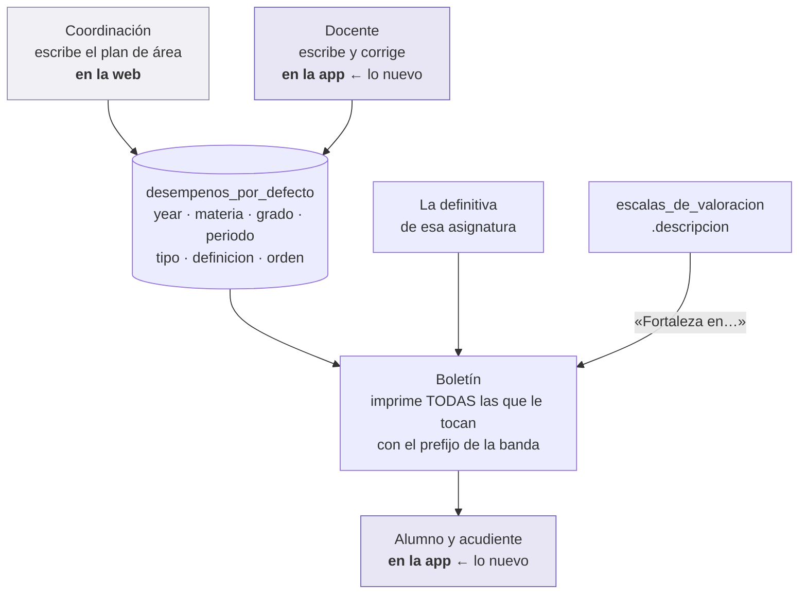
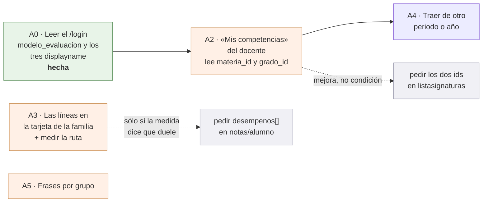

# Las competencias en la app — el plan de pantallas

> **Qué es esto.** El modelo por competencias ya está construido en el backend y
> en el front web. Este documento es **lo que le toca a `myvc_flutter`**: qué
> pantallas se traen, cuáles no, con qué forma, y qué falta del servidor para
> poder empezar.
>
> El modelo y sus decisiones están escritos en otros dos sitios y **aquí no se
> re-litiga nada de eso**:
>
> - `8myvc/docs/migracion/39-el-modelo-plano-por-competencias.md` — el contrato:
>   la tabla, las siete rutas, el permiso con alcance.
> - `myvc_front/CORRECCIONES-MODELO-DE-EVALUACION.md` — el porqué: los siete
>   hallazgos, D31, P1.bis, P1.ter, H10, y el recibo de lo entregado.
>
> Lo medido lleva su fichero o su orden al lado. Lo que es propuesta de diseño lo
> dice.
>
> **Estado: propuesta. No hay una línea escrita de esto en la app**, y dos de las
> cuatro entregas están bloqueadas por el servidor (§5).

---

## 0. Antes de nada: el documento viejo de esta app dice tres cosas que ya no son verdad

[plantilla-y-competencias.md](plantilla-y-competencias.md) se escribió contra el
diseño de septiembre, que cambió entero el 17 de septiembre. **Sus §1, §2, §3.1 y
§3.2.bis siguen valiendo** —son de la plantilla de notas, que no la toca nada de
esto—. Lo que caducó:

| lo que dice | lo que pasó |
|---|---|
| *«El backend no existe todavía»* | Existe. Siete rutas bajo `desempenos/`, `8329718` en `main` de `8myvc`. **Sin desplegar** |
| §3.2 · *«Llegan en la respuesta que ya se pide, como lista opcional»* | **No llegan.** `notas/alumno` y `notas/detailed` no las traen. Sólo las trae `boletines-competencias/detailed-notas`, que es una ruta de informe — y **eso no bloquea nada**, pero decide cómo se pide: §5.2 y §4.4 |
| §3.2 · el interruptor `show_competencias_bol` | **Esa columna no existe.** `grep show_competencias_bol` en el esquema del backend no da nada. El interruptor de verdad es `years.modelo_evaluacion` — que sale en las cuatro consultas del `/login` **pero tampoco está en el esquema desplegado**: §5.3 |
| §3.3 · *«Indicadores (Entrega 3, esperando decisión)»* | Ese piso **se abolió**. El modelo es plano: una sola tabla, sin padre y sin hijo (P1.ter, D31, H3) |

> **Y aquí yo «corregí» una cifra que estaba bien.** Escribí que sus «dieciséis
> colegios» eran quince. **Son dieciséis**: fueron quince sólo cinco días —una baja
> el 25 ago— y volvieron a ser dieciséis el 30 ago, cuando entró `lal` en la otra
> cuenta de cPanel. Lo levantó la sesión de la API el 19 sep y se comprobó en
> `8myvc/docs/DESPLIEGUE.md:966` y `:143`: el bucle de despliegue devuelve **17
> carpetas — dieciséis colegios y `demo`**.
>
> La lección está en [estado.md](estado.md) → «Dos cifras» y ya entró en
> [Interruptores](../lib/Utils/Interruptores.dart): **la condición de encendido no
> lleva número**, porque un recuento escrito a mano envejece en silencio y **falla
> del lado peligroso** — verificar «los quince» habiendo dieciséis enciende un
> interruptor con un colegio sin desplegar.

---

## 1. El modelo, en las tres frases que cambian una pantalla

1. **Una competencia es un texto y nada más.** No lleva nota, ni porcentaje, ni
   casilla. Se escribe por **(materia, grado, periodo)** — no por asignatura y no
   por alumno.
2. **El nivel no se marca: se deriva.** El boletín mira la definitiva de esa
   asignatura, la cae en su banda, y esa banda vale para **todas** las líneas de
   esa asignatura. Nadie pulsa nada (P1.bis, y es lo que borró del front la
   rejilla de 2.090 líneas).
3. **El colegio y el docente escriben las mismas filas físicas** (D31). No hay
   copia, no hay candado, no hay «lo mío» y «lo suyo». Con una excepción: una fila
   de `grado_id = NULL` —«todos los grados»— es **sólo del colegio**, y el docente
   la ve sin poder tocarla.

Eso es todo el modelo. Lo demás son consecuencias.



---

## 2. El reparto: qué mitad es de la app

La regla de esta casa es que **la app es para lo que se hace de pie y todos los
días, y lo administrativo se queda en la web** (Joseth, 23 ago 2026). Aplicada a
las cinco pantallas que el front construyó:

| pantalla del front | ¿a la app? | por qué |
|---|---|---|
| ③ **Catálogo del colegio** (`/plan-evaluacion`) | **No** | Es el plan de área de las 35 materias × 13 grados. Una vez al año, por coordinación, en una tabla. Es la web |
| **Adoptar del MEN** | **No** | Además de ser de coordinación, hoy son **43 peticiones en fila** desde el cliente (`e7931b2b`). Eso en la red de un colegio, desde un teléfono, es una función abandonada |
| **Frases por banda** (⑤) | **No** | Cuatro frases al año. La misma familia que las escalas: verlas sí, editarlas en la web |
| **Mis desempeños** (`/mis-desempenos`, F2) | **Sí** | Es del docente, es de su materia, y es lo que hace en la semana en que abre el periodo |
| **El boletín por competencias** | **Sí** | Es lo que pregunta el acudiente, y es la pantalla más abierta de la app |

Así que son **dos pantallas**, y una de ellas ya existe y sólo crece.

---

## 3. La pantalla del docente — «Mis competencias»

### 3.1 · La decisión que ordena todo lo demás: **se agrupa por (materia, grado), no por asignatura**

> **Decidido por Joseth el 19 sep 2026**, con las tres formas delante: pantalla
> propia en el menú, tercera pestaña del libro, o un bloque dentro de Unidades.

El docente piensa en asignaturas: «6.ºA Matemáticas» y «6.ºB Matemáticas» son dos
cosas suyas, con dos listas de alumnos y dos planillas. **El modelo no tiene dos
filas: tiene una**, la de Matemáticas · Sexto.

Si la app lista asignaturas —que es la forma que tienen [NotasScreen](../lib/Screens/NotasScreen.dart)
y [UnidadesScreen](../lib/Screens/UnidadesScreen.dart), y la que sale sola— el
docente ve **las mismas cuatro competencias dos veces**, edita una y la otra
cambia sola. Eso no es un fallo que se explique después: es el informe de error
que llega el primer mes.

**Por eso esta pantalla no se parece a Unidades aunque se le parezca todo lo
demás**: se colapsan las asignaturas en sus pares (materia, grado) y **se dice en
la tarjeta a qué grupos alcanza**.

```
┌──────────────────────────────────────────────┐
│  MATEMÁTICAS · Sexto                      4  │
│  vale para 6.ºA y 6.ºB                       │   ← sólo si hay más de un grupo
├──────────────────────────────────────────────┤
│  CIENCIAS NATURALES · Séptimo             0  │
│  sin competencias todavía                    │
└──────────────────────────────────────────────┘
```

En `simonbolivar` ese renglón no sale nunca —trece grupos y trece grados, uno por
grado, medido en §P1.ter—, así que **el colegio con el que se prueba es justo el
que no enseña el caso**. Es la razón de escribirlo aquí: quien lo pruebe va a
concluir que el renglón sobra.

### 3.2 · Y una cosa que la app tiene gratis y el front tuvo que construir

H10a midió que en la ③ del front **el 71 % de lo que se podía elegir no existía**:
455 combinaciones ofrecidas contra 134 pares (materia, grado) reales. El front lo
arregló poniendo el grado primero y cruzando dos catálogos.

**En la app ese problema no puede existir**, porque no se elige nada: la lista
sale de las asignaturas del docente, y una asignatura **es** un par (materia,
grado) que existe. No hay selector de materia, no hay selector de grado, no hay
nada que filtrar.

Eso no es suerte: es que el front entra por el catálogo del colegio y la app entra
por el trabajo de una persona.

### 3.3 · La tarjeta abierta: dos bloques, y el candado es un bloque

```
  MATEMÁTICAS · Sexto                          ▲
  vale para 6.ºA y 6.ºB

  ── Del colegio · para todos los grados ────── 🔒
     Resuelve problemas que requieren el uso de
     la proporcionalidad.

  ── De Sexto ────────────────────────────────
  ①  Interpreta gráficas de barras y las usa
     para comparar dos conjuntos.            ✎  🗑
  ②  Construye figuras planas a partir de sus
     medidas.                                ✎  🗑

     ＋ Añadir competencia
```

Tres decisiones, y ninguna es de estilo:

**1 · El candado es una cabecera, no un icono por fila.** Las filas de «todos los
grados» son del colegio y contestan 403 si se tocan. Pintarlas mezcladas con un
candadito invita a pulsarlas —en un teléfono, con el pulgar— y a recibir un error
que parece un fallo del sistema. Agrupadas bajo un rótulo, el candado **se explica
una vez** y ninguna fila de ese bloque lleva botones.

Y sale gratis: el backend **ya las manda primero**. `getPlantilla` ordena por
`d.grado_id` y MySQL pone los `NULL` delante; el boletín usa
`grado_id IS NOT NULL, orden, id` por el mismo motivo. **La app no reordena nada**
—es el aviso 2 de B1 en §7.11 del front—: el papel sale en el orden de la pantalla
porque los tres sitios respetan el mismo orden.

**2 · No hay `%`, ni nota, ni casilla que marcar.** Es la pantalla entera. Si
alguien la mira y piensa «esto está a medias», está viendo exactamente lo que la
metodología prometió: la respuesta a *«tu sistema le da más trabajo al docente»*
es una pantalla donde sólo se escriben frases.

**3 · La marca (`tipo`) es un campo opcional y tiene que parecerlo.** H10b lo
midió: `tipo` es `varchar(60)` anulable, texto libre, y **nunca hubo un mínimo de
tres**. El mockup del front mentía pintando una Saber, una Hacer y una Ser, y se
leía como un trío obligatorio. En la app va **un solo campo**, rotulado «marca
(opcional)», con [CampoConSugerencias](../lib/Widgets/CampoConSugerencias.dart)
alimentado por lo que ese colegio ya escribió — que es el widget que ya hace
exactamente esto en las situaciones de disciplina. Nunca tres huecos.

### 3.4 · Escribir una competencia: la hoja, y el previo de las cuatro bandas

Se escribe en una `showModalBottomSheet`, como
[pedirFrase](../lib/Widgets/SelectorFrases.dart) y
[pedirOrdinales](../lib/Widgets/SelectorOrdinales.dart). **No en un diálogo y no
en la propia lista**: el teclado del teléfono se come media pantalla, y lo que
tiene que quedar visible justo encima de él es el previo.

```
  ┌────────────────────────────────────────┐
  │  Competencia · Matemáticas · Sexto     │
  │  ┌──────────────────────────────────┐  │
  │  │ interpretar gráficas de barras   │  │
  │  │ y usarlas para comparar          │  │
  │  └──────────────────────────────────┘  │
  │  marca (opcional)  [ Saber        ▾ ]  │
  │                                        │
  │  Se imprimirá:                         │
  │   · Dificultad en interpretar gráf…    │
  │   · Fortaleza en interpretar gráfi…    │
  │   · Excelencia en interpretar gráf…    │
  │                                        │
  │            [ Cancelar ]  [ Guardar ]   │
  └────────────────────────────────────────┘
```

**El previo enseña las bandas que el colegio tenga escritas, no una.** El front
enseña una (§P2, «Front (2)»), y ahí hay un fallo que sólo se ve escribiendo: una
frase puede encajar perfectamente detrás de «Fortaleza en…» y ser absurda detrás
de «Dificultad en…». Con una sola banda de ejemplo, el docente escribe las cuatro
mal y se entera cuando el boletín está en una casa. Enseñar las que hay cuesta
tres renglones de texto y caza el fallo al escribirlo. **Es una propuesta de esta
app, y si sirve conviene devolvérsela al front.**

La regla de redacción que lo sostiene es H5: detrás de «en» cabe un infinitivo o
un sustantivo, **no un verbo conjugado**. No hace falta escribirla en ninguna
ayuda: el previo la enseña.

**Cuando ninguna banda tiene `descripcion`, el bloque del previo no se pinta.** No
un marco vacío, no un «(sin prefijo)». Hoy es el caso de todos: medido por el
front el 17 sep, las **36 escalas vivas** tienen `descripcion` a `NULL` (5) o
cadena vacía (31), ninguna con texto. O sea que **el primer día que esto se
encienda, el previo no sale** — y eso es correcto, no es que esté roto.

### 3.5 · Cuándo la pantalla es de sólo lectura, y por qué se dice antes de pulsar

La rama del docente del permiso pide además `periodos.profes_pueden_editar_notas`
(§3 del contrato). La app **ya tiene ese dato** en
[ConfiguracionColegio.profesPuedenEditarNotas](../lib/Utils/ConfiguracionColegio.dart),
que viene del `/login` y es del periodo de la barra de arriba.

Así que con el periodo cerrado: se pinta la lista, **no se pintan los botones**, y
arriba va la frase que ya usa el resto de la app para lo mismo. Pintar el botón y
dejar que el 403 lo explique es lo que hace que un candado parezca una avería.

*(La rama del colegio **no** pide el periodo abierto, y es a propósito: el
coordinador cierra las notas para congelar las notas, y sigue teniendo que poder
arreglar el plan de área. Eso es de la web y aquí no se nota.)*

### 3.6 · Lo que NO se construye en la primera versión, y se dice por qué

- **Reordenar arrastrando.** `PUT desempenos/orden` reordena **el conjunto
  entero**, y el conjunto incluye las filas de «todos los grados» que el docente no
  puede escribir. Un arrastre en esa lista es un 403 en la pantalla más delicada.
  Cuatro frases escritas en orden casi nunca hay que moverlas; si hace falta, es
  una entrega propia y con el alcance comprobado primero.
- **Borrar con deslizar.** Es borrado lógico y compartido: lo que el docente
  «deslice» desaparece también de la pantalla del coordinador. Va detrás de un
  botón y de una confirmación que **nombre a quién más le afecta**.
- **Adoptar del MEN.** §2.

---

### 3.7 · Lo que decidió la construcción, y no estaba en el plan

Seis cosas que se decidieron al escribir la pantalla, no antes. Van aquí porque
las tres primeras cambian lo que ve el usuario.

**1 · La opción del menú tiene DOS puertas, no una.** El interruptor
(`Interruptores.competenciasDocente`) espera al despliegue; `vaPorCompetencias`
es del colegio. Sin la segunda, un colegio que no use el modelo vería una opción
que lleva a una pantalla que no le sirve — y **enseñar una pantalla que no se usa
nunca es peor que no tenerla**: se abre una vez, no se entiende, y la próxima vez
que haga falta ya nadie se fía. Las dos van en `false` hoy.

**2 · Cuando faltan los ids, la pantalla lo DICE.** Hoy `listasignaturas` no manda
`materia_id` ni `grado_id` en ningún colegio, así que la lista de clases sale
vacía. Una lista vacía y «esto todavía no está en tu colegio» **se leen igual y no
son lo mismo**, así que `clasesDelDocente` cuenta aparte lo que no pudo resolver y
la pantalla enseña cuántas asignaturas hay y por qué no salen. Y si resuelve unas
sí y otras no, se pintan las que sí **con el número de las que faltan encima**:
callarlo convierte una limitación nuestra en «me faltan clases».

**3 · La confirmación de borrado nombra a quién más le afecta.** No dice «¿seguro?»:
dice que se quita **para todos los grupos de ese grado** y que coordinación deja de
verla. Es la consecuencia de D31 —las filas son las mismas— y es justo lo que no
es obvio desde una pantalla que se titula «Mis competencias».

**4 · Tres peticiones al abrir, y el catálogo se pide entero.** `listasignaturas`,
`GET desempenos?periodo_id=` y `GET escalas`. El catálogo podría pedirse por
(materia, grado) —el filtro existe— y serían cinco o seis peticiones en vez de
una. Se elige una porque **lo que escasea en este servidor es CPU, no ancho de
banda**. Si algún día pesa, la salida es el `?mias=1` de
[backend-pendiente.md](backend-pendiente.md) §6, no seis peticiones.

**5 · En tablet siempre hay una clase elegida.** En el teléfono, «ninguna abierta»
es un estado útil —todas plegadas—; al lado de su lista sería media pantalla en
blanco pidiendo un toque que no hace falta. Se elige la primera **sin escribirlo
en el estado**, para no dejar el teléfono con una tarjeta abierta al girar.

**6 · La hoja de escribir no usa el `padding` de sus hermanas.**
`CampoConSugerencias` trae 16 px por dentro y no se le pueden quitar, así que la
hoja pone 4 y cada hermano añade los 16 que faltan. Es feo de leer y lo contrario
—20 fuera— dejaba el campo de la marca un dedo más adentro que el de arriba.

---

## 4. El boletín del alumno y del acudiente

### 4.1 · Dónde va — y se ve todo, sin plegar

> **Decidido por Joseth el 19 sep 2026**, contra plegarlas tras un «4 competencias ▾»
> y contra mandarlas a una pantalla de detalle. **El criterio es que la app se
> parezca al papel**: en el boletín impreso está todo, y lo que se pliega en un
> teléfono no lo abre nadie. El precio se acepta y conviene tenerlo escrito: con
> diez materias y cuatro competencias cada una, la pantalla pasa de unas diez
> tarjetas cortas a unas cuarenta líneas de texto.

En [MisNotasScreen](../lib/Screens/MisNotasScreen.dart), debajo de la nota de cada
asignatura. Es la tarjeta que ya existe (`_buildAsignatura`, línea 339) y lo único
que cambia es lo que cuelga de ella.

```
  ┌──────────────────────────────────────────────┐
  │ (foto)  MATEMÁTICAS                      43  │
  │         Ariolfo Gómez Restrepo          Alto │
  │  ──────────────────────────────────────────  │
  │  Fortaleza en interpretar gráficas de        │
  │  barras y usarlas para comparar.             │
  │                                              │
  │  Fortaleza en construir figuras planas a     │
  │  partir de sus medidas.                      │
  │  ·  ·  ·                                     │
  │  Le cuesta entregar a tiempo, aunque el      │
  │  trabajo está bien hecho.                    │
  └──────────────────────────────────────────────┘
```

### 4.2 · «Alto» iba a salir dos veces, y esa es la decisión de diseño de esta pantalla

La tarjeta **ya imprime hoy** `asignatura.desempenio` —el nombre de la banda—
debajo del docente. Y cada línea nueva llega con el prefijo de **esa misma banda**
delante. Sin tocar nada, la palabra «Alto» aparecería una vez como rótulo y cuatro
veces disfrazada de «Fortaleza en…».

Tres salidas, y la recomendación es la segunda:

| | qué pasa |
|---|---|
| quitar el prefijo y dejar el rótulo | **No.** La app imprimiría algo distinto del papel, y el papel es el contrato con la familia |
| **mover el rótulo junto a la nota y dejar las líneas verbatim** | **Sí — decidido el 19 sep 2026.** La banda es una propiedad de la nota y su sitio es al lado de la nota. Las líneas salen **exactamente** como vienen |
| dejar los dos donde están | ruido, y el acudiente lee dos veces lo mismo sin saber por qué |

**Y una regla que vale más que la tarjeta: la app no monta el prefijo.** Viene
montado en `texto` desde `conElPrefijo()`. Rearmarlo aquí sería un segundo sitio
donde vive la misma regla, y los dos sitios se separan el día que alguien cambie
uno.

#### El rótulo se mueve SÓLO cuando hay líneas — matiz del 19 sep 2026

La decisión de arriba se tomó mirando la tarjeta con sus competencias debajo, y
aplicada a secas cambiaría la pantalla **de todos los colegios hoy mismo**, sin
que ninguno gane nada: la duplicación que justifica el cambio **sólo existe
cuando hay líneas que repiten la banda en su prefijo**.

Así que el rótulo se mueve **cuando la asignatura trae líneas**, y se queda donde
está cuando no. Un colegio que no vaya por competencias abre la app y ve
exactamente lo de siempre, que es la regla de esta casa desde el principio. Y no
es una excepción incómoda: es la misma frase leída bien —«Alto» no sobra, **sobra
la segunda vez**—.

### 4.3 · Las frases a mano no son competencias, y se ven distintas

La respuesta trae las dos cosas en la misma lista, separadas por `origen`:

| `origen` | qué es | lleva `nivel` |
|---|---|---|
| `catalogo` | la competencia: vale para todo el grado | sí, el de la asignatura |
| `frase` | lo que el docente escribió **sobre ese niño** | **no**, y no es un olvido |

Van **al final y sin prefijo**, que es como las imprime el papel. En la tarjeta,
separadas por un filete y sin rótulo. **Sin rótulo a propósito**: el modelo es
plano y el boletín no tiene cabecera (P3) — poner «Competencias» y «Observaciones»
sería inventar en la app una jerarquía que el papel no tiene.

### 4.4 · Cuándo se piden las líneas, y por qué no bloquean la nota

Dos decisiones de coste, y las dos salen de que **esa ruta es de informe y nadie
la ha medido**.

**1 · Las notas primero, las líneas después.** No se piden las dos a la vez y se
espera a las dos: se pinta la tarjeta con su número **en cuanto llegan las
notas**, y las líneas entran encima cuando lleguen. Si la ruta de informe resulta
lenta, **lo que la familia vino a ver no se retrasa** — y si falla, la pantalla
sigue siendo la de hoy en vez de un error.

Es el hedge que corresponde a no tener la medición: cuesta un `setState` más y
quita la única forma en que esto podría empeorar una pantalla que hoy funciona.

**2 · Una petición por periodo, y se recuerda.** `notas/alumno` trae **todos los
periodos de una vez** y la pantalla cambia entre ellos sin volver a preguntar. El
boletín por competencias no: es de **un** periodo. Así que se piden las líneas
**del periodo que se está mirando** y se guardan por periodo — volver a uno ya
visto no cuesta nada.

Sin eso, una familia que repase los cuatro periodos dispararía cuatro informes de
grupo entero, que es exactamente la carga que este proyecto lleva un año
esquivando en un servidor de un núcleo.

> **Y nada de esto se puede encender antes que lo demás, medido.** El
> `BoletinPorCompetenciasController` **nació el 13 sep 2026** (`7d6bfe3`) y su
> forma actual —el nivel derivado de la definitiva— es del **17 sep**
> (`09788cd`); la última tanda que se sabe desplegada en los colegios es
> `eb95cbc`, del **24 ago**:
>
> ```bash
> git merge-base --is-ancestor 09788cd eb95cbc   # falso: es posterior
> ```
>
> O sea que A3 espera **al mismo despliegue** que el resto y no puede adelantarse.
> Y su versión anterior tampoco habría servido en un colegio: leía
> `frases_asignatura.desempeno_id`, una columna que **nunca corrió en ninguno**.

### 4.5 · Las caritas, y por qué el texto va siempre

D17: el icono es adorno y **el nivel viaja en texto, siempre**, tenga o no
`caritas` el grupo. El icono, si viene, va **al lado** del texto y nunca en su
lugar. Un boletín de Jardín con cinco caritas y ni una palabra no se puede leer en
voz alta.

---

## 5. Lo que el servidor NO tiene, y por qué no bloquea nada

> ### Corrección del 19 sep 2026 — esta sección decía que faltaban dos cosas y era falso
>
> Aquí ponía *«lo que falta del servidor, y son dos cosas»*, con A2 y A3 marcadas
> como bloqueadas. **Las dos pantallas se pueden construir hoy**, con rutas que
> existen y que el front ya usa. Lo levantó Joseth: *«se supone que ya el front y
> backend hicieron todo, estas cosas ya funcionan en front, entonces debería poder
> hacerse en la app»*. Tiene razón, y el fallo es mío y de un tipo concreto:
> **medí lo que al endpoint le falta y no fui a mirar cómo lo había resuelto quien
> ya se lo había encontrado.** Es exactamente la lección de `adoptar-men` —no
> heredar un veredicto sin abrir el fichero— aplicada al revés: no dar por
> bloqueado algo sin abrir el cliente que ya lo hace.
>
> Lo que sigue en pie no es un bloqueo: es **un coste**, y como coste se decide.

### 5.1 · `listasignaturas` no trae los dos ids — y el front lo resuelve en el cliente

El hecho es cierto y está medido: `Profesor::asignaturas`
(`8myvc/app/Models/Profesor.php:110`) hace los tres `JOIN` y **no nombra
`a.materia_id` ni `g.grado_id`**. Sus trece claves son `asignatura_id · grupo_id ·
profesor_id · creditos · orden · materia · alias_materia · nombre_grupo ·
abrev_grupo · titular_id · caritas · nivel_educativo_id · unidades`.

**Y el front se lo encontró igual y lo resolvió sin tocar el backend**, en
`myvc_front/app2/src/app/paginas/docente-competencias/alcance.ts`. Reconstruye el
par con tres respuestas que ya existen:

```
grupo_id        ->  GET grupos    ->  grado_id     exacto: es la clave primaria
materia+alias   ->  GET materias  ->  id           POR NOMBRE, que es lo que hay
```

**La app puede portar eso tal cual**, y casi todo lo tiene: ya llama a
`GET /grupos` en [UsuariosApi](../lib/Http/UsuariosApi.dart), y
[GrupoModel](../lib/Models/GrupoModel.dart) ya lee `nombre_grado` — le falta
`grado_id`, que es una línea. Lo que no tiene es `GET materias`.

#### Lo que cuesta, y hay que enseñarlo en pantalla

**El emparejamiento de la materia va por su NOMBRE**, porque no hay id en ninguna
de las dos puntas. El front empareja por el par `materia` + `alias_materia` y
**sólo lo acepta si es único**; si sale ambiguo o no sale, **descarta esa
asignatura** y la cuenta en `sinEmparejar`. Su propio comentario dice por qué eso
se enseña y no se calla:

> *«una asignatura que no se empareja sale de sólo lectura, y callarlo convierte
> una limitación nuestra en “el sistema no me deja”».*

O sea que el camino existe, funciona —verificado contra el docker: el docente 7
saca los seis pares exactos que devuelve la consulta del permiso— y **tiene un
modo de fallo silencioso** el día que un colegio tenga dos materias que se llamen
y se abrevien igual. En la app eso son **tres peticiones para pintar una pantalla**
en vez de una, y dos de ellas son catálogos del colegio entero.

#### Lo que se pidió, y es un campo y no una ruta — 19 sep 2026

Joseth propuso una ruta nueva que trajera todo en una petición: *«sería buena idea
crear otro endpoint que traiga lo que necesita la app para no hacer múltiples
llamados como hizo web»*. Se escribió, se entregó a la sesión del backend, **y se
retiró el mismo día antes de que nadie la escribiera**.

**Lo que se pidió en su lugar son dos columnas**: `a.materia_id` y `g.grado_id` en
`Profesor::asignaturas`, que ya hace los tres `JOIN`. **Joseth las aprobó y ya
están escritas** ese mismo día —`fe95da8`, **sin fundir y sin desplegar**—, con el
gemelo de `PiarsAsignaturasController` tocado en el mismo commit y **ninguna ruta
nueva**. El precio medido y el recibo están en
[backend-pendiente.md](backend-pendiente.md) §6.

**Y con eso esta sección pierde su plan B, que es la mejor noticia del trazo.**
Aquí decía que, si la columna no llegaba, la app portaría `alcance.ts` con su
contador de descartadas. **Ya no hay que escribirlo**: la app lee los ids y punto,
y el `sinEmparejar` que el front tiene que enseñar **aquí no existe**, porque no
hay nada que emparejar. La ventana de despliegue la cubre el interruptor, que es
para lo que está — no una segunda mitad de pantalla.

**Escrito no es desplegado**, así que A2 se escribe leyendo los ids y se enciende
cuando estén en todos los colegios, verificado por el hash de la tanda.

**Por qué se cayó la ruta.** Su argumento fuerte era que, sin ella, la app tendría
que reimplementar `Autoriza::puedeEscribirDesempenos` y las dos versiones se
separarían. Comprobado al ir a justificarlo: **la app puede calcular esa regla
exacta** con lo que ya recibe — `perms` viaja en el `/login` y ahí está
`can_edit_plantilla_notas`; la rama 2 es su propia lista de asignaturas; el periodo
cerrado ya lo lee [ConfiguracionColegio](../lib/Utils/ConfiguracionColegio.dart).
Queda un argumento de mantenimiento, y no paga estrenar una ruta.

**Y el argumento que de verdad sostiene la petición lo puso la sesión de la API**,
mejor que el mío: el rodeo del front empareja materias **por su nombre**, y
`materias` **no tiene ningún índice único sobre `(materia, alias)`** — sólo la
clave primaria de `id`. En el colegio de desarrollo hay 35 materias vivas y cero
pares repetidos, así que allí funciona; pero eso es **una casualidad de los datos
de un colegio, no una garantía**, y son dieciséis. Lo mío era mantenimiento; esto
es corrección.

Y una trampa que apuntaron de paso, para que nadie la proponga como atajo:
`listasignaturas/{id}` trae un bloque **`grados_comp` que sí lleva `grado_id`**,
pero su consulta filtra `g.titular_id`, o sea **sólo los grupos de los que el
docente es titular**, no los que da. Quien lo tome por el mapa completo se queda
corto sin enterarse.

Con las dos columnas la pantalla se arma con **dos peticiones a rutas que ya
existen**, y las escrituras —`POST desempenos`, `PUT`/`DELETE desempenos/{id}`,
`PUT desempenos/copiar`— **también están**.

> **Y es el mismo error de esta sección, cometido dos veces seguidas.** Arriba:
> dar algo por bloqueado sin abrir el cliente que ya lo hace. Aquí: pedir una ruta
> sin mirar si lo que faltaba era una ruta o una columna. La pregunta que las dos
> veces habría bastado es **¿esto existe y devuelve de menos, o no existe?**

### 5.2 · La familia sí puede pedir su boletín — la ruta está hecha para eso

Aquí escribí que la única ruta con las líneas es de informe y que la familia no
tenía de dónde leerlas. Lo segundo es falso, y se comprueba abriendo el
middleware: `ExigirBoletinPropio` **tiene una rama escrita para este caso exacto**
—un `Alumno` pide el suyo, un `Acudiente` el de sus acudidos, comprobando
`parentescos` y el paz y salvo—. No es que la deje pasar de casualidad: **es para
lo que existe**.

Así que la app puede llamar a
`PUT boletines-competencias/detailed-notas/{grupo_id}` con `requested_alumnos`, lo
mismo que el front, y **A3 no depende de nadie**.

#### Lo que sigue siendo verdad, y es lo único

Esa ruta **arma el boletín del grupo entero y filtra después** —`Grupo::alumnos`
devuelve un superconjunto, lo dice su propio comentario— así que un acudiente que
abre las notas de un hijo paga el cálculo de sus treinta compañeros. En la web eso
lo hace un coordinador sentado, de vez en cuando; en la app lo haría **toda la
comunidad, y a la vez**, porque una notificación push abre cientos de teléfonos en
el mismo medio minuto sobre un servidor de un núcleo (ver [estado.md](estado.md) →
«Qué sigue, en orden»).

**No está medido lo que tarda**, ni desde aquí ni desde allí. Así que el orden
honesto es: **construir A3 contra esa ruta, medirla con un grupo de verdad, y sólo
entonces decidir** si hace falta pedir un `desempenos[]` dentro de
`GET notas/alumno`. Pedirlo antes de medir sería pedir por si acaso.

### 5.3 · Lo que de verdad no está desplegado son las columnas del año

Lo único de esta sección que sí condiciona algo hoy: `modelo_evaluacion`,
`desempeno_displayname`, `desempenos_displayname` y `genero_desempeno` salen en
**las cuatro** consultas de `8myvc/app/Services/ContextoDeUsuario.php` —docente,
alumno, acudiente y usuario—, pero **ninguna está en el volcado del esquema**:

```bash
grep -cE "modelo_evaluacion|desempeno_displayname|genero_desempeno" \
  8myvc/database/schema/mysql-schema.sql          # 0
```

Las crea `2026_09_13_100000_modelo_de_evaluacion_del_anio.php`, y el volcado **es
la verdad del esquema** —el argumento de §7.10 del front, más duro que mirar los
clientes porque no depende de que nadie despliegue nada—. O sea que **hoy el
`/login` de los colegios no manda esos cuatro campos**.

**Eso no bloquea A0: lo define.** Se lee con el valor de hoy por defecto, y por eso
A0 **no necesita interruptor**: una clave que no viene no puede encender nada. Lo
que sí hay que saber es que **probar esto contra un colegio va a dar siempre el
camino viejo** — para ver el otro hay que falsear el `/login`, que es lo que hacen
sus pruebas.

Y es lo mismo que pasa con las siete rutas de `desempenos/`: están en `main` de
`8myvc` (`8329718`) y **no desplegadas**. Eso no impide escribir ni una línea de
la app; impide **encenderla**, que es para lo que está
[Interruptores](../lib/Utils/Interruptores.dart).

## 6. Los tres «desempeño» de la misma tarjeta

H1 encontró dos palabras chocando en el front. **En esta app son tres**, y una de
ellas ya está impresa hoy:

| | qué es | dónde se ve hoy |
|---|---|---|
| `AsignaturaNotaModel.desempenio` | el nombre de la banda: «Alto», «Superior» | **ya impreso**, `MisNotasScreen:372` |
| `unidad_displayname` | la unidad del 70 %. En `simonbolivar` vale **«Desempeño»** | `UnidadesScreen`, `HojaDetalleNota` |
| `desempeno_displayname` | el texto nuevo | no se lee todavía |

La decisión de §7.7 del front ya resuelve el tercero: **`desempeno_displayname`
pasa a valer «Competencia»**, sin código, en la ficha del colegio. Lo que le toca
a la app es **usarlo** y no escribir «Desempeño» a mano en ninguna parte. Y lo que
no puede arreglar —un colegio que deje el valor por defecto— se acota por diseño:
**el bloque de la familia no lleva rótulo** (§4.3), así que la palabra sólo aparece
en el título de la pantalla del docente, donde no hay ninguna unidad al lado.

`ConfiguracionColegio` crece cuatro campos con la misma forma que ya tienen
`unidad`/`subunidad`: valor de hoy por defecto, y **ninguno `required`**. Es la
regla que ya está escrita en [plantilla-y-competencias.md](plantilla-y-competencias.md) §0 y
sigue mandando.

---

## 7. En tablet

La pantalla del docente es maestro-detalle de libro: la lista de pares (materia,
grado) a la izquierda, sus competencias a la derecha. Es **exactamente** lo que
[tablets.md](tablets.md) hizo con la planilla y su lista, y se monta con lo que ya
hay — [Anchos](../lib/Utils/Anchos.dart) para el tope y el mismo patrón.

La tarjeta de la familia no necesita nada: es texto en una columna, y el tope de
ancho de `Anchos` ya la deja legible.

---

## 8. El orden, y qué se puede empezar hoy



**Ninguna de las cuatro está bloqueada para escribirse.** Las dos columnas de
§5.1 **ya están escritas** (`fe95da8`), así que A2 se programa leyéndolas y el
rodeo de `alcance.ts` no se porta nunca. Lo de §5.2 no se pide: primero se mide.

**Encender es otra cosa** y es lo de siempre: cada una detrás de su interruptor
hasta que lo suyo esté desplegado en todos los colegios, verificado por el hash de
la tanda y no por `main`.

| | qué | bloqueada por |
|---|---|---|
| **A0** | `ConfiguracionColegio` lee los cuatro campos del `/login`. No cambia una sola pantalla | **hecha el 19 sep 2026** — ver abajo |
| **A2** | La pantalla del docente, leer y escribir en su alcance, leyendo `materia_id` y `grado_id` | **hecha el 19 sep 2026** — ver abajo |
| **A3** | Las líneas en la tarjeta de `MisNotasScreen` | **hecha el 19 sep 2026** — ver abajo |
| **A4** | `PUT desempenos/copiar` desde la app: «tráeme lo del periodo pasado» | **hecha el 19 sep 2026** — ver abajo |
| **A5** | Las frases del grupo en una petición — §9 | **hecha el 19 sep 2026** — ver §9 |

*(«Bloqueada por nada» es de construir. **Encender** cualquiera de ellas sí espera
al despliegue en todos los colegios, que es lo de siempre y lo lleva
[Interruptores](../lib/Utils/Interruptores.dart).)*

### A0, entregada — 19 sep 2026

[ConfiguracionColegio](../lib/Utils/ConfiguracionColegio.dart) crece el `enum`
`ModeloDeEvaluacion` y cuatro campos, todos con el valor de hoy por defecto.
Ocho pruebas nuevas en `test/configuracion_colegio_test.dart`; **518 en verde**
en la tanda entera.

Tres cosas que decidió la implementación y no el plan:

- **El campo Dart no se llama `desempeno*`, se llama `competencia*`.** Es §6
  aplicada al editor: con `AsignaturaNotaModel.desempenio` —la banda— ya dentro
  del código, un tercer identificador con esa raíz mete el choque de H1 donde
  más caro sale.
- **El defecto es el de la columna** —«Desempeño», masculino—, **no la palabra
  de la §7.7 del front**. Poner «Competencia» aquí haría que la app dijera una
  cosa y el servidor otra para un colegio que no ha tocado su ficha.
- **`hayChoqueDeNombres`**, tres líneas: dice si `unidad_displayname` y
  `desempeno_displayname` valen lo mismo, que es el caso de `simonbolivar`. No
  lo arregla —es configuración— pero deja que la pantalla lo diga en vez de
  pintar la misma palabra dos veces.

Y una que el plan daba por hecha y era falsa: **una cadena desconocida en
`modelo_evaluacion` no puede tumbar el arranque**. Con el `sql_mode` de estos
servidores, un valor fuera del `enum` se guarda como cadena vacía en vez de
fallar —lo dice el propio `Year::MODELOS_DE_EVALUACION`—, así que un
`values.byName` con eso se caería en la pantalla que abren todos. Se lee
comparando, y hay una prueba con cuatro cadenas raras.

### A2, entregada — 19 sep 2026

Nueve ficheros nuevos y cinco tocados, repartidos en cuatro trazos con ficheros
disjuntos —la regla que el front estrenó en su §7.3 y que aquí tampoco dio un
conflicto—. **579 pruebas en verde**, `analyze` limpio, nada commiteado.

| | |
|---|---|
| datos | `Models/CompetenciaModel.dart` · `Http/CompetenciasApi.dart` · los dos ids en `AsignaturaModel` |
| alcance | `Utils/ClasesDelDocente.dart` · `perms` en `AuthService` y `LoginController` |
| prefijo | `Utils/PrefijoDeBanda.dart` · `Http/EscalasApi.dart` · `descripcion` en `EscalaDeValoracion` |
| pantalla | `Screens/MisCompetenciasScreen.dart` · `Widgets/HojaCompetencia.dart` · el menú, la ruta y el interruptor |

**Cuatro cosas que salieron de abrir el controlador y no estaban en este plan:**

1. **`GET desempenos` devuelve un SOBRE, no una lista**:
   `{year_id, desempenos: [...], grupos: [...]}`. Quien escriba
   `jsonDecode(body) as List` se lleva un error de tipo.
2. **Pedirlo con un `grado_id` concreto NO trae las de «todos los grados»** — el
   filtro es `d.grado_id <=> ?`, igualdad exacta. Una tarjeta pedida por su par
   necesitaría **dos** llamadas, y con una sola perdería el bloque del colegio
   entero sin que nada fallara. Por eso la pantalla pide por periodo y filtra.
3. **En `POST`, un `grado_id` ausente no es «déjalo»: es «todos los grados»**, o
   sea una fila del colegio que sale en el boletín de trece grados. En la app el
   parámetro es `required int? gradoId`, incómodo a propósito.
4. **Dos 403 distintos con el mismo código** —«no tiene permiso para esa materia
   y ese grado» y «el periodo está cerrado»— y **lo único que los separa es el
   texto**. La app los distingue antes de llamar, con su propia copia de la
   regla; si alguna vez discrepan, el que manda es el servidor.

**Y una corrección a este documento**: el `ORDER BY` de `getPlantilla` es
`materia_id, grado_id, periodo_id, orden, id`, no el del boletín. La §3.3 ya lo
contaba bien —los dos agrupan igual porque MySQL pone los `NULL` delante— pero el
docblock de la pantalla había heredado el del boletín y se corrigió.

**Y dos hallazgos del permiso que valen más que la pantalla:**

- **La regla del backend exige además `tipo === 'Profesor'`**, y no es defensivo:
  `persona_id` es el id de la **ficha**, o sea `profesores.id` para un docente
  pero `users.id` para un administrativo. Sin esa comprobación, **el
  administrativo número 5 heredaría las asignaturas del profesor número 5** — y
  en esta app no es teórico, porque `listasignaturas/{profesor_id}` deja a un
  administrativo abrir las de otro y la pantalla usa ese camino. Está
  implementado y probado con un `Usuario` que lleva el rol `profesor` y la misma
  `personaId`.
- **La regla vive repartida en dos ficheros**: `Autoriza::puedeEscribirDesempenos`
  no mira el periodo en absoluto; quien lo mira es
  `DesempenosController::exigirEscrituraDelPlan`. Un cambio futuro puede caer en
  cualquiera de los dos, así que la copia de la app cita los tres sitios con su
  fichero y su línea.

**El nombre del grado no llega, y eso se ve en pantalla.** `Profesor::asignaturas`
junta `grados` sólo por `nivel_educativo_id` y **no trae el nombre**, así que el
título de una tarjeta se queda en «MATEMÁTICAS» a secas y un docente que la dé en
6.º y en 7.º vería dos tarjetas idénticas. Los grupos sí vienen, así que **cuando
no se sabe el grado la tarjeta nombra siempre su grupo**, que es justo lo que las
distingue. `fe95da8` añade el id, no el nombre: esto no se arregla con ese
despliegue.

**Lo que se dejó escrito y sin hacer**: adoptar del MEN y
`GET desempenos/catalogo-men`. Reordenar arrastrando también estaba en esta
lista, con el motivo equivocado —«`PUT desempenos/orden` toca el conjunto
entero, incluidas filas que el docente no puede escribir»—: **se hizo el 19 sep
al comprobarlo**, ver abajo.

### A3, entregada — 19 sep 2026

`LineaDeBoletinModel` · `BoletinCompetenciasApi` · `TarjetaDeAsignatura`, más el
enganche en `MisNotasScreen`. **634 pruebas en verde.**

**La tarjeta se sacó a su propio widget**, y no por tamaño: pasó a tener una
decisión dentro —dónde va el nombre de la banda— y **desde la pantalla ese caso
no se podía probar**, porque las líneas llegan detrás de un `const false`. Con el
widget aparte, los dos casos se miran de frente y hay ocho pruebas.

**Cinco cosas que salieron de medir el controlador:**

1. **La respuesta es un array posicional de cinco elementos**, no un objeto:
   `[grupo, year, alumnos, escalas, poblacion]`. Sólo se desmonta el tercero.
2. **El servidor SÍ filtra por alumno** —`soloLosPedidos`, antes de devolver—,
   así que la app no está tapando ningún agujero. Filtra igual, y el motivo está
   escrito: esa garantía es **condicional** —si `requested_alumnos` no llega con
   la forma esperada, devuelve la lista entera—, así que es un segundo cerrojo.
3. **Las líneas ya vienen agrupadas por asignatura.** No hay nada que agrupar.
4. **El paz y salvo no llega con la forma de `notas/alumno`**: allí es un cuerpo
   de texto con 200, aquí un **403** — y puede volver **en HTML**, porque
   `Server.put` no manda `Accept: application/json`. Se detecta por la subcadena
   `paz y salvo`, que es ASCII y sobrevive al HTML.
5. **`…/detailed-notas-group/` no se implementa**: a una familia el guard le
   contesta 403 porque no nombra a nadie. Es una llamada que no puede salir bien.

### ⚠ Una incoherencia del servidor, y la decisión es de Joseth

**`alumnos_can_see_notas` —el interruptor con el que el colegio cierra las notas
a las familias mientras cuadra los boletines— lo comprueba `NotasController::getAlumno`
y SÓLO ÉL** (única aparición en todo el backend). O sea que **la ruta del boletín
por competencias sigue entregando el boletín con las notas cerradas**.

La app queda del lado estricto **sin tener que saberlo**, y eso sale gratis de una
decisión que se tomó por otra razón: las líneas **sólo se piden si las notas
entraron**, así que con las notas cerradas la familia ve el bloqueo y ninguna
línea.

Pero **la incoherencia sigue en el servidor** y la web sí la expone. Queda abierta:
o el boletín por competencias mira ese interruptor, o se decide que cerrar las
notas no cierra el boletín. Lo que no puede pasar es que dependa de por dónde
entre la familia.

**A4 va detrás y no dentro de A2**, aunque sea la función que más tiempo ahorra:
copiar de otro año necesita dos selectores —año y periodo— y su 422 con nombre, y
eso es media pantalla más sobre una pantalla que todavía no se ha probado con un
docente delante.

> **Y A4 tiene una trampa que se encontró al escribir el permiso.** El backend
> comprueba `profes_pueden_editar_notas` **del periodo en el que se escribe**, y
> lo que la app tiene a mano es el del periodo de la barra de arriba. Una
> pantalla que copie a otro periodo estaría mirando la bandera equivocada: haría
> falta traerse la del periodo destino antes de ofrecer el botón.

Y **todo esto entra con su interruptor** en
[Interruptores.dart](../lib/Utils/Interruptores.dart), que se enciende cuando las
siete rutas estén **desplegadas en todos los colegios** —comprobado por el hash de la
tanda, no por `main`—. Hoy no lo están: `8329718` está en `main` de `8myvc` y nada
de esto se ha empujado.

---

## 9. Lo que la app se lleva de rebote, y no es de competencias

El contrato de preescolar (B4, `53b50fa`) abrió dos rutas que **arreglan un fallo
que esta app ya tiene**:

```
GET  frases_asignatura/grupo/{asignatura_id}?periodo_id=
PUT  frases_asignatura/grupo/{asignatura_id}
```

Hoy [FichaAlumnoNotasScreen](../lib/Screens/FichaAlumnoNotasScreen.dart) pone las
frases **de una en una** —`ponerFrase`, una petición por frase— y **no puede
elegir el periodo**: el `postStore` viejo escribe siempre en `$user->periodo_id`,
y el docblock de [FrasesApi](../lib/Http/FrasesApi.dart) ya lo dice como una
limitación que la pantalla respeta.

El `PUT` nuevo guarda el grupo entero y **acepta el periodo**. Medido por el front
sobre Transición 2018 (18 matriculados, 7 asignaturas): un periodo pasa de **322
peticiones a 14**.

**La capa de datos está hecha** (19 sep 2026): `traerFrasesDelGrupo` y
`guardarFrasesDelGrupo` en [FrasesApi](../lib/Http/FrasesApi.dart), con sus
modelos y **22 pruebas**. **Y la pantalla, el 19 sep 2026** — abajo. Las
funciones viejas se quedan intactas y son las que corren: `53b50fa` no está
desplegado.

Tres cosas del contrato que hay que respetar y son fáciles de romper:

1. **El botón se pinta contra `puede_escribir`, no contra `periodo_abierto`.** Son
   distintos: un administrativo escribe con el periodo cerrado y un docente no.
2. **`frases: []` es «quítaselas todas» y omitir la clave es 422.** «La vacié» y
   «no la mandé» tienen que poder decirse distinto — y eso le viene bien a la app,
   que guarda por lotes.
3. Sólo se tocan los alumnos nombrados, así que **guardar por partes no le borra
   nada a nadie**.

#### Y tres cosas que salieron al medir el controlador, que el contrato no decía

1. **`puede_escribir` tampoco se deduce del papel del usuario**, no sólo del
   periodo. Leer y escribir usan criterios distintos: leer pasa por
   `Autoriza::esAdministrativo` (`is_superuser` o Secretario) y escribir por
   `User::permiteEditarNotas`, que es falso para todo el que no sea `Profesor` ni
   superusuario. **Un secretario sin `is_superuser` lee las frases de cualquier
   grupo y no puede escribir ninguna**, con el periodo abierto o cerrado. Es un
   motivo más para pintar contra `puede_escribir` y no reconstruirlo aquí.
2. **`frases_fuera_del_grupo` sólo viene en el `GET`.** Después de guardar, ese
   número queda viejo. Se modela como `int?` —null es «no se miró», 0 es «no
   hay»— para que la pantalla no pueda leer la respuesta del `PUT` como si dijera
   que no quedan retirados con frases.
3. **El 403 del `PUT` llega antes de mirar el cuerpo** y lo demás va en
   transacción: un `motivo` significa siempre «no se guardó nada», nunca «se
   guardó a medias». Por eso no hay ningún contador de saltados, y es a propósito.

### Reordenar, entregada — 19 sep 2026 · y la tercera vez que algo «bloqueado» no lo estaba

`reordenarCompetencias` en [CompetenciasApi](../lib/Http/CompetenciasApi.dart)
y el arrastre en la tarjeta. **5 pruebas nuevas.**

**Lo que estaba escrito aquí y en el código era falso**: que `PUT
desempenos/orden` *«reordena el conjunto entero, que incluye filas que el
docente no puede escribir, así que un arrastre sería un 403 en la pantalla más
delicada»*.

Medido en `putOrdenPlantilla`: recibe **`materia_id`, `grado_id` y
`periodo_id`** y reordena **ese grupo**. Su `grupoDelCatalogo` filtra con
`grado_id <=> ?`, o sea **igualdad estricta**, así que las filas del colegio
—`grado_id IS NULL`— **son otro grupo** y sólo se tocan mandando
`grado_id: null`. «El conjunto entero» es el de la lista que se arrastra, no el
del catálogo. El propio docblock del backend lo dice en su primera línea:
*«reordena **un grupo**, en una llamada»*.

**Y el segundo argumento que había era de otra cosa.** Decía que reordenar
rompería el acuerdo entre la pantalla y el boletín, que ordenan distinto y
agrupan igual. Eso vale para un cliente que reordene **sólo en su vista**; no
para uno que llame a esta ruta, que escribe `orden` en la tabla y entonces las
dos consultas ven lo mismo.

> **Van tres.** «La familia no puede pedir su boletín» (§5.2), «copiar es de la
> web» (A4) y ésta. Las tres veces el patrón fue el mismo: **un argumento
> plausible escrito sin abrir el fichero**, heredado luego como hecho. La
> pregunta que las tres veces habría bastado es la que ya está escrita en
> `backend-pendiente.md` §6: **¿esto existe y hace de menos, o no existe?**

Tres cosas de la implementación:

- **El asa es explícita** (`buildDefaultDragHandles: false`). Dentro de una
  lista que ya se desplaza, un arrastre que empiece en cualquier punto de la
  fila se pelea con el scroll: el dedo quiere bajar la pantalla y acaba
  moviendo una competencia.
- **Con una sola fila no sale el asa.** Son tres iconos en una fila de
  teléfono, y el tercero sobra cuando no hay nada que ordenar.
- **Se pinta antes de que el servidor conteste y se revierte si dice que no.**
  Un arrastre que se queda quieto medio segundo se siente roto y se repite — y
  repetirlo es mandar dos órdenes distintas.

**Y `gradoId` es `int` y no `int?` a propósito.** Mandar `grado_id: null` sería
pedir reordenar el bloque del colegio, que alcanza a grados que ese docente no
da: 403 si es docente y, si es coordinador, mover filas de trece grados sin
querer. Hay una prueba que comprueba que la fila del colegio no se cuela en la
lista.

### A4, entregada — 19 sep 2026

`copiarCompetencias` y `CopiaDelPlan` en [CompetenciasApi](../lib/Http/CompetenciasApi.dart),
[HojaTraerPlan](../lib/Widgets/HojaTraerPlan.dart), y el botón «Traer de…» en
la tarjeta de cada clase. **12 pruebas nuevas, 663 en verde.**

**Y lo primero es una corrección a este repositorio, no una entrega.** El
docblock de `CompetenciasApi` decía que copiar *«es trabajo de escritorio, de
los que se hacen una vez en agosto: va en la web administrativa, no en el
teléfono»* — y esta misma §8 lo tenía como A4 de la app. Dos frases del mismo
día que se contradicen. **Gana la de aquí, y no por antigüedad: se abrió el
controlador.** `putCopiarPlantilla` no copia el catálogo del colegio, copia
**un par (materia, grado) y un periodo**, y su permiso es el mismo
`exigirEscrituraDelPlan` que usa escribir una a mano. O sea que mueve
exactamente lo que el docente ya puede escribir en esta app.

#### La trampa del periodo destino se esquiva, no se resuelve

El plan decía que haría falta traerse la bandera del periodo destino antes de
ofrecer el botón. **No hace falta, porque el destino no se elige**: es siempre
el periodo de la barra. Con eso, `profes_pueden_editar_notas` que la app tiene
en `ConfiguracionColegio` **es** la del periodo en el que el backend va a
escribir, y la pregunta desaparece.

No se pierde nada real: lo que se hace es «tráeme lo del periodo pasado»
estando en el nuevo, no colocar filas en un periodo que no se está mirando.

#### Copiando de otro año, el periodo NO viaja

Los ids de `periodos` son **por año y disjuntos**, así que mandar el del
destino como origen no casa ninguna fila del otro año: **200 con `copiados: 0`**,
indistinguible de «el año pasado no había nada». Omitiéndolo, el backend lo
resuelve por **número de periodo** y, si ese año no lo tiene, contesta un 422
que lo dice.

No es teórico: lo destapó el front web construyendo su diálogo —mandaba justo
ese cuerpo— y midió las dos formas, **0 copiadas con el malo, 2 y 3 con el
bueno, sobre las mismas filas**. Está contado dentro de
`DesempenosController::putCopiarPlantilla`, y aquí hay una prueba que falla si
alguien vuelve a mandarlo.

#### Los tres desenlaces de un 200, que no se pueden aplanar

**Dos de ellos traen `copiados: 0`** y significan cosas opuestas:

| lo que contesta | lo que dice la pantalla |
|---|---|
| `saltadas_sin_catalogo: 1` | «En Periodo 2 no hay nada escrito.» → te equivocaste de sitio |
| `copiados: 0`, `saltados_por_duplicado: 4` | «Ya tenías las 4.» → el trabajo está hecho |
| `copiados: 3`, `saltados_por_duplicado: 2` | «Se trajeron 3 · 2 ya estaban.» |

Juntarlos en «no se copió nada» deja al docente sin saber cuál de las dos le
tocó. Y ojo con `saltadas_sin_catalogo`: **su nombre miente**, no es un
recuento sino `$candidatos === [] ? 1 : 0`. Se lee como bandera.

#### Lo que no se ofrece, y por qué

El backend admite un tercer origen —**otro grado**, `origen.tipo: 'grado'` con
`origen.grado_id`— y la app no lo pinta: `Profesor::asignaturas` **no manda el
nombre del grado**, así que esa lista saldría con los grados sin nombre y nadie
sabría dónde está eligiendo escribir. El día que el nombre llegue es añadir una
sección a la hoja. `fe95da8` añade el id, no el nombre.

#### Dos detalles que decidió la construcción

- **El periodo en el que se está no sale en la lista.** Copiar un grupo sobre sí
  mismo es 422, y con razón. Se quita de la lista en vez de dejar pulsarlo.
- **Sólo se relee el catálogo si de verdad entró alguna.** La respuesta trae
  contadores y no filas, así que hay que releer — pero un «ya las tenías todas»
  no cambió nada que repintar.

Y una anotación que salió al escribir las pruebas y **no es de esta pantalla**:
los avisos salen **por duplicado**. `ScaffoldMessenger` enseña el `SnackBar` en
cada `Scaffold` registrado y `PantallaConMenu` añade el suyo, así que son dos
idénticos uno encima de otro. Le pasa a todas las pantallas con menú. Medido con
una sonda: la pantalla se construye una vez y los `Scaffold` son dos.

### A5, entregada — 19 sep 2026

[FrasesDelGrupoScreen](../lib/Screens/FrasesDelGrupoScreen.dart), más el botón
que la abre en [LibroAsignaturaScreen](../lib/Screens/LibroAsignaturaScreen.dart),
el interruptor y dos entradas del banco de pruebas. **17 pruebas nuevas, 651 en
verde**, `analyze` limpio.

**Entra por el libro de notas de la asignatura y no por el menú**, en un botón
de la barra. No es una pantalla del día: es lo que se hace al cerrar un periodo,
y necesita una asignatura y un grupo que el docente ya tiene abiertos. Del menú
habría que elegirlos otra vez.

**Siete cosas que decidió la construcción:**

1. **El botón de escribir no abre ninguna hoja.** Añadir una frase a mano mete
   la casilla en la tarjeta y le abre el teclado; la hoja del catálogo se queda
   en el otro botón. Lo que se hace aquí son dieciocho frases seguidas y **611
   de las 686 del grupo 3 están escritas a mano**, así que un modal por alumno
   convertiría un rato en una tarde.
2. **Sólo viajan los alumnos que se tocaron.** Es la propiedad que hace seguro
   el guardado por partes —el `PUT` no mira a quien no viene—, y se sostiene
   comparando **la codificación del cuerpo** de cada alumno contra la que tenía
   recién leído: los dos lados salen del mismo `paraElCuerpo()`, así que un
   espacio de más en el texto del servidor no puede contar como un cambio.
3. **Una casilla vacía sin `id` no es nada y una con `id` es un borrado.** La
   primera es «pulsé escribir y no escribí» y ni se manda ni cuenta; la segunda
   tiene que viajar, porque es como se quita una frase.
4. **El periodo que viaja al guardar es el que dijo el `GET`**, nunca el de la
   sesión ni el que se pidió. Si alguien la cambia desde otra pantalla mientras
   esto está abierto, omitirlo escribiría en un periodo distinto del que se está
   mirando.
5. **La población de lo leído no la pisa la del `PUT`.** Aquélla trae
   `frases_fuera_del_grupo` y ésta no, así que dejar que la segunda la
   sustituyera haría que después de guardar la pantalla dijera que no hay
   retirados con frases. El `PUT` no toca esas filas: lo que dijo el `GET` sigue
   valiendo.
6. **El libro sólo se recarga si se escribió en el periodo de la sesión.** Es lo
   único que devuelve esta pantalla al salir. `notas/detailed` trae las frases
   dentro y es la consulta más cara del proyecto: pagarla porque alguien entró y
   salió, o porque escribió en el periodo 1 estando la sesión en el 3, sería
   pagarla para nada.
7. **La marca del catálogo no se edita aquí.** Una fila del catálogo no guarda
   texto —el boletín lo resuelve con un `IFNULL` contra lo que el colegio tenga
   hoy—, así que corregirla en esta pantalla sería corregírsela a todo el
   colegio. Quien la quiera distinta la quita y escribe una a mano.

**Y la trampa de A4 aquí no existe, por el contrato y no por cuidado nuestro.**
A4 tiene que traerse la bandera del periodo destino antes de ofrecer el botón;
aquí el `GET` se pide **con el periodo** y `periodo_abierto` y `puede_escribir`
que devuelve son los de **ese** periodo. Cambiar de chip es volver a preguntar y
la respuesta trae su propio permiso. Es la diferencia entre una ruta que acepta
el periodo y una que lo da por sabido.

**Una medida que salió de las pruebas y no de mirar**: los dos botones de añadir
**no caben** en la tarjeta de un teléfono con el relleno normal de Material — se
desbordaba por 1,9 px en uno de 420 dp, y en uno de 360 por bastantes más—. Van
apretados y dentro de un `Wrap`.

**Lo que no hace y no es por falta de tiempo**: no reordena —la tabla no tiene
más clave que la primaria y cada fila es una línea del boletín—, no toca
[FichaAlumnoNotasScreen](../lib/Screens/FichaAlumnoNotasScreen.dart) —que sigue
poniendo las de **un** alumno por el camino viejo, y es lo correcto allí— y **no
enseña las frases de los alumnos que ya no están en el grupo**: las cuenta y lo
dice, porque el `GET` da el número y no las filas.

**Y lo que no está medido**: las dos rutas **no se han llamado contra un
servidor**. El `PUT` del banco de pruebas lo escribí yo mirando el contrato, así
que lo que prueba es que la pantalla usa bien lo que el contrato promete, no que
el servidor lo cumpla.

> **Y una cifra del backend que se contradice con ella misma**: la ruta dice que
> un periodo pasa de **322 peticiones a 14**, y la §5 del doc 39 dice **«175
> peticiones para un grupo y un periodo»** para `postStore`. Son dos números del
> mismo problema en la misma documentación. Aquí se copia el de la ruta, que es
> el que está medido sobre un grupo real; la discrepancia queda dicha para que
> alguien del backend la cierre.

**Preescolar en sí no tiene nada que hacer en la app**: su boletín es el tipo 4,
que lee `frases_preescolar` y `frases_asignatura` y **no sabe nada de
competencias**. D32 dice que algún día las llevará, pero qué imprime el tipo 4 y en
qué orden **sigue abierto** — y hasta que se cierre, en la app no hay nada que
pintar.

---

## 10. Lo que este documento no midió

Para que nadie lo herede como si estuviera comprobado:

- **Las siete rutas no se han llamado desde la app.** Todo lo de §3 y §4 está leído
  del contrato y del controlador, no probado contra un servidor.
- **Las formas de §3.3, §3.4 y §4.1 son propuestas de diseño**, no medidas. El
  previo de las cuatro bandas (§3.4) es una idea de esta app y nadie la ha visto
  funcionando.
- **`simonbolivar` no enseña el caso de dos grupos por grado** (§3.1), así que la
  prueba a mano no lo va a levantar. Hay que montarlo a propósito o probarlo en
  otro colegio.
- **Ninguna de las dos peticiones de §5 está pedida**, y ahora tampoco hace falta
  pedirlas para empezar: son mejoras, no condiciones. Ver la corrección del 19 sep
  al principio de la §5.
- **No está medido lo que tarda `boletines-competencias/detailed-notas`** con un
  grupo de verdad. Es el número que decide si §5.2 se pide o no, y no lo tengo.
