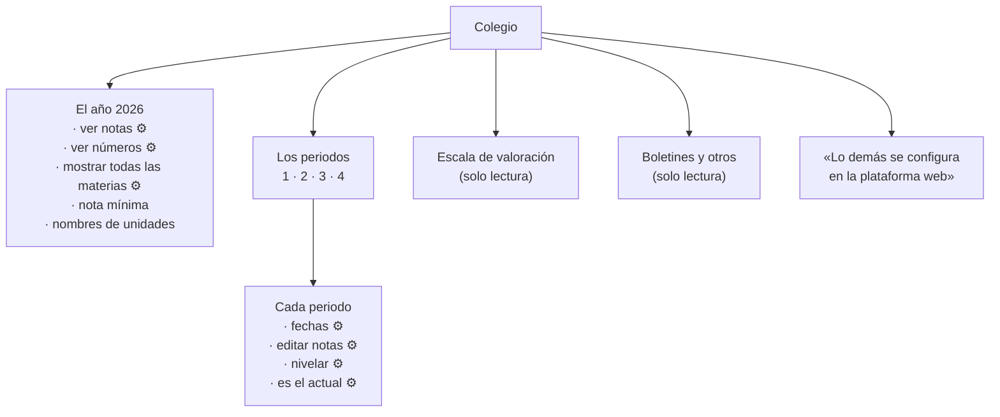

# La configuración del colegio en la app

Una pantalla que **enseña** cómo está configurado el colegio y deja **editar
solo lo que cambia a menudo**. Escrito el 23 de agosto de 2026.

## El criterio

La pantalla `^/years` del front web es la consola de administración entera: crea
y borra años, crea y borra periodos, edita la escala de valoración fila a fila,
configura los certificados, y encima tiene una docena de interruptores. Traer
eso al teléfono sería traer a la vez la parte peligrosa —borrar un año— y la
parte que nadie hace desde el móvil —montar la escala de valoración—.

La regla, entonces:

> **Se ve todo lo que ayuda a entender por qué la app se comporta como se
> comporta. Se edita solo lo que un directivo cambia estando de pie.**

Lo que se edita es corto y tiene una cosa en común: son interruptores que se
mueven varias veces al año, en momentos concretos —se cierra el periodo, se
abre, se bloquean las notas hasta que salgan los boletines— y que hoy obligan a
sentarse ante un computador para mover una casilla.

Lo demás se ve en gris, con una línea al final: **«Lo demás se configura en la
plataforma web»**. Que no es una disculpa: es la respuesta a «¿y esto dónde se
cambia?», que si no está escrita acaba en una llamada.

## Qué se edita

| Ajuste | Endpoint | Alcance | Por qué está aquí |
|---|---|---|---|
| Los alumnos y acudientes pueden ver las notas | `PUT years/alumnos-can-see-notas` | año | Es *el* interruptor de urgencia: se apaga mientras se cuadran los boletines y se vuelve a encender. Hoy hay que ir al computador. |
| Los estudiantes ven números en sus notas | `PUT years/toggle-solo-valorativas` | año | El mismo momento y la misma persona; separarlo del anterior no tendría sentido. |
| Los docentes pueden editar notas, indicadores, tardanzas y comportamientos | `PUT periodos/toggle-profes-pueden-editar-notas` | **por periodo** | El cierre del periodo. Se apaga en la fecha de plazo y se enciende para una corrección puntual. |
| Los docentes pueden nivelar o modificar notas finales | `PUT periodos/toggle-profes-pueden-nivelar` | **por periodo** | Va con el anterior, pero se abre y se cierra en otro momento: se nivela después de cerrar la edición. |
| Fecha de inicio y fecha de fin del periodo | `PUT periodos/cambiar-fecha-inicio`, `…/cambiar-fecha-fin` | por periodo | Se corren cada año y a veces a mitad de camino. |
| Cuál es el periodo actual del colegio | `PUT periodos/establecer-actual/{id}` | año | Se mueve cuatro veces al año, en un día señalado. Con confirmación (ver abajo). |
| Mostrar todas las materias al docente, ignorando el horario | `PUT years/mostrar-todas-materias` | año | Es lo que decide el filtro «Hoy» de las asignaturas ([notas.md §2](notas.md)). Si un colegio no configura los días, este interruptor es el arreglo, y conviene que esté donde se ve el efecto. |

### El periodo actual, con confirmación

`periodos/establecer-actual` no es un interruptor cualquiera: cambia el periodo
para **todo el colegio**, y de él cuelgan las notas que se escriben, los
boletines y los informes. Va con un diálogo que diga qué implica —el front web
tiene uno, `cuidadoCambiaPeriodoModal.html`— y no con un simple *toggle*.

**Y no confundirlo con el selector de la barra de arriba.** La
[BarraContexto](../lib/Widgets/BarraContexto.dart) cambia el año y el periodo
**del usuario** (`years/useractive`, `periodos/useractive`): es en qué periodo
está mirando esta persona. Lo de esta pantalla es en qué periodo está el
colegio. Son dos cosas distintas con nombres parecidos, y el sitio donde se
confunden es aquí. La pantalla lo dice con todas las letras.

## Qué se ve y no se toca

- **La escala de valoración**: los tramos, su desempeño, su descripción, y
  cuáles cuentan como perdido. Es la tabla que traduce «85» a «Alto», y un
  docente la consulta más de lo que uno cree; **editarla es cosa de una vez al
  año y de una pantalla grande**. Se muestra como una lista de tramos con su
  color, sin campos.
- **Cómo llama el colegio a las unidades y a las subunidades**
  (`unidad_displayname`, `subunidad_displayname` y sus plurales). La app ya los
  usa para rotular; aquí se explica de dónde salen.
- **La nota mínima aceptada**, que es la que pinta de rojo media app.
- **Los años y sus periodos**, con sus fechas y cuál es el actual. En lista, sin
  botones de crear ni de borrar.
- **Los interruptores del boletín** —puesto comparativo, nota de comportamiento,
  materias del año pasado, si recuperar exime de nivelar— y **si los docentes
  pueden editar datos de alumnos**. Se ven porque explican cosas que el usuario
  nota; no se editan porque no se cambian sobre la marcha.

## Qué no aparece

- **La configuración de certificados.** Los certificados se generan e imprimen
  en la web; en la app no hay nada que dependa de ellos. Una sección que
  configura algo que la app no hace es ruido.
- **Crear o borrar años y periodos.** Borrar un año se lleva por delante
  matrículas, notas y boletines. Eso no se hace desde un teléfono, ni con
  confirmación.
- **Los ordinales del manual de convivencia.** Se leen y se editan en la web.
  En la app ya se ven donde hacen falta —al anotar una situación, en
  [SelectorOrdinales](../lib/Widgets/SelectorOrdinales.dart)—, que es donde un
  docente los necesita. Una segunda lista en configuración solo sería otro sitio
  que mantener.
- **Roles y permisos, papelera, bitácora, gestor de archivos.** Administración
  de escritorio.

## Quién la ve

La pantalla entra por el menú lateral, debajo de las que ya hay, y **solo para
personal del colegio** —nunca alumnos ni acudientes—.

Dentro, dos niveles:

- **Docentes y administrativos**: lo ven todo en modo lectura. Les sirve para
  entender por qué no pueden editar notas hoy, o qué significa un 85.
- **Admins y superusuarios**: además, los siete ajustes de la tabla de arriba.

Los endpoints que editan llevan `auth.personal`, que solo cierra la puerta a
alumnos y acudientes: **un docente podría llamarlos**. Por eso la restricción a
admins es de la app, y hay que decirlo así —es alcance, no permiso—, con el
mismo criterio que ya usa `esEspecial` en
[AuthService](../lib/Http/AuthService.dart).

## Cómo se pinta

⚙ = editable para admins.

Los interruptores guardan **al momento**, uno a uno, como en el web: son
peticiones diminutas y aisladas, y un botón «Guardar» general aquí solo añadiría
un paso y la duda de si quedó guardado. Cada uno muestra su propio estado de
ocupado y revierte si falla —hay [ControlOcupado](../lib/Widgets/ControlOcupado.dart)
para eso—.

## Coste

Ninguno digno de mención: la pantalla se arma con `GET years/colegio`,
`GET periodos/show/{year_id}` y `GET escalas`, tres consultas simples, y solo
cuando alguien la abre. Los cambios son un `PUT` por interruptor. Es la pantalla
más barata de todo el plan.

## Apéndice: endpoints

| Endpoint | Uso | Permiso |
|---|---|---|
| `GET years/colegio` | los años del colegio con su configuración | — |
| `GET periodos/show/{year_id}` | los periodos de un año | — |
| `GET escalas` | la escala de valoración | — |
| `PUT years/alumnos-can-see-notas` | `{year_id, can}` | `auth.personal` |
| `PUT years/toggle-solo-valorativas` | `{year_id, can}` | `auth.personal` |
| `PUT years/mostrar-todas-materias` | `{year_id, can}` | `auth.personal` |
| `PUT periodos/toggle-profes-pueden-editar-notas` | `{periodo_id, pueden}` | `auth.personal` |
| `PUT periodos/toggle-profes-pueden-nivelar` | `{periodo_id, pueden}` | `auth.personal` |
| `PUT periodos/cambiar-fecha-inicio` / `cambiar-fecha-fin` | `{periodo_id, fecha}` | `auth.personal` |
| `PUT periodos/establecer-actual/{periodo_id}` | con confirmación | `auth.personal` |
