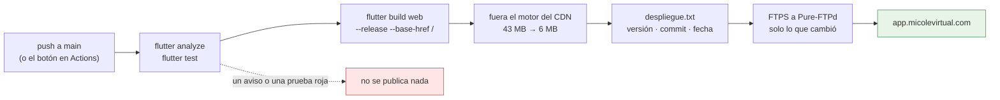

# La web: de aquí a app.micolevirtual.com

Cómo se publica la app compilada para navegador, con un botón, sin abrir un
cliente de FTP. Escrito el 16 de septiembre de 2026.

El subdominio **ya está en pie y sirviendo la app**: el `index.html` que
contesta hoy es del 20 de agosto de 2026 y lo subió alguien a mano. Lo que
cambia aquí no es que exista la web, sino que dejar de subirla a mano.

## 1. El camino, de un vistazo



El archivo es [.github/workflows/desplegar-web.yml](../.github/workflows/desplegar-web.yml).
Las reglas del servidor —tipos, compresión y caché— van en
[web/.htaccess](../web/.htaccess), que el propio `flutter build web` copia
dentro de `build/web/` y por eso viaja en cada despliegue.

**El repositorio es público**, así que los minutos de Actions no se pagan. Y el
único disparo automático es `push` a `main`: no hay `pull_request`, que es por
donde un fork ajeno podría pedir prestados los secretos.

> ### ✅ FUNCIONA desde el 21 sep 2026 — y lo que costó no fueron las credenciales
>
> **Esta caja decía, hasta el 21 de septiembre, que el despliegue no había corrido
> nunca.** Era cierto: `gh secret list` devolvía vacío y las ejecuciones que existían
> habían fallado todas en el paso 2, «Comprobar que las credenciales están puestas»,
> con *«Faltan estos secretos del repositorio: … FTP_PASSWORD»*. Los cinco intentos
> del día 20 murieron ahí, en 6–9 segundos, sin compilar ni tocar el servidor.
>
> **Joseth puso `FTP_PASSWORD` el 21 a las 02:57 y el despliegue publicó a la
> primera**, en 3m43s. Lo que sirve `app.micolevirtual.com` ya no es el `index.html`
> de agosto.
>
> Y lo que hay que decir del diseño, porque se comprobó: **falló limpio las cinco
> veces**. No compiló, no se conectó, no subió un byte. El paso 2 hizo exactamente lo
> que esta sección prometía.
>
> #### ⚠️ Pero publicar no era lo mismo que verse, y eso costó dos intentos más
>
> Con el despliegue **ya arriba y correcto** —`version.json` idéntico al build local,
> `main.dart.js` con fecha de hacía minutos— un teléfono que había abierto la app en
> agosto **seguía viendo el menú de agosto**. El servidor mandaba `main.dart.js` con
> `cache-control: max-age=604800`: una semana.
>
> **Lo taimado es que fallaba solo en los `.js`.** El `.htaccess` sí se aplicaba a
> `manifest.json` y al favicon, así que `index.html` se renovaba cada hora y el
> despliegue *parecía* correcto, mientras el fichero que lleva la app entera estaba
> congelado. Un fallo total se habría visto el primer día.
>
> **Y por cabeceras no se puede ganar**, se intentó y se midió: `ExpiresActive Off`,
> `Header always set` y `unset Expires` se subieron, se leyeron, y los `.js` siguieron
> igual. LiteSpeed les pone sus propias cabeceras por extensión y eso se configura en
> el panel del hosting, no en este repositorio. La solución está en §5 bis: **colgarle
> la versión al nombre**, que es lo único que sí está en nuestra mano.
>
> La contraseña sigue **sin estar en ningún sitio del repositorio, a propósito**, y
> sólo la puede poner Joseth.

## 2. Lo que hay que poner en GitHub, una vez

En **Settings → Secrets and variables → Actions**. Los tres primeros son
secretos (pestaña *Secrets*); los tres de abajo son variables (pestaña
*Variables*) y solo hacen falta si algo no es lo esperado.

| Secreto | Valor | De dónde sale |
|---|---|---|
| `FTP_SERVER` | `ftp.micolevirtual.com` | resuelve a `70.32.23.72`, la misma máquina que sirve el subdominio — comprobado el 16 sep |
| `FTP_USERNAME` | `micolev1_mobile_github@app.micolevirtual.com` | la cuenta de FTP creada en cPanel para este despliegue |
| `FTP_PASSWORD` | la que se puso en cPanel | **no se escribe en ningún archivo, ni en un chat** |

| Variable | Por defecto | Cuándo se toca |
|---|---|---|
| `FTP_PROTOCOL` | `ftps` | si el servidor no aceptara TLS. Hoy sí: el saludo de Pure-FTPd anuncia `[TLS]`, comprobado el 16 sep |
| `FTP_PORT` | `21` | si el hosting mueve el puerto |
| `FTP_SERVER_DIR` | `./` | **el que de verdad puede fallar** — ver §3. Tiene que acabar en `/`, o la acción no arranca |

Por consola, si se prefiere:

```bash
gh secret set FTP_SERVER   --repo bluesky777/myvc_flutter --body "ftp.micolevirtual.com"
gh secret set FTP_USERNAME --repo bluesky777/myvc_flutter --body "micolev1_mobile_github@app.micolevirtual.com"
gh secret set FTP_PASSWORD --repo bluesky777/myvc_flutter   # la pide por teclado, sin dejarla en el historial
```

El primer paso del workflow comprueba que los tres estén puestos y para con un
mensaje claro si falta alguno, en vez de morirse cinco minutos después dentro
del FTP con un error de tres palabras.

## 3. El primer despliegue, en tres pasos y en este orden

### Paso 1 — un ensayo, que no toca nada

Actions → **Desplegar la web a app.micolevirtual.com** → *Run workflow*, y se
marca **ensayo**. Compila, se conecta con las credenciales de verdad y escribe
en el log qué subiría, sin escribir un solo byte en el servidor.

Lo que hay que mirar en ese log es **dónde aterriza la sesión de FTP**. Una
cuenta de cPanel creada para el subdominio entra ya dentro de su carpeta, y
entonces `FTP_SERVER_DIR` se queda en `./`. Si en cambio entra en la casa
entera, el log enseñará las carpetas de los colegios —`coabsaravena.micolevirtual.com`,
`demo.micolevirtual.com`…— y entonces hay que crear la variable
`FTP_SERVER_DIR` con `app.micolevirtual.com/`.

> ⚠️ **Hasta no haber leído eso en un ensayo, nunca se marca «limpiar».**
> «Limpiar» borra todo lo que haya en la carpeta de destino antes de subir. Si
> el destino resultara ser la casa entera, lo que se borra son los diecisiete
> colegios. El ensayo cuesta cuatro minutos y esa carpeta no tiene copia.

### Paso 2 — la primera subida, con limpieza

Una vez confirmada la carpeta: *Run workflow* otra vez, esta vez marcando
**limpiar**. Se hace **solo esta primera vez**, y por una razón concreta: arriba
hay una compilación de agosto subida a mano, y la acción no puede saber qué
archivos de aquella sobran. Arrancar de cero deja el servidor y el repositorio
diciendo lo mismo.

### Paso 3 — de ahí en adelante, nada

Cada push a `main` que toque código de la app publica solo. Los commits que solo
mueven `docs/`, Android o iOS no gastan un despliegue —está en el `paths-ignore`
del workflow—. Y para publicar sin esperar a un push, el botón sigue ahí.

Qué quedó arriba se comprueba en **https://app.micolevirtual.com/despliegue.txt**,
que el propio despliegue escribe con la versión, el commit y la fecha.

## 4. Los tres interruptores del botón

| | Qué hace | Cuándo |
|---|---|---|
| **ensayo** | conecta y dice qué subiría, sin tocar nada | la primera vez, y cada vez que se cambie una credencial |
| **saltar_pruebas** | se salta `analyze` y `test` | un arreglo urgente con la cara roja. Queda anotado en el resumen de la ejecución, a propósito |
| **limpiar** | borra el destino y sube todo otra vez | la primera vez (§3), y el día que el servidor quede raro |

## 5. Por qué el `.htaccess` no es un adorno

**Flutter no le pone un hash al nombre de sus archivos.** Después de publicar,
el navegador vuelve a pedir `main.dart.js` —el mismo nombre de ayer— y se queda
con la copia vieja. Esto no es teoría; así contesta hoy el servidor, medido el
16 sep 2026:

| Archivo | Cabecera de hoy | Lo que significa |
|---|---|---|
| `index.html` | `max-age=3600, must-revalidate` | una hora con la app anterior |
| `main.dart.js` | `max-age=604800, public` | **una semana** con la app anterior |

O sea que hasta ahora publicar no quería decir que la gente lo viera: quien ya
tenía la app abierta seguía con la de la semana pasada. Y el service worker no
salva a nadie, porque el que genera Flutter está deprecado y lo único que hace
al instalarse es darse de baja.

Por eso [web/.htaccess](../web/.htaccess) pone `no-cache` en todo salvo los
iconos. `no-cache` no es «no guardes», es «guarda, pero pregunta antes de
usarlo»: el navegador manda su ETag, LiteSpeed contesta `304` sin cuerpo y no se
vuelve a bajar nada de lo que no cambió. Despliegues que se ven el mismo día, y
casi el mismo ahorro de datos.

Lo demás de ese archivo es red de seguridad y está dicho allí mismo: los tipos
—por si el motor deja de venir del CDN (§6)—, la compresión —que LiteSpeed ya
hace solo: los cuatro megas de `main.dart.js` bajan en 970 KB con `br`— y
esconder el cuaderno del FTP.

## 5 bis. El `.htaccess` NO gana esa pelea, y lo que sí la gana

**Medido el 21 sep 2026, con el primer despliegue ya arriba.** La §5 de arriba tenía
razón en el diagnóstico y se equivocaba en la cura: el `.htaccess` no puede con esas
cabeceras. Lo que contesta el servidor, fichero por fichero:

| Archivo | Cabecera | ¿De quién es? |
|---|---|---|
| `manifest.json` | `no-cache, must-revalidate` | ✅ nuestra regla |
| `favicon.png` | `public, max-age=604800` | ✅ nuestra regla |
| `main.dart.js` | `max-age=604800, public` | ❌ del servidor |
| `flutter.js` | `max-age=604800, public` | ❌ del servidor |

**El `.htaccess` se sube y se lee** —se comprobó en el log del FTP, `🔁 File replace:
.htaccess`, y dos de las cuatro filas llevan nuestro sello hasta en el orden de las
palabras—. Pero **LiteSpeed pone sus propias cabeceras a los estáticos por extensión**,
y eso se configura en el panel del hosting. Se intentó `ExpiresActive Off`,
`Header always set` y `Header always unset Expires`: se desplegaron y **no cambiaron
nada** en los `.js`.

### Lo que sí funciona: colgarle la versión al nombre

Si no se puede mandar en la cabecera, se manda en la URL. El paso **«Romper la caché de
los `.js`»** del workflow reescribe, después de compilar:

```
index.html         →  flutter_bootstrap.js?v=<commit corto>
flutter_bootstrap  →  main.dart.js?v=<commit corto>
```

Una URL distinta es una entrada distinta de la caché. **El fichero del servidor no
cambia de nombre**, así que el FTP sigue subiendo solo lo que cambió.

**Hay que romper los dos eslabones y no uno.** La cadena es `index.html` →
`flutter_bootstrap.js` → `main.dart.js`; rompiendo solo el primero, el bootstrap nuevo
seguiría pidiendo el `main.dart.js` viejo que el navegador ya tiene.

El `sed` va anclado a las comillas —`"main.dart.js"`— y no al nombre suelto, porque
dentro del bootstrap ese nombre aparece tres veces y solo las entrecomilladas son la
carga del entrypoint.

> **Lo peor que puede pasar ahora es una hora**, que es lo que el servidor cachea
> `index.html`. Antes era una semana — y una semana es tiempo de sobra para que alguien
> concluya que el despliegue no funciona y se ponga a arreglar lo que no está roto.
> Esto es justo lo que pasó el 21 de septiembre.

## 6. Los 37 megas que no se suben

`flutter build web` deja 43 MB en `build/web/`, y **37 son un motor gráfico que
esta app no sirve**: el arranque carga CanvasKit de `gstatic.com/flutter-canvaskit`
—el CDN de Google—, que es el comportamiento por defecto de Flutter. La copia
local no la pide nadie.

No es una suposición: la web que ya está en pie devuelve **404** en
`canvaskit/canvaskit.wasm` y en `canvaskit/skwasm.wasm` desde agosto, y funciona.

El workflow la borra antes de subir, pero **mirando primero el arranque de
verdad**: si algún día se compila con `--no-web-resources-cdn`, el paso se da
cuenta solo y sube el motor entero. Así el despliegue son ~6 MB la primera vez y
kilobytes las siguientes, en vez de 43 MB por FTP contra un hosting compartido.

Queda dicho por si alguna vez se decide al revés: **servir el motor desde aquí
quitaría la única petición que esta app le hace a Google desde el navegador**.
Es una decisión de privacidad —la app la usan menores—, no de despliegue, y hoy
está como estaba. Cambiarla es añadir esa bandera al paso de compilar; el resto
se ajusta solo.

## 7. Las trampas que ya están miradas

**El selector de colegios funciona desde la web.** La lista sale de
`https://micolevirtual.com/app/listado_colegios.php`, que desde el navegador es
una petición a otro origen; contesta con `access-control-allow-origin: *`,
comprobado el 16 sep 2026. Si algún día alguien cierra esa cabecera, el login de
la web se queda sin colegios que ofrecer.

**El CORS de cada colegio es la política `*`** (decisión de Joseth, 6 sep 2026),
así que la app servida desde `app.micolevirtual.com` puede hablar con cualquiera
de los diecisiete. El riesgo conocido: un colegio con `CORS_ALLOWED_ORIGINS`
puesta en su `.env` **con un solo origen** devuelve cabecera a todo el mundo y
aun así el navegador bloquea —la respuesta parece buena y no lo es—. Si un día
la web no entra en un colegio concreto y en el celular sí, eso es lo primero que
hay que mirar: `tools/cors-de-los-colegios.sh --url https://ese-colegio…` en el
backend. **El backend es de solo lectura desde aquí**; lo que haga falta allí se
pide ([backend-pendiente.md](backend-pendiente.md)).

**La analítica no mide en web, y es correcto.** En Firebase solo está registrada
la app de Android; `Analitica.disponible` es `false` en web y no se manda ni un
evento. Ver [analitica.md](analitica.md).

**La versión de Flutter está clavada en el workflow** —`3.44.1`, la misma de la
máquina donde se trabaja—. El día que aquí se haga `flutter upgrade`, ese número
sube con él: si CI compila con otra versión, lo que se publica no es lo que se
probó.

## 8. Lo que esto no hace

No toca el backend, no toca Play y no publica APKs. Es una sola cosa: la
compilación web de esta app, en ese subdominio. La publicación en las tiendas
sigue donde estaba, en [publicacion-play.md](publicacion-play.md) y
[publicacion-app-store.md](publicacion-app-store.md).
