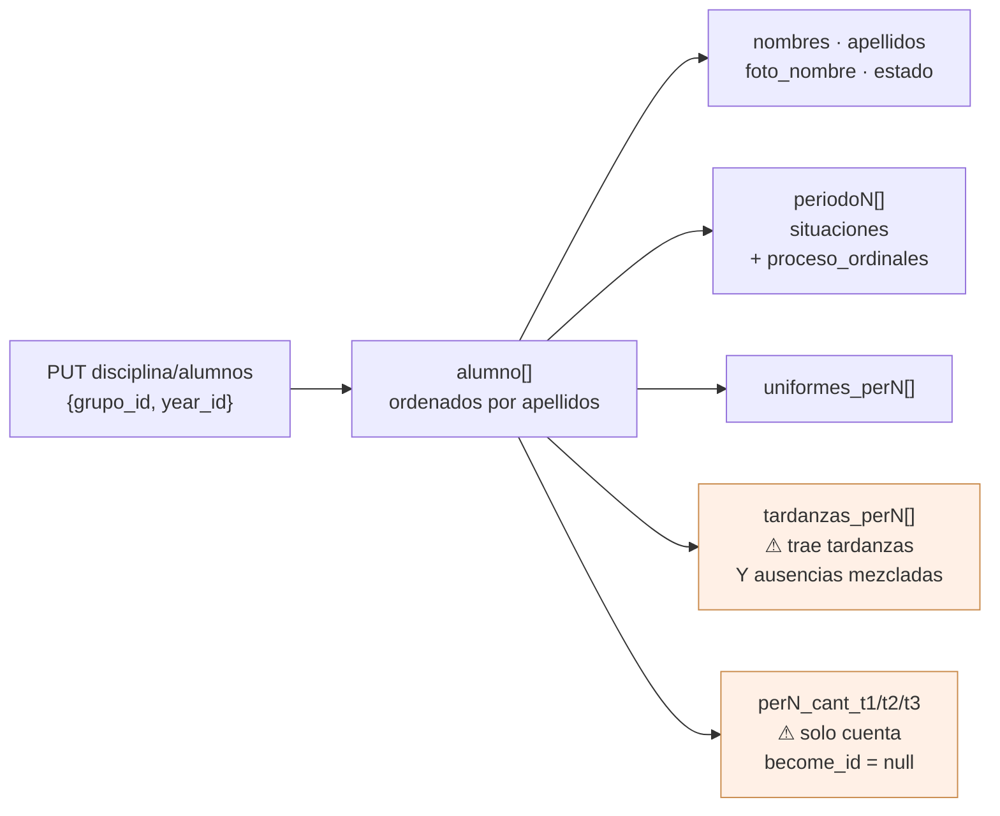
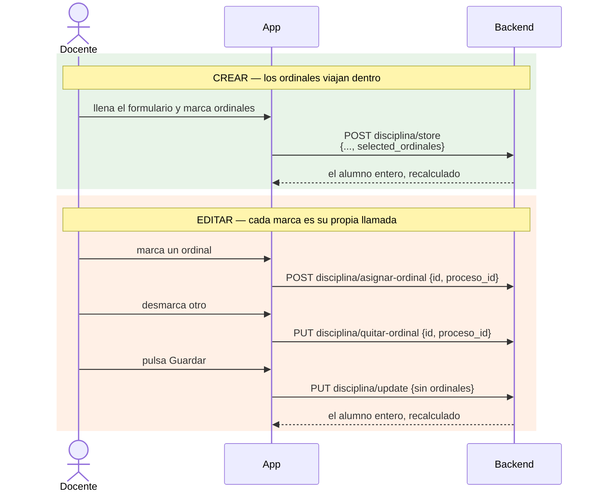
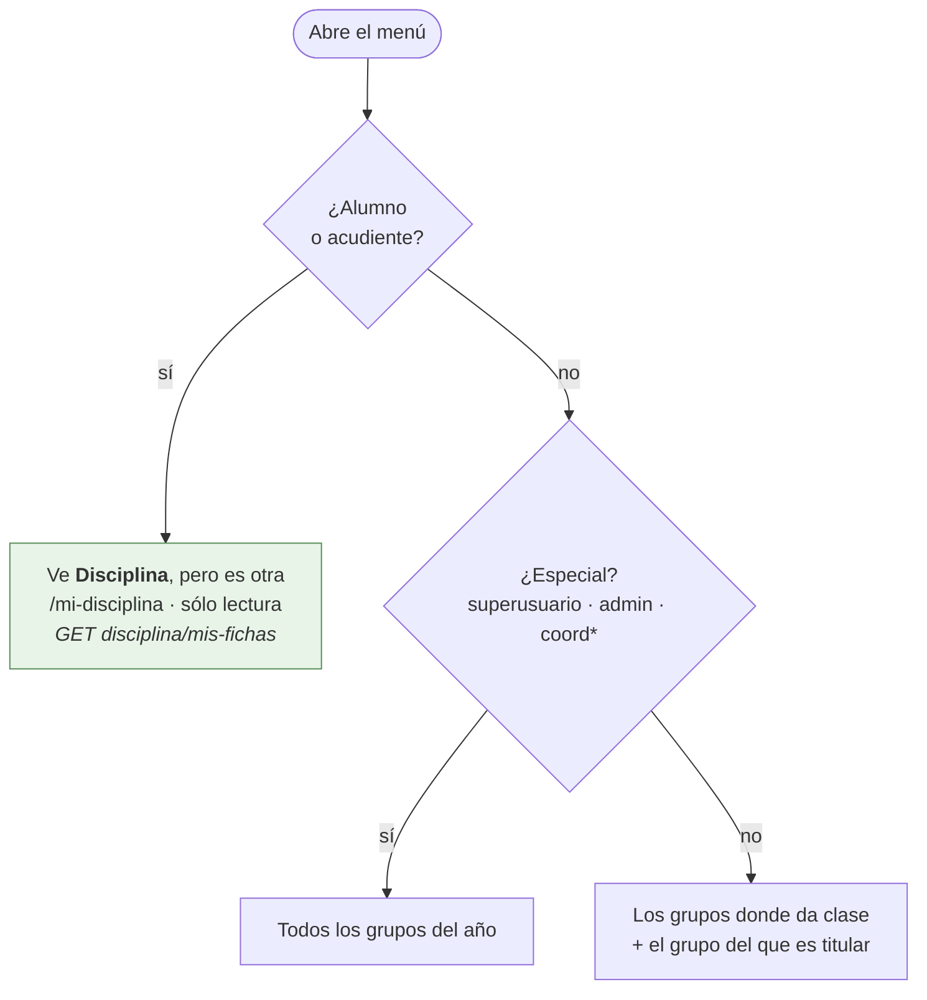
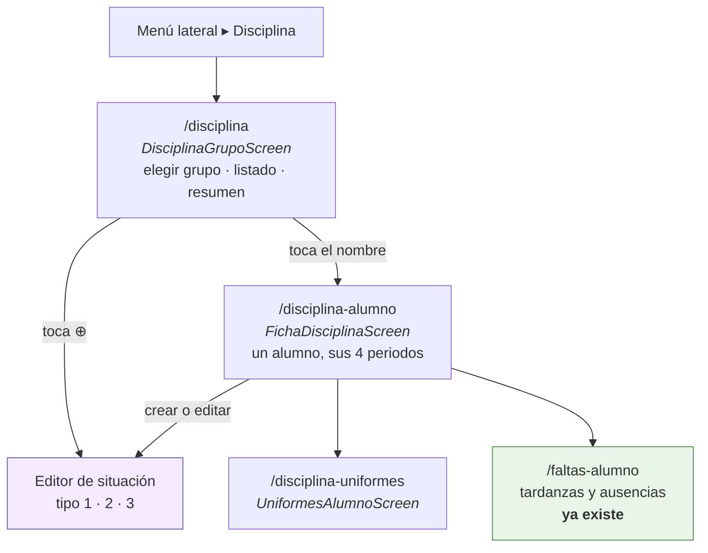

# Disciplina

La pantalla de disciplina de la app, traída de `/disciplina` del front web
(`myvc_front/app/scripts/comportamiento/`). **Está hecha entera**, la del alumno y el acudiente
incluida, y encendida desde el 26 de agosto de 2026; ver «La ficha del alumno y del
acudiente».

Los diagramas son [Mermaid](https://mermaid.js.org). Para verlos dibujados en VS Code,
extensión `bierner.markdown-mermaid` y vista previa con `⌘K V`; en GitHub se ven solos.

## Lo que hay al otro lado

**Carga inicial** — `PUT grupos/con-disciplina`, sin cuerpo, devuelve de golpe `year`,
`grupos` (todos), `config`, `ordinales` y `descripciones_typeahead`. Una sola llamada al
entrar.

**El grupo** — `PUT disciplina/alumnos {grupo_id, year_id}` devuelve los alumnos ya
ordenados por apellidos, cada uno con todo lo suyo de los cuatro periodos.



**Escrituras** — `POST disciplina/store`, `PUT disciplina/update`, `PUT disciplina/destroy`,
`POST disciplina/asignar-ordinal`, `PUT disciplina/quitar-ordinal`; los uniformes por
`PUT uniformes/agregar|actualizar|eliminar`. Las tres primeras devuelven **el alumno entero
recalculado**, que es con lo que se refresca la fila sin recargar el grupo.

Las tardanzas y ausencias a la institución ya las escribe esta app por `/ausencias/*`, y
`FaltasAlumnoScreen` ya lee `disciplina/alumnos`. Eso no se toca.

## Las trampas

Escritas aquí para no descubrirlas dos veces.

1. **`disciplina/update` no toca los ordinales.** Al editar hay que asignarlos y quitarlos al
   vuelo, uno a uno. Y el par no usa el mismo verbo: asignar es POST, quitar es PUT, y en los
   dos el ordinal viaja como `id` y el proceso como `proceso_id`.
2. **`proceso_ordinales` es la tabla pivote.** El id del ordinal es `ordinal_id`; su `id` es el
   de la fila pivote. Confundirlos deja la lista de ordinales vacía al abrir una situación ya
   guardada — es un error que ya se pagó en el front web.
3. **`perN_cant_tX` solo cuenta las situaciones con `become_id` nulo**, las que no fueron
   absorbidas por otra derivada. Hay que pintar ese contador, no `lista.length`.
4. **`tardanzas_perN` miente en el nombre**: filtra por `entrada=1` pero no por tipo, así que
   ahí vienen tardanzas y ausencias mezcladas. `TipoFalta.soloDelTipo` ya las separa.
5. **El profesor viaja como objeto**, `{profesor_id: N}`, no como id suelto. Un id suelto se
   guarda como `null` sin avisar.
6. **`disciplina/destroy` usa el año del usuario**, no el que se le mande.
7. **Los uniformes exigen `pueden_editar_notas`**: con el periodo cerrado para docentes
   responden 400. `mensajeDeFallo` de `lib/Http/FaltasApi.dart` ya lo traduce.
8. **Los nombres de los tres tipos son del colegio**, no nuestros: `falta_tipoN_displayname`
   en singular para los botones, `faltas_tipoN_displayname` en plural para los títulos. Nunca
   «Tipo 1» a pelo.
9. **`grupos/con-disciplina` devuelve todos los grupos.** El filtro por docente es del cliente.
10. **`dependencias` va SIEMPRE en el update**, aunque esté vacía. El backend hace
    `count($dependencias)` sin comprobar antes que sea un array, y en PHP 8.3 `count(null)` es un
    TypeError: omitir la clave no guarda nada y devuelve un 500. El alta sí lo protege con
    `is_array`, así que la diferencia está solo en editar.
11. **Lo que engancha una situación a otra es que la clave `asignado` ESTÉ, no lo que valga.** El
    update hace `array_key_exists('asignado', ...)`. Mandar `asignado: false` para soltar
    engancha, y `asignado: null` también, porque en PHP una clave con null existe. Lo que suelta
    es el id a secas. Y solo se mandan las que cambian: soltar una que nunca colgó de esta le
    borraría el enganche que tuviera con otra.
12. **`deriva_de_tardanzas` solo se puede fijar al crear.** El UPDATE de `disciplina/update` no
    nombra esa columna, así que mandarla al guardar no hace nada y no avisa.

### La trampa de los ordinales, en detalle

Crear y editar no se parecen, porque el `update` del backend ignora los ordinales.



## Quién ve qué



- **Especial** — `isSuperuser`, rol `admin`, o cualquier rol que empiece por `coord`. Va como
  getter `esEspecial` en `lib/Http/AuthService.dart`, al lado de `esAdmin`.
- **Docente** — los grupos donde tiene asignatura (`GET asignaturas/listasignaturas`, que la
  app ya usa en Unidades) más aquel del que es titular (`titular_id == personaId`, dato que ya
  viene en `grupos`).
- **Alumno y acudiente** — entran a **la suya**, en sólo lectura y por otra ruta. Ver «La ficha
  del alumno y del acudiente».

## Navegación

En el menú lateral, **Disciplina**. La misma palabra para todos y dos pantallas detrás: el
personal va a `/disciplina`, que edita; el alumno y el acudiente a `/mi-disciplina`, que sólo
lee. El nombre se comparte a propósito —es como lo llama el colegio—, así que **lo que separa a
unos de otros es la ruta y no el texto**, y así se comprueba en las pruebas.



El año y el periodo salen de la barra de arriba (`TituloContexto`), como en Unidades: un
selector propio sería un segundo sitio para lo mismo y una forma de que discrepen.

## Las pantallas

### DisciplinaGrupoScreen

```
┌───────────────────────────────────────────┐
│ ☰   2026 · Periodo 3 ▾                 ⟳  │
├───────────────────────────────────────────┤
│ Grupo   [ 10-B · Décimo B              ▾ ]│
│ Buscar  [ 🔍                             ]│
├───────────────────────────────────────────┤
│ ⬤  ACOSTA PÉREZ, Ana                  ⊕ ⌄ │
│     P1 3  ·  P2 0  ·  P3 9  ·  P4 —       │
│   ┌─ Periodo 3 ──────────────────────────┐│
│   │ 👕 2    ⏰ 5    🚫 1                  ││
│   │ Leves 3   Graves 1   Gravísimas 0    ││
│   └──────────────────────────────────────┘│
├───────────────────────────────────────────┤
│ ⬤  BOLAÑO DÍAZ, Luis                  ⊕ ⌄ │
│     P1 0  ·  P2 1  ·  P3 2  ·  P4 —       │
└───────────────────────────────────────────┘
```

La tira de los cuatro periodos siempre visible, con el total de cada uno. En la web son cuatro
columnas de tabla, una al lado de otra; en un teléfono no caben. El chevron despliega en la
propia tarjeta los seis contadores por tipo del periodo tocado —uniforme, tardanza, ausencia y
los tres tipos de situación, con el nombre que les da el colegio—, y cada contador abre su
detalle. El nombre lleva a la ficha del alumno; el `⊕` crea una situación en el periodo de la
barra.

### FichaDisciplinaScreen

El alumno del año entero: cuatro secciones desplegables, una por periodo, y dentro las
situaciones agrupadas por tipo, con su fecha, descripción, docente, testigos, descargo, quién
la registró y los ordinales resueltos contra el catálogo. Desde aquí se crea, se edita y se
borra. Los uniformes y las tardanzas/ausencias del periodo se enseñan resumidos y se abren en
su pantalla.

### El editor de situación

Todo lo que ofrece el modal del front web, con los controles de esta app:

| Dato | Control |
|---|---|
| Tipo 1 / 2 / 3 | `SegmentedButton` con los nombres de `config` |
| Descripción | campo con sugerencias sobre `descripciones_typeahead` |
| Fecha | `showDatePicker`, como en el resto de la app |
| Testigos, descargo | texto |
| Profesor | `CampoDocente` — el de las fotos, no un dropdown |
| Ordinales | `CampoOrdinales`, abajo |

**El control del ordinal** es el `ui-select multiple` de la web traducido: el campo enseña los
elegidos como chips con su número; al tocarlo se abre una hoja inferior a pantalla casi
completa con un buscador arriba y la lista del manual de convivencia con casilla, filtrando
según se escribe sin distinguir acentos. Los ordinales son de solo lectura: aquí se eligen, no
se crean ni se editan.

**Cuándo se guardan, y por qué no como en la web.** Allí marcar un ordinal dispara
`asignar-ordinal` en ese instante, aunque después se cancele el formulario. Aquí no se toca
nada hasta pulsar Guardar. En el teléfono se cancela mucho más —basta el gesto de volver— y
guardar a espaldas de quien está escribiendo deja ordinales puestos en situaciones que nadie
llegó a modificar. Al guardar van **primero los ordinales y después el resto**, al revés de
como se lee: `disciplina/update` devuelve el alumno recalculado, así que si los ordinales
fueran después, lo que vuelve estaría ya viejo y la ficha pintaría los de antes.

### UniformesAlumnoScreen

Las fallas del periodo, cada una con su fecha y hora y sus marcas —sin cámara, contrario, sin
uniforme, incompleto, cabello, accesorios, excusado— más la descripción. Crear, editar y
eliminar. Las marcas van como `FilterChip`, que es lo que eran los `btn-checkbox` de la web.

### De dónde viene una situación

Es como el colegio convierte la reincidencia en una falta mayor: varias leves se vuelven una
grave. Al enlazarlas, el backend le pone `become_id` a cada una apuntando a la nueva, y desde
ese momento **dejan de contar por separado** — el contador del periodo las salta, porque ya se
contaron dentro de esta.

Las reglas son del front web y se respetan tal cual:

- Solo aparece a partir del **tipo 2**: una de tipo 2 se alimenta de las de tipo 1, y una de
  tipo 3 de las de tipo 2.
- Una de **tipo 1 no deriva de ninguna situación**: viene de las tardanzas, que no son
  situaciones y no se enganchan una a una. Para eso está el sí o no de `deriva_de_tardanzas`.
- Qué periodos se ofrecen lo decide `reinicia_por_periodo`: si NO reinicia, valen las de este
  periodo y las de los anteriores; si reinicia, solo las de este.
- No se ofrecen las que ya cuelgan de otra situación — una se absorbe una sola vez—, pero sí las
  que ya cuelgan de la que se está editando, y salen marcadas: si no aparecieran, editarla las
  soltaría sin querer.

Como con los ordinales, aquí no se guarda al marcar: el web llama a
`cambiar-situacion-derivante` en el mismo instante en que se toca un chip, y esto espera al
botón de Guardar.

## Los archivos

**Nuevos**

- `lib/Models/ConfigDisciplinaModel.dart` — los nombres de los tres tipos y los umbrales
- `lib/Models/OrdinalModel.dart`
- `lib/Models/SituacionModel.dart` — `dis_procesos` con sus ordinales resueltos
- `lib/Models/UniformeModel.dart`
- `lib/Models/AlumnoDisciplinaModel.dart` — el alumno con sus cuatro periodos
- `lib/Http/DisciplinaApi.dart`
- `lib/Http/UniformesApi.dart`
- `lib/Widgets/SelectorGrupo.dart` — `CampoGrupo` + hoja con buscador
- `lib/Widgets/SelectorOrdinales.dart` — `CampoOrdinales`
- `lib/Widgets/SelectorSituaciones.dart` — de qué situaciones viene esta
- `lib/Widgets/BarraPlegable.dart` — la barra que se pliega al desplazar
- `lib/Widgets/CampoConSugerencias.dart` — el typeahead de la descripción
- `lib/Screens/DisciplinaGrupoScreen.dart`
- `lib/Screens/FichaDisciplinaScreen.dart`
- `lib/Screens/SituacionEditorScreen.dart`
- `lib/Screens/UniformesAlumnoScreen.dart`

**Tocados**

- `lib/Http/AuthService.dart` — el getter `esEspecial`
- `lib/Menu/MenuLateral.dart` — la opción, solo para el personal
- `lib/Screens/RouteGenerator.dart` — la ruta `/disciplina`
- `lib/Models/GrupoModel.dart` — `titular_id` y `nombre_grado`, y se lee con `JsonBackend`
- `lib/Models/AsignaturaModel.dart` — `DocenteModel` gana `userId`
- `lib/Utils/ContextoAcademico.dart` — `periodoIdDe(numero)`, para poder escribir en un periodo
  que no es el de la barra
- `lib/Http/UnidadesApi.dart` y `lib/Http/NotasApi.dart` — un solo sitio que entiende la forma
  de `/contratos`, en vez de tres copias del mismo cruce

**Una sola ruta con nombre.** `/disciplina` es la puerta; la ficha, el editor y los uniformes se
abren con `push` directo. Reciben modelos ya cargados y devuelven el alumno recalculado, y por
una ruta con nombre eso viaja como `Object?` y hay que creerse el tipo al bajarlo. Así no se
vuelve a pedir el grupo de cuarenta alumnos después de cada guardado.

**Reutilizados sin tocar** — `AvatarPersona`, `CampoDocente`, `ControlOcupado`,
`TituloContexto`, `FechaServidor`, `JsonBackend`, `TipoFalta`, `mensajeDeFallo`, y la pantalla
`/faltas-alumno`, que ya sabía corregir el día de una tardanza.

## Las fases

```mermaid
flowchart LR
    F1["1 · Datos ✓<br/>modelos + APIs<br/>+ 21 pruebas"] --> F2["2 · Listado ✓<br/>grupo, resumen,<br/>menú y ruta"]
    F2 --> F3["3 · Ficha ✓<br/>del alumno"]
    F3 --> F4["4 · Crear y editar ✓<br/>situaciones"]
    F4 --> F4b["4b · Derivantes ✓<br/>encadenar situaciones"]
    F4b --> F5["5 · Uniformes ✓"]
    F5 --> F6["6 · Pantalla del alumno ✓<br/>y del acudiente<br/><i>encendida 26 ago 2026</i>"]

    style F1 fill:#e8f4e8,stroke:#5a8f5a
    style F2 fill:#e8f4e8,stroke:#5a8f5a
    style F3 fill:#e8f4e8,stroke:#5a8f5a
    style F4 fill:#e8f4e8,stroke:#5a8f5a
    style F4b fill:#e8f4e8,stroke:#5a8f5a
    style F5 fill:#e8f4e8,stroke:#5a8f5a
    style F6 fill:#e8f4e8,stroke:#5a8f5a
```



De la 1 a la 5, la 4b incluida, hechas en la rama `feat/disciplina`.

## La ficha del alumno y del acudiente

**La fase 6, hecha y encendida.** De dónde venía: en todo el backend solo cuatro controladores
tocan `dis_procesos` —`Disciplina`, `Comportamiento`, `NotaComportamiento` y `Grupos`— y todas
sus rutas llevaban `auth.personal`, que aborta con 403 a `Alumno` y `Acudiente`. El único
endpoint de notas abierto a ellos, `GET notas/alumno/{id}` con la guarda `boletin.propio`, trae
por periodo las asignaturas, sus ausencias de clase y `nota_comportamiento` —que es **la
nota**, no las fichas—. Uniformes y tardanzas de institución, igual de cerrados.

Por eso se pidió `GET disciplina/mis-fichas`: solo las situaciones del propio alumno con sus
ordinales ya resueltos, sin los cuarenta compañeros, sin las notas y sin el boletín, con una
guarda de propiedad al estilo de `boletin.propio`.

**Ya existe, y la pantalla está escrita** (24 ago 2026). El endpoint está en el backend con la
guarda `boletin.propio:sin-paz-y-salvo` y devuelve `{alumno, config, ordinales}`, con `alumno`
en la misma forma que un elemento de `PUT disciplina/alumnos` — que era el motivo de pedirlo
así.

**Encendida el 26 de agosto de 2026.** Estuvo detrás de `Interruptores.disciplinaMisFichas`
mientras el endpoint no estuviera desplegado —una opción de menú que termina en 404 es peor
que no tenerla—, y esa condición **ya estaba cumplida sin que aquí se supiera**: la ruta entró
con el commit `83bf717` (23 ago) y viajó en la tanda `eb95cbc`, que Joseth desplegó el 25 ago
con el mismo hash en los quince colegios. Este documento la dio por pendiente tres días de
más, y el mapa general lo copió.

El interruptor sigue existiendo, porque la condición para el siguiente será la misma.

Es [MiDisciplinaScreen](../lib/Screens/MiDisciplinaScreen.dart), y **no es una pantalla
nueva**: carga y delega en `FichaDisciplinaScreen` con `soloLectura: true`. Escribir otra para
enseñar exactamente lo mismo habrían sido dos sitios donde arreglar el mismo fallo.

Tres cosas que salieron al hacerla:

1. **Sin id, un acudiente recibe 400.** El backend sólo deduce el alumno del token cuando quien
   pregunta es el propio alumno. Así que el acudiente elige acudido antes, con la misma hoja
   que ya usan «Mis notas» y «Asistencia».
2. **El año lo decide el backend a partir del alumno, no de quien pregunta.** Es lo único que
   hace que esto sirva para un acudiente cuyo año de usuario no tiene por qué ser el del
   acudido.
3. **En modo lectura no basta con quitar los botones de crear y editar.** También dejan de ser
   pulsables los contadores de uniformes y de faltas: sus pantallas escriben, y todo lo que hay
   detrás —`uniformes/*`, `ausencias/*`— lleva `auth.personal` y le respondería 403 a un
   alumno. Los números se siguen viendo, que es lo que la familia viene a mirar.

## Lo que se deja fuera a propósito

Los ordinales del manual (solo se leen), el botón «Ir a comportamiento», los informes e
impresión, los observadores, «Situaciones por grupo» y «Nombre inmovible» —un apaño de tabla
ancha que en un teléfono no significa nada—.
