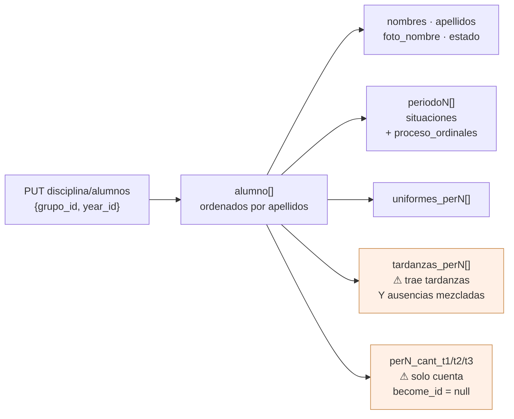
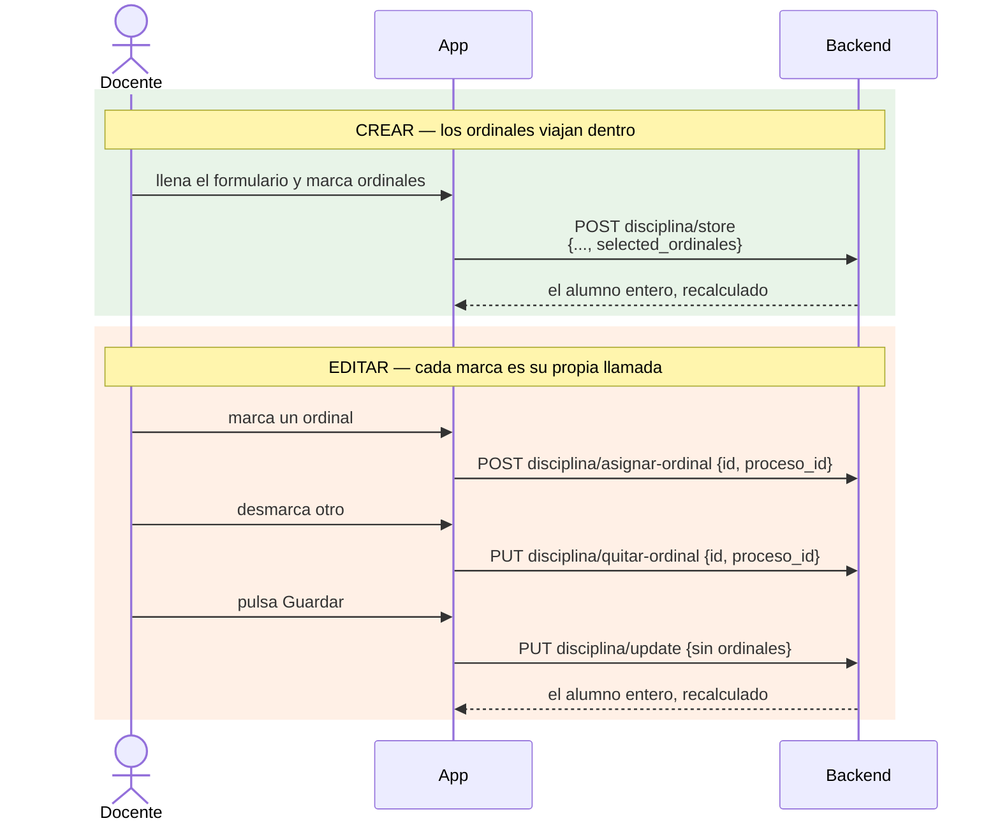
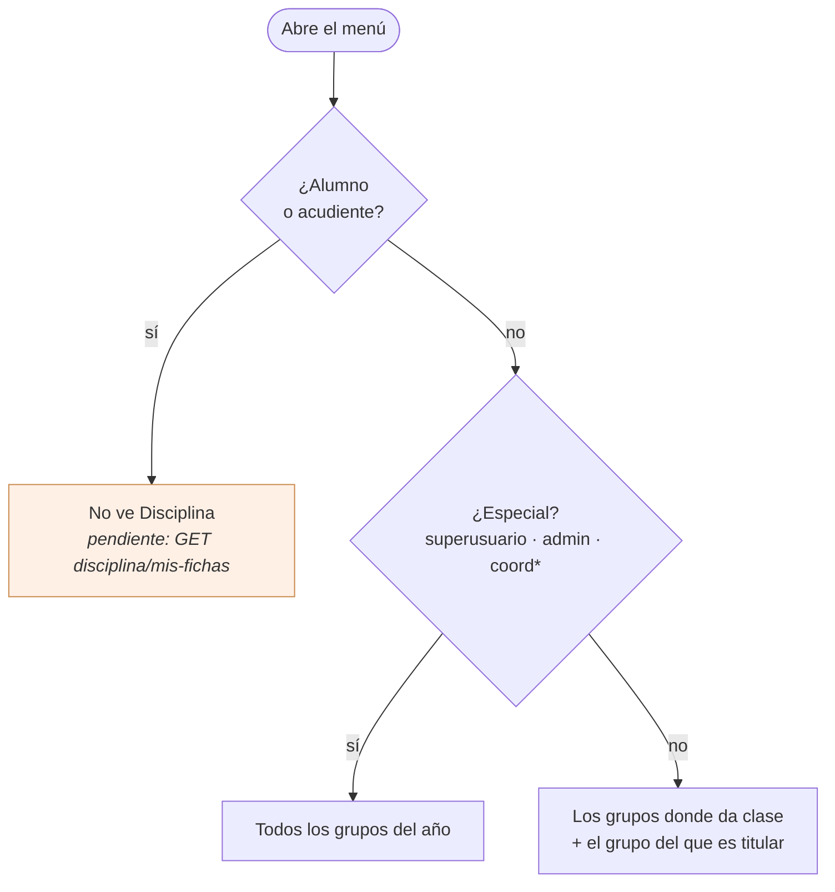
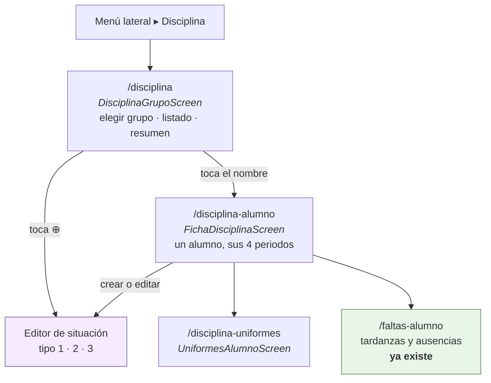
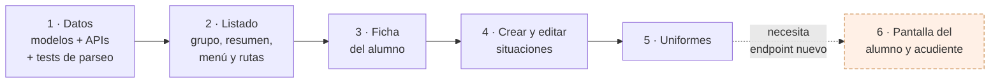

# Disciplina

Plan de la pantalla de disciplina en la app, traída de `/disciplina` del front web
(`myvc_front/app/scripts/comportamiento/`).

Los diagramas son [Mermaid](https://mermaid.js.org). Para verlos dibujados en VS Code,
extensión `bierner.markdown-mermaid` y vista previa con `⌘K V`; en GitHub se ven solos.

## Lo que hay al otro lado

**Carga inicial** — `PUT grupos/con-disciplina`, sin cuerpo, devuelve de golpe `year`,
`grupos` (todos), `config`, `ordinales` y `descripciones_typeahead`. Una sola llamada al
entrar.

**El grupo** — `PUT disciplina/alumnos {grupo_id, year_id}` devuelve los alumnos ya
ordenados por apellidos, cada uno con todo lo suyo de los cuatro periodos.



**Escrituras** — `POST disciplina/store`, `PUT disciplina/update`, `PUT disciplina/destroy`,
`POST disciplina/asignar-ordinal`, `PUT disciplina/quitar-ordinal`; los uniformes por
`PUT uniformes/agregar|actualizar|eliminar`. Las tres primeras devuelven **el alumno entero
recalculado**, que es con lo que se refresca la fila sin recargar el grupo.

Las tardanzas y ausencias a la institución ya las escribe esta app por `/ausencias/*`, y
`FaltasAlumnoScreen` ya lee `disciplina/alumnos`. Eso no se toca.

## Las trampas

Escritas aquí para no descubrirlas dos veces.

1. **`disciplina/update` no toca los ordinales.** Al editar hay que asignarlos y quitarlos al
   vuelo, uno a uno. Y el par no usa el mismo verbo: asignar es POST, quitar es PUT, y en los
   dos el ordinal viaja como `id` y el proceso como `proceso_id`.
2. **`proceso_ordinales` es la tabla pivote.** El id del ordinal es `ordinal_id`; su `id` es el
   de la fila pivote. Confundirlos deja la lista de ordinales vacía al abrir una situación ya
   guardada — es un error que ya se pagó en el front web.
3. **`perN_cant_tX` solo cuenta las situaciones con `become_id` nulo**, las que no fueron
   absorbidas por otra derivada. Hay que pintar ese contador, no `lista.length`.
4. **`tardanzas_perN` miente en el nombre**: filtra por `entrada=1` pero no por tipo, así que
   ahí vienen tardanzas y ausencias mezcladas. `TipoFalta.soloDelTipo` ya las separa.
5. **El profesor viaja como objeto**, `{profesor_id: N}`, no como id suelto. Un id suelto se
   guarda como `null` sin avisar.
6. **`disciplina/destroy` usa el año del usuario**, no el que se le mande.
7. **Los uniformes exigen `pueden_editar_notas`**: con el periodo cerrado para docentes
   responden 400. `mensajeDeFallo` de `lib/Http/FaltasApi.dart` ya lo traduce.
8. **Los nombres de los tres tipos son del colegio**, no nuestros: `falta_tipoN_displayname`
   en singular para los botones, `faltas_tipoN_displayname` en plural para los títulos. Nunca
   «Tipo 1» a pelo.
9. **`grupos/con-disciplina` devuelve todos los grupos.** El filtro por docente es del cliente.

### La trampa de los ordinales, en detalle

Crear y editar no se parecen, porque el `update` del backend ignora los ordinales.



## Quién ve qué



- **Especial** — `isSuperuser`, rol `admin`, o cualquier rol que empiece por `coord`. Va como
  getter `esEspecial` en `lib/Http/AuthService.dart`, al lado de `esAdmin`.
- **Docente** — los grupos donde tiene asignatura (`GET asignaturas/listasignaturas`, que la
  app ya usa en Unidades) más aquel del que es titular (`titular_id == personaId`, dato que ya
  viene en `grupos`).
- **Alumno y acudiente** — no entran. Ver «Lo que queda pendiente».

## Navegación

Una opción nueva en el menú lateral, **Disciplina**, visible solo para el personal.



El año y el periodo salen de la barra de arriba (`TituloContexto`), como en Unidades: un
selector propio sería un segundo sitio para lo mismo y una forma de que discrepen.

## Las pantallas

### DisciplinaGrupoScreen

```
┌───────────────────────────────────────────┐
│ ☰   2026 · Periodo 3 ▾                 ⟳  │
├───────────────────────────────────────────┤
│ Grupo   [ 10-B · Décimo B              ▾ ]│
│ Buscar  [ 🔍                             ]│
├───────────────────────────────────────────┤
│ ⬤  ACOSTA PÉREZ, Ana                  ⊕ ⌄ │
│     P1 3  ·  P2 0  ·  P3 9  ·  P4 —       │
│   ┌─ Periodo 3 ──────────────────────────┐│
│   │ 👕 2    ⏰ 5    🚫 1                  ││
│   │ Leves 3   Graves 1   Gravísimas 0    ││
│   └──────────────────────────────────────┘│
├───────────────────────────────────────────┤
│ ⬤  BOLAÑO DÍAZ, Luis                  ⊕ ⌄ │
│     P1 0  ·  P2 1  ·  P3 2  ·  P4 —       │
└───────────────────────────────────────────┘
```

La tira de los cuatro periodos siempre visible, con el total de cada uno. En la web son cuatro
columnas de tabla, una al lado de otra; en un teléfono no caben. El chevron despliega en la
propia tarjeta los seis contadores por tipo del periodo tocado —uniforme, tardanza, ausencia y
los tres tipos de situación, con el nombre que les da el colegio—, y cada contador abre su
detalle. El nombre lleva a la ficha del alumno; el `⊕` crea una situación en el periodo de la
barra.

### FichaDisciplinaScreen

El alumno del año entero: cuatro secciones desplegables, una por periodo, y dentro las
situaciones agrupadas por tipo, con su fecha, descripción, docente, testigos, descargo, quién
la registró y los ordinales resueltos contra el catálogo. Desde aquí se crea, se edita y se
borra. Los uniformes y las tardanzas/ausencias del periodo se enseñan resumidos y se abren en
su pantalla.

### El editor de situación

Todo lo que ofrece el modal del front web, con los controles de esta app:

| Dato | Control |
|---|---|
| Tipo 1 / 2 / 3 | `SegmentedButton` con los nombres de `config` |
| Descripción | campo con sugerencias sobre `descripciones_typeahead` |
| Fecha | `showDatePicker`, como en el resto de la app |
| Testigos, descargo | texto |
| Profesor | `CampoDocente` — el de las fotos, no un dropdown |
| Ordinales | `CampoOrdinales`, abajo |

**El control del ordinal** es el `ui-select multiple` de la web traducido: el campo enseña los
elegidos como chips (`tipo - ordinal. descripción`); al tocarlo se abre una hoja inferior a
pantalla casi completa con un buscador arriba y la lista del manual de convivencia con
casilla, filtrando según se escribe. Los ordinales son de solo lectura: aquí se eligen, no se
crean ni se editan.

### UniformesAlumnoScreen

Las fallas del periodo, cada una con su fecha y hora y sus marcas —sin cámara, contrario, sin
uniforme, incompleto, cabello, accesorios, excusado— más la descripción. Crear, editar y
eliminar. Las marcas van como `FilterChip`, que es lo que eran los `btn-checkbox` de la web.

## Los archivos

**Nuevos**

- `lib/Models/ConfigDisciplinaModel.dart` — los nombres de los tres tipos y los umbrales
- `lib/Models/OrdinalModel.dart`
- `lib/Models/SituacionModel.dart` — `dis_procesos` con sus ordinales resueltos
- `lib/Models/UniformeModel.dart`
- `lib/Models/AlumnoDisciplinaModel.dart` — el alumno con sus cuatro periodos
- `lib/Http/DisciplinaApi.dart`
- `lib/Http/UniformesApi.dart`
- `lib/Widgets/SelectorGrupo.dart` — `CampoGrupo` + hoja con buscador
- `lib/Widgets/SelectorOrdinales.dart` — `CampoOrdinales`
- `lib/Widgets/CampoConSugerencias.dart` — el typeahead de la descripción
- `lib/Screens/DisciplinaGrupoScreen.dart`
- `lib/Screens/FichaDisciplinaScreen.dart`
- `lib/Screens/SituacionEditorScreen.dart`
- `lib/Screens/UniformesAlumnoScreen.dart`

**Tocados** — `lib/Http/AuthService.dart` (`esEspecial`), `lib/Menu/MenuLateral.dart` (la
opción), `lib/Screens/RouteGenerator.dart` (tres rutas).

**Reutilizados sin tocar** — `AvatarPersona`, `CampoDocente`, `ControlOcupado`,
`TituloContexto`, `SelectorDia`, `FechaServidor`, `JsonBackend`, `TipoFalta`, `mensajeDeFallo`.

## Las fases



## Lo que queda pendiente

**La pantalla del alumno y del acudiente.** Necesita un endpoint que hoy no existe. Se
comprobó: en todo el backend solo cuatro controladores tocan `dis_procesos` —`Disciplina`,
`Comportamiento`, `NotaComportamiento` y `Grupos`— y todas sus rutas llevan `auth.personal`,
que aborta con 403 a `Alumno` y `Acudiente`. El único endpoint de notas abierto a ellos,
`GET notas/alumno/{id}` con la guarda `boletin.propio`, trae por periodo las asignaturas, sus
ausencias de clase y `nota_comportamiento` —que es **la nota**, no las fichas—. Uniformes y
tardanzas de institución, igual de cerrados.

Hace falta algo como `GET disciplina/mis-fichas`: solo las situaciones del propio alumno con
sus ordinales ya resueltos, sin los cuarenta compañeros, sin las notas y sin el boletín, con
una guarda de propiedad al estilo de `boletin.propio`. Cuando exista, la pantalla es corta: es
la ficha del alumno en modo lectura.

## Lo que se deja fuera a propósito

Los ordinales del manual (solo se leen), el botón «Ir a comportamiento», los informes e
impresión, los observadores, «Situaciones por grupo» y «Nombre inmovible» —un apaño de tabla
ancha que en un teléfono no significa nada—.

Y las **situaciones derivantes**: el mecanismo por el que tres tardanzas se convierten en una
falta tipo 1, con `dependencias` y `become_id`. Es el que más duele dejar fuera, porque los
contadores ya dependen de él; entra como fase 4b si se decide que sí.
