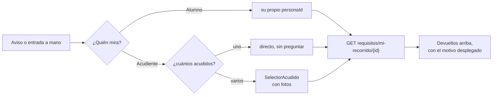

# Las estaciones de matrícula, desde la app

**Todo este documento es propuesta de diseño**, escrita el 20 de septiembre de 2026 sobre el
plan que ya existe: `myvc_front/INVESTIGACION-MATRICULAS.md` (el embudo y el modelo de datos)
y `myvc_front/PANTALLAS-MATRICULA.md` (las quince pantallas y los seis roles). Aquello puso
las estaciones **en `app2`, o sea en la web**. Esto contesta la pregunta que quedaba:
**cómo atiende una estación alguien que solo tiene el teléfono en la mano.**

**Maqueta navegable de las doce pantallas:**
https://claude.ai/artifact/3fixY3xaQsjGT2V4LAWPbE

---

## 0. Por qué la estación tiene que ser la app y no la web

Lo contó Joseth y está citado en `PANTALLAS-MATRICULA.md` §0:

> *«Las siguientes estaciones están marcadas con números impresos. Cuando termina con la
> estación documentos, el profesor que atendió busca al alumno en el sistema y chulea el
> requisito "Documentos".»*

Quien atiende la estación 2 es **un docente de pie en un aula, con una fila delante y papeles
en la otra mano**. No tiene un computador; tiene el teléfono con el que ya toma asistencia.
La web de `app2` sirve para **armar** el recorrido y para el tablero del rector; no sirve para
el patio.

Y hay una consecuencia que no es de comodidad: **la app es una sola para los dieciséis
colegios** y una versión vieja convive meses (`docs/estado.md`). Lo que se diseñe aquí tiene
que funcionar cuando el colegio de al lado tiene otras estaciones, otros nombres y otro
número de pasos — y cuando el teléfono que lo abre es de hace tres versiones.

---

## 1. El recorrido del que atiende, en doce pantallas

Cada línea: **qué ve · qué toca · qué queda escrito · a quién le pasa el turno.**

| # | Pantalla | Quién | Qué pasa |
|---|---|---|---|
| 01 | **Elegir estación** | cualquiera del personal | El colegio configuró N estaciones; solo se abren las que esa persona puede cerrar. Se recuerda: mañana la app abre ahí |
| 02 | **Mi estación · me llegan** | el que atiende | La cola acumulada: los que cerraron la estación anterior y no han cerrado la mía. Arriba, tres cifras: atendidos, esperando, espera media |
| 03 | **Escanear la hoja de ruta** | el que atiende | El QR del papel que trae la familia. O se teclea el código (`2027-4K7M2`), que es el de `docs/migracion/41` |
| 04 | **La ficha en la estación** | el que atiende | Quién es, la barra de los N pasos, y **solo lo que cierra él** con los controles grandes |
| 05 | **Cerrar el paso** | el que atiende | Cumple · cumple con observación · devolver. Y **a quién se va a avisar, antes de confirmar** |
| 06 | **Devolver con motivo** | el que atiende | El motivo es obligatorio: sin texto el botón no se enciende |
| 07 | **Listo** | el que atiende | A qué estación pasa, dónde queda, qué le llegó a la familia, y **deshacer durante 8 segundos** |
| 08 | **El que llega salteado** | cualquier estación | «No lo atiendas todavía: le falta la 1». Lo dice la pantalla, no el profesor |
| 09 | **Sin señal** | el que atiende | Se sigue atendiendo. Lo marcado espera en el teléfono, y **se ve que espera** |
| 10 | **Buscar** | cualquiera del personal | Todo el colegio, no solo la cola: nombre, apellido, documento o código |
| 11 | **El recorrido completo** | cualquiera del personal | Los N pasos de esa persona con quién los cerró y cuándo. Solo lectura |
| 12 | **Las notas de cualquier estación** | cualquiera del personal | Lo que otras estaciones dejaron escrito de esa familia, en la suya o en cualquier otra, y dejar la propia |

---

## 2. Las diez decisiones de diseño, y por qué

### 2.1 · La cola es una CONSULTA, no una bandeja de avisos

Es la decisión que sostiene todas las demás. La cola de la estación 3 no se llena con los
mensajes que le manda la estación 2: **se calcula** —«los que tienen cerrado el paso 2 y
abierto el 3»— cada vez que se pide.

La diferencia se ve el día que algo falla. Una bandeja de avisos con un aviso perdido deja a
una familia **invisible para siempre** y nadie sabe que falta; una consulta con un aviso
perdido deja a la familia en la fila **igual**, solo que la pantalla tardó en enterarse. Un
sistema que se repara solo contra uno que acumula agujeros en silencio.

Por eso la pantalla 02 no tiene «marcar como leído» ni nada que haya que vaciar: **no hay nada
que vaciar**, hay una pregunta que se vuelve a hacer.

### 2.2 · El aviso a la estación siguiente son DOS cosas, y hoy solo una es posible

**Medido el 20 sep 2026 en `pubspec.yaml`:** la app tiene `firebase_core` y
`firebase_analytics` y **no tiene `firebase_messaging`**. El lado del servidor sí está
—el endpoint de temas, el comando `notificaciones:enviar` y su disparo, desplegados desde el
25 ago (`98e6311`, ver `docs/estado.md`)—, pero **el lado Flutter no está empezado**, así que
hoy esta app **no puede recibir un push**.

Y hay un segundo hecho que importa más: **ese disparo va cada quince minutos**. Para avisarle
a un acudiente de que hay notas nuevas, quince minutos es perfecto. Para una fila en un patio,
quince minutos es no avisar.

Así que el aviso se parte en dos, y se dice cuál es cuál:

| | Qué es | Cuándo está |
|---|---|---|
| **La cola, dentro de la app** | La pantalla 02 vuelve a preguntar cada ~20 s mientras está abierta, y siempre al volver de marcar. Es lo que hace aparecer al recién llegado | **Es lo único que hace falta para que el día de matrículas funcione** |
| **El push** | Un tema por estación | ~~Entra ahora~~ → **NO ENTRA. Rectificado por Joseth el 20 sep 2026**, ver abajo |

> ## ⛔ RECTIFICADO EL 20 SEP 2026: EL PUSH INMEDIATO NO ENTRA
>
> **Esta casilla decía «Entra ahora» y mandaba a este repo a meter `firebase_messaging` en
> `pubspec.yaml` por ello. NO hay que hacerlo por esto.** Al ir a construir la mitad del
> servidor se destapó que **dos documentos se contradecían**, se le puso delante a Joseth y
> contestó: *«que llegue cuando tenga que llegar, no me voy a complicar con que le llegue de
> inmediato, por ahora no importa»*.
>
> **La contradicción, dicha entera porque el día que esto se retome ahorra la derivación:**
> `notificaciones.md` §«Cuándo se envía» prohíbe **publicar dentro de una petición** y lo
> prohíbe **con la medición hecha** —*«el docente espera a que Google responda»*—, mientras que
> lo que esta tabla pedía era exactamente eso. Y la prohibición tiene **dos motivos, de los que
> aquí sólo aplicaba uno, el peor**: el de *volumen* no aplica —cerrar un paso es **una** acción
> por familia, no treinta— pero el de *latencia* **aplica más fuerte**, porque quien atiende
> tiene una fila delante y está en un patio con mala señal.
>
> Había una salida que ninguno de los dos documentos contemplaba —**el cron ya entra cada
> minuto** en los dieciséis, y el cuarto de hora es una elección de Laravel cuyo motivo escrito
> es *agrupar las notas*, que no aplica a una estación— y aun así la respuesta fue que **la
> inmediatez no importa hoy**: contesta al problema en vez de a la solución.
>
> El porqué entero, con lo medido y lo que quedó sin medir, está en
> `8myvc/docs/migracion/46-las-estaciones-en-la-app.md` §5.3.
>
> **Lo que esto cambia para este repo, en una línea: nada de lo que hay que construir.** El
> orden de la §5 no se mueve —el push era el paso 5 y ahora no está— y las doce pantallas se
> hacen igual, porque **lo que sostiene el día es la cola sondeada**, no el push.
>
> **La cola sondeada sigue siendo la que sostiene el día**, y no por desconfianza: un push
> puede perderse, llegar tarde o estar apagado en los ajustes del teléfono, y la fila del
> patio no se puede parar por eso. El push **adelanta** el aviso; la cola **garantiza** que
> nadie se quede invisible. Construir solo el push sería volver a la bandeja de avisos que la
> §2.1 descarta.

**Preguntar cada 20 segundos no puede costar lo que cuesta pedir la cola.** El patrón ya
existe en esta casa y está medido: `GET sincronizacion/huella`
(`8myvc/docs/migracion/34-la-huella-de-sincronizacion.md`) contesta en **345 bytes** si algo
cambió, en vez de los 121 KB que costaba preguntarlo trayéndose los datos. La estación hace lo
mismo: sondea la huella, y **solo cuando se mueve** pide la cola de verdad. Con diez
estaciones abiertas ocho horas son 14.400 peticiones de 300 bytes al día — menos que abrir la
app dos veces.

> **El que se manda a una estación NO lleva el nombre del menor dentro.** Es la regla que ya
> está escrita en `notificaciones.md`: una notificación se ve en la pantalla bloqueada, con
> gente al lado. «Llegó alguien a tu estación» y se abre la app.

### 2.2 bis · Al acudiente se le avisa en CADA estación

**Decidido por Joseth el 20 sep 2026**, contra la otra opción que esta casa se planteó
—avisar solo cuando devuelven—. La familia sabe en todo momento dónde va y a dónde sigue, sin
preguntarle a nadie, que es justo lo que hace la fila más corta.

**Lo que eso obliga, dicho una vez y sin re-litigar:** son tantos avisos como estaciones tenga
el colegio, cinco mañanas de un sábado. El riesgo no es el volumen —FCM ni lo nota— sino que
la familia **aprenda a ignorarlos**, y entonces el que importa de verdad, el de la devolución,
llegue al mismo sitio que los otros cuatro. **Por eso el de devolución tiene que verse
distinto**: es el único que pide algo, y la pantalla 05 ya enseña su texto exacto antes de
confirmar (§2.3).

**Y el nombre sí va, el motivo no.** `notificaciones.md` permite nombrar al menor —*«Laura
tiene 4 notas nuevas»*— y prohíbe el contenido: aquí eso se traduce en *«Laura pasó a la
Estación 3 · Tesorería»*, y en *«Laura fue devuelta en Documentos»* **sin el motivo dentro**.
El motivo lo escribió un docente para que lo lea la familia (§2.4), pero se lee **abriendo la
app**, no en la pantalla bloqueada del bus.

### 2.3 · Antes de confirmar se enseña a quién se avisa

La pantalla 05 dedica un bloque entero a lo que va a pasar **después** de pulsar: a qué
estación pasa, en qué aula queda, cuántos hay delante y **el texto exacto** que le va a llegar
al celular de la mamá.

No es adorno. Quien atiende es responsable de lo que dispara y hoy no tiene forma de saberlo:
en la práctica se lo dice a la familia de viva voz y reza. Enseñar la consecuencia antes del
botón es lo que convierte «chulear un requisito» en «pasar a alguien a la estación 3».

### 2.4 · Devolver siempre lleva motivo escrito, y el botón lo hace cumplir

La pantalla 06 tiene el botón **apagado** hasta que hay texto, y lo dice: *«Sin motivo
escrito, el botón no se enciende»*. Arriba, en rojo: *«lo que escribas aquí lo lee la familia,
tal cual, en su celular»*.

Las tres frases de siempre —falta el certificado, la copia no se lee, falta la firma— son
botones, porque un motivo de un toque es un motivo que sí se escribe. Un desplegable de
motivos cerrados, no: el día que el caso no esté en la lista, se elige el más parecido y la
familia recibe una mentira.

### 2.5 · «Devuélvase a la estación 3» lo dice la pantalla, no el profesor

Pantalla 08. Hoy eso depende de que quien atiende mire bien la hoja; con fila detrás, no mira.
La banda roja ocupa el ancho entero **antes que la ficha**, con el número y el sitio: *«le
falta la Estación 1 · Recepción, en la portería»*.

Tres cosas de esa pantalla que no son evidentes:

- **No escribe nada en el paso.** Registra el intento, que es distinto: sirve para el tablero
  del rector —«en la 4 se presentan doce sin pasar por la 3, el cartel está mal puesto»— sin
  ensuciar el recorrido de la familia.
- **«Atenderlo de todas formas» existe y está apagado.** Un sistema que no puede saltarse su
  propia regla se salta por fuera, en papel, y entonces no hay registro de nada. Lo levanta
  Coordinación caso por caso, y **queda con el nombre de quien lo autorizó**.
- **Mandarlo a la 1 también avisa**: le entra a la cola de Recepción marcado como devuelto, y
  la familia recibe en el celular a dónde tiene que ir. Es el mismo mecanismo de la 2.1 en la
  otra dirección.

### 2.6 · «Marcado aquí» y «guardado» son dos estados distintos, y se ven distintos

Pantalla 09. El patio tiene mala señal y la jornada no se puede parar, así que se sigue
atendiendo con la marca guardada en el teléfono. Lo que **no** se puede hacer es pintarla
igual que una guardada:

- reloj naranja = **marcado aquí, el servidor no lo sabe**
- chulo verde = **el servidor contestó**

Y la pantalla dice la consecuencia en una línea: *«la estación siguiente aún no lo ve: dile a
la familia a dónde va, no esperes al aviso»*. Un verde optimista ahorra un icono y cuesta que
alguien jure que marcó a un alumno que no está marcado.

### 2.7 · Deshacer, ocho segundos

Pantalla 07. En una fila, con dos hermanos apellidados igual, tocar el renglón de al lado pasa
todos los días. Un deshacer de ocho segundos es infinitamente más barato que una corrección de
auditoría, que necesita a alguien con permisos y un rato de teléfono.

Pasados los ocho segundos, corregirlo es **devolver el paso con motivo**, que deja rastro —que
es lo correcto: ahí ya hay otra estación que lo vio.

### 2.8 · Los nombres y los números de las estaciones vienen del servidor. Siempre

*«Todo esto es personalizado por el colegio»* — Joseth. Un colegio tendrá cinco estaciones y
otro tres; uno llamará «Académico» a lo que otro llama «Coordinación». **La app no cablea ni
un nombre ni un número**, y el día que el servidor mande un tipo de paso que esta versión no
conoce, lo pinta con el control genérico —cumple / devolver— en vez de romperse.

Es la regla de siempre de esta app, y aquí muerde más que nunca: **una sola app, dieciséis
colegios, y las versiones viejas viven meses**. Si el colegio no configuró estaciones, la
entrada del menú **no aparece** — no una pantalla vacía que parezca rota.

### 2.9 · Ver todo, cerrar solo lo tuyo

La 10 y la 11 son las que pidió la pregunta original: **buscar en todo el sistema**, no solo
en la cola. Cualquiera del personal puede mirar el recorrido completo de cualquiera —es lo que
ya hace hoy quien se acerca a preguntar «¿y mi hija en qué va?»—, y la ficha se abre en modo
lectura con una línea que lo dice: *«tú atiendes Documentos, y ella ya lo pasó. Cerrar la 4 le
toca a Orientación»*.

**Ver no es cerrar.** Y esa frase hay que hacerla cumplir en el servidor, no en la pantalla:
la app es una sola para dieciséis colegios y el guard de la ruta es lo único que de verdad
protege.

> **Leído al fundir (20 sep):** esta sección se escribió sin la respuesta de Joseth delante, y
> la respuesta la cambia. **Cierra cualquiera del personal** —*«pero queda con su nombre y su
> hora»*—, así que **el 403 por rol no existe** y `rol_id` se descartó con motivo escrito
> (`8myvc/docs/migracion/44-el-dia-de-matriculas.md` §2, ya desplegado). Lo que protege el paso
> es lo que este diseño ya traía: **la firma visible, el deshacer de ocho segundos y el motivo
> escrito que lee la familia**. Para la pantalla eso significa que **04 y 11 no se abren en
> sólo-lectura por no ser tu estación** —se abren, y enseñan de quién es el paso y quién lo
> cerró—. Lo que sigue abierto es si eso vale también para **resolver** una nota pendiente
> (§2.10, regla 2), donde este documento pide el dueño de la estación y el dueño ya no existe
> como concepto.

### 2.10 · El globo de notas sale en cualquier estación, haya llegado o no

*«Puede ser que se adelante el tesorero a poner una nota antes de empezar el proceso»* —y eso
no es un caso raro: es **lo más útil que puede pasar**. El tesorero sabe el lunes que esa
familia tiene un saldo pendiente; la estación 5 la ve el sábado. Entre esas dos fechas la
información existe y no la ve nadie.

Por eso la barra de pasos lleva un **globo de conversación con un número**, flotando sobre el
círculo de **cualquier** estación —la 1, la 4 o la 5, esté cerrada, en curso o sin empezar— y
lo ve quien sea que esté mirando la ficha, aunque no atienda esa estación. Quien atiende
Documentos tiene que poder ver que Tesorería escribió algo en la 5 **antes** de mandar a la
familia a hacer cuatro colas.

**Dos colores y una forma, y la forma es la que manda:**

| | |
|---|---|
| Globo **pizarra** `#2B2740` | hay algo escrito ahí. Léelo cuando puedas |
| Globo **ámbar** `#B26A00` | hay algo **sin resolver**. Léelo antes de seguir |

El globo se distingue de los cuatro estados del paso **por su silueta**, no por su color:
ninguno de los otros indicadores de esta pantalla tiene forma de bocadillo. Y el número nunca
va solo: debajo de la barra, la misma información en palabras —*«Tesorería dejó 2 notas en la
5, una sin resolver»*— que es lo que se lee de verdad con sol en la cara. En la cola y en la
búsqueda el mismo globo va sobre la foto y sobre el punto de la estación, con su chip de texto
al lado.

**La nota no le avisa a nadie: espera ahí.** *«Espera ahí»* —Joseth, 20 sep 2026—. Es la
decisión barata y es la correcta: el globo ya hace el trabajo. Quien abra la ficha lo ve, y lo
ve **cualquiera**, no solo la estación anotada (§2.10), así que el saldo que el tesorero
escribió el lunes lo encuentra el sábado el primero que atienda a esa familia. Un aviso
añadiría ruido a un canal —el del personal— que el día de matrículas ya está lleno, y su única
ventaja sería adelantar unas horas algo que **nadie puede resolver hasta que la familia
llegue**.

**Cuatro reglas que hacen que esto no se convierta en un chat:**

1. **Escribe cualquiera del personal, en cualquier estación.** Es la contrapartida exacta de
   §2.9: ver todo, escribir una nota en cualquier paso, **cerrar solo el tuyo**.
2. **Resolver una nota pendiente: quien la escribió, o Admin, Secretario o Rector.**
   **Decidido por Joseth el 20 sep 2026**, y sustituye a lo que este documento pedía —«el
   dueño de esa estación»—, que ya no existe: desde que cerrar un paso lo puede hacer
   cualquiera del personal (§2.9), **la estación no tiene dueño**. Los tres roles existen tal
   cual en la tabla `roles` —`Admin` (1), `Rector` (10), `Secretario` (12)—, así que la regla
   es comprobable y no hay que inventar un concepto nuevo para sostenerla.

   Lo que protege sigue siendo lo mismo y ahora se sostiene mejor: **el aviso del tesorero no
   lo puede apagar el primero a quien le estorbe**, porque el que atiende la estación 5 no es
   ni quien la escribió ni ninguno de esos tres. Desde fuera se lee y se sigue; el botón de
   darla por resuelta aparece **apagado, con el motivo escrito** —*«esta nota la puso
   Tesorería; puede darla por resuelta quien la escribió, o Secretaría, Rectoría o un
   administrador»*—, que es lo que convierte un botón muerto en una instrucción.
3. **Una nota NO es el motivo de una devolución.** El motivo pertenece al paso, lo lee la
   familia y va en su propia columna (§2.4). La nota es **entre el personal** y la familia no
   la ve. Mezclarlas es la forma de que un comentario interno acabe en el celular de una mamá.
4. **Una nota reservada cuenta para el globo y no se lee.** Orientación tiene un campo que solo
   ven orientación y rectoría; el globo sale igual, con el candado y sin el texto. Es
   literalmente lo que ya pedía el plan del front: *«si hay algo que tesorería deba mirar, le
   llega la señal sin el texto»* (`PANTALLAS-MATRICULA.md`, pantalla 11). **Que el número
   incluya lo reservado es a propósito**: esconder que existe una nota es peor que esconder su
   contenido — quien no puede leerla sí puede ir a preguntar.

---

## 3. La forma, y por qué se ve así

- **El color de la app** (`kPrimaryColor`, `#6A62B7`) manda; el número de la estación va
  **grande y en blanco sobre él**, porque el cartel impreso del patio dice «2» y lo primero
  que hay que poder comprobar de un vistazo es que estás en la estación que crees.
- **Cuatro estados, y ninguno se distingue solo por el color**: cada uno lleva icono y
  palabra. Verde `#1E7A55` cumplido, ámbar `#8A4B00` en revisión u observación, rojo
  `#B8342A` devuelto o bloqueado, gris `#6E6B7B` pendiente. Es por el sol del patio y por
  quien no distingue el rojo del verde, que en un claustro de cincuenta docentes es uno o dos.
- **Objetivos de toque de 56 px** en todo lo que decide algo, y los destructivos separados del
  principal. Se toca de pie, con una mano, a veces con guantes de frío en tierra fría.
- **La barra de pasos es horizontal en la ficha** (de un vistazo, ¿dónde va?) y **vertical en
  la consulta** (con quién y cuándo, que es leer, no mirar).
- **La tipografía**: Archivo para los números y los títulos —sus cifras se leen de lejos— y
  Source Sans 3 para el texto. En la app se resuelve con el peso y el tamaño; lo de la maqueta
  es para que el diseño se lea en pantalla grande.
- **En tablet** esto es maestro-detalle, no una columna estirada: la cola a la izquierda y la
  ficha a la derecha. Es el «problema 2» de `docs/tablets.md` y **la estación es el caso donde
  más se nota**, porque la tablet del colegio es justo lo que hay en el patio.

---

## 4. Lo que el servidor tiene que poner, y lo que ya está

### 4.1 · Lo que ya existe, medido el 20 sep 2026

- **Las dos tablas de la lista de chequeo**, en
  `8myvc/database/schema/mysql-schema.sql`: `requisitos_matricula`
  (`year_id, orden, requisito, descripcion, editable_por_profe_id`) y `requisitos_alumno`
  (`alumno_id, requisito_id, estado` por defecto `'Falta'`, `descripcion, updated_by`).
- **Seis rutas** de `requisitos/*` con `auth.personal`
  (`8myvc/app/Http/Controllers/Matriculas/RequisitosController.php`).
- **La búsqueda de personas**: `PUT buscar/por-nombre` y `PUT buscar/por-apellido`, las dos
  con `auth.personal`. La pantalla 10 se apoya en ellas.
- **El código del formulario y su QR**: `docs/migracion/41-el-formulario-de-inscripcion.md`,
  diez rutas ya escritas y probadas. La pantalla 03 lee **ese** código, no inventa otro.

### 4.2 · Un aviso que hay que resolver antes de construir la 02

**`requisitos_alumno.estado` es un `varchar` sin vocabulario cerrado, y `postAlumno` escribe
tal cual lo que venga en el cuerpo.** Hoy el valor por defecto es `'Falta'` y lo demás lo
decide cada llamante — hay tres pantallas escribiendo ahí. Una cola que pregunta *«¿está
cerrado el paso 2?»* **no se puede construir encima de una columna cuyo conjunto de valores no
está fijado**: el día que una pantalla vieja escriba `'cumple'` en minúscula, la persona
desaparece de la fila de la estación siguiente y nadie se entera.

Es lo primero que hay que cerrar, y es del backend: **fijar los estados, migrar lo que haya
escrito y rechazar lo que no esté en la lista**. No es trabajo de esta app.

### 4.3 · El contrato que la app necesita — ocho rutas, PROPUESTA

Está escrito, con sus porqués y con lo que mueve, en
**`8myvc/docs/migracion/46-las-estaciones-en-la-app.md`**. En resumen:

```
GET  estaciones                     el recorrido del colegio y cuál atiendo yo
GET  estaciones/{n}/cola            los que me llegan
GET  estaciones/huella              ~300 bytes: ¿cambió algo?
GET  estaciones/alumno/{id}         la ficha: los N pasos + lo mío
GET  estaciones/codigo/{codigo}     lo mismo, por el QR de la hoja
PUT  estaciones/{n}/marcar          cumple | observación | devolver(motivo)
PUT  estaciones/{n}/enviar-a/{m}    el salteado: registra el intento y avisa
POST estaciones/{n}/nota            una nota en CUALQUIER estación, la tuya o no
```

Y **el globo necesita que el conteo viaje en lo que ya se pide**, no en una llamada aparte:
cada paso de la ficha trae `notas:{total, pendientes, reservadas}` y cada fila de la cola trae
`notas_total` y `notas_pendientes`. Una pantalla que tuviera que preguntar «¿y notas?» alumno
por alumno no dibujaría la cola: la dibujaría cuatro segundos después, en un patio con mala
señal.

**Ocho rutas son una decisión, no un efecto secundario**, y las autoriza Joseth con el precio
delante. Ninguna de las doce pantallas de aquí arriba se puede empezar antes de eso.

---

## 5. Por dónde se empieza

**Nada de esto depende de la pasarela ni del portal de la familia.** Del push **sí depende
ahora**, por decisión del 20 sep (§2.2), y por eso cambió el orden que este documento traía.
Es la Fase 1 de `INVESTIGACION-MATRICULAS.md` §9, rendida en el teléfono:

1. **El backend decide sobre qué se apoya la cola.** El plan decía *«cerrar el vocabulario de
   `estado`»* y sigue haciendo falta, pero **medido el 20 sep hay un camino más corto**:
   `AlumnosController:899` inserta `"falta"` en minúscula mientras el defecto de la tabla es
   `'Falta'` con mayúscula —o sea que **el desacuerdo ya existe hoy**—, pero `cerrado_at`
   **ya está desplegado** y `postAlumno` lo escribe comparando en minúsculas, así que es
   inmune a eso. Una cola que pregunte `cerrado_at IS NOT NULL` no se rompe con una pantalla
   vieja; una que pregunte `estado = 'Cumple'` sí.

   **Con una trampa que hay que cerrar antes de fiarse**: `cerrado_at` se escribe con
   `COALESCE`, o sea **una sola vez**. Si alguien reabre un paso, la fecha se queda puesta y
   la cola creería que sigue cerrado. Limpiarla al reabrir es una línea; migrar el vocabulario
   de dieciséis colegios es un trabajo. **Las dos cosas son del backend**, pero ya no están
   empatadas.

   De las columnas que este documento pedía, **`bloquea` ya está** (migración
   `2026_09_20_300000`) y **`estacion_nro` y `rol_id` se descartaron con motivo escrito**: el
   número impreso **es** `requisitos_matricula.orden`, y no hay rol porque cierra cualquiera
   del personal.
2. **Las ocho rutas** (§4.3) y la tabla de notas, con el permiso de resolver que dice §2.10.
3. **Pantallas 01, 02, 04, 05, 07** — con eso ya se atiende una estación entera, y el día de
   matrículas funciona.
4. **06, 08** — el motivo y el salteado, que son las que ahorran el tiempo de verdad.
5. ~~**El push**~~ — **FUERA, rectificado el 20 sep 2026** (§2.2). No hay que meter
   `firebase_messaging` por esto. *Y el orden no se resiente, que es lo que demuestra que
   estaba bien puesto: iba **después** de que la cola funcionara porque la cola es lo que
   garantiza que nadie se quede invisible — así que quitarlo no deja ningún hueco.*
6. **12 y el globo** — las notas entre estaciones. Va aquí y no antes porque **la nota sin la
   cola no sirve de nada**, y la cola sin notas sí: se puede atender un día entero sin ellas.
7. **09** (sin señal), y **03** con el código tecleado.

### Lo que este orden daba por supuesto y era falso: 10 y 11 no esperaban a nada

Estaban las últimas de la lista, y **se escribieron el mismo día que las primeras**. El motivo
es que ninguna de las dos usa las nueve rutas: **buscar** se apoya en `PUT buscar/por-nombre` y
`por-apellido`, desplegadas desde mucho antes, y **el recorrido** en
`GET requisitos/recorrido/{alumno_id}`, entregada el 20 sep. O sea que van detrás de **su
propio interruptor** y pueden encenderse meses antes que el resto.

Y eso no es un detalle de orden: son **las dos que contestan «¿y mi hija en qué va?»**, que era
la mitad de la pregunta con la que nació este documento. Se puede tener eso funcionando **sin
nada del día de matrículas montado**, un lunes cualquiera en secretaría.

**La lección, para el próximo plan:** el orden se escribió suponiendo que todo el módulo
esperaba a lo mismo, y no era verdad. Lo que se puede encender solo hay que buscarlo **antes**
de ordenar, no después.

### Y el escáner no entra por ahora — decidido el 20 sep 2026

La pantalla 03 tiene dos mitades y **solo una cuesta**: teclear el código
(`2027-4K7M2`, el del formulario de inscripción) no cuesta nada; **la cámara cuesta los
permisos de las dos tiendas**. Hoy esta app no pide cámara en ninguna, y meterla añade
`android.permission.CAMERA` a la ficha de Play —que los dieciséis colegios ven cambiar— y
`NSCameraUsageDescription` en iOS, sin el cual la app **se cae** al abrir la cámara.

**Y una trampa que no avisa**: los paquetes de escáner añaden solos un
`<uses-feature android:name="android.hardware.camera">`, y sin `required="false"` explícito
**Play deja de ofrecer la app a los aparatos sin cámara**. No falla nada, no llega ningún
aviso: se desaparece de algunas tablets —que es justo el aparato del patio—.

Así que **la 03 se escribirá con el código tecleado y sin cámara**, y el escáner es una
decisión aparte con ese precio delante. El detalle entero, en
[seguridad-datos-play.md](seguridad-datos-play.md).

## 6. Lo que falta decidir, y no lo decide esta app

**Las tres primeras se contestaron el 20 sep 2026 y quedan aquí tachadas, no borradas**: lo
que se decidió se lee mejor al lado de la alternativa que se descartó.

1. ~~**¿Quién puede atender una estación?**~~ — **cualquiera del personal**, firmado con
   nombre y hora (§2.9). Y su cola, **quién resuelve una nota pendiente**, también:
   **quien la escribió, o Admin, Secretario o Rector** (§2.10).
2. ~~**¿Se avisa al acudiente en cada estación, o solo cuando lo devuelven?**~~ — **en cada
   estación** (§2.2 bis). Con el nombre dentro y **sin el motivo**.
3. ~~**¿Cuántas estaciones tiene un día de matrículas típico y cómo se llaman?**~~ — **las que
   el colegio quiera**: es un editor de pasos, no un diagrama grabado en el código
   (`8myvc/docs/migracion/44-el-dia-de-matriculas.md` §2). Para la barra de §3 eso no es una
   respuesta cómoda: significa que **tiene que aguantar un número que no conocemos**, así que
   se diseña para desplazarse y no para cinco.
4. ~~**¿La estación la atiende un teléfono o la tablet del colegio?**~~ — **las dos**,
   decidido el 20 sep 2026. Y eso **no es la respuesta cómoda**: si fuera solo teléfono, el
   maestro-detalle de §3 sería una mejora que se deja para luego; con las dos, **pasa a ser
   requisito** (`docs/tablets.md`, problema 2).

   Lo que obliga, en concreto: a partir de `Anchos.maestroDetalle` (900 px) la cola y la
   ficha **se ven a la vez**, la lista a la izquierda con `Anchos.maestro` (380) y el detalle
   a la derecha, **sin navegar**. Por debajo de 900 no cambia nada. Es el mismo patrón que ya
   usan `LibroAsignaturaScreen` y `MisCompetenciasScreen`, así que no hay que inventarlo.

   **Y aquí muerde más que en el libro de notas**: quien atiende tiene una fila delante, y en
   una columna estirada cada persona de la cola cuesta ir y volver. En maestro-detalle,
   tocar el siguiente de la fila es un toque y el recorrido ya está a la derecha.

**Ya no queda ninguna abierta.** Las cinco preguntas con las que nació este diseño están
contestadas.

---

## 7. La pantalla trece, que no es del que atiende: «Mi proceso»

**Escrita el 20 sep 2026, apagada tras `Interruptores.miMatricula`.**

Las doce de la §1 son todas del personal. Ésta es la primera de la familia, y es **la que
cierra el círculo que el §2.2 dejó abierto**: el aviso dice *«Laura fue devuelta en
Documentos. Abre la app para ver por qué»* y **no lleva el motivo dentro**, a propósito.
El motivo lo escribió un docente para que lo lea la familia, y hasta hoy no había dónde
leerlo.

> **Un aviso que apunta a una pantalla que no existe es peor que no avisar**, porque enseña
> que los avisos no sirven. Eso valía aunque el push esté descartado: al acudiente se le va
> a contar de todas formas, y «entra a la app» tiene que llevar a alguna parte.



### 7.1 · Por qué NO reutiliza la pantalla del personal

«Mi disciplina» sí reutiliza la del personal en sólo lectura, y allí fue lo correcto:
`disciplina/mis-fichas` devuelve **la misma forma** que la ruta del personal, así que una
sola pantalla no puede desincronizarse.

Aquí el servidor devuelve **otra cosa, y aposta**. `getMiRecorrido` no manda la observación
interna ni quién cerró cada paso, y lo dejó escrito: *«un `if ($esFamilia)` dentro del otro
habría puesto las dos respuestas en un solo sitio, y el día que alguien añada un campo
tendría que acordarse de que hay un lector que no puede verlo»*. **Reutilizar la pantalla
desharía en el cliente la separación que el servidor sostiene.**

### 7.2 · Las dos trampas del contrato, que ya mordieron una vez

| | |
|---|---|
| **`descripcion` está en DOS tablas** | `requisitos_matricula.descripcion` es **qué le piden** a la familia y sí viaja; `requisitos_alumno.descripcion` es la **observación interna** y viaja solo a la ruta del personal, con el alias `observacion`. Confundirlas le enseñaría a una madre una nota escrita entre docentes |
| **`cumplido` no se deduce** | lo calcula el servidor con `marca_id != null && cerrado_at != null`, **no desde `estado`**, porque `estado` lo escriben tres pantallas con tres vocabularios. Esta app ya se quemó con `falta` contra `Falta` |

Las dos están sujetas con pruebas en `test/mi_matricula_test.dart`.

### 7.3 · Tres cosas pequeñas que se decidieron al escribirla

1. **Con un solo acudido no se pregunta de quién.** Preguntar cuando solo hay una respuesta
   es una pantalla de más entre el aviso y el motivo. Con dos o más sí, con el selector de
   fotos que ya usan «Mis notas» y «Mi disciplina».
2. **El motivo va desplegado, no detrás de un toque.** Quien abre esto viene de que le
   dijeran que algo pasó; hacerle buscar dónde es cobrarle dos veces el mismo susto.
3. **Un paso devuelto SIN motivo escrito no se queda mudo**: dice que no quedó escrito y
   manda a la secretaría. Un hueco en blanco parece un fallo de la app, y no lo es.

### 7.4 · El id no es opcional, y aquí se separa de sus hermanas

`disciplina/mis-fichas/{alumno_id?}` deja no mandar nada y el backend resuelve del token.
**`mi-recorrido` no**: declara `{alumno_id}` sin `?` y arranca con `abort(422)` si no es
numérico. Así que **hasta un alumno mirando lo suyo manda su propio `personaId`** —el de la
ficha, no el de la cuenta—.

### 7.5 · Su interruptor es el tercero, y no podía colgarse de los otros dos

| interruptor | qué espera |
|---|---|
| `estaciones` | las nueve rutas del personal — **ya en `origin/main`** |
| `recorridoDeMatricula` | `requisitos/recorrido` — **ya en `origin/main`** |
| `miMatricula` | `requisitos/mi-recorrido` — entró en el merge `74d5028`, **después** |

Colgarla de cualquiera de los otros la encendería contra una ruta que todavía puede dar
404, y un 404 dentro de la app se lee como «esto está roto».
