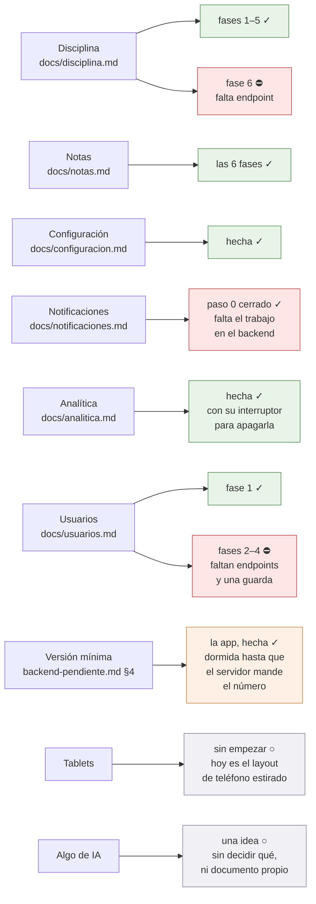

# Dónde va todo, y qué sigue

El mapa para retomar el trabajo sin que nadie tenga que contar nada. Se
actualiza en el mismo commit que cambia el estado que describe: si esta página
miente, es un fallo tan real como una prueba en rojo.

**Última actualización: 25 de agosto de 2026.** **Todo lo construido está
fusionado en `main`, empujado a `origin` y no queda ninguna rama suelta**: las
fases 4, 5 y 6 de notas, la configuración, la analítica, la pantalla de
usuarios, la versión mínima y el 422 de la escala.
Los tres frentes viejos esperan al backend. **[La analítica](analitica.md) está
hecha entera** —Firebase, los eventos, el interruptor para apagarla y la
política de privacidad reescrita—; de ella solo queda un ajuste de consola. Lo
recién abierto es **[la pantalla de usuarios](usuarios.md)**: su fase 1 está
hecha y lo demás espera ocho cosas del servidor.

## Los frentes abiertos

✓ hecho · ○ pendiente y se puede hacer ya · ⛔ bloqueado por algo de fuera

## Qué sigue, en orden

**No queda trabajo de app que no espere a nadie.** De la analítica solo falta
una cosa, y es de consola: confirmar en Analytics que la retención a nivel de
usuario está en dos meses, que es lo que promete la política de privacidad.

Los otros frentes —la pantalla de disciplina del alumno, las notificaciones y
lo que le falta a la de usuarios— necesitan trabajo en el backend, y el backend
es de solo lectura para esta app. Ver «Lo que está bloqueado». Cuando se
desbloquee alguno, el orden es:

1. **Disciplina, la pantalla del alumno y del acudiente**, en cuanto exista
   `GET disciplina/mis-fichas`. Es corta: la ficha del alumno en modo lectura.
2. **Notificaciones**, en cuanto estén las tres piezas del servidor. El paso 0
   ya está cerrado, así que se entra directo por el tipo más tonto, el del
   muro, para probar la tubería entera antes de llenarla.
3. **Usuarios, lo que le falta**, y por trozos según vaya llegando: cada cosa
   apagada tiene su interruptor y se enciende con una palabra. El primero no
   es un endpoint sino una guarda —la de `perfiles/guardar-username`—, y ese
   va por delante de todo porque es un fallo en producción y no una función
   que falte. Ver [usuarios.md](usuarios.md).

## Lo que está bloqueado, y por qué

Los tres primeros, con su contrato ya escrito y la evidencia que lo justifica,
están en **[backend-pendiente.md](backend-pendiente.md)**: es lo que hay que aprobar para
desbloquearlos, y está redactado para poder decidir sin volver a investigar. Ahí
está también lo contrario —**«Lo que la app necesita que NO se rompa»**—, con el
mínimo de `contratos` para alumno y acudiente, que el backend está a punto de
recortar por seguridad.

- **Disciplina, la pantalla del alumno y del acudiente.** Hace falta un
  `GET disciplina/mis-fichas` que hoy no existe: todas las rutas que tocan
  `dis_procesos` llevan `auth.personal`, que a un alumno le responde 403. El
  detalle, en [disciplina.md](disciplina.md) → «Lo que queda pendiente».
- **Notificaciones.** Cuelgan de tres cosas del servidor: un endpoint de temas,
  un comando de artisan y una entrada de cron. **El paso 0 está cerrado y las
  cuatro comprobaciones salieron bien** (23 ago 2026): el hosting sale por HTTPS
  a Google, ejecuta artisan (Laravel 13.26.1 sobre PHP 8.4.24 en
  `/usr/local/bin/php`) y **el cron dispara**, comprobado con una tarea de
  prueba. El plan B sin push queda descartado. Lo que falta es escribir las tres
  piezas, y eso es trabajo de backend. Ver
  [notificaciones.md](notificaciones.md) → «Lo comprobado en el servidor».
- **Un `PUT notas/lote`.** No existe y es la mejora de carga más grande de todo
  el plan: no solo convierte treinta peticiones en una, sino **treinta agregados
  de la asignatura entera en uno**. Cada `notas/update` recalcula la definitiva,
  y ese recálculo agrega toda la asignatura antes de quedarse con un alumno. El
  contrato, en [backend-pendiente.md](backend-pendiente.md).
- **Usuarios, todo menos la fase 1.** Ocho cosas del servidor —el último acceso,
  los roles por lista, «Otros», dos masivas por grupo y tres columnas que
  faltan—, **todas sin autorizar todavía**. Y dos que no eran funciones sino
  arreglos, **ya escritas en el backend y sin desplegar**: la guarda de
  `PUT perfiles/guardar-username/{id}` —que hoy deja a cualquiera de los 51
  docentes renombrar cualquier cuenta, la de un superusuario incluida— y el
  alcance de `alumnos/cambiar-claves`, que le cambiaba la contraseña también a
  los retirados del grupo y a las cuentas borradas. **Nada se enciende en la app
  hasta que esté en los dieciséis colegios**, que no es lo mismo que escrito. El
  contrato entero, en [usuarios.md](usuarios.md) → «Lo que falta en el
  servidor».

### El 422 de la escala — hecho, y esperando al servidor

La escala de notas **pasa a validarse en el servidor**: `PUT notas/update` y la
definitiva manual contestarán **422** donde hoy dan 200, con el motivo dentro
del cuerpo, y en `notas/lote` el mismo texto vuelve en `fallidas[].motivo`.

El lado de la app ya está: los dos sitios que enseñaban «El servidor respondió
422.» ahora enseñan lo que el servidor dijo, y lo traduce un solo sitio,
[MensajesDelServidor](../lib/Http/MensajesDelServidor.dart). Sus dos recortes no
son cosméticos —descarta la página de error en HTML y los volcados de excepción,
que son JSON válido con `message` dentro— y tienen prueba cada uno.

**Falta desplegarlo en el servidor**, y antes de eso conviene una comprobación
que no es de código: el backend midió **92 notas fuera de rango en su base
local**, todas de los años 1 a 5 y ninguna en los cuatro recientes. Si eso se
sostiene en producción, encender la validación no le rompe el día a nadie. Una
nota histórica que ya no se puede volver a guardar es distinta de una que se
escribe hoy, así que merece mirarse contra la base real.

### Un agujero de la versión mínima, sin decidir

**Un colegio que suba `version_minima_app` no bloquea a nadie que ya tenga
sesión guardada** — y ésa es la gente que usa la app todos los días.

Al arrancar, `restaurar()` lee el cuerpo de `/login` **guardado en disco** la
última vez que esa persona tecleó su contraseña; la comprobación del token se
hace con `GET /years` y no con `/login`, a propósito, porque el login está
limitado a cinco por minuto y por IP. Y la app **no refresca**: no hay ninguna
llamada a `auth/refresh`, así que el punto por el que la API entrega un mínimo
nuevo sin que el usuario salga y vuelva no lo ejerce nadie desde aquí.

Salió el 24 ago 2026 al confirmarle el contrato a la sesión de la API, que
había escrito un caso de prueba dando por cubierto ese camino.

**La decisión es de Joseth**, porque el arreglo cuesta una petición más en algún
sitio y eso es justo lo que este proyecto evita en un hosting compartido. Las
opciones: volver a guardar el cuerpo de `/login` cada cierto tiempo, o releer el
mínimo dentro de alguna llamada barata que ya se haga. Mientras tanto, la puerta
existe pero **sólo se cierra en la cara de quien vuelve a entrar**.

## Cómo se trabaja aquí

- **Rama por frente**, con el nombre de lo que hace: `feat/disciplina`,
  `feat/notas`. Un commit por fase, con el porqué en el cuerpo del mensaje.
- **El backend es de solo lectura.** Vive en `~/DESARROLLOS/8myvc` y se lee para
  saber qué devuelve cada endpoint; nunca se edita. Lo que haga falta allí se
  anota en el documento del frente y se pide.
- **Cada plan vive en `docs/`**, con sus diagramas en Mermaid dentro del propio
  `.md`, y se pone al día en el commit que lo cambia.
- **Las trampas del backend se escriben con su prueba al lado.** Los listados se
  arman con `DB::select` y SQL a pelo, así que los tipos los decide PDO: el lado
  Flutter lee el JSON con [JsonBackend](../lib/Utils/JsonBackend.dart) en vez de
  fiarse.
- **Probar en web contra un colegio de verdad pide bajar el CORS.** Los
  servidores solo permiten su propio origen —`access-control-allow-origin:
  https://demo.micolevirtual.com`—, así que desde `localhost` el navegador
  bloquea la respuesta y la app enseña «No se pudo conectar», que es el mismo
  mensaje que da un servidor caído. Para que la prueba valga:
  `flutter run -d chrome --web-browser-flag="--disable-web-security"`. En el
  celular no pasa, porque ahí no hay navegador de por medio.
- **Antes de commitear**: `flutter analyze` sin avisos y `flutter test` en verde.
  Con `--concurrency=2` si la máquina va justa; a pelo se queda sin memoria.

## El estado de cada frente, en detalle

### Notas — [notas.md](notas.md)

| Fase | Qué | Estado |
|---|---|---|
| 1 | La sesión completa: [ConfiguracionColegio](../lib/Utils/ConfiguracionColegio.dart) | hecha |
| 2 | Asignaturas con filtro «Hoy» + tarjeta en el muro | hecha |
| 3 | La planilla del indicador (casos A y B) | hecha |
| 4 | La ficha del alumno (casos C y E) | hecha |
| 5 | Notas perdidas | hecha |
| 6 | Frases, historial, borrar nota | hecha |

El camino en la app: menú ▸ Notas → [NotasScreen](../lib/Screens/NotasScreen.dart)
→ [LibroAsignaturaScreen](../lib/Screens/LibroAsignaturaScreen.dart), que tiene
dos pestañas sobre el mismo libro ya cargado:

- **Por indicador** → [PlanillaScreen](../lib/Screens/PlanillaScreen.dart), el
  trabajo diario: una casilla y los treinta alumnos.
- **Por alumno** → [FichaAlumnoNotasScreen](../lib/Screens/FichaAlumnoNotasScreen.dart),
  el acudiente que pregunta y el nivelar de fin de periodo.

Dentro de las dos, manteniendo pulsada una nota se abre su historial y desde
ahí se borra ([HojaDetalleNota](../lib/Widgets/HojaDetalleNota.dart)).

Y aparte, menú ▸ Notas perdidas →
[NotasPerdidasScreen](../lib/Screens/NotasPerdidasScreen.dart): el árbol de lo
que llevan por debajo de la mínima, del año entero y en una sola petición.

### Disciplina — [disciplina.md](disciplina.md)

Fases 1 a 5 hechas, la 4b incluida. Falta solo la pantalla del alumno y del
acudiente, bloqueada por el endpoint que no existe.

### Configuración — [configuracion.md](configuracion.md)

Hecha: menú ▸ Configuración →
[ConfiguracionScreen](../lib/Screens/ConfiguracionScreen.dart). Se edita lo que
un directivo cambia estando de pie —siete ajustes— y lo demás se ve, con «lo
demás se configura en la plataforma web» al final. La ve todo el personal; los
interruptores solo los mueve un administrador, y eso es **alcance de la app, no
permiso del servidor**: sus endpoints llevan `auth.personal` y un docente
podría llamarlos.

### Notificaciones — [notificaciones.md](notificaciones.md)

Solo el plan, y bloqueado en el servidor. **El paso 0 está cerrado**: el
hosting sale a Google, ejecuta artisan y el cron dispara. Falta escribir el
endpoint de temas, el comando `notificaciones:enviar` y la línea de cron; el
lado Flutter —Firebase, permiso y suscripción— no se puede empezar sin el
endpoint que entrega los temas.

### Usuarios — [usuarios.md](usuarios.md)

**Fase 1 hecha**: menú ▸ Usuarios →
[UsuariosScreen](../lib/Screens/UsuariosScreen.dart), y solo para quien
administra cuentas —superusuario, `Admin` o `Secretario`—. Se entra por tipo
—alumnos, acudientes, profesores, otros— y por grupo, y **nunca se pide más de
un grupo a la vez**: la pantalla que sustituye traía las 2.279 personas del
colegio con tres consultas por fila para sus roles.

Funciona hoy: los listados de alumnos, acudientes —con sus acudidos— y
docentes —con sus años contratados—, ponerle una contraseña a una persona y
ponerle una a todo un grupo de alumnos. **Cuatro cosas están apagadas** con su
interruptor en
[PendientesUsuarios](../lib/Http/UsuariosApi.dart): los roles, el último
acceso, «Otros» y dos de las masivas por grupo. Y una quinta, cambiar el nombre
de usuario, que no está apagada por falta de endpoint sino porque el que hay
deja a cualquier docente renombrar la cuenta de un superusuario — está avisado
al backend y va por delante de la pantalla.

### La versión mínima — [backend-pendiente.md](backend-pendiente.md) §4

**El lado de la app está hecho** (24 ago 2026):
[VersionMinima](../lib/Utils/VersionMinima.dart) y
[ActualizarScreen](../lib/Screens/ActualizarScreen.dart). El número llega en la
respuesta de `POST /login` —un campo, no una ruta— y si esta versión se queda
corta no se entra a ninguna parte: la puerta está en el router, no en cada
pantalla.

**Y está dormida**, que es lo que la hace inofensiva de publicar: hoy ningún
colegio manda el campo, así que se comporta exactamente igual que no tenerla.
Lo que falta es que el backend lo mande, y eso está en la lista de Joseth.

**Por qué importa más de lo que parece.** Es lo único que permite retirar un
endpoint: sin esto, un teléfono con la versión vieja sigue llamando a la ruta
vieja indefinidamente y nadie se entera, así que **retirar cualquier cosa
depende de que dieciséis colegios se actualicen por su cuenta**. Dos planes del
backend —la fase 7 de la auditoría y la 5 del 00— estaban parados en eso. Ahora
pasan de «sin fecha y sin forma» a «sin fecha, pero con la forma escrita»: la
fecha sigue sin poder existir porque **la app no está publicada todavía**.

### Analítica — [analitica.md](analitica.md)

**El código está hecho.** Google Analytics de Firebase sobre el proyecto
`micolevirtual-mobile`, gratis, con dos reglas que mandan sobre el resto: ni un
dato que identifique a una persona, y el identificador de publicidad apagado con
su permiso fuera del *bundle* —para que [publicacion-play.md](publicacion-play.md)
§9 pueda seguir diciendo «solo `INTERNET`»—. Mide **solo en Android**: en
Firebase hay una sola app registrada, y en web la analítica es un no-op para no
romper un sitio donde la app hoy funciona.

Todo pasa por [Analitica](../lib/Utils/Analitica.dart), que es el único archivo
que habla con Firebase y donde vive la regla de qué se puede mandar.

Se puede apagar: menú ▸ **Privacidad**, y esa opción la ven **todos** los
roles —Configuración no servía, que el menú se la ofrece solo al personal—. La
preferencia es del dispositivo y no de la cuenta, igual que se decidió para las
notificaciones.

La política de privacidad ya está reescrita. Falta solo confirmar en la consola
que la retención está en dos meses.

### Tablets — el layout de teléfono, estirado

**Sin empezar, y no bloquea nada.** Salió al sacar las capturas de la ficha de
Play el 25 de agosto de 2026, en un emulador de Pixel Tablet: la app **funciona**
en tablet, pero no tiene ningún layout propio. Es la interfaz de teléfono
ocupando todo el ancho.

Dónde se nota y dónde no, medido y no supuesto:

| Pantalla | Cómo queda |
|---|---|
| Notas «por alumno», asistencia, disciplina | **Bien.** Son listas, y a lo ancho caben 15 alumnos en vez de 7 |
| Detalle de una asignatura | **Mal.** Cinco indicadores arriba y media pantalla en blanco debajo |
| Login | Regular. Los campos ocupan todo el ancho y quedan desproporcionados |
| Ficha de disciplina de un alumno | Regular. Las tarjetas de contadores se estiran de más |

Lo que haría falta el día que se aborde: un ancho máximo para los formularios y
las fichas —que un campo de texto de 1.500 px no lo lee nadie— y, en las
pantallas de detalle, aprovechar el hueco con dos columnas o con un patrón
maestro-detalle, que es el que pide a gritos la navegación
grupo → alumno → ficha.

Las capturas de tablet que se subieron a Play son de las tres pantallas que sí
quedan bien, a propósito. Sirven para que Play no marque la app como «no
optimizada para tablets», pero eso es quitar una etiqueta, no resolver el fondo.

### Algo de IA en la app — una idea, todavía sin forma

**Sin empezar, y sin decidir qué.** Lo pidió Joseth el 25 de agosto de 2026,
mientras se enviaba la ficha de Play: quiere aprender a agregarle a la app
alguna función con IA. Queda anotado aquí para que no se pierda; cuando se
aborde, lo primero no es escribir código sino elegir el «qué», porque eso es lo
que decide todo lo demás.

Las tres cosas que ya se saben, y que estrechan el campo antes de empezar:

- **El hosting compartido no puede ser el que llame al modelo.** Cualquier cosa
  que se cocine en el servidor hereda el problema de siempre: ni sondeo, ni
  consultas caras repetidas. Y **el backend es de solo lectura para esta app**,
  así que lo que necesite servidor hay que pedirlo, como todo lo demás.
- **No pueden salir datos de menores hacia un tercero.** Hoy la ficha de Play y
  la política de privacidad prometen que las notas, la asistencia y las
  anotaciones no salen del servidor del colegio. Mandarle a un modelo el nombre
  o las notas de un alumno rompe esa promesa, y obliga a rehacer
  [politica-privacidad.md](politica-privacidad.md), la ficha y el formulario de
  seguridad de datos. Lo que sí cabe sin tocar nada es lo que no lleva datos
  personales dentro.
- **La ficha de Play tiene su propia casilla de IA**, y es de recursos —ícono,
  capturas, gráfico destacado—, no de la app. Ver
  [publicacion-play.md](publicacion-play.md) §5.

Cuando le llegue el turno se le abre su `docs/ia.md`, como todos los frentes.

### Publicación en Google Play

**La ficha está armada y en «Lista para enviar a revisión»** (25 ago 2026):
textos, ícono, gráfico destacado y capturas de teléfono y tablet, con la
declaración de recursos de IA contestada —el gráfico destacado se hizo con IA y
va etiquetado; el resto, no—. No se envía sola: se revisa junto con la primera
versión que se suba. Lo que sigue son los siete formularios de «Contenido de la
app» —el de seguridad de datos ya tiene sus respuestas escritas en
[seguridad-datos-play.md](seguridad-datos-play.md)—, la política de privacidad
viva en su URL, y el `.aab` en prueba cerrada con los doce probadores.

[publicacion-play.md](publicacion-play.md) tiene la guía, y
[ficha-play.md](ficha-play.md) y [politica-privacidad.md](politica-privacidad.md)
los borradores. Si algún día entran las notificaciones, los dos hay que
retocarlos: hay que declarar el identificador de dispositivo de FCM.
