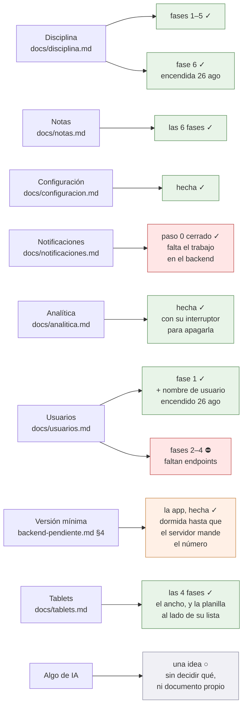

# Dónde va todo, y qué sigue

El mapa para retomar el trabajo sin que nadie tenga que contar nada. Se
actualiza en el mismo commit que cambia el estado que describe: si esta página
miente, es un fallo tan real como una prueba en rojo.

**Última actualización: 26 de agosto de 2026.** **Todo lo construido está
fusionado en `main`, empujado a `origin` y no queda ninguna rama suelta**: las
fases 4, 5 y 6 de notas, la configuración, la analítica, la pantalla de
usuarios, la versión mínima y el 422 de la escala.
**[La analítica](analitica.md) está hecha entera** —Firebase, los eventos, el
interruptor para apagarla y la política de privacidad reescrita—; de ella solo
queda un ajuste de consola.

**El 26 de agosto se encendieron tres interruptores** que llevaban días apagados
esperando algo que ya había pasado: la ficha de disciplina del alumno y del
acudiente, el botón de cambiar el nombre de usuario y el aviso de la contraseña
de grupo. Ver «La lección de los tres días», abajo — porque el fallo no fue de
código sino de esta página.

## Dos cifras que hay que corregir donde se lean

- **Son quince colegios, no dieciséis**, desde el 25 de agosto de 2026. Uno se
  dio de baja y se borró del servidor, y además nunca estuvo en ninguna tanda de
  despliegue: no tenía ni repositorio git ni aplicación, así que jamás pudo
  devolver un hash. Importa porque «desplegado en los dieciséis» es la condición
  de encendido de los interruptores, y escrita así **no se puede cumplir nunca**.
  Barrido entero el 26 ago: documentos y comentarios de código. Lo único que
  sigue diciendo «dieciséis» a propósito son las frases que corrigen la cifra, y
  [SelectorDocente](../lib/Widgets/SelectorDocente.dart), que habla de dieciséis
  **docentes** y no de colegios.
- **«Desplegado» se comprueba contra el hash de la tanda, no contra `main`.** Lo
  que corre en los quince es el commit que Joseth verificó igual en todos, y
  `main` va por delante. La pregunta correcta es «¿el commit que trae esto es
  ancestro del hash desplegado?», y se contesta con
  `git merge-base --is-ancestor <commit> <hash>`.

## Los frentes abiertos

✓ hecho · ○ pendiente y se puede hacer ya · ⛔ bloqueado por algo de fuera

## Qué sigue, en orden

**[Tablets](tablets.md) está hecho, las cuatro fases**, y con eso no queda
trabajo de app que no espere a nadie. Lo que se puede hacer ahora es lo que
quede de los otros frentes cuando el servidor los suelte, más las dos cosas de
abajo.

De la analítica solo falta una cosa, y es de consola: confirmar en Analytics que
la retención a nivel de usuario está en dos meses, que es lo que promete la
política de privacidad.

Y hay **una decisión pequeña que sí se puede tomar ya**: `PUT notas/lote` está
desplegado desde el 25 ago, así que `Interruptores.notasLote` se puede encender
cuando Joseth quiera. Sigue apagado a propósito y no por falta de servidor: toca
la pantalla del trabajo diario de un docente —pasar una columna de treinta
notas— y eso no se enciende de paso mientras se enciende otra cosa.

Los otros frentes —las notificaciones y lo que le falta a la de usuarios—
necesitan trabajo en el backend, y el backend es de solo lectura para esta app.
Ver «Lo que está bloqueado». Cuando se desbloquee alguno, el orden es:

1. **Notificaciones**, en cuanto estén las tres piezas del servidor. El paso 0
   ya está cerrado, así que se entra directo por el tipo más tonto, el del
   muro, para probar la tubería entera antes de llenarla.
2. **Usuarios, lo que le falta**, y por trozos según vaya llegando: cada cosa
   apagada tiene su interruptor y se enciende con una palabra. Ver
   [usuarios.md](usuarios.md).

## La lección de los tres días

El 26 de agosto se descubrió que **tres cosas que este mapa daba por bloqueadas
llevaban un día desplegadas**. No se perdió trabajo —el código ya estaba escrito
y probado—, pero la ficha de disciplina de una familia y el arreglo de una
escalada de privilegios estuvieron apagados sin motivo. Las tres causas, porque
las tres se repiten solas:

1. **Se preguntó «¿está en `main`?» en vez de «¿está desplegado?».** Son
   preguntas distintas y `main` contesta mal en los dos sentidos.
2. **Se leyó la guarda en `routes/` y no en el controlador.**
   `PUT perfiles/guardar-username/{id}` **sigue llevando
   `persona.propia:user_id` en la ruta**, y el arreglo está anclado al objetivo
   dentro del método. Leer el fichero de rutas daba la conclusión falsa.
3. **Este documento se creyó a sí mismo.** Decía «un endpoint que hoy no existe»
   de un endpoint que existía, y nadie fue a mirar porque el mapa ya lo decía.
   Su propia regla lo cubre: si esta página miente, es un fallo tan real como una
   prueba en rojo — pero una prueba en rojo se ve sola y esto no.

Lo que queda escrito para la próxima: antes de dar algo por bloqueado en el
servidor, **comprobarlo contra el hash desplegado y en el controlador**, no en
`main` ni en `routes/` ni aquí.

## Lo que está bloqueado, y por qué

Los contratos, con la evidencia que los justifica, están en
**[backend-pendiente.md](backend-pendiente.md)** —donde los dos primeros ya
figuran como entregados—. Ahí está también lo contrario —**«Lo que la app
necesita que NO se rompa»**—, con el mínimo de `contratos` para alumno y
acudiente, que el backend está a punto de recortar por seguridad.

- **Notificaciones.** Cuelgan de tres cosas del servidor: un endpoint de temas,
  un comando de artisan y una entrada de cron. **El paso 0 está cerrado y las
  cuatro comprobaciones salieron bien** (23 ago 2026): el hosting sale por HTTPS
  a Google, ejecuta artisan (Laravel 13.26.1 sobre PHP 8.4.24 en
  `/usr/local/bin/php`) y **el cron dispara**, comprobado con una tarea de
  prueba. El plan B sin push queda descartado. Lo que falta es escribir las tres
  piezas, y eso es trabajo de backend. Ver
  [notificaciones.md](notificaciones.md) → «Lo comprobado en el servidor».
- **Usuarios, lo que le falta.** Ocho cosas del servidor —el último acceso, los
  roles por lista, «Otros», dos masivas por grupo y tres columnas que faltan—,
  **todas sin autorizar todavía**. El contrato entero, en
  [usuarios.md](usuarios.md) → «Lo que falta en el servidor».

**Y lo que ya NO está bloqueado**, para que nadie lo vuelva a buscar aquí:

- **`PUT notas/lote`** existe y está desplegado desde el 25 ago. El interruptor
  sigue apagado por decisión, no por bloqueo. Ver «Qué sigue, en orden».
- **`GET disciplina/mis-fichas`** existe, está desplegado y la pantalla está
  encendida desde el 26 ago.
- **Los dos arreglos de cuentas** —la guarda de
  `PUT perfiles/guardar-username/{id}`, que dejaba a cualquiera de los 51
  docentes renombrar cualquier cuenta, y el alcance de `alumnos/cambiar-claves`,
  que llegaba a los retirados del grupo y a las cuentas borradas— van en el mismo
  commit `0e7208c` y están desplegados desde el 25 ago. Sus dos interruptores se
  encendieron el 26.

### El 422 de la escala — hecho, y esperando al servidor

La escala de notas **pasa a validarse en el servidor**: `PUT notas/update` y la
definitiva manual contestarán **422** donde hoy dan 200, con el motivo dentro
del cuerpo, y en `notas/lote` el mismo texto vuelve en `fallidas[].motivo`.

El lado de la app ya está: los dos sitios que enseñaban «El servidor respondió
422.» ahora enseñan lo que el servidor dijo, y lo traduce un solo sitio,
[MensajesDelServidor](../lib/Http/MensajesDelServidor.dart). Sus dos recortes no
son cosméticos —descarta la página de error en HTML y los volcados de excepción,
que son JSON válido con `message` dentro— y tienen prueba cada uno.

**Falta desplegarlo en el servidor**, y antes de eso conviene una comprobación
que no es de código: el backend midió **92 notas fuera de rango en su base
local**, todas de los años 1 a 5 y ninguna en los cuatro recientes. Si eso se
sostiene en producción, encender la validación no le rompe el día a nadie. Una
nota histórica que ya no se puede volver a guardar es distinta de una que se
escribe hoy, así que merece mirarse contra la base real.

### Un agujero de la versión mínima, sin decidir

**Un colegio que suba `version_minima_app` no bloquea a nadie que ya tenga
sesión guardada** — y ésa es la gente que usa la app todos los días.

Al arrancar, `restaurar()` lee el cuerpo de `/login` **guardado en disco** la
última vez que esa persona tecleó su contraseña; la comprobación del token se
hace con `GET /years` y no con `/login`, a propósito, porque el login está
limitado a cinco por minuto y por IP. Y la app **no refresca**: no hay ninguna
llamada a `auth/refresh`, así que el punto por el que la API entrega un mínimo
nuevo sin que el usuario salga y vuelva no lo ejerce nadie desde aquí.

Salió el 24 ago 2026 al confirmarle el contrato a la sesión de la API, que
había escrito un caso de prueba dando por cubierto ese camino.

**La decisión es de Joseth**, porque el arreglo cuesta una petición más en algún
sitio y eso es justo lo que este proyecto evita en un hosting compartido. Las
opciones: volver a guardar el cuerpo de `/login` cada cierto tiempo, o releer el
mínimo dentro de alguna llamada barata que ya se haga. Mientras tanto, la puerta
existe pero **sólo se cierra en la cara de quien vuelve a entrar**.

## Cómo se trabaja aquí

- **Rama por frente**, con el nombre de lo que hace: `feat/disciplina`,
  `feat/notas`. Un commit por fase, con el porqué en el cuerpo del mensaje.
- **El backend es de solo lectura.** Vive en `~/DESARROLLOS/8myvc` y se lee para
  saber qué devuelve cada endpoint; nunca se edita. Lo que haga falta allí se
  anota en el documento del frente y se pide.
- **Cada plan vive en `docs/`**, con sus diagramas en Mermaid dentro del propio
  `.md`, y se pone al día en el commit que lo cambia.
- **Las trampas del backend se escriben con su prueba al lado.** Los listados se
  arman con `DB::select` y SQL a pelo, así que los tipos los decide PDO: el lado
  Flutter lee el JSON con [JsonBackend](../lib/Utils/JsonBackend.dart) en vez de
  fiarse.
- **Probar en web contra un colegio de verdad pide bajar el CORS.** Los
  servidores solo permiten su propio origen —`access-control-allow-origin:
  https://demo.micolevirtual.com`—, así que desde `localhost` el navegador
  bloquea la respuesta y la app enseña «No se pudo conectar», que es el mismo
  mensaje que da un servidor caído. Para que la prueba valga:
  `flutter run -d chrome --web-browser-flag="--disable-web-security"`. En el
  celular no pasa, porque ahí no hay navegador de por medio.
- **Antes de commitear**: `flutter analyze` sin avisos y `flutter test` en verde.
  Con `--concurrency=2` si la máquina va justa; a pelo se queda sin memoria.

## El estado de cada frente, en detalle

### Notas — [notas.md](notas.md)

| Fase | Qué | Estado |
|---|---|---|
| 1 | La sesión completa: [ConfiguracionColegio](../lib/Utils/ConfiguracionColegio.dart) | hecha |
| 2 | Asignaturas con filtro «Hoy» + tarjeta en el muro | hecha |
| 3 | La planilla del indicador (casos A y B) | hecha |
| 4 | La ficha del alumno (casos C y E) | hecha |
| 5 | Notas perdidas | hecha |
| 6 | Frases, historial, borrar nota | hecha |

El camino en la app: menú ▸ Notas → [NotasScreen](../lib/Screens/NotasScreen.dart)
→ [LibroAsignaturaScreen](../lib/Screens/LibroAsignaturaScreen.dart), que tiene
dos pestañas sobre el mismo libro ya cargado:

- **Por indicador** → [PlanillaScreen](../lib/Screens/PlanillaScreen.dart), el
  trabajo diario: una casilla y los treinta alumnos.
- **Por alumno** → [FichaAlumnoNotasScreen](../lib/Screens/FichaAlumnoNotasScreen.dart),
  el acudiente que pregunta y el nivelar de fin de periodo.

Dentro de las dos, manteniendo pulsada una nota se abre su historial y desde
ahí se borra ([HojaDetalleNota](../lib/Widgets/HojaDetalleNota.dart)).

Y aparte, menú ▸ Notas perdidas →
[NotasPerdidasScreen](../lib/Screens/NotasPerdidasScreen.dart): el árbol de lo
que llevan por debajo de la mínima, del año entero y en una sola petición.

### Disciplina — [disciplina.md](disciplina.md)

**Hecha entera, las seis fases.** La 6 —la ficha del alumno y del acudiente— se
encendió el 26 de agosto de 2026: es
[MiDisciplinaScreen](../lib/Screens/MiDisciplinaScreen.dart), que **no es una
pantalla nueva** sino `FichaDisciplinaScreen` con `soloLectura: true`, y por eso
se pidió que `mis-fichas` devolviera el alumno con la misma forma que un elemento
de `PUT disciplina/alumnos`.

En el menú, alumnos y acudientes ven la palabra «Disciplina» igual que el
personal, y lo que separa a unos de otros es la ruta: `/mi-disciplina` sólo lee,
`/disciplina` edita y lleva `auth.personal`.

### Configuración — [configuracion.md](configuracion.md)

Hecha: menú ▸ Configuración →
[ConfiguracionScreen](../lib/Screens/ConfiguracionScreen.dart). Se edita lo que
un directivo cambia estando de pie —siete ajustes— y lo demás se ve, con «lo
demás se configura en la plataforma web» al final. La ve todo el personal; los
interruptores solo los mueve un administrador, y eso es **alcance de la app, no
permiso del servidor**: sus endpoints llevan `auth.personal` y un docente
podría llamarlos.

### Notificaciones — [notificaciones.md](notificaciones.md)

Solo el plan, y bloqueado en el servidor. **El paso 0 está cerrado**: el
hosting sale a Google, ejecuta artisan y el cron dispara. Falta escribir el
endpoint de temas, el comando `notificaciones:enviar` y la línea de cron; el
lado Flutter —Firebase, permiso y suscripción— no se puede empezar sin el
endpoint que entrega los temas.

### Usuarios — [usuarios.md](usuarios.md)

**Fase 1 hecha**: menú ▸ Usuarios →
[UsuariosScreen](../lib/Screens/UsuariosScreen.dart), y solo para quien
administra cuentas —superusuario, `Admin` o `Secretario`—. Se entra por tipo
—alumnos, acudientes, profesores, otros— y por grupo, y **nunca se pide más de
un grupo a la vez**: la pantalla que sustituye traía las 2.279 personas del
colegio con tres consultas por fila para sus roles.

Funciona hoy: los listados de alumnos, acudientes —con sus acudidos— y
docentes —con sus años contratados—, ponerle una contraseña a una persona,
ponerle una a todo un grupo de alumnos y **cambiarle el nombre de usuario a una
cuenta**, esto último desde el 26 de agosto de 2026, cuando se desplegó la guarda
que faltaba.

**Tres cosas siguen apagadas** con su interruptor en
[PendientesUsuarios](../lib/Http/UsuariosApi.dart): los roles, el último acceso,
«Otros» y dos de las masivas por grupo — todas por endpoints que no existen.

Y una nota de alcance que la app no decide: `alumnos/cambiar-claves` pasó de
pedir superusuario a pedir **`esAdministrativo`**, ordenado por alcance —la de un
grupo pedía más que la del colegio entero—. Hoy no le da el botón a nadie nuevo,
pero por eso la pantalla usa `administraCuentas` y no cablea `is_superuser`.

### La versión mínima — [backend-pendiente.md](backend-pendiente.md) §4

**El lado de la app está hecho** (24 ago 2026):
[VersionMinima](../lib/Utils/VersionMinima.dart) y
[ActualizarScreen](../lib/Screens/ActualizarScreen.dart). El número llega en la
respuesta de `POST /login` —un campo, no una ruta— y si esta versión se queda
corta no se entra a ninguna parte: la puerta está en el router, no en cada
pantalla.

**Y está dormida**, que es lo que la hace inofensiva de publicar: hoy ningún
colegio manda el campo, así que se comporta exactamente igual que no tenerla.
Lo que falta es que el backend lo mande, y eso está en la lista de Joseth.

**Por qué importa más de lo que parece.** Es lo único que permite retirar un
endpoint: sin esto, un teléfono con la versión vieja sigue llamando a la ruta
vieja indefinidamente y nadie se entera, así que **retirar cualquier cosa
depende de que quince colegios se actualicen por su cuenta**. Dos planes del
backend —la fase 7 de la auditoría y la 5 del 00— estaban parados en eso. Ahora
pasan de «sin fecha y sin forma» a «sin fecha, pero con la forma escrita»: la
fecha sigue sin poder existir porque **la app no está publicada todavía**.

### Analítica — [analitica.md](analitica.md)

**El código está hecho.** Google Analytics de Firebase sobre el proyecto
`micolevirtual-mobile`, gratis, con dos reglas que mandan sobre el resto: ni un
dato que identifique a una persona, y el identificador de publicidad apagado con
su permiso fuera del *bundle* —para que [publicacion-play.md](publicacion-play.md)
§9 pueda seguir diciendo «solo `INTERNET`»—. Mide **solo en Android**: en
Firebase hay una sola app registrada, y en web la analítica es un no-op para no
romper un sitio donde la app hoy funciona.

Todo pasa por [Analitica](../lib/Utils/Analitica.dart), que es el único archivo
que habla con Firebase y donde vive la regla de qué se puede mandar.

Se puede apagar: menú ▸ **Privacidad**, y esa opción la ven **todos** los
roles —Configuración no servía, que el menú se la ofrece solo al personal—. La
preferencia es del dispositivo y no de la cuenta, igual que se decidió para las
notificaciones.

La política de privacidad ya está reescrita. Falta solo confirmar en la consola
que la retención está en dos meses.

### Tablets — [tablets.md](tablets.md)

**Hecho entero el 26 de agosto de 2026, las cuatro fases.** El frente salió al
sacar las capturas de la ficha de Play el 25 de agosto, en un emulador de Pixel
Tablet: la app **funciona** en tablet, pero no tiene ningún layout propio. Es la
interfaz de teléfono ocupando todo el ancho.

Lo primero que hizo falta fue **separar dos problemas que no son el mismo**: lo
que se estira y no debería —un campo de texto de 1.300 px— y el hueco que sobra
y no se aprovecha. El primero se arregla con un número y el segundo rediseñando
una pantalla, así que el primero no espera al segundo.

**Hecho, las dos primeras fases** —las dos que se arreglan con un número—:

- **El login** ([Anchos](../lib/Utils/Anchos.dart)). La regla es proporcional
  **con tope**: en un teléfono no cambia nada —hay prueba de eso— y en tablet el
  formulario se queda centrado a 420 px. De paso quita la banda del login de los
  tres sitios donde estaba escrita.
- **La ficha de disciplina**
  ([ColumnaDeFicha](../lib/Widgets/ColumnaDeFicha.dart)), con su propio tope de
  720: una ficha lleva bloques dentro y aguanta más que un formulario, y hay
  prueba que se pone en rojo si alguien unifica las dos constantes.

- **El detalle de una asignatura** (fase 3), a medias y a propósito: se le puso
  el tope, que arregla el ancho; el hueco vertical no lo arregla un número.

**La fase 3 se hizo mirando la pantalla en un Pixel Tablet, y eso cambió lo que
había que hacer.** Tres cosas que este mapa daba por buenas resultaron falsas:

1. **«Notas por alumno queda bien en tablet»** — era media verdad. Caben quince
   alumnos en vez de siete, que es una medida *vertical*; en horizontal **el
   nombre quedaba a 1.900 px de su nota**. «Caben más» y «se lee bien» son dos
   preguntas distintas, y la primera se contestó sacando capturas para Play, o
   sea mirando la pantalla como una imagen y no como algo que alguien usa.
2. **«Dos columnas arreglan el hueco»** — no: con dos tarjetas, ponerlas lado a
   lado ocupa la mitad de alto y el blanco de abajo **crece**.
3. **«Maestro-detalle, si hace falta»** — hace falta, y es lo único que llena
   ese hueco. Su pareja natural es indicador → planilla de treinta alumnos, que
   es el trabajo diario del docente y que hoy son dos pantallas.

De paso salió un defecto que no era de tablet: las tarjetas de unidad eran un
`Container` con color y **se tragaban la onda al tocar** de cada indicador, o
sea que la acción más repetida de la pantalla del trabajo diario no daba ninguna
respuesta visual. Lo destapó la primera prueba que monta esa pantalla.

**La fase 4, maestro-detalle, también está hecha**: en una tablet la lista de
indicadores queda a la izquierda y la planilla de los treinta alumnos a la
derecha, sin navegar. Es el trabajo diario del docente en una sola pantalla —se
acaba la clase, se entra al indicador del quiz y se pasan las treinta notas—, y
no cuesta ni una petición más porque `notas/detailed` ya sirve a las dos mitades.
Por debajo de 900 px no cambia nada: se navega como siempre.

Es la misma `PlanillaScreen` en los dos sitios y no dos parecidas, porque pasar
treinta notas tiene que costar lo mismo en un teléfono y en una tablet. Encajada
pierde solo lo que deja de tener sentido —su barra, su `PopScope`— y avisa de lo
guardado según entra, para que el «faltan 30» de la lista de al lado no mienta.

El plan entero, y **cómo mirar una pantalla en tablet sin cuenta y sin red**, en
[tablets.md](tablets.md).

Las capturas de tablet que se subieron a Play son de las tres pantallas que ya
quedaban bien, a propósito. Sirven para que Play no marque la app como «no
optimizada para tablets», pero eso es quitar una etiqueta, no resolver el fondo.

### Algo de IA en la app — una idea, todavía sin forma

**Sin empezar, y sin decidir qué.** Lo pidió Joseth el 25 de agosto de 2026,
mientras se enviaba la ficha de Play: quiere aprender a agregarle a la app
alguna función con IA. Queda anotado aquí para que no se pierda; cuando se
aborde, lo primero no es escribir código sino elegir el «qué», porque eso es lo
que decide todo lo demás.

Las tres cosas que ya se saben, y que estrechan el campo antes de empezar:

- **El hosting compartido no puede ser el que llame al modelo.** Cualquier cosa
  que se cocine en el servidor hereda el problema de siempre: ni sondeo, ni
  consultas caras repetidas. Y **el backend es de solo lectura para esta app**,
  así que lo que necesite servidor hay que pedirlo, como todo lo demás.
- **No pueden salir datos de menores hacia un tercero.** Hoy la ficha de Play y
  la política de privacidad prometen que las notas, la asistencia y las
  anotaciones no salen del servidor del colegio. Mandarle a un modelo el nombre
  o las notas de un alumno rompe esa promesa, y obliga a rehacer
  [politica-privacidad.md](politica-privacidad.md), la ficha y el formulario de
  seguridad de datos. Lo que sí cabe sin tocar nada es lo que no lleva datos
  personales dentro.
- **La ficha de Play tiene su propia casilla de IA**, y es de recursos —ícono,
  capturas, gráfico destacado—, no de la app. Ver
  [publicacion-play.md](publicacion-play.md) §5.

Cuando le llegue el turno se le abre su `docs/ia.md`, como todos los frentes.

### Publicación en Google Play

**Enviada a revisión el 25 de agosto de 2026.** Trece cambios: la ficha entera
—textos, ícono, gráfico destacado y capturas de teléfono y tablet, con el
gráfico etiquetado como hecho con IA—, los formularios de contenido de la app,
la política de privacidad viva en `micolevirtual.com/privacidad.html`, y la
primera versión `1.0.0 (3)` en el canal de prueba cerrada, con los 28 correos de
verificadores cargados y las credenciales del revisor comprobadas contra el
servidor de Demo.

**Lo que sigue no depende de nosotros hasta que Google conteste**, y luego:
mandarle el enlace de opt-in a los 28 —hacen falta **12 aceptaciones**, y
aceptar es un acto de cada persona, no basta con estar en la lista—, y de ahí
**14 días seguidos** antes de poder pedir acceso a producción. El mensaje de
invitación importa más de lo que parece: el fallo típico es abrir el enlace con
una cuenta de Google distinta a la registrada.

[publicacion-play.md](publicacion-play.md) tiene la guía, y
[ficha-play.md](ficha-play.md) y [politica-privacidad.md](politica-privacidad.md)
los borradores. Si algún día entran las notificaciones, los dos hay que
retocarlos: hay que declarar el identificador de dispositivo de FCM.
