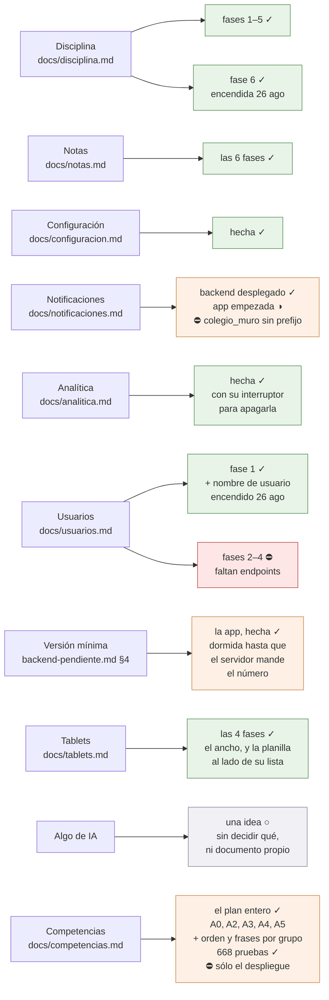

# Dónde va todo, y qué sigue

El mapa para retomar el trabajo sin que nadie tenga que contar nada. Se
actualiza en el mismo commit que cambia el estado que describe: si esta página
miente, es un fallo tan real como una prueba en rojo.

**Última actualización: 15 de septiembre de 2026.** **Todo lo construido está
fusionado en `main`, empujado a `origin` y no queda ninguna rama suelta**: las
fases 4, 5 y 6 de notas, la configuración, la analítica, la pantalla de
usuarios, la versión mínima y el 422 de la escala; y de septiembre, el horario
arreglado, las notas con decimales, el muro que se pide una vez por visita, la
primera compilación para iOS y el menú lateral montado en un solo sitio.

**La app está enviada a revisión para producción en Google Play**, con acceso
concedido el 15 de septiembre — abajo, en «Publicación en Google Play».
**[La analítica](analitica.md) está hecha entera** —Firebase, los eventos, el
interruptor para apagarla y la política de privacidad reescrita—; de ella solo
queda un ajuste de consola.

**El 26 de agosto se encendieron tres interruptores** que llevaban días apagados
esperando algo que ya había pasado: la ficha de disciplina del alumno y del
acudiente, el botón de cambiar el nombre de usuario y el aviso de la contraseña
de grupo. Ver «La lección de los tres días», abajo — porque el fallo no fue de
código sino de esta página.

## Dos cifras que hay que corregir donde se lean

- **Son DIECISÉIS colegios, y el «quince» de esta página llevaba desde el 30 de
  agosto de 2026 siendo falso.** Fueron dieciséis, luego quince cinco días por
  una baja el 25 ago —que es cuando se barrió el repositorio entero y se escribió
  aquí—, y **dieciséis otra vez el 30 ago, cuando entró `lal`**, montado en la
  otra cuenta de cPanel (`lalvirtual.edu.co`). Lo levantó la sesión de la API el
  19 sep 2026 y se comprobó desde aquí: `8myvc/docs/DESPLIEGUE.md:966` y `:143`
  — **el bucle de despliegue devuelve 17 carpetas: dieciséis colegios y `demo`**.

  **La lección no es el número: es que la condición no debe llevar ninguno.**
  Un recuento escrito en un docblock envejece en silencio y **falla del lado
  peligroso** — quien verifique «los quince» habiendo dieciséis enciende un
  interruptor con un colegio sin desplegar. Por eso
  [Interruptores](../lib/Utils/Interruptores.dart) ya no dice un número, sino
  **«todos los que recorre el bucle de despliegue»**, que se lee del servidor y
  no hay que mantener al día. Y ojo: el `for` de `micolev1` **no alcanza a
  `lal`**, que está en otra cuenta.

  **El resto del repositorio sigue diciendo «quince» en unas cuarenta frases** y
  **no se ha barrido**, a propósito: muchas son ciertas en su contexto —«se
  desplegó en los quince el 25 ago» lo era ese día— y un reemplazo a ciegas
  rompería las que cuentan otras cosas. Mover la cifra donde de verdad afirma el
  presente es decisión de Joseth, no un efecto secundario.

  **Y una comprobación que queda pendiente, sin alarmar**: `disciplinaMisFichas` se
  encendió el 26 ago contra la tanda `eb95cbc`, **cuatro días antes de que `lal`
  existiera**. Aquí se escribió primero *«lo más probable es que se montara con
  código posterior y lo tenga de sobra»* — **y esa inferencia no vale**: la sesión
  de la API avisó de que `lal` **se trasladó desde otro servidor**
  (`8myvc/docs/TRASLADO-LAL.md`), así que **lo que tenga depende de qué copia se
  llevó, no de la fecha**. Se comprueba mirando su hash en el servidor, que es una
  orden contra producción y por tanto de Joseth. Es el mismo error en pequeño que
  el de la cifra: razonar donde había que medir.

  [SelectorDocente](../lib/Widgets/SelectorDocente.dart) habla de dieciséis
  **docentes**, no de colegios: ése no se toca.
- **«Desplegado» se comprueba contra el hash de la tanda, no contra `main`.** Lo
  que corre en los quince es el commit que Joseth verificó igual en todos, y
  `main` va por delante. La pregunta correcta es «¿el commit que trae esto es
  ancestro del hash desplegado?», y se contesta con
  `git merge-base --is-ancestor <commit> <hash>`.

## Los frentes abiertos

✓ hecho · ○ pendiente y se puede hacer ya · ⛔ bloqueado por algo de fuera

## Qué sigue, en orden

**Primero, lo único con prisa: [backend-pendiente.md](backend-pendiente.md) §5,
`GET muro/app`.** Salió el 2 de septiembre de 2026 al mirar qué le va a costar al
hosting compartido que la app deje de ser de docentes y pase a ser de toda la
comunidad. `GET ChangesAsked/to-me` —de donde la app saca el muro— le manda a un
acudiente **108 KB**, y el 99 % de eso es la tabla `calendario` entera, sin
filtro de año ni de fecha. **La app no lee esa clave**: de toda la respuesta usa
unos 5 KB. Se paga en cada apertura, y el pico lo fabrica el push —una
notificación hace que cientos de teléfonos abran la app en el mismo medio
minuto, sobre un servidor de un núcleo—.

**El backend ya hizo una pasada ese mismo día** (`805e08f`: el panel de un
alumno de 620 ms a 24 ms, y el calendario a la mitad para todos) y midió el
endpoint rol por rol. Esa medición corrigió a esta app: aquí se había estimado
el coste contando consultas en el código, y el número real es otro **y el
argumento está en otro sitio** —el peso, no las consultas—. Lo que sigue
pendiente es no mandarle `eventos` a quien no lo pinta. Ojo: lo de hoy está en
`main` del backend, que no es lo mismo que desplegado.

Del lado Flutter ya se hizo lo que se podía hacer sin tocar el servidor, el
mismo día: [MuroEnMemoria](../lib/Utils/MuroEnMemoria.dart) —cuatro pantallas
pedían el muro en una sola visita, ahora una—,
[VerificacionSesion](../lib/Utils/VerificacionSesion.dart) —`GET /years` en cada
arranque en frío, y también es N+1— y `cached_network_image`, que hace que la
cabecera `max-age=604800` que el servidor ya manda sirva para algo en móvil.
**Eso divide entre cuatro cuántas veces se pide; no toca lo que cuesta cada
vez**, que es lo que decide el pico. Lo segundo es el endpoint.

**[Tablets](tablets.md) está hecho, las cuatro fases.** El otro frente vivo es
**[notificaciones](notificaciones.md)**, que resultó no estar bloqueado: el
backend lleva desplegado desde el 25 de agosto y este mapa lo dio por pendiente
un día de más.

Su mitad de app está empezada —el cliente de temas, las preferencias del
dispositivo y sus once pruebas—, y **lo que falta no es más código sino una
decisión de Joseth**:

1. **Añadir `firebase_messaging` mete `POST_NOTIFICATIONS` en el manifiesto** y
   un identificador de dispositivo en lo que hay que declararle a Google. La app
   está **en revisión ahora mismo** con `1.0.0 (3)` en prueba cerrada, así que
   la política de privacidad y la ficha de Play dejan de ser el paso 6 del plan
   y pasan a ser condición previa. Ver [notificaciones.md](notificaciones.md) →
   «En la app».
2. **Y hay un fallo del servidor por medio**, ya pedido: `colegio_muro` no lleva
   identificador de colegio y sería el mismo tema para los quince. Los temas por
   alumno están bien y son los que se usan.

De la analítica solo falta una cosa, y es de consola: confirmar en Analytics que
la retención a nivel de usuario está en dos meses, que es lo que promete la
política de privacidad.

Y **una decisión pequeña que se puede tomar ya**: `PUT notas/lote` está
desplegado desde el 25 ago, así que `Interruptores.notasLote` se puede encender
cuando Joseth quiera. Sigue apagado a propósito y no por falta de servidor: toca
la pantalla del trabajo diario de un docente —pasar una columna de treinta
notas— y eso no se enciende de paso mientras se enciende otra cosa.

Lo único que sigue esperando al backend es **[usuarios](usuarios.md)**: ocho
cosas sin autorizar. Cada una tiene su interruptor y se enciende con una palabra
según vaya llegando.

## La lección de los tres días

El 26 de agosto se descubrió que **tres cosas que este mapa daba por bloqueadas
llevaban un día desplegadas**. No se perdió trabajo —el código ya estaba escrito
y probado—, pero la ficha de disciplina de una familia y el arreglo de una
escalada de privilegios estuvieron apagados sin motivo. Las tres causas, porque
las tres se repiten solas:

1. **Se preguntó «¿está en `main`?» en vez de «¿está desplegado?».** Son
   preguntas distintas y `main` contesta mal en los dos sentidos.
2. **Se leyó la guarda en `routes/` y no en el controlador.**
   `PUT perfiles/guardar-username/{id}` **sigue llevando
   `persona.propia:user_id` en la ruta**, y el arreglo está anclado al objetivo
   dentro del método. Leer el fichero de rutas daba la conclusión falsa.
3. **Este documento se creyó a sí mismo.** Decía «un endpoint que hoy no existe»
   de un endpoint que existía, y nadie fue a mirar porque el mapa ya lo decía.
   Su propia regla lo cubre: si esta página miente, es un fallo tan real como una
   prueba en rojo — pero una prueba en rojo se ve sola y esto no.

Lo que queda escrito para la próxima: antes de dar algo por bloqueado en el
servidor, **comprobarlo contra el hash desplegado y en el controlador**, no en
`main` ni en `routes/` ni aquí.

**Y el barrido de ese día se quedó corto, que es la cuarta lección.** Se
comprobaron los dos frentes que Joseth preguntó y no todos los que esta página
daba por bloqueados. Al hacerlo entero, ese mismo día, aparecieron dos más:

- **Las notificaciones**, con sus tres piezas desplegadas (`98e6311`).
- **El 422 de la escala** (`9cb4409`), que además lleva vivo desde el 25 sin la
  comprobación previa que este documento pedía.

Un mapa que miente en un sitio suele mentir en varios, porque la causa no es el
sitio: es la costumbre de no ir a mirar. **Cuando se encuentre uno, se barren
todos.**

**Y una quinta, que salió de trabajar con la sesión del backend y vale para los
dos repositorios:**

- **Un fallo puede tener la premisa en un repositorio y la consecuencia en el
  otro.** Lo de `colegio_muro` —el mismo tema de Firebase para los quince
  colegios— sólo se veía desde aquí: allí es un nombre razonable, y lo que lo
  convierte en fallo —que el proyecto de Firebase es uno solo— vive en este lado.
  Se vio por leer el contrato **antes** de cablearlo, que es la única postura
  desde la que se veía.
- **Un número sacado de la copia equivocada no es un número pequeño: es otra
  pregunta.** Ver el 422 de la escala, abajo.
- **Un cambio de forma no avisa; un cambio de valor sí.** El campo `colegio` del
  endpoint de temas pasó de lista a objeto, y un parser que sólo leyera lista
  habría devuelto vacío **en silencio** el día del despliegue. Por eso se leen
  las dos formas.
- **El mensaje de un commit es una afirmación, y hay que poder comprobarla
  contra el `stat`.** Salió en las dos direcciones el mismo día: aquí, un commit
  con dos cosas dentro casi esconde que el 422 de la escala ya estaba desplegado,
  porque su mensaje hablaba sólo de la otra; allí, un mensaje prometió una
  sección que el parche no había llegado a escribir.
- **Y un número escrito en un documento envejece solo.** Este repo decía «cinco
  pruebas» de un fichero que ya tenía ocho, y «once» de otro que tenía trece —las
  dos ciertas al escribirlas y rotas por quien añadió las siguientes, que fue la
  misma sesión—. Contar pruebas no le dice a nadie nada que no diga mejor abrir
  el fichero: **lo que hay que escribir es cuál importa y por qué**.

  La versión afilada, que vino de vuelta del backend: **un número en un documento
  envejece solo; una propiedad que obliga el compilador, no.** Cuando se puede
  elegir entre los dos, escribir el número es escribir la parte que caduca.

  **Con una excepción, y es importante: los censos son números y tienen que
  serlo.** Ahí la regla no es quitarlos sino que lleven **pegado el recuento que
  los reproduce**, porque un número que trae su consulta no envejece: se
  recontesta. Este repo tenía cinco censos —2.279, 6.800, 1.280, 51 docentes,
  2.355— repetidos catorce veces, ninguno con su recuento y **ninguno diciendo de
  cuál de los quince colegios salieron**, que es la lección 2 otra vez. Ahora
  viven en un solo sitio, con su origen: [usuarios.md](usuarios.md) → «De dónde
  salen estas cifras».

  **Y la forma final de la regla, que vino de vuelta del backend y es mejor que
  «estampar la copia en todo número»:**

  > **O se dice de qué copia salió el número, o se dice por qué la copia no
  > cambia la respuesta.** La segunda es mejor cuando se puede, porque no caduca
  > al cambiar de base.

  Es el mismo movimiento por los dos lados: **subir del número a la propiedad que
  lo hacía cierto**. Aquí salió como «lo correcto no es que sean 2.279, es que es
  el colegio entero contra treinta»; allí, como una herramienta que busca
  `possible_keys` vacío —propiedad del esquema y no del volumen—, así que el seed
  pequeño enseña el mismo hecho que un colegio con un millón de notas.

  **Aplicada aquí destapó algo peor que los censos, y era mío.** Este repo decía
  doce veces que el nombre de un alumno quedaba «a 1.900 px» de su nota. Ese
  número no salió de ningún dispositivo: **lo leí de una captura escalada** —la
  imagen se me mostraba a 2.000 px de ancho y el original eran 2.560—, así que no
  era ni físico ni lógico. Lo medido de verdad son **1.152 dp en un Pixel Tablet
  de 1.280 dp de ancho**, y con el tope baja a unos 560.

  Pero lo que hace que eso esté mal **no es la cifra de ese aparato**: es que la
  fila **no tiene ancho propio**, así que sus dos extremos se separan tanto como
  se le dé de pantalla. Esa frase vale en cualquier tablet y no hay que volver a
  medirla nunca — que es exactamente lo que la regla pide.
- **Una promesa que sólo vive en un mensaje entre sesiones se cae con la
  sesión.** Las dos condiciones que esperamos del backend —el hash de
  `b369020`, y el desglose por año de la fase 0— están escritas en su
  `docs/DESPLIEGUE.md` y no en un mensaje; y de este lado, la condición para
  encender `temasDelColegio` vive en su propio docblock.

Lo que se barrió y **sí estaba bien**, para que nadie lo repita: las ocho cosas
de la pantalla de usuarios no existen en el backend —comprobado—, y `GET
contratos` **todavía no se ha recortado**, así que no hay regresión esperándonos
ahí.

## Lo que está bloqueado, y por qué

Los contratos, con la evidencia que los justifica, están en
**[backend-pendiente.md](backend-pendiente.md)** —donde los dos primeros ya
figuran como entregados—. Ahí está también lo contrario —**«Lo que la app
necesita que NO se rompa»**—, con el mínimo de `contratos` para alumno y
acudiente, que el backend está a punto de recortar por seguridad.

- **Usuarios, lo que le falta.** Ocho cosas del servidor —el último acceso, los
  roles por lista, «Otros», dos masivas por grupo y tres columnas que faltan—,
  **todas sin autorizar todavía**. El contrato entero, en
  [usuarios.md](usuarios.md) → «Lo que falta en el servidor».

- **El boletín independiente.** El backend lo tiene **fusionado y sin desplegar**
  (1 sep 2026), y esta app **no sabe nada de él**: en un colegio ya desplegado,
  un alumno que lleve boletín aparte **desaparece de la planilla sin ningún
  error**. Lo que hay que escribir, la decisión que falta y por qué esta app lo
  tiene peor que el front —es **una sola para los quince** y el despliegue va
  colegio a colegio— están en
  [boletin-independiente.md](boletin-independiente.md).

**Y lo que ya NO está bloqueado**, para que nadie lo vuelva a buscar aquí:

- **Las notificaciones.** Las tres piezas del servidor —el endpoint de temas, el
  comando `notificaciones:enviar` y su disparo cada quince minutos— entraron en
  el commit `98e6311` y **están desplegadas desde el 25 ago**. El disparo no es
  un cron nuevo: va en el `schedule:run` de cada minuto que ya existía. Este
  mapa las dio por bloqueadas un día de más, por la misma causa de siempre.

- **`PUT notas/lote`** existe y está desplegado desde el 25 ago. El interruptor
  sigue apagado por decisión, no por bloqueo. Ver «Qué sigue, en orden».

- **El 422 de la escala** está desplegado desde el 25 ago (`9cb4409`), y el lado
  de la app estaba desde antes. Hecho de punta a punta.
- **`GET disciplina/mis-fichas`** existe, está desplegado y la pantalla está
  encendida desde el 26 ago.
- **Los dos arreglos de cuentas** —la guarda de
  `PUT perfiles/guardar-username/{id}`, que dejaba a cualquiera de los 51
  docentes renombrar cualquier cuenta, y el alcance de `alumnos/cambiar-claves`,
  que llegaba a los retirados del grupo y a las cuentas borradas— van en el mismo
  commit `0e7208c` y están desplegados desde el 25 ago. Sus dos interruptores se
  encendieron el 26.

### El 422 de la escala — hecho por los dos lados, y vivo desde el 25 de agosto

La escala de notas **se valida en el servidor**: `PUT notas/update` y la
definitiva manual contestan **422** donde antes daban 200, con el motivo dentro
del cuerpo, y en `notas/lote` el mismo texto vuelve en `fallidas[].motivo`.

El lado de la app ya estaba: los dos sitios que enseñaban «El servidor respondió
422.» ahora enseñan lo que el servidor dijo, y lo traduce un solo sitio,
[MensajesDelServidor](../lib/Http/MensajesDelServidor.dart). Sus dos recortes no
son cosméticos —descarta la página de error en HTML y los volcados de excepción,
que son JSON válido con `message` dentro— y tienen prueba cada uno.

**Y el lado del servidor también**: `EscalaDeNotas` y su uso en `NotasController`
entraron en el commit `9cb4409`, ancestro de `eb95cbc`, o sea **desplegado en los
quince desde el 25 de agosto de 2026**. Esta página decía «falta desplegarlo» un
día de más; ver «La lección de los tres días».

**Se encendió sin la comprobación previa que este documento pedía**, y eso llevó
a algo que merece guardarse.

La precaución era ésta: el backend midió **92 notas fuera de rango en su base
local**, todas de los años 1 a 5 y ninguna en los cuatro recientes, y había que
confirmarlo contra producción antes de encender — porque una nota histórica que
ya no se puede reescribir es distinta de una que se escribe hoy.

Al pedirla el 26 ago, la sesión del backend la montó como un bloque más de su
herramienta de fase cero, que ya recorre los quince colegios: sale con el `for`
que ya estaba pendiente, sin una visita más al servidor. Y al correrla contra su
base de desarrollo salieron **tres cifras distintas y las tres ciertas**: 42 con
cadena viva, 123 planas, y las 92 del docblock. Peor aún, **quince de esas 42
caían en el año en curso**, justo donde el docblock afirma que hay cero.

**La premisa parecía falsa y no lo era.** Las 81 de diferencia cuelgan de una
unidad en la papelera, así que no se abren desde ninguna pantalla y **nadie puede
reescribirlas**; y 31 de las 123 se crearon el 24 de agosto de 2026 —el día de
aquella misma medición—, incluidas las quince del año en curso. Eran rastro de
desarrollo.

**La lección no es sobre ese docblock: la base de desarrollo no es una muestra
limpia de un colegio, porque el trabajo de desarrollo escribe en ella.** Un
número sacado de la copia equivocada no es un número pequeño, es **otra
pregunta** — y eso refuerza la petición original en vez de contradecirla: hay que
hacérsela a los quince.

Así que sigue abierta, pero ya con herramienta. Mientras tanto: **si un docente
reporta que no puede guardar una nota vieja, ésta es la explicación y no un fallo
nuevo.**

### Un agujero de la versión mínima, sin decidir

**Un colegio que suba `version_minima_app` no bloquea a nadie que ya tenga
sesión guardada** — y ésa es la gente que usa la app todos los días.

Al arrancar, `restaurar()` lee el cuerpo de `/login` **guardado en disco** la
última vez que esa persona tecleó su contraseña; la comprobación del token se
hace con `GET /years` y no con `/login`, a propósito, porque el login está
limitado a cinco por minuto y por IP. Y la app **no refresca**: no hay ninguna
llamada a `auth/refresh`, así que el punto por el que la API entrega un mínimo
nuevo sin que el usuario salga y vuelva no lo ejerce nadie desde aquí.

Salió el 24 ago 2026 al confirmarle el contrato a la sesión de la API, que
había escrito un caso de prueba dando por cubierto ese camino.

**La decisión es de Joseth**, porque el arreglo cuesta una petición más en algún
sitio y eso es justo lo que este proyecto evita en un hosting compartido. Las
opciones: volver a guardar el cuerpo de `/login` cada cierto tiempo, o releer el
mínimo dentro de alguna llamada barata que ya se haga. Mientras tanto, la puerta
existe pero **sólo se cierra en la cara de quien vuelve a entrar**.

## Cómo se trabaja aquí

- **Rama por frente**, con el nombre de lo que hace: `feat/disciplina`,
  `feat/notas`. Un commit por fase, con el porqué en el cuerpo del mensaje.
- **El backend es de solo lectura.** Vive en `~/DESARROLLOS/8myvc` y se lee para
  saber qué devuelve cada endpoint; nunca se edita. Lo que haga falta allí se
  anota en el documento del frente y se pide.
- **Cada plan vive en `docs/`**, con sus diagramas en Mermaid dentro del propio
  `.md`, y se pone al día en el commit que lo cambia.
- **Las trampas del backend se escriben con su prueba al lado.** Los listados se
  arman con `DB::select` y SQL a pelo, así que los tipos los decide PDO: el lado
  Flutter lee el JSON con [JsonBackend](../lib/Utils/JsonBackend.dart) en vez de
  fiarse.
- **Probar en web contra un colegio de verdad pide bajar el CORS.** Los
  servidores solo permiten su propio origen —`access-control-allow-origin:
  https://demo.micolevirtual.com`—, así que desde `localhost` el navegador
  bloquea la respuesta y la app enseña «No se pudo conectar», que es el mismo
  mensaje que da un servidor caído. Para que la prueba valga:
  `flutter run -d chrome --web-browser-flag="--disable-web-security"`. En el
  celular no pasa, porque ahí no hay navegador de por medio.
- **Antes de commitear**: `flutter analyze` sin avisos y `flutter test` en verde.
  Con `--concurrency=2` si la máquina va justa; a pelo se queda sin memoria.

## El estado de cada frente, en detalle

### El boletín independiente — [boletin-independiente.md](boletin-independiente.md)

**Sin empezar por este lado, y con una decisión de Joseth dentro** (ocultar a los
marcados y decirlo, o enseñarlos con su propia estructura). No se publica hasta
que el backend esté **desplegado en los quince**, comprobado contra el hash de la
tanda y no contra `main`.

### Notas — [notas.md](notas.md)

| Fase | Qué | Estado |
|---|---|---|
| 1 | La sesión completa: [ConfiguracionColegio](../lib/Utils/ConfiguracionColegio.dart) | hecha |
| 2 | Asignaturas con filtro «Hoy» + tarjeta en el muro | hecha |
| 3 | La planilla del indicador (casos A y B) | hecha |
| 4 | La ficha del alumno (casos C y E) | hecha |
| 5 | Notas perdidas | hecha |
| 6 | Frases, historial, borrar nota | hecha |

El camino en la app: menú ▸ Notas → [NotasScreen](../lib/Screens/NotasScreen.dart)
→ [LibroAsignaturaScreen](../lib/Screens/LibroAsignaturaScreen.dart), que tiene
dos pestañas sobre el mismo libro ya cargado:

- **Por indicador** → [PlanillaScreen](../lib/Screens/PlanillaScreen.dart), el
  trabajo diario: una casilla y los treinta alumnos.
- **Por alumno** → [FichaAlumnoNotasScreen](../lib/Screens/FichaAlumnoNotasScreen.dart),
  el acudiente que pregunta y el nivelar de fin de periodo.

Dentro de las dos, manteniendo pulsada una nota se abre su historial y desde
ahí se borra ([HojaDetalleNota](../lib/Widgets/HojaDetalleNota.dart)).

Y aparte, menú ▸ Notas perdidas →
[NotasPerdidasScreen](../lib/Screens/NotasPerdidasScreen.dart): el árbol de lo
que llevan por debajo de la mínima, del año entero y en una sola petición.

### Disciplina — [disciplina.md](disciplina.md)

**Hecha entera, las seis fases.** La 6 —la ficha del alumno y del acudiente— se
encendió el 26 de agosto de 2026: es
[MiDisciplinaScreen](../lib/Screens/MiDisciplinaScreen.dart), que **no es una
pantalla nueva** sino `FichaDisciplinaScreen` con `soloLectura: true`, y por eso
se pidió que `mis-fichas` devolviera el alumno con la misma forma que un elemento
de `PUT disciplina/alumnos`.

En el menú, alumnos y acudientes ven la palabra «Disciplina» igual que el
personal, y lo que separa a unos de otros es la ruta: `/mi-disciplina` sólo lee,
`/disciplina` edita y lleva `auth.personal`.

### Configuración — [configuracion.md](configuracion.md)

Hecha: menú ▸ Configuración →
[ConfiguracionScreen](../lib/Screens/ConfiguracionScreen.dart). Se edita lo que
un directivo cambia estando de pie —siete ajustes— y lo demás se ve, con «lo
demás se configura en la plataforma web» al final. La ve todo el personal; los
interruptores solo los mueve un administrador, y eso es **alcance de la app, no
permiso del servidor**: sus endpoints llevan `auth.personal` y un docente
podría llamarlos.

### Notificaciones — [notificaciones.md](notificaciones.md)

Solo el plan, y bloqueado en el servidor. **El paso 0 está cerrado**: el
hosting sale a Google, ejecuta artisan y el cron dispara. Falta escribir el
endpoint de temas, el comando `notificaciones:enviar` y la línea de cron; el
lado Flutter —Firebase, permiso y suscripción— no se puede empezar sin el
endpoint que entrega los temas.

### Usuarios — [usuarios.md](usuarios.md)

**Fase 1 hecha**: menú ▸ Usuarios →
[UsuariosScreen](../lib/Screens/UsuariosScreen.dart), y solo para quien
administra cuentas —superusuario, `Admin` o `Secretario`—. Se entra por tipo
—alumnos, acudientes, profesores, otros— y por grupo, y **nunca se pide más de
un grupo a la vez**: la pantalla que sustituye traía las 2.279 personas del
colegio con tres consultas por fila para sus roles.

Funciona hoy: los listados de alumnos, acudientes —con sus acudidos— y
docentes —con sus años contratados—, ponerle una contraseña a una persona,
ponerle una a todo un grupo de alumnos y **cambiarle el nombre de usuario a una
cuenta**, esto último desde el 26 de agosto de 2026, cuando se desplegó la guarda
que faltaba.

**Tres cosas siguen apagadas** con su interruptor en
[PendientesUsuarios](../lib/Http/UsuariosApi.dart): los roles, el último acceso,
«Otros» y dos de las masivas por grupo — todas por endpoints que no existen.

Y una nota de alcance que la app no decide: `alumnos/cambiar-claves` pasó de
pedir superusuario a pedir **`esAdministrativo`**, ordenado por alcance —la de un
grupo pedía más que la del colegio entero—. Hoy no le da el botón a nadie nuevo,
pero por eso la pantalla usa `administraCuentas` y no cablea `is_superuser`.

### La versión mínima — [backend-pendiente.md](backend-pendiente.md) §4

**El lado de la app está hecho** (24 ago 2026):
[VersionMinima](../lib/Utils/VersionMinima.dart) y
[ActualizarScreen](../lib/Screens/ActualizarScreen.dart). El número llega en la
respuesta de `POST /login` —un campo, no una ruta— y si esta versión se queda
corta no se entra a ninguna parte: la puerta está en el router, no en cada
pantalla.

**Y está dormida**, que es lo que la hace inofensiva de publicar: hoy ningún
colegio manda el campo, así que se comporta exactamente igual que no tenerla.
Lo que falta es que el backend lo mande, y eso está en la lista de Joseth.

**Por qué importa más de lo que parece.** Es lo único que permite retirar un
endpoint: sin esto, un teléfono con la versión vieja sigue llamando a la ruta
vieja indefinidamente y nadie se entera, así que **retirar cualquier cosa
depende de que quince colegios se actualicen por su cuenta**. Dos planes del
backend —la fase 7 de la auditoría y la 5 del 00— estaban parados en eso. Ahora
pasan de «sin fecha y sin forma» a «sin fecha, pero con la forma escrita»: la
fecha sigue sin poder existir porque **la app no está publicada todavía**.

### Analítica — [analitica.md](analitica.md)

**El código está hecho.** Google Analytics de Firebase sobre el proyecto
`micolevirtual-mobile`, gratis, con dos reglas que mandan sobre el resto: ni un
dato que identifique a una persona, y el identificador de publicidad apagado con
su permiso fuera del *bundle* —para que [publicacion-play.md](publicacion-play.md)
§9 pueda seguir diciendo «solo `INTERNET`»—. Mide **solo en Android**: en
Firebase hay una sola app registrada, y en web la analítica es un no-op para no
romper un sitio donde la app hoy funciona.

Todo pasa por [Analitica](../lib/Utils/Analitica.dart), que es el único archivo
que habla con Firebase y donde vive la regla de qué se puede mandar.

Se puede apagar: menú ▸ **Privacidad**, y esa opción la ven **todos** los
roles —Configuración no servía, que el menú se la ofrece solo al personal—. La
preferencia es del dispositivo y no de la cuenta, igual que se decidió para las
notificaciones.

La política de privacidad ya está reescrita. Falta solo confirmar en la consola
que la retención está en dos meses.

### Tablets — [tablets.md](tablets.md)

**Hecho entero el 26 de agosto de 2026, las cuatro fases.** El frente salió al
sacar las capturas de la ficha de Play el 25 de agosto, en un emulador de Pixel
Tablet: la app **funciona** en tablet, pero no tiene ningún layout propio. Es la
interfaz de teléfono ocupando todo el ancho.

Lo primero que hizo falta fue **separar dos problemas que no son el mismo**: lo
que se estira y no debería —un campo de texto de tres palmos— y el hueco que sobra
y no se aprovecha. El primero se arregla con un número y el segundo rediseñando
una pantalla, así que el primero no espera al segundo.

**Hecho, las dos primeras fases** —las dos que se arreglan con un número—:

- **El login** ([Anchos](../lib/Utils/Anchos.dart)). La regla es proporcional
  **con tope**: en un teléfono no cambia nada —hay prueba de eso— y en tablet el
  formulario se queda centrado a 420 px. De paso quita la banda del login de los
  tres sitios donde estaba escrita.
- **La ficha de disciplina**
  ([ColumnaDeFicha](../lib/Widgets/ColumnaDeFicha.dart)), con su propio tope de
  720: una ficha lleva bloques dentro y aguanta más que un formulario, y hay
  prueba que se pone en rojo si alguien unifica las dos constantes.

- **El detalle de una asignatura** (fase 3), a medias y a propósito: se le puso
  el tope, que arregla el ancho; el hueco vertical no lo arregla un número.

**La fase 3 se hizo mirando la pantalla en un Pixel Tablet, y eso cambió lo que
había que hacer.** Tres cosas que este mapa daba por buenas resultaron falsas:

1. **«Notas por alumno queda bien en tablet»** — era media verdad. Caben quince
   alumnos en vez de siete, que es una medida *vertical*; en horizontal **el
   nombre y su nota quedaban en los dos extremos**. «Caben más» y «se lee bien» son dos
   preguntas distintas, y la primera se contestó sacando capturas para Play, o
   sea mirando la pantalla como una imagen y no como algo que alguien usa.
2. **«Dos columnas arreglan el hueco»** — no: con dos tarjetas, ponerlas lado a
   lado ocupa la mitad de alto y el blanco de abajo **crece**.
3. **«Maestro-detalle, si hace falta»** — hace falta, y es lo único que llena
   ese hueco. Su pareja natural es indicador → planilla de treinta alumnos, que
   es el trabajo diario del docente y que hoy son dos pantallas.

De paso salió un defecto que no era de tablet: las tarjetas de unidad eran un
`Container` con color y **se tragaban la onda al tocar** de cada indicador, o
sea que la acción más repetida de la pantalla del trabajo diario no daba ninguna
respuesta visual. Lo destapó la primera prueba que monta esa pantalla.

**La fase 4, maestro-detalle, también está hecha**: en una tablet la lista de
indicadores queda a la izquierda y la planilla de los treinta alumnos a la
derecha, sin navegar. Es el trabajo diario del docente en una sola pantalla —se
acaba la clase, se entra al indicador del quiz y se pasan las treinta notas—, y
no cuesta ni una petición más porque `notas/detailed` ya sirve a las dos mitades.
Por debajo de 900 px no cambia nada: se navega como siempre.

Es la misma `PlanillaScreen` en los dos sitios y no dos parecidas, porque pasar
treinta notas tiene que costar lo mismo en un teléfono y en una tablet. Encajada
pierde solo lo que deja de tener sentido —su barra, su `PopScope`— y avisa de lo
guardado según entra, para que el «faltan 30» de la lista de al lado no mienta.

El plan entero, y **cómo mirar una pantalla en tablet sin cuenta y sin red**, en
[tablets.md](tablets.md).

Las capturas de tablet que se subieron a Play son de las tres pantallas que ya
quedaban bien, a propósito. Sirven para que Play no marque la app como «no
optimizada para tablets», pero eso es quitar una etiqueta, no resolver el fondo.

### Algo de IA en la app — una idea, todavía sin forma

**Sin empezar, y sin decidir qué.** Lo pidió Joseth el 25 de agosto de 2026,
mientras se enviaba la ficha de Play: quiere aprender a agregarle a la app
alguna función con IA. Queda anotado aquí para que no se pierda; cuando se
aborde, lo primero no es escribir código sino elegir el «qué», porque eso es lo
que decide todo lo demás.

Las tres cosas que ya se saben, y que estrechan el campo antes de empezar:

- **El hosting compartido no puede ser el que llame al modelo.** Cualquier cosa
  que se cocine en el servidor hereda el problema de siempre: ni sondeo, ni
  consultas caras repetidas. Y **el backend es de solo lectura para esta app**,
  así que lo que necesite servidor hay que pedirlo, como todo lo demás.
- **No pueden salir datos de menores hacia un tercero.** Hoy la ficha de Play y
  la política de privacidad prometen que las notas, la asistencia y las
  anotaciones no salen del servidor del colegio. Mandarle a un modelo el nombre
  o las notas de un alumno rompe esa promesa, y obliga a rehacer
  [politica-privacidad.md](politica-privacidad.md), la ficha y el formulario de
  seguridad de datos. Lo que sí cabe sin tocar nada es lo que no lleva datos
  personales dentro.
- **La ficha de Play tiene su propia casilla de IA**, y es de recursos —ícono,
  capturas, gráfico destacado—, no de la app. Ver
  [publicacion-play.md](publicacion-play.md) §5.

Cuando le llegue el turno se le abre su `docs/ia.md`, como todos los frentes.

### Publicación en Google Play

**Publicada, a falta de que Google apruebe la versión.** El 15 de septiembre de
2026 se concedió el acceso a producción y ese mismo día se envió a revisión la
versión `1.0.1 (4)` en el canal de producción, con nueve países y lanzamiento
completo al 100 %.

El camino, en fechas:

| | |
|---|---|
| 25 ago | Ficha completa y `1.0.0 (3)` a revisión, con 27 correos de verificadores cargados |
| 26 ago – 10 sep | Prueba cerrada. La consola marcaba **15 instalaciones** al final; el mínimo exigido son 12 aceptaciones |
| 11 sep, 9:34 | Formulario de acceso a producción enviado — ocho preguntas a mano |
| 15 sep, 20:41 | **Acceso concedido**, en cuatro días de los siete prometidos |
| 15 sep | `1.0.1 (4)` y nueve países, enviados a revisión en un solo envío |

**Lo que salió de esas dos semanas fueron cuatro arreglos, y ninguno lo reportó
un verificador**: el horario que le decía «Hoy no tienes clases» a todos los
docentes, las notas que se redondeaban a entero, el promedio que no cuadraba con
el boletín y el arranque que volvía a descargar las fotos. Los cuatro van en el
`4`; el canal cerrado se quedó en el `3`, y por eso el build que se promociona a
producción **no** es el que probaron los verificadores. Es lo correcto —el `3`
lleva el fallo del horario—, pero conviene tenerlo escrito.

**Lo que queda:** que Google apruebe la versión (horas a 3 días) y decidir cuándo
se les avisa a los colegios. **Las notificaciones no bloquean nada**: entran como
`1.1.0` cuando el servidor arregle lo suyo, y le llegan a todo el mundo solas
([notificaciones.md](notificaciones.md)).

[publicacion-play.md](publicacion-play.md) §10 tiene el formulario contestado
pregunta por pregunta —**App Store pregunta lo mismo**—, por qué «Aplicar» envía
la solicitud en vez de guardarla, y las tres piedras del lanzamiento: el botón
gris por un borrador a medias, los países que arrancan en 0 y las notas que van
en `es-419` y no en `es-CO`.

[ficha-play.md](ficha-play.md) y [politica-privacidad.md](politica-privacidad.md)
tienen los textos. Si algún día entran las notificaciones, los dos hay que
retocarlos: hay que declarar el identificador de dispositivo de FCM.

### La web, publicada con un botón — [despliegue-web.md](despliegue-web.md)

**Escrito el 16 de septiembre de 2026, a falta de poner los secretos en GitHub.**
`app.micolevirtual.com` llevaba desde el 20 de agosto sirviendo una compilación
subida a mano. Ahora hay un workflow —[desplegar-web.yml](../.github/workflows/desplegar-web.yml)—
que compila, pasa `analyze` y `test`, y sube por FTPS solo lo que cambió: a mano
desde Actions, o solo en cada push a `main` que toque código de la app.

Lo que falta es de una vez: los tres secretos (`FTP_SERVER`, `FTP_USERNAME`,
`FTP_PASSWORD`) y **un ensayo antes de la primera subida**, para ver en qué
carpeta entra la cuenta de FTP. Esa comprobación no es ceremonia: el interruptor
de limpieza borra la carpeta de destino, y si la cuenta entrara en la casa
entera, esa carpeta son los diecisiete colegios.

De paso entra [web/.htaccess](../web/.htaccess), que es lo que hace que un
despliegue **se vea**: Flutter no le pone hash al nombre de sus archivos y hoy
el servidor manda `main.dart.js` con `max-age=604800` —una semana—, así que
hasta ahora publicar no significaba que la gente lo viera. Y el despliegue pasó
de 43 MB a 6: los 37 restantes son un motor gráfico que la app carga del CDN de
Google y que nadie le pide al servidor.

### Competencias — [competencias.md](competencias.md)

**El plan de pantallas, escrito el 19 de septiembre de 2026.** El modelo por
competencias ya está construido en el backend (siete rutas) y en el front web
(cinco pantallas), y **no está desplegado en los quince**. De la app le tocan dos
pantallas y sólo dos: **la del docente**, donde ve y corrige las competencias de
su materia y su grado, y **las líneas del boletín** en la tarjeta de
`MisNotasScreen`. El catálogo del colegio, adoptar del MEN y las frases por banda
se quedan en la web, por la misma regla de siempre.

**A0 y A2 están hechas** (19 sep). A0: `ConfiguracionColegio` lee del `/login`
`modelo_evaluacion` y los tres rótulos, con el valor de hoy por defecto; no
cambia una pantalla y no necesita interruptor, porque una clave que no viene no
puede encender nada.

**A2 es la pantalla del docente**, `/mis-competencias`: sus clases agrupadas por
(materia, grado) —no por asignatura, que es la decisión que ordena todo lo
demás—, las filas del colegio en su bloque y sin botones, y una hoja para
escribir que enseña **cómo va a salir impresa en cada banda** mientras se teclea.
Nueve ficheros nuevos, **579 pruebas en verde**.

Está detrás de **dos** puertas, las dos cerradas: `Interruptores.competenciasDocente`
y que el año del colegio vaya por competencias. Hoy no la ve nadie.

Y al implementarla salió una corrección al propio plan: **esas cuatro columnas no
están en el volcado del esquema**, o sea que están en `main` del backend y **no
desplegadas**. Probar esto contra un colegio va a dar siempre el camino viejo.

**Aquí decía que faltaban dos campos del backend y era falso** — lo corrigió
Joseth el 19 sep: el front y el backend ya hicieron su parte, y **las dos
pantallas se pueden construir hoy**. `listasignaturas` efectivamente no trae
`materia_id` ni `grado_id`, pero **el front se lo encontró igual y lo resolvió en
el cliente** (`alcance.ts`), y la app puede portarlo; y la familia **sí** puede
pedir su boletín, porque `ExigirBoletinPropio` tiene una rama escrita justo para
eso. Lo que queda no es un bloqueo sino un coste, y está en
[competencias.md](competencias.md) §5.

**A4 también, el 19 sep**: «Traer de…» en la tarjeta de cada clase, que copia
el plan de otro periodo o del mismo periodo de otro año. Y con ella una
corrección al propio repositorio — el docblock de `CompetenciasApi` decía que
copiar era de la web, y al abrir el controlador resultó que copia **un par
(materia, grado) y un periodo**, o sea lo que el docente ya puede escribir
aquí. Su trampa conocida —la bandera del periodo destino— **se esquiva**: el
destino es siempre el periodo de la barra, así que la bandera que la app tiene
es la que el backend comprueba.

**Y reordenar arrastrando, el 19 sep**, que estaba en la lista de «no se puede»
con el motivo equivocado: `PUT desempenos/orden` **no** toca el conjunto
entero, toca el del trío (materia, grado, periodo) con el grado exacto, así que
las filas del colegio son otro grupo. Van **tres** veces en este frente que algo
dado por bloqueado no lo estaba, y las tres por el mismo motivo: un argumento
plausible escrito sin abrir el fichero.

Con eso **el plan está entero**. Lo único que queda escrito y sin hacer es
adoptar del MEN, que es de coordinación y va en la web.

**Lo único que espera de verdad es el despliegue**: las siete rutas están en
`main` de `8myvc` y no en los dieciséis, igual que las cuatro columnas del año
— que ni siquiera están en el volcado del esquema.

Y de rebote, **A5, hecha el 19 sep**: las dos rutas nuevas de
`frases_asignatura/grupo/{asignatura_id}` arreglaban un fallo que la app ya
tenía —ponía las frases de una en una y no podía elegir el periodo—, y ahora
hay pantalla. Se entra por el libro de notas de la asignatura, se escribe el
grupo entero y se guarda en una petición: de **322 a 14** en un periodo de
«Transición». Detrás de `Interruptores.frasesPorGrupo`, que espera al despliegue
de `53b50fa`. Las de una en una no se van: la ficha de **un** alumno no necesita
el grupo. Ver [competencias.md](competencias.md) §9.

**Y el documento viejo del tema, [plantilla-y-competencias.md](plantilla-y-competencias.md),
caducó en su mitad de competencias** y lleva el aviso arriba: describía un modelo
de dos pisos que se abolió y nombra un interruptor que no existe en el esquema.
Su mitad de plantilla de notas sigue valiendo entera.
