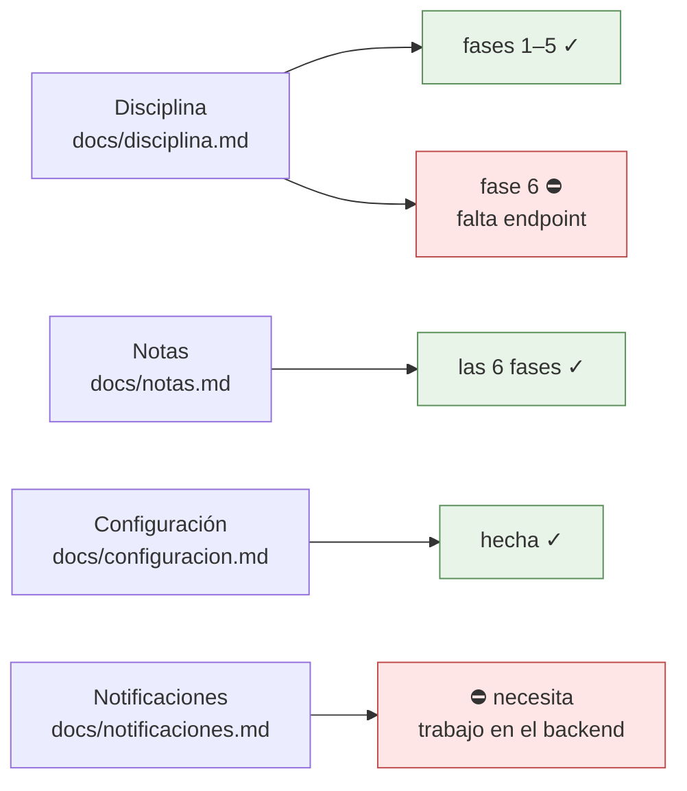

# Dónde va todo, y qué sigue

El mapa para retomar el trabajo sin que nadie tenga que contar nada. Se
actualiza en el mismo commit que cambia el estado que describe: si esta página
miente, es un fallo tan real como una prueba en rojo.

**Última actualización: 23 de agosto de 2026.** Lo último construido —las fases
4, 5 y 6 de notas y la pantalla de configuración— está en la rama
`feat/notas`, sin fusionar todavía a `main`.

## Los frentes abiertos

✓ hecho · ○ pendiente y se puede hacer ya · ⛔ bloqueado por algo de fuera

## Qué sigue, en orden

**No queda nada pendiente que dependa solo de la app.** Los dos frentes que
siguen abiertos —la pantalla de disciplina del alumno y las notificaciones—
necesitan trabajo en el backend, y el backend es de solo lectura para esta app.
Ver «Lo que está bloqueado».

Cuando se desbloquee alguno, el orden es:

1. **Disciplina, la pantalla del alumno y del acudiente**, en cuanto exista
   `GET disciplina/mis-fichas`. Es corta: la ficha del alumno en modo lectura.
2. **Notificaciones**, empezando por el paso 0 —comprobar con un `curl` que el
   hosting deje salir a Google— y por el tipo más tonto, el del muro, para
   probar la tubería entera antes de llenarla.

## Lo que está bloqueado, y por qué

- **Disciplina, la pantalla del alumno y del acudiente.** Hace falta un
  `GET disciplina/mis-fichas` que hoy no existe: todas las rutas que tocan
  `dis_procesos` llevan `auth.personal`, que a un alumno le responde 403. El
  detalle, en [disciplina.md](disciplina.md) → «Lo que queda pendiente».
- **Notificaciones.** Todo el plan cuelga de tres cosas del servidor —un
  endpoint de temas, un comando de artisan y una entrada de cron— y el backend
  es de solo lectura para esta app. Antes de nada hay que comprobar que el
  hosting deje salir por HTTPS a Google. Ver
  [notificaciones.md](notificaciones.md).
- **Un `PUT notas/lote`.** No existe y sería la mejora de carga más grande de
  todo el plan de notas: convertiría treinta peticiones en una. Anotado en
  [notas.md §1.5](notas.md).

## Cómo se trabaja aquí

- **Rama por frente**, con el nombre de lo que hace: `feat/disciplina`,
  `feat/notas`. Un commit por fase, con el porqué en el cuerpo del mensaje.
- **El backend es de solo lectura.** Vive en `~/DESARROLLOS/8myvc` y se lee para
  saber qué devuelve cada endpoint; nunca se edita. Lo que haga falta allí se
  anota en el documento del frente y se pide.
- **Cada plan vive en `docs/`**, con sus diagramas en Mermaid dentro del propio
  `.md`, y se pone al día en el commit que lo cambia.
- **Las trampas del backend se escriben con su prueba al lado.** Los listados se
  arman con `DB::select` y SQL a pelo, así que los tipos los decide PDO: el lado
  Flutter lee el JSON con [JsonBackend](../lib/Utils/JsonBackend.dart) en vez de
  fiarse.
- **Antes de commitear**: `flutter analyze` sin avisos y `flutter test` en verde.
  Con `--concurrency=2` si la máquina va justa; a pelo se queda sin memoria.

## El estado de cada frente, en detalle

### Notas — [notas.md](notas.md)

| Fase | Qué | Estado |
|---|---|---|
| 1 | La sesión completa: [ConfiguracionColegio](../lib/Utils/ConfiguracionColegio.dart) | hecha |
| 2 | Asignaturas con filtro «Hoy» + tarjeta en el muro | hecha |
| 3 | La planilla del indicador (casos A y B) | hecha |
| 4 | La ficha del alumno (casos C y E) | hecha |
| 5 | Notas perdidas | hecha |
| 6 | Frases, historial, borrar nota | hecha |

El camino en la app: menú ▸ Notas → [NotasScreen](../lib/Screens/NotasScreen.dart)
→ [LibroAsignaturaScreen](../lib/Screens/LibroAsignaturaScreen.dart), que tiene
dos pestañas sobre el mismo libro ya cargado:

- **Por indicador** → [PlanillaScreen](../lib/Screens/PlanillaScreen.dart), el
  trabajo diario: una casilla y los treinta alumnos.
- **Por alumno** → [FichaAlumnoNotasScreen](../lib/Screens/FichaAlumnoNotasScreen.dart),
  el acudiente que pregunta y el nivelar de fin de periodo.

Dentro de las dos, manteniendo pulsada una nota se abre su historial y desde
ahí se borra ([HojaDetalleNota](../lib/Widgets/HojaDetalleNota.dart)).

Y aparte, menú ▸ Notas perdidas →
[NotasPerdidasScreen](../lib/Screens/NotasPerdidasScreen.dart): el árbol de lo
que llevan por debajo de la mínima, del año entero y en una sola petición.

### Disciplina — [disciplina.md](disciplina.md)

Fases 1 a 5 hechas, la 4b incluida. Falta solo la pantalla del alumno y del
acudiente, bloqueada por el endpoint que no existe.

### Configuración — [configuracion.md](configuracion.md)

Hecha: menú ▸ Configuración →
[ConfiguracionScreen](../lib/Screens/ConfiguracionScreen.dart). Se edita lo que
un directivo cambia estando de pie —siete ajustes— y lo demás se ve, con «lo
demás se configura en la plataforma web» al final. La ve todo el personal; los
interruptores solo los mueve un administrador, y eso es **alcance de la app, no
permiso del servidor**: sus endpoints llevan `auth.personal` y un docente
podría llamarlos.

### Notificaciones — [notificaciones.md](notificaciones.md)

Solo el plan, y bloqueado. El paso 0 es un `curl` desde el servidor.

### Publicación en Google Play

[publicacion-play.md](publicacion-play.md) tiene la guía, y
[ficha-play.md](ficha-play.md) y [politica-privacidad.md](politica-privacidad.md)
los borradores. Si algún día entran las notificaciones, los dos hay que
retocarlos: hay que declarar el identificador de dispositivo de FCM.
