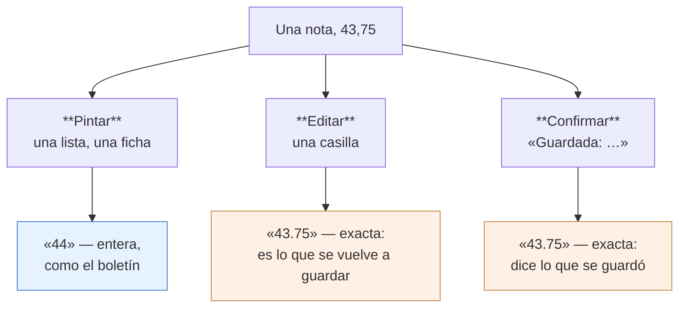

# La nota deja de ser un entero

El backend guardaba la definitiva de cada materia **redondeada a entero** y va a
dejar de hacerlo. Eso no rompe nada de esta app —se comprobó clase por clase—
pero cambia **lo que enseña** en dos sitios y **lo que guarda** en uno.

**Estado: hecho aquí el 30 de agosto de 2026, y esperando al servidor.** La
migración no estaba ni comiteada cuando esto se escribió.

## De dónde viene

Los puestos del boletín empataban en masa. La causa es que la definitiva se
escribía con un `CAST(... AS DECIMAL(4,0))`, o sea redondeada: **el 77,1 % de las
125.352 definitivas** de una base estaban en un entero. Dos alumnos con 43,75 y
44,20 se imprimían iguales y compartían un puesto que no compartían.

La migración `2026_08_30_200000_notas_finales_en_decimal` pasa la columna a
`DECIMAL(7,4)` y mueve los dos `CAST` que la escriben —el de
`DefinitivasDeAsignatura` y su gemelo de `DefinitivasPeriodosController`—. Desde
entonces una nota puede valer 43,75.

Medido por la sesión del front web (`myvc-front-b8`) y verificado por la del
backend. Las cifras son de **una** base; el argumento no cuelga del número.

## Lo que no hubo que tocar

Se revisó antes de escribir nada, porque el backend lo tenía marcado como
bloqueante:

- **Ni un `as int`** en las 112 clases de `lib/`.
- Las notas se leen con `_decimal()`, que traga `43.75` y `"43.7500"`.
- Los campos son `double`.
- Los tres `toInt()` que hay son de ids, contadores y un tope de validación.

La capa tolerante de [JsonBackend](../lib/Utils/JsonBackend.dart) estaba escrita
para exactamente esto, y aguantó sin cambios.

## Las tres categorías

Aquí estuvo el trabajo, y no salió de un `grep`. Buscando `toStringAsFixed`
aparecían cinco sitios y **tres ni siquiera eran notas**: un porcentaje con su
`%` pegado, el rango de una escala de valoración y dos casillas editables. Hubo
que abrir los ocho llamantes uno a uno.



| Categoría | Cuántos | Dónde |
|---|---|---|
| **Pintar** | 1 | `LibroAsignaturaScreen:453` |
| **Editar** | 6 | `PlanillaScreen` ×2, `FichaAlumnoNotasScreen` ×3, `NotasPerdidasScreen` ×1 |
| **Confirmar** | 1 | `NotasPerdidasScreen:199` |

Más el getter `AsignaturaNotaModel.notaEscrita`, que pinta y va con los de
arriba: es el que usa «Mis notas».

**El eco merece su fila y casi no la tuvo.** `'Guardada: ${…}'` parece un display
—desde una lista de líneas es idéntico— pero el valor que enseña es el que el
docente acaba de teclear y que acaba de viajar al servidor. Redondeado ahí,
alguien guarda 43,75 y la app le contesta «Guardada: 44»: una confirmación falsa,
del único número que esa persona está mirando en ese momento. Se cazó abriendo el
fichero, no leyendo la lista.

Y la trampa que se lleva por delante a quien lo toque con un `grep`: **había dos
funciones llamadas `notaEscrita`**, una en `LibroNotasApi` para casillas y un
getter en `NotasAlumnoModel` para pintar. Mismo nombre, reglas opuestas. Por eso
la de casillas pasó a llamarse `notaEnCasilla` y la regla vive ahora en un solo
sitio, [FormatoDeNota](../lib/Utils/FormatoDeNota.dart).

## Lo que se decidió, y por quién

**Una nota se pinta entera.** Decisión de Joseth, 30 ago 2026, y es la misma que
tomó esa mañana para el promedio del periodo: la app escribe como el papel que se
firma. El boletín imprime la nota de una materia entera desde hace años, y dos
números distintos para el mismo alumno según mire la pantalla o el papel es peor
que un número discutible.

**Un promedio no.** Los dos que la app pinta —`LibroAsignaturaScreen:448` y
`FichaAlumnoNotasScreen:633`— conservan su decimal. Ahí el decimal es justo lo
que se fue a buscar: sin él vuelven los empates.

## El redondeo del cliente, y el orden que obliga

`NotaFinalDelLibro.trasRecalcularse` **redondeaba del lado de la app**, y su
docblock lo justificaba citando el `DECIMAL(4,0)` del servidor: era copiarle. La
migración convierte ese `CAST` en `DECIMAL(7,4)`, con lo que la línea que hacía
coincidir los dos números pasa a ser la que los separa —el docente guarda una
subunidad, la app enseña «44», el servidor tiene 43,75— hasta la siguiente
recarga, sin error y sin excepción.

**Y por eso el orden no es libre.** Hoy el cliente y el servidor redondean los dos
y coinciden: quitar el redondeo aquí antes de que la migración esté desplegada
abre la misma divergencia en el otro sentido, y afectando a los quince en vez de
a ninguno. Esa línea no estaba mal; estaba atada a un contrato vigente.

```
1. app2      cuando se quiera — es independiente, allí sólo se pinta
2. backend   la migración, en los QUINCE, verificada por hash de tanda
3. Flutter   el bundle con esto — sólo después de que 2 esté confirmado
```

Se propuso dejarlo detrás de un interruptor apagado, como
[PendientesUsuarios](../lib/Http/UsuariosApi.dart), para poder publicar el bundle
antes. **Joseth eligió no ponerlo** y sostener el orden: la migración primero, el
bundle después. Queda escrito porque es la condición que hace correcto el código
de hoy, y quien publique un bundle sin comprobarla no verá ningún test en rojo.

## Lo que esta app no decide

El formato del boletín impreso y de los puestos es del backend y del front web.
Aquí sólo se decide qué enseña el teléfono, y se decidió que enseñe lo mismo.
