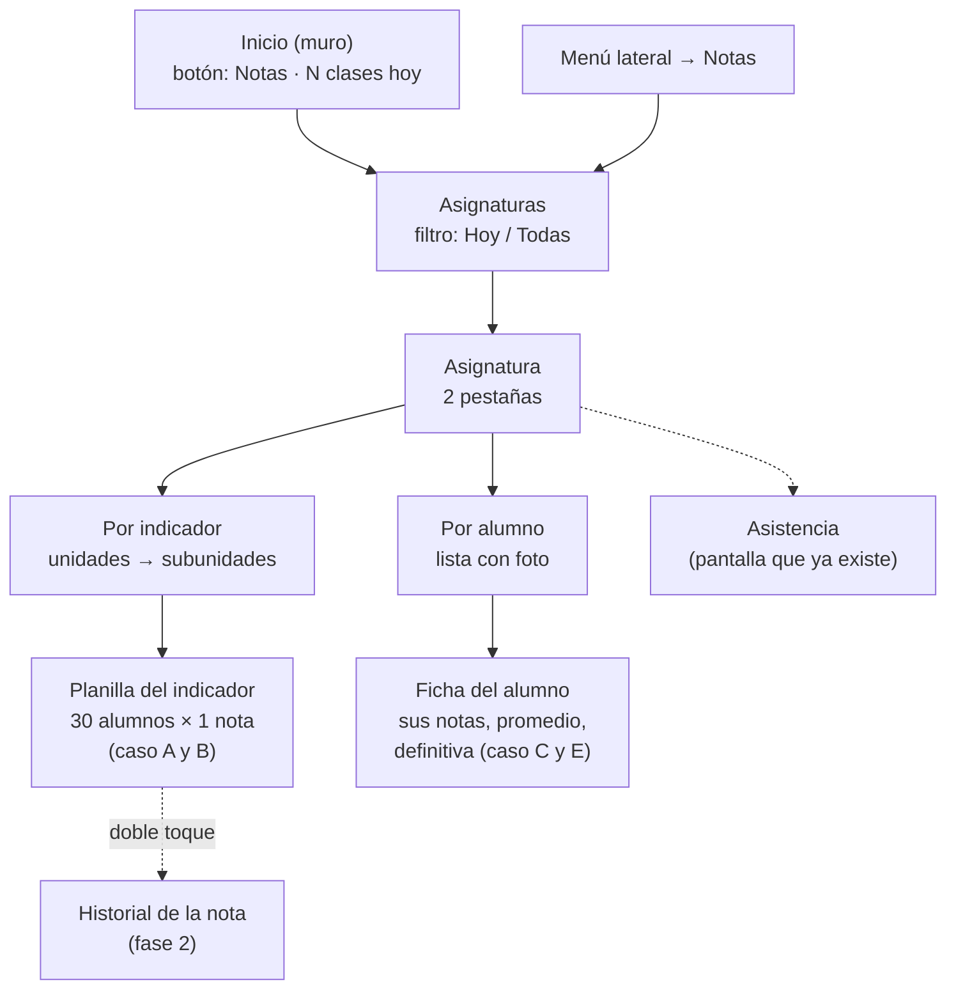
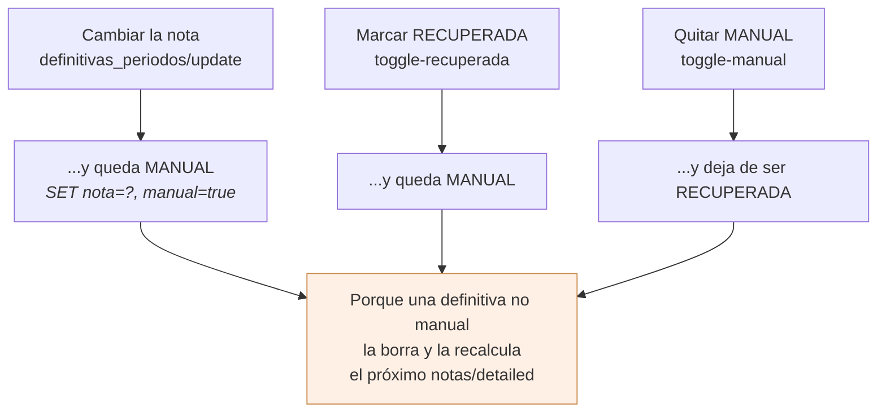
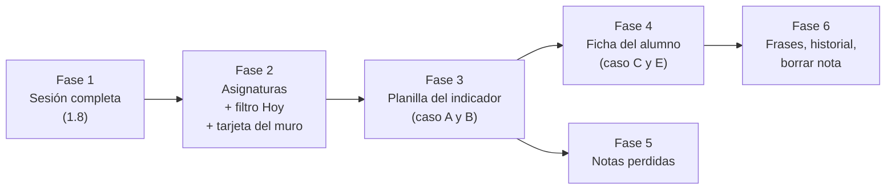

# Notas en la app

Plan para llevar al teléfono el trabajo diario del docente con las notas: el
libro de notas, las notas perdidas, y el camino para llegar a ellos sin dar
vueltas. Escrito el 23 de agosto de 2026.

Lo que hay hoy en la app es la mitad de arriba de la cadena —las unidades y las
subunidades se crean en [UnidadesScreen](../lib/Screens/UnidadesScreen.dart)— y
la mitad de abajo vista por el alumno —[MisNotasScreen](../lib/Screens/MisNotasScreen.dart)—.
Falta justo el medio: poner la nota.

## Estado

El mapa de todos los frentes está en [estado.md](estado.md); esta tabla es la de
este.

| Fase | Qué | Estado |
|---|---|---|
| 1 | La sesión completa: [ConfiguracionColegio](../lib/Utils/ConfiguracionColegio.dart) | **hecha** |
| 2 | Asignaturas con filtro «Hoy» + tarjeta en el muro | **hecha** |
| 3 | La planilla del indicador (casos A y B) | **hecha** |
| 4 | La ficha del alumno (casos C y E) | **hecha** |
| 5 | Notas perdidas | **hecha** |
| 6 | Frases, historial, borrar nota | **hecha** |

Lo hecho vive en:

- [ConfiguracionColegio.dart](../lib/Utils/ConfiguracionColegio.dart) — los ajustes que ya venían en /login y nadie leía.
- [HorarioDeHoy.dart](../lib/Utils/HorarioDeHoy.dart) y [FiltroAsignaturas.dart](../lib/Utils/FiltroAsignaturas.dart) — qué clases toca hoy y con qué filtro se dejó la pantalla.
- [LibroNotasApi.dart](../lib/Http/LibroNotasApi.dart) — el libro, y el guardado por lotes.
- [NotasScreen.dart](../lib/Screens/NotasScreen.dart) → [LibroAsignaturaScreen.dart](../lib/Screens/LibroAsignaturaScreen.dart), con sus dos pestañas → [PlanillaScreen.dart](../lib/Screens/PlanillaScreen.dart) y [FichaAlumnoNotasScreen.dart](../lib/Screens/FichaAlumnoNotasScreen.dart).
- [DefinitivasApi.dart](../lib/Http/DefinitivasApi.dart) — nivelar, y las tres trampas de las banderas.
- [NotasPerdidasApi.dart](../lib/Http/NotasPerdidasApi.dart) y [NotasPerdidasScreen.dart](../lib/Screens/NotasPerdidasScreen.dart) — lo que llevan perdido, y arreglarlo.
- [FrasesApi.dart](../lib/Http/FrasesApi.dart), [FraseModel.dart](../lib/Models/FraseModel.dart) y [SelectorFrases.dart](../lib/Widgets/SelectorFrases.dart) — la información para el alumno.
- [HistorialNotaApi.dart](../lib/Http/HistorialNotaApi.dart) y [HojaDetalleNota.dart](../lib/Widgets/HojaDetalleNota.dart) — de dónde viene una nota, y borrarla.

---

## 1. El libro de notas

### 1.1 Lo que hace el front web, y por qué aquí no vale

`notas/notas.html` es **una tabla**: los alumnos en las filas, las subunidades
en las columnas agrupadas por unidad, y encima ausencias, tardanzas, frases,
promedio automático, definitiva real, «manual» y «recuperada». Con un grupo de
30 alumnos y 12 subunidades son 360 celdas editables, más columnas fijas y
scroll horizontal. Sobre eso hay cuatro interruptores (tab vertical u
horizontal, ocultar ausencias, ver historial, nombre inmóvil, ver títulos) y un
panel flotante arrastrable, la «nota rápida».

Eso no es una pantalla que se estreche: es una hoja de cálculo. En un teléfono
de 390 puntos de ancho, una tabla de 360 celdas con scroll en los dos ejes es
inusable, y los cinco interruptores existen precisamente para *domar* la tabla.
Si la tabla no está, sobran.

**La decisión de fondo: no portar la tabla. Invertir la jerarquía.** En vez de
una rejilla con dos ejes, dos listas verticales que enseñan los mismos datos por
un eje cada vez. Es exactamente lo que ya hace el widget «Clases de hoy» del
panel web (`panel/horarioHoyPanelDir.html`): asignatura → unidades →
subunidades → lista de alumnos con su nota. Ese widget es la versión móvil que
el propio front ya descubrió que hacía falta; aquí se convierte en la pantalla
principal en vez de en un accesorio del panel.

### 1.2 Los casos de uso, y cuál manda

Ordenados por cuántas veces al día ocurren:

| # | Qué hace el docente | Cuándo | Eje |
|---|---|---|---|
| A | Poner la nota de **un indicador a todo el grupo** | al acabar la clase, todos los días | por subunidad |
| B | Corregir **la nota de un alumno** en un indicador | trabajo entregado tarde, reclamo | por subunidad |
| C | Mirar **cómo va un alumno** en toda la asignatura | el acudiente pregunta | por alumno |
| D | Marcar ausencias y tardanzas del día | todos los días | por alumno |
| E | Nivelar la definitiva, marcar recuperada o manual | fin de periodo | por alumno |
| F | Repasar quién va perdiendo | cada tanto, y al cerrar | otra pantalla |

**A manda.** Es el que se repite y el que hoy obliga al docente a abrir el
portátil. Todo lo demás se acomoda alrededor.

D ya está resuelto en la app: [AsistenciaClaseScreen](../lib/Screens/AsistenciaClaseScreen.dart).
No se duplica; se enlaza. F es la pantalla de notas perdidas, sección 4.

### 1.3 La navegación



Las dos pestañas son **la misma matriz leída por sus dos ejes**, y comparten los
datos ya cargados en memoria: cambiar de pestaña no pide nada al servidor.

### 1.4 La planilla del indicador — el caso A

Es la pantalla que más se va a usar, así que se diseña para ella y no para el
promedio de todas.

```
┌──────────────────────────────────────┐
│ 3° B · Matemáticas          [ ⋮ ]    │  título: grupo y materia
│ 2. Quiz de fraccionarios  (20%)      │  la subunidad, con su porcentaje
├──────────────────────────────────────┤
│ A todos: [ 100 ]  [ Aplicar ]        │  la «nota rápida», ya sin panel flotante
├──────────────────────────────────────┤
│ 🙍 Acosta Muñoz, Laura      [  85  ] │
│ 🙍 Bermúdez Ríos, Juan      [  40  ] │  ← en rojo: por debajo de la mínima
│ 🙍 Cárdenas Peña, Sofía     [ 100  ] │
│ ...                                  │
├──────────────────────────────────────┤
│ 6 sin guardar        [ Guardar ]     │  barra fija abajo
└──────────────────────────────────────┘
```

Las decisiones que importan:

- **Foto y apellidos.** Es la regla de la app para todo lo que sea una persona
  (ver `AvatarPersona`); aquí además ayuda a no equivocarse de fila, que en una
  tabla de 30 nombres parecidos es el error clásico.
- **Teclado numérico y `selectAll` al enfocar.** Se toca el campo y se escribe
  el número encima; no hay que borrar lo que había.
- **`textInputAction.next` baja al siguiente alumno sin cerrar el teclado.**
  Esto es lo que sustituye al «Tab vertical» del web y es, en la práctica, lo
  que decide si pasar 30 notas cuesta un minuto o cinco. Con el teclado abierto
  se ven unos seis alumnos; la lista se autodesplaza para dejar el campo activo
  justo encima del teclado.
- **«A todos» en vez del panel flotante.** La nota rápida del web es un panel
  arrastrable que hay que activar y luego ir tocando celdas. Aquí el caso real
  —«casi todos sacaron 100, tres no»— se resuelve mejor al revés: se rellena la
  columna entera de una vez y se corrigen las tres excepciones. Un campo y un
  botón, sin modo que activar ni desactivar.
- **Rojo por debajo de `nota_minima_aceptada`**, igual que el web. El valor
  llega en la sesión (ver 1.7).

### 1.5 Cómo se guarda — y aquí hay una diferencia deliberada con el web

El front web guarda **una nota por petición**, disparada al salir del campo con
un debounce de un segundo (`NotasApi.actualizar(nota.id, {nota})`). Pasar una
columna de 30 alumnos son 30 `PUT`. Y la nota rápida por columna reescribe
*todas* las notas, hayan cambiado o no.

En un portátil con cable eso se nota poco. En un teléfono con datos móviles en
un colegio, no: cada petición puede tardar o fallar sola, y el docente se queda
sin saber cuáles entraron.

**Aquí se edita en local y se guarda cuando se dice.**

```mermaid
sequenceDiagram
    participant D as Docente
    participant P as Planilla (memoria)
    participant S as Servidor
    D->>P: escribe 30 notas
    Note over P: nada sale todavía;<br/>la barra de abajo dice «30 sin guardar»
    D->>P: Guardar
    P->>P: descarta las que no cambiaron
    loop solo las cambiadas, de 3 en 3
        P->>S: PUT notas/update/{id}
        S-->>P: ok / error
    end
    P-->>D: «28 guardadas, 2 fallaron · Reintentar»
```

- **Solo las que cambiaron.** Comparando con el valor que vino del servidor. En
  el caso «puse 100 a todos y ya estaban en 100», eso son cero peticiones donde
  el web hace treinta.
- **Concurrencia limitada a 3.** Treinta peticiones simultáneas contra un
  hosting compartido es la forma más rápida de que el servidor empiece a
  rechazar. De tres en tres tarda casi lo mismo y no lo tumba.
- **Las que fallen se quedan marcadas y se reintentan**, sin perder lo escrito.
- **Autoguardado al salir**: al volver atrás o cambiar de subunidad con cambios
  pendientes, se guarda; si falla, se pregunta antes de descartar.

> **Pendiente de autorización del backend.** No existe un endpoint de lote para
> notas: `PUT notas/update/{id}` es de una en una. Un `PUT notas/lote` que
> recibiera `[{id, nota}, …]` convertiría 30 peticiones en 1 y sería, de largo,
> la mejora de carga más grande de todo este plan. El backend es de solo
> lectura para esta app, así que queda anotado, no hecho.

### 1.6 La ficha del alumno — casos C y E

La traspuesta: un alumno, y debajo sus unidades con sus subunidades y la nota de
cada una, el promedio automático, la definitiva real, y los interruptores
«manual» y «recuperada».

La definitiva y sus dos interruptores van por endpoints distintos y con su
propio permiso (`profes_pueden_nivelar`, no `profes_pueden_editar_notas`):
`definitivas_periodos/update`, `toggle-manual`, `toggle-recuperada`. Y el permiso
se niega con un **400**, no con un 403 —`User::pueden_modificar_definitivas`
aborta así—, de modo que ahí un 400 no es «petición mal hecha» sino «no te
dejan».

**El promedio se calcula en la app, no se espera al servidor.** La gracia de
nivelar es ver a dónde llega el promedio *antes* de decidir la definitiva, y
para eso no sirve un número que solo se refresca al recargar el libro. Es la
misma cuenta que hace `notas/detailed` en SQL y la que hace el front web en
`promedioTotal`; las casillas sin nota no suman, igual que allí, porque en SQL
un NULL no entra en el `SUM`.

#### Las tres trampas de las dos banderas

`manual` y `recuperada` parecen dos interruptores independientes y no lo son: el
backend cruza sus efectos dentro de la misma sentencia SQL. Están en
[DefinitivasApi](../lib/Http/DefinitivasApi.dart), cada una con su prueba.



Las tres salen de lo mismo: `notas/detailed` **borra y vuelve a insertar** la
definitiva de todo alumno que no la tenga manual ni recuperada. Una nota
nivelada que no estuviera marcada se perdería sola al abrir el libro, así que el
backend no deja que esa combinación exista. La app no lo esconde: lo dice al
guardar —«queda marcada como manual, así que el sistema ya no la
recalculará»—, porque callarlo haría que el siguiente recálculo que no ocurre
pareciera un fallo.

Y un cuarto detalle, este de solo lectura: la columna `nfinal_desactualizada`
vale **1 cuando la definitiva guardada es más vieja que la última nota puesta**.
Se enseña solo si es manual, que es el único caso en que decir algo tiene
sentido: la automática se recalcula sola.

#### Guardar una nota cambia dos cosas, no una

Salió al construir la fase 6 y obligó a corregir la 4. **`notas/update`
recalcula además la definitiva del alumno**, al final del método y fuera del
`try` —`DefinitivasDeAsignatura::recalcularPorNota`—. Respeta las manuales y
las recuperadas, que las salta, y a las demás les escribe el promedio
**redondeado a entero**: la consulta lo castea a `DECIMAL(4,0)`.

Si la app apuntara solo la nota, la ficha enseñaría la definitiva vieja justo
debajo del promedio nuevo, y la pestaña «Por alumno» seguiría con la de antes
hasta la siguiente recarga. Así que `LibroDeNotas.conNotas` aplica las dos
mitades, con la misma regla y el mismo redondeo. Tiene sus pruebas.

Lo que la app **no** puede seguir es el recálculo que dispara **borrar** una
nota: para saber el promedio nuevo haría falta saber que esa casilla ya no
existe, y quien tiene el libro en memoria sigue teniéndola. Por eso borrar es lo
único de la ficha que obliga a pagar otra vez la consulta cara.

#### Dos formas de guardar en la misma pantalla, y es a propósito

Los números —las notas de subunidad y la definitiva— se editan en local y salen
al pulsar Guardar, igual que en la planilla y por lo mismo. Los dos
interruptores se mandan al tocarlos, y no es incoherencia: son peticiones
diminutas y, sobre todo, **el servidor cruza sus efectos**, así que lo que hay
que pintar es lo que de verdad quedó, y eso solo se sabe preguntando.

Al guardar van **primero las notas y después la definitiva**. La definitiva que
se escribe es la que el docente decidió *viendo* el promedio que sale de esas
notas; mandarla antes dejaría un instante en que la fila nivelada es más vieja
que las notas de las que salió, que es justo lo que el backend marca como
desactualizada.

### 1.7 El bloqueo del periodo

El colegio cierra el periodo y los docentes dejan de poder editar. Son dos
permisos separados, ambos por periodo, y ambos vienen en la sesión:

- `profes_pueden_editar_notas` → las notas de subunidad y las ausencias.
- `profes_pueden_nivelar` → la definitiva, «manual» y «recuperada».

**Y aquí la app NO copia al front web, porque el front web se equivoca.** Su
comprobación es `hasRoleOrPerm('Admin')`, o sea el **rol**. La del backend, en
`User::pueden_editar_notas`, es otra: solo pasan los usuarios de **tipo**
`'Profesor'` —con la bandera del periodo en 1— y los **superusuarios**;
cualquier otro recibe un 403 tenga el rol que tenga. Resultado en la web: a un
administrativo con rol de admin que no sea superusuario le pinta los campos
editables y le da un error al guardar.

La app aplica la regla del backend. Es mejor un campo gris con su motivo que uno
que acepta lo que después se pierde. Está en
[ConfiguracionColegio](../lib/Utils/ConfiguracionColegio.dart) y tiene su prueba.

**Los campos se muestran en solo lectura, no se ocultan**, con un aviso arriba
que diga por qué. Un campo que desaparece parece un error de la app; un campo
gris con «Este periodo está bloqueado» es una respuesta. Son cuatro frases y no
una: los dos permisos son independientes y al docente le importa cuál le falta,
y a quien no es docente hay que decirle otra cosa —«las notas las edita el
docente de la asignatura»— porque su motivo no es el periodo.

### 1.8 Lo que falta parsear en la sesión

[AuthService](../lib/Http/AuthService.dart) hoy lee del login el token, el tipo,
los roles y `personaId`. El backend manda mucho más en ese mismo JSON
(`app/Services/ContextoDeUsuario.php`), y este plan necesita:

| Campo | Para qué |
|---|---|
| `profes_pueden_editar_notas` | bloqueo, 1.7 |
| `profes_pueden_nivelar` | bloqueo de la definitiva |
| `nota_minima_aceptada` | pintar en rojo lo perdido |
| `unidad_displayname`, `subunidad_displayname` | cada colegio les da su nombre («Logro», «Indicador») |
| `show_materias_todas` | el filtro de hoy, sección 2 |
| `alumnos_can_see_notas` | si el alumno tiene las notas bloqueadas |

Ya vienen en la respuesta; solo hay que leerlos. Con
[JsonBackend](../lib/Utils/JsonBackend.dart), que es lo que hay para no fiarse
del tipo que devuelva PDO.

### 1.9 Lo que llegó después de la primera versión — fase 6

Las tres cosas que se dejaron fuera del arranque, y cómo quedaron.

**Frases** («información para el alumno»). Son dos tablas y no conviene
confundirlas: `frases` es el catálogo del año, que escribe el colegio —más de
cuatrocientas filas en producción—, y `frases_asignatura` es lo que se le pone a
un alumno concreto en una asignatura y un periodo. Tres cosas que importan:

- **Las que ya tiene un alumno no se piden**: vienen dentro de `notas/detailed`,
  en `alumno.frases`. El catálogo sí es una petición aparte, y se hace **la
  primera vez que alguien va a poner una**, no al abrir la ficha: son
  cuatrocientas filas que la mayoría de las visitas no llega a mirar.
- **El periodo no se puede elegir.** `FrasesAsignaturaController` escribe
  siempre `periodo_id = $user->periodo_id`, o sea el de la barra de arriba, y no
  mira lo que se le mande. Ofrecer elegirlo sería ofrecer algo que no se cumple.
- **Poner devuelve la lista entera recalculada; quitar no.** El `store` contesta
  todas las frases del alumno y el `destroy` solo la fila borrada, así que al
  poner se pinta lo que dice el backend y al quitar se saca de la lista de aquí.

**Historial de la nota.** `PUT historiales/nota-detalle {nota_id}` sobre las
`bitacoras` que ya escribía cada `notas/update`. Se llega **manteniendo pulsada
la nota**, en la planilla y en la ficha. En la web hay que encender antes un
interruptor «Ver historial» para que el doble clic haga algo, y un modo que hay
que acordarse de encender es un modo que nadie enciende.

Un detalle al leerlo: la bitácora guarda las notas en columnas
`..._value_int`, así que un 85,5 quedó registrado como 85. El historial dice
quién y cuándo con precisión, y el cuánto con la del entero; enseñar decimales
que nadie guardó sería inventarlos.

**Borrar una nota.** `DELETE notas/destroy/{id}`, dentro de la misma hoja del
historial y con confirmación. Vive ahí y no suelto en la lista a propósito:
borrar es raro y destructivo, así que hay que abrir algo primero, y de paso se
ve lo que se va a perder antes de perderlo.

El diálogo dice que la casilla vuelve, porque si no, borrar da miedo de más:
`notas/detailed` la vuelve a crear con la nota por defecto de la subunidad. Es
la forma de deshacer «puse un 40 donde no había nada» sin dejar un cero que
parezca una nota de verdad.

Y una consecuencia que sí obliga a recargar: **el borrado recalcula la
definitiva** del alumno. Actualizar una nota también lo hace y la app sí sabe
seguirlo —ver «Guardar una nota cambia dos cosas»—, pero borrar no: para saber
el promedio nuevo haría falta saber que la casilla ya no está, y el libro en
memoria sigue teniéndola.

De paso, un campo cuya nota se acaba de borrar se apaga. La fila ya no existe y
`notas/update` sobre ella contesta un 422, así que dejarlo escribiendo sería
prometer un guardado que no puede ocurrir.

### Lo que sigue fuera a propósito

- **Ausencias y tardanzas dentro del libro**: no se traen. Se enlaza a
  [AsistenciaClaseScreen](../lib/Screens/AsistenciaClaseScreen.dart), que ya
  hace eso mejor que una columna dentro de una tabla.

  El plan decía «un botón en la cabecera de la asignatura», y al implementarlo
  no encajaba: esa pantalla es **de un alumno** —recibe `alumnoId` y `grupoId` y
  la materia se elige dentro—, no de una asignatura. Así que el enlace está
  donde sí hay un alumno: tocando la foto o el nombre en la planilla. Sale mejor
  de lo previsto, porque marcar la falta de hoy es justo lo otro que se hace al
  acabar la clase, y queda a un toque de la nota. Los contadores de faltas y
  tardanzas ya vienen en el libro y se pintan bajo el nombre, sin pedir nada.

---

## 2. Las asignaturas y el filtro de «hoy»

Al docente le salen hoy **todas** sus asignaturas. En un colegio donde cada
asignatura tiene configurados sus días —las columnas `lunes` … `sabado` de
`asignaturas`, que se editan en `areas/asignaturas.html` con los botones Sí/No—
eso es ruido: de doce asignaturas, hoy dicta tres.

**Lo que se hace:**

- Una fila de chips arriba de la lista: **[ Hoy ] [ Todas ]**.
- Por defecto, **Hoy**.
- La elección se guarda en el dispositivo (`shared_preferences`, que es el
  `localStorage` de aquí), con clave por usuario para que en un teléfono
  compartido no se herede la del anterior: `asignaturas.filtro.<user_id>`.

Y dos reglas que evitan una pantalla vacía, que es el fallo obvio de esto:

1. Si el año tiene `show_materias_todas = 1`, el colegio ha dicho
   explícitamente «ignora el horario»: el filtro no se muestra y se ven todas.
2. Si hoy no hay ninguna —es domingo, o el colegio no configuró los días—, se
   cae a Todas sola y se dice por qué: «Hoy no tienes clases; se muestran
   todas». Nunca una lista vacía sin explicación.

**De dónde salen las de hoy, y esto es lo bueno:** ya están llegando. La app
pide `GET /ChangesAsked/to-me` para pintar el muro
([MuroApi](../lib/Http/MuroApi.dart)), y esa misma respuesta trae, para
docentes, `horario_hoy` y `horario_manana` **ya filtrados por el servidor**
(`ChangeAskedController::asignaturas_dia`, que también respeta
`show_materias_todas`). Hoy la app los descarta. Leerlos cuesta cero
peticiones nuevas.

`GET asignaturas/listasignaturas`, en cambio, **no** devuelve las columnas de
días (`Profesor::asignaturas` no las selecciona), así que el filtro no se puede
calcular en el cliente a partir de ahí. Por eso la fuente es `horario_hoy`.

---

## 3. El acceso desde el muro

El muro es lo primero que se ve y es un scroll largo de publicaciones. Meter
ahí la puerta a las notas, para docentes, como **una tarjeta encima de las
publicaciones**:

```
┌──────────────────────────────────────┐
│  📓  Notas                           │
│      3 clases hoy · 3°B, 4°A, 5°A    │
└──────────────────────────────────────┘
     ↓ lleva a Asignaturas, ya filtrada a Hoy
```

Una tarjeta y no un botón flotante: el botón flotante tapa publicaciones y en
una lista larga estorba. Y con el recuento de clases de hoy dentro, porque ese
dato ya está en la misma respuesta del muro y convierte el botón en información.

Para alumnos y acudientes esa tarjeta no aparece. En el menú lateral, «Notas»
se añade junto a Unidades para docentes y administrativos.

---

## 4. Notas perdidas

La pantalla para que el docente vea y arregle lo que sus alumnos llevan
perdido, por grupo, asignatura, unidad y subunidad.

**El backend está listo y no hay que tocarlo:**

- `PUT notas-perdidas/profesor-grupos` con `{profesor_id, periodo_a_calcular}`
  devuelve el árbol completo: grupo → asignatura → alumno → notas. Cada nota
  trae `nota_id`, `numero_periodo`, `defin_unidad`, `defin_subunidad`,
  `orden_unidad`, `orden_subunidad`. **Todo el filtrado que se quiere sale de
  esa única respuesta**, sin más peticiones.
- `PUT notas/update/{id}` para corregir, la misma de la sección 1.

**Decisiones:**

- **Periodo: todo el año.** Se pide con `periodo_a_calcular = 10`, que el
  backend traduce a `p.numero <= 10`, o sea todos. El docente ve lo perdido del
  año entero de una vez. Encima, unos chips **[Todos] [1] [2] [3] [4]** que
  filtran **en el cliente** sobre lo ya traído —igual que hace el web—, sin
  volver al servidor.
- **La fila arreglada no desaparece.** La consulta solo devuelve notas por
  debajo de la mínima, así que al subir una a aprobado dejaría de venir en la
  siguiente carga. En pantalla se queda, marcada en verde y con la nota nueva,
  hasta que se refresque a mano. Desaparecer sola la haría parecer perdida.
- **Elegir docente** (para quien no es docente): con `CampoDocente` de
  [SelectorDocente](../lib/Widgets/SelectorDocente.dart). Nunca un dropdown.
- **Jerarquía plegable**, no la tabla del web: grupo → asignatura → alumno →
  sus notas perdidas, cada nivel con su recuento («4 alumnos», «7 notas»). Al
  abrir, el primer grupo desplegado y el resto cerrado.

**Lo que se aprendió al construirla**, y que el plan no decía:

- **El filtro por periodo corta de abajo arriba.** Quedarse solo con las notas
  del periodo deja alumnos con cero notas, asignaturas con cero alumnos y grupos
  con cero asignaturas. Hay que ir podando hacia arriba: una lista de cajas
  vacías es peor que no filtrar. Es lo mismo que hace el front web en
  `selectFiltrarPeriodo`, y tiene su prueba.
- **Los chips se ofrecen solo de los periodos que tienen algo.** Enseñar los
  cuatro siempre es ofrecer filtros que dejan la pantalla en blanco, y una
  pantalla en blanco se lee como un fallo de la app. Con un solo periodo con
  pérdidas, la fila de chips ni aparece.
- **La foto del alumno no está donde parece.** La consulta de alumnos solo trae
  `foto_id`; el nombre del archivo, ya resuelto al de por defecto según el sexo,
  viene dentro de `userData`. Y cuando el alumno no tiene cuenta de usuario,
  `Alumno::userData` devuelve `{"": null}` en vez de un objeto vacío, así que
  hay que comprobar que sea un mapa antes de leerlo.
- **Se guarda nota a nota, con su botón**, y no con un Guardar general como en
  la planilla. Aquí no se pasa una columna: se corrigen una o dos notas sueltas
  que alguien recuperó, y cada una vive en un sitio distinto del árbol. El botón
  solo aparece cuando el campo cambió.

---

## 5. Lo que esto le cuesta al servidor

El hosting es compartido. Tres cosas concretas:

**`PUT notas/detailed` es la consulta más cara del proyecto.** Por cada
subunidad llama a `Nota::verificarCrearNotas`, que hace un `INSERT … WHERE NOT
EXISTS` **por alumno**; después, por cada alumno, va a buscar sus datos de
usuario y sus frases. Con 12 subunidades y 30 alumnos son unos 360 inserts
condicionales más 60 consultas sueltas, en una sola petición.

Regla para la app: **se llama una vez por asignatura y periodo, y se cachea en
memoria mientras la pantalla viva.** Nunca al arrancar la app, nunca al volver
atrás. Refresco solo tirando hacia abajo. Cambiar de pestaña, filtrar o buscar
no vuelve a pedirla.

**No hay endpoint de lote**, así que guardar es N peticiones pequeñas. Se
mitiga como dice 1.5: solo las que cambiaron, de tres en tres.

**Nada de sondeo.** La app no pregunta cada X segundos por nada. Lo que haya
que avisar, se avisa por push (ver [notificaciones.md](notificaciones.md)).

---

## 6. Cosas del backend que conviene mirar

Salieron leyendo el servidor para escribir esto. **No se tocan** —el backend es
de solo lectura para esta app—, quedan anotadas:

1. **`putSubunidad` tiene el SQL roto.** En `NotasController.php:369`, el
   `INSERT` que crea la nota que falta está dentro de una cadena de comillas
   dobles pero conserva los puntos y comillas de una concatenación:
   `'.$sub_id.'`. PHP interpola la variable pero deja los puntos, así que a
   MySQL le llega la cadena `.5.` donde debía ir el número. Consecuencia: si un
   alumno no tiene fila en `notas` para esa subunidad, no se crea bien y el
   `SELECT` de la línea 383 devuelve vacío → `$nota[0]` revienta con un 500.

   **Impacto en el plan:** el endpoint `PUT notas/subunidad` solo es fiable si
   las notas ya existen. Por eso la app **materializa las notas llamando una
   vez a `notas/detailed`** —que sí usa la versión correcta, con parámetros
   ligados— al abrir la asignatura, y a partir de ahí trabaja en local.

2. **`horario_manana` ignora `show_materias_todas`** y se calcula como
   `$dia + 1`, que el sábado da 7 y no encaja con ningún `case`, así que el
   filtro queda vacío y salen todas. No afecta a este plan porque la app usa
   `horario_hoy`, pero si algún día se añade «Mañana» hay que contar con ello.

---

## 7. Orden de trabajo



La fase 1 es pequeña y las demás dependen de ella. La 3 es la que quita el
portátil de en medio: en cuanto esté, ya sirve aunque falte todo lo demás. La 5
es independiente de la 4 y puede adelantarse si corre más prisa.

## Apéndice: endpoints

| Endpoint | Para qué | Permiso |
|---|---|---|
| `GET ChangesAsked/to-me` | ya se usa; de aquí salen `horario_hoy` y `horario_manana` | sesión |
| `GET asignaturas/listasignaturas/{persona_id?}` | las asignaturas del docente (sin días) | `persona.propia` |
| `GET unidades/de-asignatura-periodo/{a}/{p}` | unidades y subunidades, ya en uso | |
| `PUT notas/detailed` | el libro completo; **materializa las notas** | `auth.personal` |
| `PUT notas/subunidad` | alumnos de una subunidad; ver 6.1 | `auth.personal` |
| `PUT notas/update/{id}` | guardar una nota | `auth.personal` |
| `DELETE notas/destroy/{id}` | borrar una nota (fase 6) | `auth.personal` |
| `PUT notas-perdidas/profesor-grupos` | el árbol de notas perdidas | `auth.personal` |
| `PUT definitivas_periodos/update` | la definitiva real | `auth.personal` |
| `PUT definitivas_periodos/toggle-manual` | marcar la definitiva como puesta a mano | `auth.personal` |
| `PUT definitivas_periodos/toggle-recuperada` | marcar que viene de recuperación | `auth.personal` |
