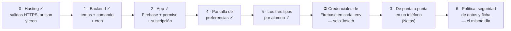

# Notificaciones para alumnos y acudientes

Plan para que un acudiente se entere de que a su hijo le pusieron notas, faltó a
clase o le anotaron una situación, sin abrir la app a ver si hay algo nuevo — y
sin que el hosting compartido lo pague. Escrito el 23 de agosto de 2026.

## El problema, dicho en una línea

Hay dos maneras de que un teléfono se entere de algo: **preguntar** o **que le
avisen**. Preguntar es sondeo, y el sondeo es exactamente lo que un hosting
compartido no aguanta: 400 acudientes preguntando cada cinco minutos son 115.000
peticiones al día para decir «no, nada nuevo» el 99 % de las veces.

Que le avisen es push, y el push **no lo entrega el servidor del colegio**: lo
entrega Google. El servidor solo le dice a Google «avisa a estos», una vez.

Todo este documento va de que esa frase —«una vez»— siga siendo verdad cuando
haya 400 acudientes.

## Qué se avisa

Cinco tipos. Cada uno se puede apagar por separado, que es lo que se pidió.

| Tipo | Se dispara con | Ejemplo del aviso |
|---|---|---|
| **Notas** | notas nuevas o cambiadas de ese alumno | «Laura tiene 4 notas nuevas en Matemáticas» |
| **Asistencia** | una ausencia o una tardanza registrada hoy | «Se registró una ausencia de Juan hoy» |
| **Disciplina** | una situación anotada | «Se anotó una situación de Juan. Ábrela para verla» |
| **Muro** | una publicación nueva del colegio | «Nueva publicación: Salida pedagógica» |
| **Colegio** | cierre de periodo, boletines listos, materias en riesgo | «El periodo cierra el viernes» |

**Ninguna notificación lleva la nota dentro.** «Laura tiene 4 notas nuevas en
Matemáticas», nunca «Laura sacó 45 en Matemáticas». Una notificación se ve en la
pantalla bloqueada, en el bus, con gente al lado; y una nota de un menor no es
algo que deba aparecer ahí. Para verla hay que abrir la app y estar
identificado. Esto además evita el caso feo: el push llega aunque el colegio
tenga las notas bloqueadas (`alumnos_can_see_notas = 0`), y sería absurdo que la
notificación enseñara lo que la app niega.

## Cómo se entrega: temas, no lista de dispositivos

Firebase Cloud Messaging (gratis, sin cuota que preocupe) ofrece dos formas:

**Por dispositivo.** El servidor guarda el token de cada teléfono en una tabla y
envía a cada uno. Con 400 acudientes con dos dispositivos son 800 tokens que
guardar, refrescar cuando caducan y limpiar cuando dejan de valer; y cada aviso
es un lote de peticiones.

**Por tema (*topic*).** El teléfono **se apunta él mismo** a un tema. El
servidor publica en el tema y Google reparte. Una petición, tenga el tema tres
dispositivos o tres mil. Cero tablas, cero tokens, cero limpieza.

**Se usan temas.** No es solo más barato: es que la parte cara de la otra opción
—guardar y mantener los tokens— caería justo sobre lo que hay que proteger.

### Y aquí está el detalle que hay que hacer bien

Si el tema se llamara `alumno_345`, cualquiera con la app podría apuntarse al
`alumno_346` y recibir los avisos de un menor que no es suyo. El nombre del tema
es, en la práctica, la única puerta.

Por eso **el nombre del tema no se calcula en el teléfono: lo entrega el
servidor al identificarse**, y es opaco:

```
tema = "a_" + HMAC-SHA256(alumno_id, secreto_del_colegio)   →   a_9f3c1e...
```

El acudiente recibe al entrar la lista de temas de sus acudidos, y nada más.
Nadie puede derivar el de otro alumno sin el secreto, que vive en el servidor.
Y como el contenido del aviso no dice nada —punto anterior—, incluso el peor
caso, que se filtre un nombre de tema, entrega ruido y no datos.

El tipo va como sufijo, y ahí está la clave de las preferencias:

```
a_9f3c1e…_notas        a_9f3c1e…_asistencia      a_9f3c1e…_disciplina
c_4b2d7a…_muro         c_4b2d7a…_avisos
```

### Los temas del colegio también llevan prefijo

Los dos últimos no son de un alumno sino de todo el colegio, y aun así **no
pueden llamarse `colegio_muro` a secas**. El motivo es que los temas viven en el
proyecto de Firebase, y **el proyecto es uno solo para los quince colegios**:
es una sola app, un solo `com.micolevirtual.app`, un solo `google-services.json`.
Un tema llamado `colegio_muro` sería el mismo tema para los quince, y una
publicación del muro de un colegio le llegaría a las familias de los otros
quince.

Así que llevan el identificador del colegio, derivado igual que el del alumno
—`c_` + HMAC del identificador del colegio— y entregado por el mismo endpoint de
temas. No es secreto como el del alumno —qué colegio es no lo esconde nadie—,
pero derivarlo igual evita tener dos formas de nombrar temas.

### Las preferencias viven en el teléfono

Apagar «Notas» es `unsubscribeFromTopic`: una llamada a Google, **cero
peticiones al servidor del colegio, cero filas en la base de datos, cero
consultas al enviar**. El envío no tiene que filtrar por preferencias porque
quien no quiere el aviso ya no está en el tema.

El efecto secundario es correcto, además: las preferencias son **por
dispositivo**. El acudiente puede querer los avisos de notas en su teléfono y no
en la tableta que usa el niño. Con preferencias guardadas en el servidor eso no
se puede.

Una pantalla «Notificaciones» en el menú lateral, con cinco interruptores y una
línea explicando qué manda cada uno.

## Cuándo se envía: por cron, agrupado, nunca dentro de una petición

Dos cosas que **no** se pueden hacer:

**No enviar dentro de la petición del docente.** Si al guardar una nota el
servidor llama a Google, el docente espera a que Google responda. Pasar una
columna de 30 notas serían 30 llamadas a Google metidas en el camino crítico de
30 peticiones. La app se sentiría rota y el servidor estaría ocupado
esperando a un tercero.

**No usar colas.** `QUEUE_CONNECTION` está en `sync`, que significa «ejecuta
ahora mismo, aquí» — o sea, exactamente el problema de arriba con otro nombre.
Una cola de verdad necesita un proceso vivo escuchando, y en hosting compartido
no lo hay.

Queda el cron, que casi todos los hostings compartidos sí dan:

```mermaid
sequenceDiagram
    participant D as Docente
    participant S as Servidor
    participant BD as Base de datos
    participant C as Cron (cada 15 min)
    participant G as Firebase
    participant T as Teléfono del acudiente

    D->>S: PUT notas/update/{id} × 30
    S->>BD: UPDATE notas + INSERT bitacoras
    Note over S,D: responde ya; no habla con nadie más

    C->>BD: SELECT de bitacoras desde la última marca
    BD-->>C: 30 filas → 1 alumno, 1 asignatura
    C->>G: 1 POST: tema a_9f3c1e…_notas
    G->>T: «Laura tiene 4 notas nuevas en Matemáticas»
    C->>BD: guarda la marca nueva
```

**Agrupar es lo que hace esto viable, y de paso lo hace mejor.** Un docente que
pasa una columna genera 30 cambios en dos minutos. Sin agrupar son 30 avisos y
el acudiente apaga las notificaciones para siempre. Agrupado por alumno y
asignatura es uno: «4 notas nuevas en Matemáticas». Menos peticiones y menos
molestia, la misma decisión.

### De dónde salen los cambios sin inventar tablas

Ya está todo registrado:

| Tipo | Fuente | Consulta |
|---|---|---|
| Notas | `bitacoras` — cada `PUT notas/update/{id}` inserta una fila con `affected_element_type = 'Nota'`, `affected_user_id = alumno_id` y `created_at` | `WHERE id > :marca AND affected_element_type IN ('Nota','NF_UPDATE') GROUP BY affected_user_id` |
| Asistencia | `ausencias.created_at` | agrupada por `alumno_id` |
| Disciplina | las situaciones, por `created_at` | agrupada por `alumno_id` |
| Muro | `publicaciones.created_at` | una fila basta |

Una consulta agrupada por tipo, cuatro por ejecución. La marca —el último `id`
de `bitacoras` procesado— es una fila en una tabla nueva de dos columnas, o un
archivo; con `CACHE_DRIVER=file` sirve el propio caché de Laravel.

### Lo que le cuesta al servidor

Cada 15 minutos: cuatro `SELECT` con índice y **entre cero y unas pocas**
llamadas a Google. En una jornada normal, con clases entre las 7 y las 14, la
mayoría de ejecuciones no manda nada.

96 ejecuciones al día. Comparado con los 115.000 sondeos del primer párrafo, es
otra escala. Si 15 minutos resulta mucha espera para asistencia, ese tipo se
puede subir a 5 minutos y dejar los demás en 15; sigue sin acercarse a nada
preocupante.

## Lo que hay que construir

### El backend ya está — desplegado desde el 25 de agosto de 2026

**Y este documento no se enteró hasta el 26.** Las tres piezas entraron en el
commit `98e6311`, que es ancestro de `eb95cbc`, la tanda que se desplegó con el
mismo hash en los quince colegios:

| Pieza | Dónde |
|---|---|
| `GET notificaciones/temas` | `routes/api/notificaciones.php:25` |
| `notificaciones:enviar` | `app/Console/Commands/EnviarNotificaciones.php` |
| El disparo cada quince minutos | `app/Console/Kernel.php:58` — **en el scheduler, no un cron nuevo**: viaja en el `schedule:run` de cada minuto que ya existía |
| La configuración | `config/notificaciones.php` |

Se comprueba con `git merge-base --is-ancestor <commit> eb95cbc`, no leyendo un
documento. Es la misma lección que dejó apagada la ficha de disciplina tres días
de más; ver [estado.md](estado.md) → «La lección de los tres días».

### ⛔ Un fallo del servidor que hay que arreglar antes de encender el muro

**`colegio_muro` y `colegio_avisos` no llevan identificador de colegio.**
`TemasDeNotificacion::DEL_COLEGIO` son literales, y `avisosDelMuro()` publica en
el literal `'colegio_muro'`.

El proyecto de Firebase **es uno solo para los quince colegios** —una sola app,
un solo `com.micolevirtual.app`, un solo `google-services.json`—, así que ese
tema es el mismo para los quince: en cuanto dos colegios tengan la app, una
publicación del muro de uno le llega a las familias de los otros catorce.

Es justo lo que este documento avisaba en «Los temas del colegio también llevan
prefijo». Por qué se escapó, que es lo que merece la pena guardar: el docblock
del backend razona que ese tema «no lleva HMAC porque es público a propósito: no
dice nada de ningún menor». Eso es cierto y es **otra pregunta**. El HMAC del
tema del alumno hace dos cosas a la vez —esconder de quién es, y separar un
colegio de otro—; ahí se descartó la primera, que no hacía falta, y con ella se
fue la segunda, que sí.

Hoy no rompe nada porque la app no está publicada. **No es fuga de contenido**
—el cuerpo es genérico, «hay 3 publicaciones nuevas»— pero sí es el aviso
equivocado a la familia equivocada, multiplicado por quince.

**Arreglado el mismo día** (`b369020`), y con una forma mejor que la que se
pidió: `c_` + 32 hex de HMAC, derivado con el mismo secreto del colegio que los
temas de alumno. **No lleva el identificador del colegio, y con razón** — el
secreto ya *es* distinto en cada colegio, porque es su `APP_KEY`, así que el
identificador sería un dato de más; y uno que hoy no existe en su `config/` y
obligaría a editar quince `.env`, que es justo lo que su propio documento dice
que no se le puede pedir a un despliegue.

**Está en `main` y NO desplegado**, así que en la app
`PendientesNotificaciones.temasDelColegio` sigue **apagado** y solo se usan los
temas por alumno. Se enciende cuando entre en una tanda y esté en los quince,
comprobado contra el hash.

**Y cambia la forma de la respuesta, no solo el valor.** El campo `colegio` pasa
de lista a objeto:

```
ANTES  "colegio": ["colegio_muro", "colegio_avisos"]
AHORA  "colegio": {"colegio_muro": "c_1a2b…", "colegio_avisos": "c_3c4d…"}
```

La clave es el nombre lógico —estable, y es con lo que se etiqueta la
preferencia— y el valor el tema de verdad. `alumnos` no se toca.

[NotificacionesApi](../lib/Http/NotificacionesApi.dart) **lee las dos formas, y
eso no lleva interruptor a propósito**: las dos están vivas a la vez mientras
dura un despliegue, y leer de la respuesta tal como venga vale antes y después
sin que nadie tenga que acordarse de encender nada. Es el mismo criterio que el
número de contraseñas cambiadas en [usuarios.md](usuarios.md).

**La letra pequeña, que nos toca conocer:** si dos colegios compartieran
`APP_KEY` —un `.env` copiado al crear uno nuevo, que es como se crean— sus temas
colisionarían. Eso no lo introduce el arreglo: los temas de alumno dependen del
mismo secreto desde el primer día. Lo que cambia es que ahora el fallo sería el
mismo en los dos sitios y no solo en uno.

**`colegio_avisos` se queda declarado** aunque no lo publique nadie todavía. Si
esa función no va a existir se retira **de los dos lados a la vez**, y esa es una
pregunta para Joseth y no para ninguna de las dos sesiones.

**Y esto reordena el plan de abajo:** el paso 3 era probar la tubería con el
tipo más tonto, el del muro, y ése es precisamente el roto. Hasta que lleve
prefijo, la prueba de punta a punta tiene que hacerse con uno de los tres tipos
por alumno.

### Lo que se pidió en su día, y que ya está hecho

Se conserva porque explica por qué el backend quedó como quedó.

1. Un endpoint que, al identificarse, devuelva **los temas** que le tocan a ese
   usuario (los suyos y los de sus acudidos). Es la pieza de seguridad: la
   derivación con HMAC vive aquí y en ningún otro sitio.
2. Un comando de artisan, `notificaciones:enviar`, con las cuatro consultas, la
   marca y el envío.
3. La entrada de cron: `*/15 * * * * php artisan notificaciones:enviar`.
4. Las credenciales: una cuenta de servicio de Firebase (un JSON) y su secreto
   fuera del repositorio.

Sobre el envío: la API HTTP v1 de FCM pide un token de OAuth firmado con la
cuenta de servicio. **No hace falta añadir el SDK de Google**: se firma un JWT
con `openssl_sign` y se pide el token con Guzzle —que ya está en el
`composer.json`—, y el token se cachea la hora que dura. Una dependencia menos
que mantener en un hosting donde actualizar es incómodo.

### Lo comprobado en el servidor — 23 de agosto de 2026

El paso 0 del plan, cerrado. Las cuatro respuestas están, y las cuatro son que
sí:

| Pregunta | Comprobación | Resultado |
|---|---|---|
| ¿Sale el servidor por HTTPS a Google? | `curl` a `oauth2.googleapis.com/token` y a `fcm.googleapis.com` | **sí** — los dos contestan `404` |
| ¿Ejecuta artisan? | `php artisan --version` | **sí** — Laravel 13.26.1 |
| ¿Puede programar cron? | una tarea de prueba de cada minuto | **sí** — programada por consola, visible en cPanel y **ejecutada**: cuatro pasadas en el log |
| ¿Con qué PHP? | `which php` · `php -v` | `/usr/local/bin/php`, **PHP 8.4.24** — el mismo del shell, y la versión que pide el backend |

Sobre el `404`: **es la respuesta correcta para esta comprobación.** Un 404 es
Google contestando —hubo DNS, handshake TLS y conversación—, y eso es justo lo
que se quería saber. Lo que delataría un bloqueo sería que se quedara colgado, o
un `Could not resolve host`, o un `Connection refused`. Pedir esas URLs sin
credenciales y sin el método correcto **tiene** que dar 404.

**Las cuatro son que sí, así que este plan sale entero y el plan B del final
queda descartado como camino principal.**

El cron se confirmó programando una tarea de cada minuto y mirando que corriera
—que es lo único que lo demuestra: aparecer en la lista de cPanel solo prueba
que está apuntada—:

```
( crontab -l 2>/dev/null; echo 'MAILTO=""'; \
  echo '* * * * * /usr/local/bin/php -v >> $HOME/cron-prueba.log 2>&1' ) | crontab -
```

Sin `crontab -e`, que abre `vi` y es donde se atasca uno. A los dos minutos el
log tenía la versión de PHP cuatro veces. Después se borra la tarea, que es más
cómodo con el enlace *Delete* de cPanel → *Advanced* → **Cron Jobs**.

De paso quedó comprobado que **las dos vías valen**: una tarea metida por
consola con `crontab -` aparece en la interfaz de cPanel y se puede editar y
borrar desde ahí.

**La ruta absoluta del binario importa** —y por eso se midió—: cron arranca con
un `PATH` mínimo y casi nunca encuentra `php` a secas. Es el fallo clásico de
cron en cPanel. Aquí resultó ser el mismo binario del shell, así que no hay
sorpresa de versión; en otro colegio habría que volver a mirarlo.

### Y el cron no es uno, es un bucle

Esto salió al ver la ruta real del servidor, `~/coabsaravena.micolevirtual.com/8myvc`:
**cada colegio es un directorio con su propio `.env` y su propia base de datos**,
como dice el `CLAUDE.md` del backend. Así que el comando hay que ejecutarlo una
vez **por colegio**, y son quince.

Quince entradas de cron es la forma equivocada: muchos hostings limitan
cuántas se pueden tener, y disparadas a la misma hora son quince procesos PHP
a la vez, que es justo la carga que este documento entero intenta evitar. Una
sola entrada que los recorra en fila:

```
*/15 * * * * for d in $HOME/*.micolevirtual.com/8myvc; do /usr/local/bin/php "$d/artisan" notificaciones:enviar; done
```

`$HOME` y no `~`: cron ejecuta con `/bin/sh` y la expansión de la virgulilla ahí
no está garantizada, mientras que `HOME` sí lo pone cron.

Secuencial —un proceso cada vez— y añadir un colegio nuevo no obliga a tocar el
crontab.

Dos detalles más de cPanel: algunos no dejan bajar de los 15 minutos, que da
igual porque es la frecuencia del plan; y por defecto mandan **un correo por
ejecución**, que se apaga con `MAILTO=""` en la primera línea del crontab o
redirigiendo la salida.

### En Firebase — la consola, y lo que cuesta

**No cuesta nada.** Cloud Messaging figura como «sin coste» en los dos planes de
Firebase, el gratuito (Spark) y el de pago (Blaze), y **el gratuito no pide
método de pago**. No hay que activar facturación, no hay tarjeta que meter y no
hay tramo a partir del cual empiece a cobrar: enviar por temas es gratis tenga
el tema tres dispositivos o tres mil. Lo que sí se paga está fuera de Firebase y
ya estaba contado: los USD 25 de una vez de Play Console y, **solo si se quiere
iOS**, los USD 99 al año del programa de desarrollador de Apple, que es de donde
sale la clave de APNs.

**Un proyecto, no quince.** Es una sola app con un solo identificador,
`com.micolevirtual.app`, así que hay un proyecto de Firebase y un
`google-services.json`. Lo que separa a un colegio de otro es el nombre del
tema, no el proyecto — ver «Los temas del colegio también llevan prefijo».

Los pasos, en orden:

1. **Crear el proyecto** en `console.firebase.google.com`. Google Analytics se
   puede desactivar: es gratis, pero no lo usamos y añade condiciones que no
   hacen falta.
2. **Registrar la app de Android** con el paquete `com.micolevirtual.app`, y
   bajar el `google-services.json` a `android/app/`. La huella SHA-1 que pide es
   opcional aquí —hace falta para inicio de sesión con Google, no para FCM—,
   pero ya está medida en [publicacion-play.md](publicacion-play.md) §8.
3. **La cuenta de servicio**, que es lo que usa el servidor para firmar el
   token: *Configuración del proyecto ▸ Cuentas de servicio ▸ Generar nueva
   clave privada*. Sale un JSON. Ese archivo va **fuera del repositorio** y en
   los quince directorios de colegio hace falta el mismo, porque el proyecto
   de Firebase es uno.
4. **iOS, solo cuando haya cuenta de Apple.** Una clave de APNs (`.p8`) subida a
   Firebase y la app de iOS registrada con su *bundle id*. Sin eso, en iOS no
   llega nada; en Android sí, y por eso este plan sale primero en Android.

El `google-services.json` **no es un secreto** —va dentro del APK, cualquiera lo
puede sacar— y por eso no protege nada por sí mismo: lo que protege es que el
nombre del tema no se pueda adivinar. El JSON de la cuenta de servicio **sí** es
un secreto, y ese es el que nunca sale del servidor.

### En la app — escrita y enchufada el 22 de septiembre de 2026

**El día que la app entró a Play se levantó la única condición que faltaba.** Lo
que bloqueaba esto no era código: `firebase_messaging` mete
`POST_NOTIFICATIONS` en el manifiesto y un identificador de dispositivo en lo
que hay que declarar, y la app estaba en revisión. Publicada ya, entra.

| Pieza | Dónde |
|---|---|
| El cliente de `GET notificaciones/temas` | [NotificacionesApi](../lib/Http/NotificacionesApi.dart) — de agosto, sin tocar salvo un `TemasDeNotificacion.deCuerpo` para poder releer lo guardado |
| Las preferencias de este teléfono | [PreferenciasAvisos](../lib/Utils/PreferenciasAvisos.dart) — de agosto, sin tocar |
| Lo que el teléfono recuerda | [AvisosGuardados](../lib/Utils/AvisosGuardados.dart) |
| El servicio: permiso, suscripción, pintado y tap | [Avisos](../lib/Utils/Avisos.dart) |
| La oferta del permiso, una vez en la vida | [OfrecerAvisos](../lib/Widgets/OfrecerAvisos.dart) |
| La pantalla de ajustes | [NotificacionesScreen](../lib/Screens/NotificacionesScreen.dart), ruta `/notificaciones` |
| La llave del navegador, global | [Navegador](../lib/Utils/Navegador.dart) |

Y lo enganchado: `Avisos.arrancar()` en `main.dart` después de
`Firebase.initializeApp()`; `Avisos.sincronizar()` al entrar y al recuperar
sesión; `Avisos.soltarTodo()` en **las dos** puertas de salida —`logout()` y
`_tirarLaSesion()`, que es por donde se sale con un 401 sin tocar el menú—; y la
entrada «Notificaciones» en la rama de familias del menú lateral.

#### Cuatro decisiones que no estaban en el plan y que hay que conocer

**Los temas a los que está apuntado el teléfono se anotan en disco.** Firebase no
sabe decir «a qué estoy apuntado», y al cerrar sesión ya no hay token con el que
preguntarle al colegio de qué hay que desapuntarse. Sin ese apunte, soltarlos
todos era imposible — y soltarlos todos es lo que impide que el teléfono
prestado siga recibiendo los avisos del alumno anterior. Se anota **lo que se
pidió**, no lo que se confirmó: desapuntarse de un tema que no se tenía no hace
nada, y quedarse apuntado a uno que no se anotó es justo el fallo que esto evita.

**El catálogo también se guarda, y se refresca como mucho una vez por semana.**
Dos motivos distintos. Uno, que apagar un interruptor no puede costar una
petición al colegio: con el catálogo en el teléfono, un toque son cero
peticiones al servidor y una llamada a Google. Dos, que preguntarlo en cada
arranque serían cientos de peticiones diarias para recibir siempre lo mismo — lo
que cambia la lista es que un acudido se matricule o que su matrícula termine, y
eso pasa un par de veces al año. **Pero no preguntarlo nunca tampoco vale**: el
servidor solo devuelve matrículas vivas, así que un acudido que desaparece del
catálogo es uno del que hay que desapuntarse, y sin refrescar, el acudiente de
quien se fue hace tres años seguiría recibiendo sus avisos. La semana es el
punto medio; entrar y abrir la pantalla de Notificaciones lo refrescan igual sin
esperarla.

**Solo se mueve la diferencia.** `Avisos.calcularCambio` compara lo querido con
lo anotado y devuelve qué coger y qué soltar. Nada de soltarlo todo y volver a
cogerlo en cada arranque: sería una ventana, corta pero real, en la que los
avisos no llegan. Es la parte probada, porque es la que decide.

**El permiso se ofrece una sola vez, y con el muro ya delante.** Desde Android
13 el sistema pregunta **una sola vez**: si se dice que no, no vuelve a
preguntar y hay que ir a los ajustes del teléfono a mano. Así que primero una
frase que dice qué se va a avisar y solo si dice que sí se gasta la pregunta del
sistema. Quien diga «ahora no» no ha gastado nada: lo tiene en el menú. Y va
después de que el muro cargue, no al abrir la app, porque ahí ya se ve de qué
colegio y de quién va lo que se ofrece.

#### Lo que el manifiesto y Gradle pedían

- `POST_NOTIFICATIONS` en `AndroidManifest.xml`.
- `com.google.firebase.messaging.default_notification_channel_id` en el
  manifiesto, apuntando al mismo canal que crea `Avisos.arrancar()`. Hacen falta
  los dos: cuando el aviso llega con la app cerrada no hay Dart corriendo para
  elegir canal, y **una notificación sin canal no se muestra** en Android 8 y
  arriba.
- `isCoreLibraryDesugaringEnabled` y `desugar_jdk_libs` en
  `android/app/build.gradle.kts`. Lo exige el AAR de
  `flutter_local_notifications` aunque no se use la parte que lo necesita de
  verdad —programar avisos a una hora—; sin eso el build ni empieza.

**Lo que NO cambió, y conviene que siga así:** el manifiesto fusionado sigue sin
`AD_ID` —el `tools:node="remove"` aguanta— y lo que añade Firebase Messaging son
`VIBRATE`, `c2dm.RECEIVE` y el receptor dinámico, ninguno de los cuales hay que
justificarle a Play. Comprobado en el manifiesto fusionado, no supuesto.

#### Lo que sigue sin estar

- **iOS**: una clave de APNs, que requiere cuenta de desarrollador de Apple de
  pago. Ver [publicacion-app-store.md](publicacion-app-store.md). `Avisos` es
  Android por el mismo motivo que la analítica y lo dice en su docblock.
- **El `alumno_id` del aviso no se usa.** Viene en `data` para `matricula`, pero
  las pantallas del acudiente no reciben argumentos: resuelven el acudido por
  dentro con `pedirAcudido`. El dato ya llega el día que lo reciban.
- **Los temas del colegio siguen apagados**, que es lo de la sección de arriba:
  `b369020` está en `main` y sin desplegar.

### Fuera del código

**Escrito el 15 de septiembre de 2026, y esperando.** Los tres textos están
redactados y **sin publicar**, marcados con `⏸ NOTIFICACIONES` allí donde viven:

- **La política de privacidad** ([politica-privacidad.md](politica-privacidad.md))
  ya dice que se usa Firebase Cloud Messaging, que el cuerpo del aviso no lleva
  nada personal, que el teléfono no manda su identificador a ningún servidor y
  cómo se apagan. En [privacidad.html](privacidad.html) el mismo texto está
  **comentado**, con las tres cosas que hay que hacer el día de publicar escritas
  dentro del comentario.
- **El formulario de seguridad de datos**
  ([seguridad-datos-play.md](seguridad-datos-play.md)) tiene la respuesta
  decidida: cambia **una fila y solo su propósito** —el ID del dispositivo pasa a
  servir también a «Funciones de la app»— y se queda en **opcional**, no en
  obligatorio como decía esa página. De ahí sale una condición para el código:
  **no pedir el token ni suscribirse a nada hasta que la persona conceda el
  permiso**, o «opcional» deja de ser verdad.
- **La ficha de Play** ([ficha-play.md](ficha-play.md)) tiene el bloque «AVISOS
  CUANDO HAY ALGO NUEVO» listo, fuera del texto que se copia para que nadie lo
  pegue antes de tiempo.

**Los tres se publican el mismo día que la versión que estrene las
notificaciones.** Ni antes —prometerían un tratamiento de datos que no ocurre—,
ni después —la app estaría recogiendo un identificador que la política no
menciona—.
- Son de menores. Merece la pena que el colegio lo comunique a las familias
  antes de encenderlo, aunque legalmente baste con la política.

## Orden de trabajo



**El orden cambió y merece la pena decir por qué.** Los pasos 4 y 5 se
adelantaron al 3 porque el 3 ya no es lo que era: se escribió pensando que el
tipo del muro era el más tonto para probar la tubería, y resulta que **es el
único roto** —`colegio_muro` sin prefijo, sección de arriba—. Con la prueba
teniendo que hacerse con un tipo por alumno, escribir los tres y la pantalla
cuesta lo mismo que escribir uno, y la prueba sale mejor: se prueba lo que se va
a publicar.

### Lo comprobado en el servidor el 23 de septiembre de 2026

Dos cosas que este documento y el del backend llevaban escritas como **desconocidas**,
y que resultaron una mal y la otra bien.

**No existía ningún cron. En ninguna de las dos cuentas.** `crontab -l` devolvía
vacío en `micolevi` y solo `MAILTO=""` en `micolev1`. O sea que `schedule:run`
**nunca había corrido en ningún colegio**: ni `notificaciones:enviar`, ni
`importaciones:marcar-abandonadas` —las importaciones que se cuelgan en
`en_proceso` se quedaban así para siempre—, ni `sesion:limpiar`.

Y `8myvc/app/Console/Kernel.php:66` decía, en presente, que «el de `schedule:run`
**ya está**, uno por colegio, y esa decisión es la que hace que añadir esto sean
tres líneas aquí en vez de dieciséis visitas a paneles de cPanel». **Era falso.**
Es exactamente la trampa que ese mismo archivo ya se había cazado a sí mismo un
par de semanas antes con «lo que *va a pasar* en los dieciséis»: una frase
escrita en presente sobre algo que nunca llegó a ocurrir, que se lee como un
hecho medido y que nadie reescribe porque no lleva fecha dentro. Ver
[estado.md](estado.md) → «Un comentario en futuro describe un día que ya pasó».

Puestos ese día: **dieciséis líneas en `micolev1`** —una por colegio, con su
ruta, nunca un bucle en una sola línea: dieciséis arranques de Laravel cada
minuto en un servidor de un núcleo es otra cosa— y **una en `micolevi`** para el
LAL vivo, que ningún glob alcanza.

**`lal.micolevirtual.com` queda fuera a propósito.** Es el subdominio de pruebas
del traslado, con una copia de la base del LAL vivo, y el ensayo lleva semanas
parado ([TRASLADO-LAL.md](../../8myvc/docs/TRASLADO-LAL.md)). Cumple el patrón
que buscan los bucles —su propio documento lo avisa— así que se coló en el
primer intento. Con cron habría publicado avisos calculados sobre una base
congelada.

#### Seis colegios no tenían **ningún** comando propio, y nadie podía saberlo

**Lo que se buscaba era por qué `notificaciones:enviar` no existía en `demo`.
Lo que había era más grande.** En seis colegios —`coal`, `colbosque`,
`comad-san-andres`, `demo`, `eal` y `lal`— artisan no conocía **ninguno** de los
comandos de la aplicación: ni `notificaciones:enviar`, ni `sesion:limpiar`, ni
`importaciones:marcar-abandonadas`, ni `colegio:parte`, ni `correo:probar`.
Nunca los había conocido.

**La causa, que costó dos hipótesis equivocadas.** Esos seis tenían `vendor/`
por symlink a `/home/micolev1/laravel_compartido`, y el `autoload_psr4.php` de
ahí lleva esta línea:

```php
$baseDir = dirname($vendorDir).'/maranathaarauca.micolevirtual.com/8myvc';
```

O sea que los seis **cargaban sus clases `App\` del `app/` de
maranathaarauca**. Funcionaba porque el código es idéntico en los diecisiete
—mismo commit— y por eso nadie lo notó nunca. Pero Laravel **no registra los
comandos por nombre: escanea un directorio** y deriva la clase restándole
`app_path()`. En esos seis el escaneo caía en el árbol de maranathaarauca y la
resta se hacía contra su propio `app_path()`, que es otro: la resta no casa,
sale un nombre de clase imposible, y **el comando se descarta sin un solo
error**.

Ése es el detalle que lo hizo difícil: `class_exists('App\Console\Commands\EnviarNotificaciones')`
devolvía **`true`**. Cargar por nombre funcionaba perfectamente; descubrir por
ruta, no. Las dos hipótesis que se probaron antes —classmap desactualizado,
caché de `bootstrap/cache/`— eran razonables y **las dos eran falsas**, y lo que
las descartó fue medir, no releer.

**Lo que lo destapó fue una pregunta de una sola línea:** si el problema es el
escaneo, no falta *un* comando, faltan **todos**. `php artisan list | grep -E
'colegio:|sesion:|importaciones:'` en demo no devolvió nada, y ahí se acabó la
discusión.

**El arreglo**: darles `vendor/` propio, que es lo que ya tenían los once que
funcionaban. Por colegio, `rm vendor` —era un symlink—, `cp -a` del compartido y
`composer dump-autoload -o`, que reescribe `$baseDir` apuntando a su propia
carpeta. Cuesta **9.626 inodos por copia**. Censo final: los diecisiete a `1`.

**Y deja dos cosas para el backend**, que allí son documentación desfasada:

- La lista de los que comparten `vendor/` estaba mal **por los dos lados**:
  decía `maranathaarauca` (que ya no compartía) y no decía `demo` (que sí). Dos
  errores que se cancelaban en el total, así que **el número no avisó**.
- Si ya no queda ningún symlink, **desaparece la trampa número uno del
  despliegue** —«un `composer install` dentro de uno cambia a los otros cinco»— y
  esos seis dejan de tener que desplegarse como bloque.

**La lección, que no es «mide»:** las tres hipótesis eran sobre *por qué no
carga*, y la clase **sí cargaba**. La pregunta que resolvió el caso no fue más
profunda, fue **más ancha**: en vez de insistir en ese comando, preguntar si
faltaban los demás. Un fallo que parece de una pieza y es de todas se reconoce
por eso, y ninguna de las tres primeras preguntas lo habría encontrado.

**Y las `APP_KEY` son todas distintas.** Ésta es la que salió bien. Se comparó el
hash md5 de cada una —el hash, no la clave: contesta la pregunta sin sacar nada
del servidor— en las dieciocho instalaciones: las diecisiete de `micolev1`, el
`lal` de pruebas incluido, más el LAL vivo de la otra cuenta. **Dieciocho hashes,
dieciocho valores, ninguno vacío.**

Eso cierra el pendiente que el backend tenía abierto en
`docs/migracion/29-los-env-no-son-uniformes.md` §1, y que era el único capaz de
convertir este frente en una fuga: si dos colegios compartieran `APP_KEY`
compartirían los temas de FCM, y un acudiente recibiría los avisos de un menor de
otro colegio **sin que nada diera error** —publicar en un tema ajeno es válido—.
La premisa era que `key:generate` había corrido en cada instalación, y nadie la
había medido porque un colegio nuevo se crea **copiando otro**. Ahora está medida.

Y una predicción que falló, que es lo que la hace digna de anotarse: se esperaba
que el `lal` de pruebas compartiera clave con el LAL vivo, por ser copia suya.
**No la comparte.** La copia se hizo sin arrastrar el `.env`.

Las cuentas, ya que estaban: dieciséis líneas de cron en `micolev1` son quince
colegios más `demo`; con el LAL vivo son **dieciséis colegios y `demo`**, que es
justo lo que devuelve el bucle de despliegue.

#### Esa misma noche: `schedule:run` corría el comando y el aviso no salía

Con el cron ya puesto, los avisos seguían sin llegar solos. Medido en `demo` entre
las 22:30 y las 23:40 (hora de Colombia), con la salida del cron desviada a un log:

| Qué lo lanzaba | Resultado |
|---|---|
| `schedule:run` desde el cron | «Running notificaciones:enviar … 198 ms DONE», y `--seco` **seguía listando el aviso** |
| `schedule:test` desde la terminal | salió |
| el comando a mano, también con `env -i` (el entorno del cron) | salió |
| **una línea propia del cron** que lo llama directamente | **salió** (04:35:01 UTC, «Mandados 1 avisos») |

Se descartó, midiendo cada cosa: el candado de `withoutOverlapping` (no había), el
PHP que usa el cron (8.4.25, mismos 66 módulos con y sin el envoltorio de
CloudLinux), las credenciales (legibles con `env -i`) y la caché (`file`, la misma
marca desde los dos entornos). **Por qué falla desde el scheduler sigue sin
saberse.**

Lo que quedó:

- `8myvc` `4967741` saca `notificaciones:enviar` del `Kernel`. **Hay que
  desplegarlo**: sin el candado, dos pasadas a la vez duplicarían el aviso.
- En `micolev1`, una línea más en el crontab (18 en total) que recorre los 16
  colegios **por las rutas que ya estaban en el crontab**, así que `lal` queda fuera:

  ```
  */15 * * * * for d in /home/micolev1/amiguitosdejesus.micolevirtual.com/8myvc … ; do cd $d && /usr/local/bin/php artisan notificaciones:enviar >> /home/micolev1/notificaciones.log 2>&1; done
  ```

- **En `micolevi` (el LAL de verdad) todavía no.** Tiene su propia línea de
  `schedule:run` y probablemente le pasa lo mismo.

**Y cómo se edita ese crontab sin romperlo.** `crontab -l | sed … | crontab -`
**lo dejó vacío** en esta cuenta: 0 líneas, los 16 colegios, unos minutos. Se
restauró de un respaldo. Lo que sí funciona es por archivos, y comprobando antes
de instalar:

```
crontab -l > ~/cron-actual.txt
# … preparar ~/cron-nuevo.txt a partir de cron-actual.txt …
wc -l ~/cron-nuevo.txt           # el número que tiene que salir
crontab ~/cron-nuevo.txt && crontab -l | wc -l
```

### Lo que falta, en orden

1. ~~**Las credenciales de Firebase en el `.env` de cada colegio.**~~
   **HECHO el 23 de septiembre de 2026.** El JSON de la cuenta de servicio está
   en el `storage/app/` de cada uno y `FCM_PROYECTO=micolevirtual-mobile` en cada
   `.env`. Comprobado corriendo `notificaciones:enviar`: deja de decir «Firebase
   no está configurado en este colegio» y recorre las cinco fuentes, que es lo
   que prueba que `estaConfigurado()` dice que sí. La API de Firebase Cloud
   Messaging (V1) está habilitada en el proyecto `micolevirtual-mobile`, con el
   id de remitente `276868175794` — el mismo `project_number` del
   `google-services.json`.
2. **La prueba de punta a punta en un teléfono real**, con el tipo **Notas**:
   entrar, conceder el permiso, que un docente publique una nota, esperar al
   cuarto de hora y ver llegar el aviso — con la app cerrada, en segundo plano y
   abierta, que son tres caminos distintos en el código. Y tocarlo, que abra
   «Mis notas».
3. **Los tres textos, el mismo día que la versión.** Están redactados y marcados
   `⏸ NOTIFICACIONES`: la política de privacidad, el formulario de seguridad de
   datos y el bloque de la ficha de Play. Ver «Fuera del código». Ni antes
   —prometerían un tratamiento que no ocurre— ni después —la app estaría
   recogiendo un identificador que la política no menciona—.

Y una cosa que **no** bloquea: el despliegue de `b369020`. Mientras no esté,
`PendientesNotificaciones.temasDelColegio` sigue en `false` y los avisos del
muro no salen; los tres tipos por alumno funcionan igual.

## Si el hosting no deja salir

> **Descartado como camino principal el 23 de agosto de 2026**, porque se
> comprobó que sí deja: ver «Lo comprobado en el servidor». Se conserva escrito
> por lo que dice el último párrafo —los puntos rojos siguen valiendo la pena
> aunque el push funcione— y porque el día que un colegio nuevo tenga otro
> hosting, esta es la salida.

Plan B, sin push y sin sondeo: **«novedades al abrir»**. Un solo endpoint
barato, `GET novedades`, que devuelve **contadores** desde la última vez que ese
usuario miró —«3 notas nuevas, 1 ausencia»— y que la app pide **solo al abrirse
o al volver del segundo plano**, nunca en un temporizador. Se pintan como puntos
rojos en el menú.

No avisa con el teléfono en el bolsillo, que es medio punto de todo esto. Pero
es una consulta por sesión y por usuario en vez de una cada cinco minutos, y se
puede montar sin Firebase, sin cron y sin cuenta de Apple.

Merece la pena tenerlo presente también como **complemento**: los puntos rojos
dentro de la app son útiles aunque el push funcione, porque contestan a «¿qué me
perdí?» cuando el aviso se descartó sin leerlo.
