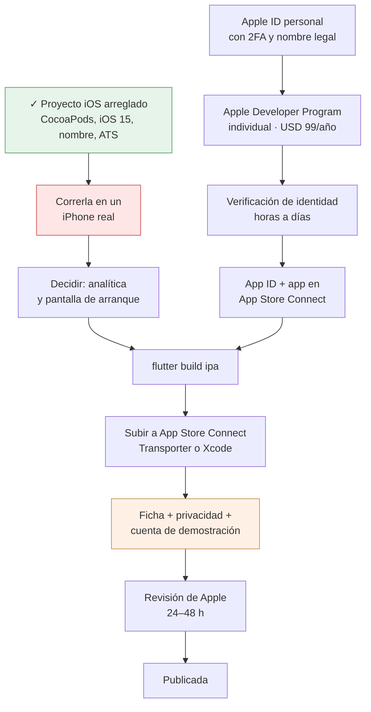

# Publicar Mi Cole Virtual en la App Store

Qué falta para que esta app entre a la tienda de Apple, en qué estado está hoy
el proyecto de iOS —que es peor de lo que parece— y en qué orden hacerlo.

Escrito el 2 de septiembre de 2026, después de mirar el proyecto de verdad:
`ios/`, el `pubspec`, los plugins y el `flutter doctor` de esta máquina. Lo que
está marcado como **verificado** se comprobó ejecutando algo, no leyendo.

El hermano de este documento es [publicacion-play.md](publicacion-play.md), que
ya se recorrió entero. Muchas cosas se reutilizan —los textos, la política de
privacidad, las credenciales del revisor— y se dice cuáles.

Los diagramas son [Mermaid](https://mermaid.js.org). En VS Code, extensión
`bierner.markdown-mermaid` y vista previa con `⌘K V`; en GitHub se ven solos.

## La buena noticia primero

**Apple no tiene el cuello de botella de Play.** No hay 12 probadores ni 14 días
seguidos: se sube el build, se manda a revisión y Apple contesta normalmente en
24–48 horas. Lo que en Play fueron semanas de espera estructural, aquí no
existe. TestFlight es opcional y sirve para probar, no para desbloquear nada.

Lo que sí costaba era lo de antes: la cuenta, y **arreglar el proyecto de iOS,
que no compilaba**. Eso último ya se hizo —§1.1 a §1.4—; queda **correrla en un
iPhone de verdad**, que es donde se ve lo que ningún documento puede prever.

## El camino completo



La caja verde ya está hecha. La roja es el siguiente paso y no se puede saltar:
hasta que la app no corra en un iPhone de verdad, nada de lo de abajo es firme.
La naranja es la que hay que preparar con calma porque es donde se juega la
revisión.

> **Y la caja roja depende de la cuenta, que es lo contrario de lo que dice el
> párrafo de abajo.** Confirmado el 2 sep 2026: **aquí no hay iPhone**, solo el
> MacBook. Así que «correrla en un iPhone real» no se hace enchufando un cable:
> se hace por **TestFlight**, con el teléfono de otra persona, y TestFlight
> necesita la cuenta pagada y una build subida (§5).
>
> Lo que sí se puede hacer ya, y conviene hacer antes: **el simulador**, que
> desde hoy está instalado. Cubre casi todo —que compile, el nombre bajo el
> ícono, que las pantallas se pinten, que el login entre— y no cubre el permiso
> de red local, el rendimiento real ni el comportamiento de Firebase.

**Las dos ramas van en paralelo y ninguna tarda semanas.** Arreglar el proyecto
no necesita cuenta de Apple hasta el momento de firmar; sacar la cuenta no
necesita que el proyecto compile. **Al elegir cuenta individual (§3) desaparece
el único paso largo que tenía este plan** —el D-U-N-S y la verificación de una
entidad legal, que eran de días a semanas—: la verificación de un individuo es
de horas a días.

---

## 1. Lo que estaba roto, y qué queda

Esto salió de mirar el proyecto el 2 de septiembre de 2026, cuando **nunca se
había compilado esta app para iOS**. Ese mismo día se arreglaron los cuatro
bloqueos duros; lo que queda abierto no bloquea la compilación.

| | Qué era | Hoy |
|---|---|---|
| 1.1 | CocoaPods sin instalar | **Hecho** |
| 1.2 | *Deployment target* 13.0 contra el 15.0 que exige Firebase | **Hecho** |
| 1.3 | En el iPhone la app se llamaría «myvc_flutter» | **Hecho** |
| 1.4 | «Otro» no conectaría: ATS y permiso de red local | **Hecho** |
| 1.5 | ¿Pasan ATS los servidores de los colegios? | Falta correr `nscurl` |
| 1.6 | En iOS no se ofrece enlace a la tienda | Espera el ID de App Store Connect |
| 1.7 | Un solo `+N` para dos tiendas | Es una disciplina, no un cambio |
| 1.8 | Menores | La pantalla de arranque; el resto hecho |

### 1.1 CocoaPods no estaba instalado — *hecho*

`flutter doctor` decía:

```
[!] Xcode - develop for iOS and macOS (Xcode 26.5)
    ✗ Unable to get list of installed Simulator runtimes.
    ! CocoaPods not installed.
```

Se instaló con `brew install cocoapods`: hoy hay **CocoaPods 1.17.0** en
`/opt/homebrew/bin/pod`.

**Y hace falta bajar la plataforma de iOS, que Xcode 26 ya no trae de fábrica.**
Esto no es solo el simulador: **sin ella no compila nada**. El error, al final
de un `flutter build ios` que parece ir bien, es

```
{ platform:iOS, id:dvtdevice-DVTiPhonePlaceholder-iphoneos:placeholder,
  name:Any iOS Device, error:iOS 26.5 is not installed.
  Please download and install the platform from Xcode > Settings > Components. }
```

Se arregla con

```bash
xcodebuild -downloadPlatform iOS   # son varios GB
```

Cómo saber si falta, antes de perder una compilación: `xcrun simctl list
runtimes` devuelve la lista **vacía**. Así estaba esta máquina el 2 sep 2026.

> **Sorpresa al hacerlo: los plugins ya no pasan por CocoaPods.** Este proyecto
> quedó migrado a **Swift Package Manager** —el `project.pbxproj` tiene ahora un
> `XCLocalSwiftPackageReference` a `FlutterGeneratedPluginSwiftPackage`, y se le
> quitó la fase «[CP] Embed Pods Frameworks»—. Por eso el `Podfile.lock` nuevo
> lista **solo Flutter** y ni un plugin: los seis viven en
> `ios/.symlinks/plugins` y entran por SPM. CocoaPods sigue haciendo falta para
> el propio Flutter, o sea que instalarlo no sobró.

### 1.2 El *deployment target* era 13.0 y Firebase exige 15.0 — *hecho*

Este era el bloqueo real, y no daba un error obvio: fallaba con un mensaje sobre
versiones incompatibles que no menciona a Firebase.

| Dónde | Decía | Dice |
|---|---|---|
| [`ios/Podfile`](../ios/Podfile) línea 11 | `platform :ios` **comentado** | `platform :ios, '15.0'` |
| `ios/Runner.xcodeproj/project.pbxproj` (3 sitios: 338, 412, 461) | `IPHONEOS_DEPLOYMENT_TARGET = 13.0` | `15.0` |
| `firebase_core` 4.13.0 | `s.ios.deployment_target = '15.0'` | — |
| `firebase_analytics` 12.4.6 | `s.ios.deployment_target = '15.0'` | — |

Las dos están puestas, y **tienen que seguir coincidiendo**: si alguien
descomenta el `Podfile` o Xcode le cambia el target al proyecto, vuelve el mismo
error críptico. El `Podfile` lo dice en un comentario, en el sitio donde se
tropezaría.

**Subir a iOS 15 no deja a nadie fuera que importe.** iOS 15 corre desde el
iPhone 6s (2015). El iPhone más viejo que se queda fuera es el 6, de 2014, que
Apple dejó de actualizar hace ocho años.

El `Podfile.lock` de otra época —tres pods, CocoaPods 1.10.2— se regeneró. Ahora
tiene una sola entrada, por lo de SPM que cuenta §1.1.

#### El punto muerto que hay debajo, y cómo se sale

**Cambiar las dos cosas de arriba no basta la primera vez**, y esto costó una
tarde. El error que sale es:

```
Xcode failed to resolve Swift Package Manager dependencies
```

Sin una línea más. Parece la red —está descargando `firebase-ios-sdk`, que es
enorme— y no lo es. Lo que pasa es un círculo de tres piezas:

1. Flutter genera
   `ios/Flutter/ephemeral/Packages/FlutterGeneratedPluginSwiftPackage/Package.swift`
   con **iOS 13.0 fijo**. No lo lee del proyecto: está a pelo en el código de la
   herramienta —`ios => Version(13, 0, null)` en
   `flutter_tools/lib/src/darwin/darwin.dart`—.
2. Firebase exige 15.0, y SPM **falla** si una dependencia pide más que el
   paquete que la usa.
3. Flutter tiene el arreglo —`SwiftPackageManager.updateMinimumDeployment`, que
   sube ese 13.0 al del proyecto— pero lo alimenta con
   `xcodebuild -showBuildSettings`… **que no contesta mientras los paquetes no
   resuelvan** (`ios/mac.dart:342`).

O sea que el mecanismo existe y es el correcto, pero no arranca solo. Se rompe a
mano una vez:

```bash
# En ios/Flutter/ephemeral/Packages/FlutterGeneratedPluginSwiftPackage/Package.swift
#   .iOS("13.0")  ->  .iOS("15.0")
cd ios && xcodebuild -resolvePackageDependencies -workspace Runner.xcworkspace -scheme Runner
```

Con eso resolvió: **21 paquetes, Firebase 12.17.0**, y a partir de ahí compila.

**Y a partir de ahí Flutter lo mantiene solo, pero tarda una compilación en
empezar.** Medido el 2 sep 2026 en dos compilaciones seguidas:

| | `Package.swift` al terminar |
|---|---|
| La primera tras romper el punto muerto | volvió a `.iOS("13.0")` |
| La siguiente | **`.iOS("15.0")`, puesto por Flutter** |

La primera compila igual porque Xcode ya tiene guardado el grafo resuelto
(`Package.resolved`); y para cuando llega la segunda, `showBuildSettings` ya
contesta —reporta `IPHONEOS_DEPLOYMENT_TARGET = 15.0`, comprobado— y
`updateMinimumDeployment` puede hacer su trabajo. Desde ahí ya se corrige sola
en cada compilación.

Ese `Package.swift` es generado y está **ignorado por git** —`ios/.gitignore`
línea 21, `Flutter/ephemeral/`—, o sea que **arreglarlo aquí no arregla nada
para nadie más**. Quien clone el repo en otra máquina, o quien borre
`DerivedData`, se encontrará el mismo punto muerto y tendrá que repetir estos
dos pasos. Por eso está escrito: es una receta que hace falta una vez por
máquina, no una cicatriz de este proyecto.

#### Lo que sí hay que commitear: `Package.resolved`

La resolución dejó dos archivos nuevos, y **no** están ignorados:

```
ios/Runner.xcodeproj/project.xcworkspace/xcshareddata/swiftpm/Package.resolved
ios/Runner.xcworkspace/xcshareddata/swiftpm/Package.resolved
```

Son el candado de versiones de SPM, lo mismo que `pubspec.lock` y
`Podfile.lock`, que en este repo **sí** se versionan. Fijan Firebase en
**12.17.0** y sus veinte dependencias. Sin ellos, otra máquina —u otra
compilación dentro de unos meses— puede resolver versiones distintas de las que
se probaron, y en un binario que va a la App Store eso no debería quedar al
azar. **Van al commit.**

### 1.3 En el iPhone la app se habría llamado «myvc_flutter» — *hecho*

[`ios/Runner/Info.plist`](../ios/Runner/Info.plist) tenía `CFBundleName` =
`myvc_flutter` y **ningún** `CFBundleDisplayName`. En Android el manifiesto dice
`Mi Cole Virtual` desde siempre; en iOS no lo dijo nunca nadie, así que debajo
del ícono habría salido el nombre interno del paquete de Dart.

Ya está `CFBundleDisplayName` = `Mi Cole Virtual`.

**Queda mirarlo en un teléfono de verdad.** La pantalla de inicio corta
alrededor de los 12–13 caracteres, o sea que se va a leer «Mi Cole Vir…», y hay
que decidir viéndolo si se acorta a «Mi Cole». El nombre de la ficha en la
tienda es otro campo distinto y ahí caben 30 caracteres.

> **El `Info.plist` no lleva comentarios, y no es por dejadez.** Se le pusieron,
> explicando cada clave como se explica todo en este repo, y **Flutter los
> borró**: la primera compilación reescribió el archivo entero para migrar la
> app al ciclo de vida **UIScene** —añade `UIApplicationSceneManifest`,
> `CADisableMinimumFrameDurationOnPhone` y
> `UIApplicationSupportsIndirectInputEvents`, y cambia `@UIApplicationMain` por
> `@main` en `AppDelegate.swift`—. Las claves nuestras sobrevivieron; los
> comentarios no, y volverán a desaparecer cada vez que la herramienta lo toque.
>
> Así que **el porqué de cada clave vive aquí** —§1.3 el nombre, §1.4 ATS y red
> local, §2.2 las orientaciones, y el cifrado en §5— y no en el plist. Volver a
> ponerlos allí es trabajo que se pierde solo.

### 1.4 El servidor «Otro» no habría funcionado en iOS — *hecho*

Primero, deshacer un malentendido: **Apple no prohíbe la opción «Otro»**. Nadie
en la revisión la va a mirar, porque el revisor entra con la cuenta de
demostración contra `demo`, que es `https`. Lo que se rompía era la *conexión*
al servidor de desarrollo de quien programa.

[`EsquemaServidor`](../lib/Utils/EsquemaServidor.dart) pone `http://` cuando la
dirección es de red local —`192.168.x`, `10.x`, `localhost`, `*.local`—, porque
ahí no hay certificado que valga. En iOS eso chocaba con dos cosas a la vez:

1. **ATS** (App Transport Security) bloquea el tráfico en claro. Es el
   equivalente de lo que ya hace Android desde la 9, que el propio docblock cita.
2. **El permiso de Red Local**, que iOS pide desde la 14 para conectarse a
   direcciones privadas. Sin `NSLocalNetworkUsageDescription` en el `Info.plist`
   la conexión falla y ni siquiera aparece el diálogo.

Había dos salidas —(a) no hacer nada, y que quien desarrolle use el
`--dart-define=SERVIDOR` de [`Server`](../lib/Http/Server.dart); (b) declararlo
bien— y **se hizo (b)**, que son seis líneas en el `Info.plist`:

```xml
<key>NSAppTransportSecurity</key>
<dict>
    <key>NSAllowsLocalNetworking</key>
    <true/>
</dict>
<key>NSLocalNetworkUsageDescription</key>
<string>Para conectarse a un servidor del colegio que esté en esta misma red,
cuando se escribe su dirección a mano en la opción «Otro».</string>
```

`NSAllowsLocalNetworking` es exactamente este caso —solo abre la mano con
direcciones privadas y nombres `.local`, no con internet— y a diferencia de
`NSAllowsArbitraryLoads` **no hay que justificarlo ante el revisor**. Con eso
«Otro» funciona igual en las tres plataformas.

Dos detalles al usarlo:

- **`localhost` no sirve en un iPhone de verdad** ni con esto puesto: apuntaría
  al propio teléfono. Hay que escribir la IP `192.168.x` del Mac. En el
  simulador sí funciona `localhost`.
- **El `--dart-define=SERVIDOR` no se salta nada de esto.** Salta el selector,
  no la red: en un dispositivo real necesita las mismas dos claves.

Lo que **no** hay que poner nunca es `NSAllowsArbitraryLoads`: eso sí dispara
preguntas en la revisión y encima haría mentir a la política de privacidad, que
promete que todo viaja cifrado.

### 1.5 Los servidores de los colegios sí pasan — *verificado a medias*

Los colegios que devuelve `listado_colegios.php` están todos en `https://` y los
tres que se probaron —`demo`, `lalvirtual.edu.co`, `maranatha`— negocian **TLS
1.2 con cadena de certificados válida**. Por ahí no hay sorpresa.

> **De paso, una cifra que no cuadra.** El 2 de septiembre de 2026 ese endpoint
> devolvió **once** colegios, y los documentos cuentan quince desde
> [estado.md](estado.md) → «Dos cifras que hay que corregir donde se lean».
> Puede que el listado sean solo los que se ofrecen en el selector de la app y
> no el censo entero, y en ese caso no hay nada roto. Pero si deberían salir los
> quince, hay cuatro colegios cuya gente no puede elegir su colegio al entrar —
> y eso no sería un problema de iOS, sino de las tres plataformas, y llevaría
> tiempo pasando desapercibido.

Queda una comprobación que esta sesión no pudo ejecutar: `nscurl
--ats-diagnostics https://demo.micolevirtual.com`, que es la herramienta de
Apple y además mira el cifrado con *forward secrecy* y que el certificado esté
firmado con SHA-256. **Córrela antes de subir nada**, sobre todo contra `demo`,
que es el servidor por el que va a entrar el revisor. Es un comando y quita la
duda entera.

### 1.6 Al bloqueado por versión mínima, en iOS, no se le ofrece salida

[`ActualizarScreen`](../lib/Screens/ActualizarScreen.dart) construye el enlace a
la tienda solo en Android:

```dart
if (kIsWeb || defaultTargetPlatform != TargetPlatform.android) return null;
```

En un iPhone eso deja al usuario con «búscala como Mi Cole Virtual en la tienda
de aplicaciones» y ningún botón. El docblock lo dice a propósito —*«solo Android:
es donde se publica»*— y deja de ser verdad el día que esto salga.

Hay que añadir la rama de iOS: `https://apps.apple.com/app/id<ID_NUMÉRICO>`. El
número no lo inventamos: **aparece cuando se crea la app en App Store Connect**,
así que este cambio va después del paso 3 y no antes.

### 1.7 Un solo `+N` para dos tiendas, y `version_minima_app` no distingue

Esto no rompe nada hoy pero es una trampa puesta.

[`VersionMinima`](../lib/Utils/VersionMinima.dart) compara el `+N` del `pubspec`
—hoy `1.0.0+3`— contra un **entero por colegio** que llega en `/login`. Ese
entero no dice de qué plataforma habla. Si Android va por el build 7 y iOS por
el 5 de la misma versión, un colegio que ponga «7» bloquea a todos sus usuarios
de iPhone sin que exista una versión de iPhone a la que puedan actualizar. Es el
mismo accidente que el docblock ya describe para el «12» copiado de un ejemplo,
pero por una puerta nueva.

**Recomendación: un solo número de build para las dos tiendas.** Se sube el `+N`
una vez por versión y se publica en Play y en App Store desde ese mismo número,
aunque una de las dos tarde más en salir. Es gratis mientras se haga a
propósito, y es lo único que mantiene cierto el contrato que
[backend-pendiente.md](backend-pendiente.md) §4 le vendió a los colegios.

Si algún día se necesitan números distintos, entonces el campo tiene que
partirse en dos —`version_minima_android` y `version_minima_ios`—, y eso es
trabajo de backend. Mejor no llegar ahí.

### 1.8 Cosas menores, pero que se ven

- **La pantalla de arranque sigue siendo la de fábrica de Flutter**:
  `LaunchImage`, una imagen genérica de 168×185 centrada sobre blanco. Android
  sí tiene su `LaunchTheme`. No lo rechazan por eso, pero es lo primero que ve
  cualquiera. **Es lo único de §1.8 que queda.**
- **El `project.pbxproj` era antiguo** (`objectVersion = 46`,
  `LastUpgradeCheck = 1020`, o sea plantilla de Xcode 10). *Hecho*: hoy va por
  `objectVersion = 54` y `LastUpgradeCheck = 1510`. En la misma pasada entró la
  migración a Swift Package Manager de §1.1, así que ese diff es más grande de
  lo que suena y conviene leerlo como lo que es: dos cambios en uno.
- **Faltaba `ITSAppUsesNonExemptEncryption`** en el `Info.plist`. *Hecho*, en
  `<false/>`: la app solo usa HTTPS estándar, y así App Store Connect deja de
  preguntar por el cumplimiento de exportación en cada subida.

---

## 2. Decisiones que hay que tomar antes de compilar

Estas no son bugs, son bifurcaciones. Ninguna la puede decidir el código.

### 2.1 ¿Analítica en iOS? — hay que decidirlo

Hoy no la hay: [`Analitica.disponible`](../lib/Utils/Analitica.dart) es
`!kIsWeb && defaultTargetPlatform == TargetPlatform.android`, y **no existe
`ios/Runner/GoogleService-Info.plist`** — verificado. Eso está bien hecho: sin
el plist, `Firebase.initializeApp()` en iOS reventaría, y el docblock ya explica
por qué se acotó a Android.

Publicar así es perfectamente válido: la app arranca, no falla, simplemente no
mide en iPhone. Pero significa que la mitad de la respuesta a las preguntas de
[analitica.md](analitica.md) va a faltar, y no se va a notar que falta.

**Recomendación: registrarla.** Son tres pasos y no cuesta ninguna petición
extra en el hosting compartido:

1. En la consola de Firebase, añadir una app iOS al proyecto que ya existe, con
   el bundle id `com.micolevirtual.app`.
2. Bajar `GoogleService-Info.plist` y **añadirlo al target Runner desde Xcode**
   (arrastrarlo al proyecto, no solo copiarlo a la carpeta: si no está en
   «Copy Bundle Resources» no llega al build y falla en silencio).
3. Ampliar `disponible` a `TargetPlatform.iOS` y actualizar su docblock, que hoy
   dice «Solo Android» y explica por qué.

Dos avisos, los dos importantes:

- **Firebase Analytics en iOS no pide ATT** mientras no se enlace `AdSupport`:
  usa el IDFV, que es por fabricante y no sirve para seguir a nadie entre apps.
  No hay que añadir `NSUserTrackingUsageDescription` ni el diálogo de
  «permitir seguimiento», y **no hay que añadirlo**: pedirlo sin necesitarlo es
  motivo de rechazo por sí solo.
- **Hay que declararlo en las etiquetas de privacidad** de App Store Connect
  (§4.2), igual que se declaró en Play.

#### Y el equivalente iOS de lo que ya se hizo en Android

En Android se sacó a mano el permiso del identificador de publicidad —el
`tools:node="remove"` sobre `AD_ID` y las dos del Privacy Sandbox, más el
`google_analytics_adid_collection_enabled=false`—, y el motivo está escrito en
el manifiesto: *«no hay publicidad, no hay perfiles y es una app de menores»*.
Ver [analitica.md](analitica.md).

**En iOS eso mismo se decide con una variable de entorno**, y por defecto viene
al revés de lo que este proyecto quiere. En el `Package.swift` de
`firebase_analytics` 12.4.6:

```swift
// Set FIREBASE_ANALYTICS_WITHOUT_ADID=true to use FirebaseAnalyticsCore.
let useWithoutAdId = ProcessInfo.processInfo.environment["FIREBASE_ANALYTICS_WITHOUT_ADID"] != nil
let analyticsProduct = useWithoutAdId ? "FirebaseAnalyticsCore" : "FirebaseAnalytics"
```

Sin la variable se enlaza **`FirebaseAnalytics`**, el que trae soporte de
identificador de publicidad. Con ella se enlaza `FirebaseAnalyticsCore`, que no.
Comprobado además que el grafo resuelto arrastra
`GoogleAdsOnDeviceConversion` —§1.2, la lista de los 21 paquetes—.

**Si se enciende la analítica en iOS, hay que poner esa variable**, o la app de
menores acabaría enlazando en iPhone justo lo que en Android se quitó a
propósito, y habría que declararlo en las etiquetas de privacidad.

> **La trampa está en el `!= nil`**: la condición mira si la variable **existe**,
> no lo que vale. `FIREBASE_ANALYTICS_WITHOUT_ADID=false` activa el modo *sin*
> AdId igual que `=true`. No es un error del que lo escribió —el comentario dice
> «set … =true»— pero se lee al revés de como funciona, así que conviene ponerla
> a `true` y no tocarla.

**Y lo medido hoy, que es tranquilizador pero no cierra el tema.** Sobre el
`Runner.app` que salió de la primera compilación:

```bash
otool -L build/ios/iphoneos/Runner.app/Runner | grep -iE "adsupport|adservices"
nm -u  build/ios/iphoneos/Runner.app/Runner | grep -cE "advertisingIdentifier|ASIdentifierManager"
```

Ninguna de las dos devuelve nada: **hoy el binario no enlaza `AdSupport` ni
`AdServices`, y no tiene símbolos de IDFA**. Tiene sentido, porque en iOS la
analítica ni siquiera arranca —`Analitica.disponible` es solo Android—.

**Hay que repetir esas dos comprobaciones el día que se encienda en iOS**, antes
de rellenar las etiquetas de privacidad. Y poner la variable de todas formas: es
gratis y dice por escrito lo que se quiere, que es la misma razón por la que en
Android se quitó el permiso a mano en vez de confiar en que no se usara.

### 2.2 iPhone en horizontal — *decidido: solo vertical*

El `Info.plist` permitía las tres orientaciones en iPhone (vertical, y las dos
horizontales). La app está diseñada en vertical para teléfono; el trabajo de
[tablets.md](tablets.md) es de ancho —una tablet—, no de teléfono acostado.

Se quitaron las dos `LandscapeLeft/Right` de
`UISupportedInterfaceOrientations`. No es una limitación real: un docente
pasando treinta notas tiene el teléfono vertical. Si al recorrer las pantallas
en un iPhone alguien echa de menos el horizontal, son dos líneas de vuelta.

**El iPad se queda con las cuatro**, que es lo que ya estaba y lo que Apple
exige para que funcione bien el multitarea.

### 2.3 ¿Se ofrece para iPad? — sí, y tiene una consecuencia

`TARGETED_DEVICE_FAMILY = "1,2"` (verificado): la app sale para iPhone **y**
iPad. Con las cuatro fases de [tablets.md](tablets.md) hechas —maestro-detalle
incluido— eso es lo correcto y sería absurdo renunciar a ello.

La consecuencia: **si se ofrece para iPad, las capturas de iPad de 13″ son
obligatorias** en la ficha. No es opcional como en Play. Son tres pantallas y ya
se sabe cuáles se ven bien, porque son las mismas que se subieron a Play.

---

## 3. La cuenta de Apple

**USD 99 al año, y se renueva.** No es como los USD 25 de una vez de Play: si un
año no se paga, **la app desaparece de la tienda**. Es el costo que
[analitica.md](analitica.md) y [notificaciones.md](notificaciones.md) ya
mencionaban de pasada; aquí es la factura de verdad.

En [developer.apple.com/programs](https://developer.apple.com/programs/).

### Individual — decidido el 2 de septiembre de 2026

**Cuenta individual.** Joseth descartó la de organización ese día, y con razón:
exige una entidad legal registrada. En Colombia eso es cámara de comercio y NIT,
porque el **D-U-N-S** que pide Apple lo emite Dun & Bradstreet contra una
empresa que exista de verdad. Montar una sociedad para publicar una app es
mucho más caro y más lento que lo que se compra con ella.

| | Individual ✅ | Organización |
|---|---|---|
| Requisitos | Apple ID con 2FA y **tu nombre legal**, más documento de identidad | Entidad legal + **D-U-N-S** + sitio web |
| En Colombia significa | nada más | cámara de comercio y NIT |
| Precio | **USD 99/año** | USD 99/año, el mismo |
| Verificación | horas a días | días a semanas |
| Aparece en la tienda como | **tu nombre legal** | la razón social |
| Varias personas con acceso | no | sí, con roles |

**Es la misma decisión que ya se tomó en Play**, donde la cuenta también es
personal: ver [publicacion-play.md](publicacion-play.md) §2. Las dos tiendas
quedan a nombre de la misma persona, que es coherente y una cosa menos que
explicar.

**Y no cierra ninguna puerta.** Si algún día hay empresa, Apple tiene
procedimiento para pasar la cuenta de individual a organización y para
transferir una app publicada de una cuenta a otra. En eso Apple es más flexible
que Google.

#### Lo que sí hay que saber, porque no tiene vuelta

- **Apple no acepta nombres comerciales.** Ni DBA, ni razón social inventada, ni
  «Mi Cole Virtual» como nombre de vendedor. Los campos de nombre y apellido del
  Apple ID **tienen que llevar el nombre legal**, y usar un alias retrasa o
  tumba la aprobación. Lo dice Apple en su
  [ayuda de inscripción](https://developer.apple.com/help/account/membership/program-enrollment/).
- **Ese nombre legal es el que sale en la ficha como vendedor.** Debajo del
  nombre de la app, en gris y pequeño.

**Lo que ve una familia es «Mi Cole Virtual» en grande**, que es el nombre de la
app y ése sí se elige. El nombre del vendedor es la línea de abajo. Es un costo
real pero pequeño, y es exactamente el que ya se aceptó en Play.

#### El correo: el personal — decidido el 2 sep 2026

**Joseth se inscribe con su Apple ID personal**, el mismo que tiene abierto en el
Mac: `davidguerrero777@gmail.com`. No crea uno dedicado. Es **el mismo correo con
el que está registrada la cuenta de Play** —ver
[publicacion-play.md](publicacion-play.md) §1—, así que las dos tiendas cuelgan
de una sola cuenta de Gmail. Eso simplifica el día a día y concentra el riesgo:
las dos cosas a la vez, y por eso la mitigación de abajo no es opcional.

Este documento recomendaba lo contrario, y conviene dejar escrito que **no se
descartó por descuido**. El argumento que se le expuso fue el mismo que vale en
Play: ese Apple ID es el **dueño de la app para siempre**, y cambiarlo después no
es editar un campo, es **transferir la app** de una cuenta a otra. Aun así
prefirió el personal por coherencia con Play, donde la cuenta también es la
suya. Es una decisión suya y con la información delante.

**Estado de la mitigación, 2 sep 2026:** verificación en dos pasos activa y
**teléfono de confianza puesto** —hecho ese día—. **Falta la clave de
recuperación**, que en Apple es opcional y viene desactivada; queda aplazada a
petición de Joseth y hay que recordárselo. Falta también el lado de Google:
teléfono de recuperación y códigos de respaldo en la cuenta de Play, que es el
mismo correo.

**El riesgo que queda, para que esté dicho una vez:** si ese Apple ID se pierde
—se olvida la contraseña sin acceso al segundo factor, o queda en manos de otra
persona— se pierde el control de la app publicada, y recuperarlo es un trámite
con Apple, no un cambio de correo. Lo que lo mitiga no cuesta nada: **que la
verificación en dos pasos tenga un teléfono de confianza y una clave de
recuperación guardada fuera del Mac**.

Ojo con la trampa: el correo puede ser el que sea, pero **el nombre y apellido
de ese Apple ID tienen que ser los tuyos legales**. No se puede poner «Mi Cole
Virtual» ahí.

#### Dónde va la inscripción — 2 sep 2026

La solicitud está **creada y sin pagar**. El dato que hay que conservar:

| | |
|---|---|
| Enrollment ID | `8LJ68CM389` |
| Tipo | Apple Developer Program, individual |
| Costo | USD 99 · 1 año |
| Estado | en la pantalla de pago, **sin pagar** |

Ese Enrollment ID es lo primero que pide el soporte de Apple si el trámite se
traba, y **no llega por correo hasta que se paga**: si se pierde esta pantalla
sin apuntarlo, no hay dónde volver a leerlo.

**Se decidió no pagar todavía, y por una razón concreta:** la membresía dura un
año **contado desde el pago**, así que pagar hoy es empezar a gastar días que
aún no se pueden usar. Lo que la cuenta desbloquea —App Store Connect,
TestFlight, subir la build— es el final del camino; los pasos 3, 4 y 5 de §7 no
la necesitan para nada.

**El margen que hay que dejar:** la verificación de identidad tarda de horas a
días *después* de pagar. O sea que «pagar el mismo día que se sube» no sirve;
hay que pagar unos días antes de necesitar App Store Connect.

Lo que no se sabe, y conviene no dar por hecho: **cuánto vive una solicitud sin
pagar**. Apple no lo documenta. Si caduca no se pierde nada más que el trámite
—se vuelve a empezar y sale otro Enrollment ID—, pero no conviene dejarla
dormida meses.

#### Publicar solo en Colombia

En App Store Connect, *Precios y disponibilidad*, limita la app a **Colombia**.

El motivo principal es que es la verdad: son quince colegios colombianos y la
app no le sirve a nadie fuera. Pero de paso quita de encima las reglas de otras
jurisdicciones —la Unión Europea, por ejemplo, obliga a publicar los datos de
contacto de quien vende con ánimo comercial, y con cuenta individual esos datos
son los de una persona—. Cobrarle a los colegios te pone del lado comercial, así
que **no ofrecer la app donde no se usa es gratis y evita esa conversación
entera**.

Se puede ampliar después con un clic si algún día hace falta.

---

## 4. App Store Connect

### 4.1 La ficha

Casi todo se saca de [ficha-play.md](ficha-play.md). Lo que cambia:

| Campo | Apple | Comparado con Play |
|---|---|---|
| Nombre | 30 caracteres | Igual |
| **Subtítulo** | 30 caracteres | **Nuevo**, Play no lo tiene |
| **Palabras clave** | 100 caracteres, separadas por comas, no se ven | **Nuevo**, y es lo que decide si te encuentran |
| Descripción | 4.000 caracteres | Play da 4.000 también |
| Descripción corta | — | **No existe en Apple** |
| **URL de soporte** | **Obligatoria** | Play no la exige |
| URL de política de privacidad | Obligatoria | Igual |
| Gráfico destacado | **No existe** | Ese trabajo no se reusa |
| Capturas | 6,9″ iPhone **y** 13″ iPad | Play acepta cualquier tamaño |

Dos avisos:

- **La URL de soporte es obligatoria y hoy no existe.** Tiene que ser una página
  que se pueda abrir, con al menos una forma de contacto. Lo más barato es
  colgar `micolevirtual.com/soporte.html` al lado de `privacidad.html`, que ya
  está viva.
- **Directriz 2.3.10: nada de mencionar Android ni Google Play** en el texto de
  la ficha ni dentro de la app. Al reusar los textos de `ficha-play.md` hay que
  peinarlos. Dentro del código está bien: el único «Play Store» que hay vive en
  un `SnackBar` de `ActualizarScreen` que solo se alcanza en Android.

### 4.2 Etiquetas de privacidad

El contenido ya está pensado en
[seguridad-datos-play.md](seguridad-datos-play.md) y
[politica-privacidad.md](politica-privacidad.md); el formulario es distinto pero
las respuestas salen de ahí. Dos diferencias que sí importan:

- Apple pregunta, por cada dato, si está **vinculado a la identidad** del
  usuario. Casi todo lo del colegio lo está: nombre, notas, asistencia,
  disciplina. Hay que decirlo, no es un problema.
- Apple pregunta aparte si el dato se usa para **seguimiento** (*tracking*) entre
  apps. La respuesta es **no en todo**, y por eso no hace falta el diálogo de ATT.

Si entra la analítica de §2.1, se añaden «identificadores de dispositivo» y
«datos de uso», no vinculados y sin seguimiento.

La política de privacidad ya vive en `micolevirtual.com/privacidad.html` y sirve
igual. Si algún día entran las notificaciones, hay que retocarla en los dos
sitios —lo mismo que ya advierte [estado.md](estado.md)—.

### 4.3 Clasificación por edad, y la trampa de la categoría «Kids»

Categoría: **Educación**. Clasificación: **4+**.

**No marcar la categoría «Kids».** Suena a que corresponde —son menores— y es
una trampa: la categoría infantil de Apple prohíbe analítica de terceros y
enlaces fuera de la app sin puerta parental, y somete la app a una revisión
mucho más estricta. Esta app no es para que la usen niños solos: la usan
docentes, y acudientes que miran las notas de sus hijos. Educación 4+ es lo
correcto y lo que ya se decidió en Play.

### 4.4 La cuenta de demostración — esto es lo que más rechazos causa

La app **entera** está detrás de un login contra el servidor de un colegio. Un
revisor que abra la app y no pueda entrar rechaza por la directriz 2.1, y es el
motivo de rechazo número uno de las apps así.

En «Información para la revisión» hay que poner, y hay que ser explícito:

- Usuario y contraseña del servidor **Demo** —los mismos que ya se comprobaron
  para Play el 25 de agosto—.
- **Qué colegio elegir en la lista**: literalmente «en el selector de colegio,
  elija *Demo*». El revisor ve una lista de nombres de colegios colombianos y no
  tiene cómo adivinar cuál.
- Que la app no permite registrarse: **las cuentas las crea el colegio**. Esto
  contesta de paso la directriz 5.1.1(v), que exige poder borrar la cuenta desde
  la app *a las apps que dejan crearla*. Ésta no deja, así que no aplica —pero
  hay que decirlo, porque si no lo dices el revisor lo pregunta y son tres días.
- Cómo pedir la baja de datos, y el enlace a `privacidad.html`.

**Antes de enviar, comprobar que `demo.micolevirtual.com` contesta desde fuera
de Colombia.** Si el hosting compartido tiene algún filtro por geografía o algún
cortafuegos que se active con tráfico raro, el revisor ve un login que no entra
y no hay forma de explicárselo después.

---

## 5. Compilar y subir

Con CocoaPods instalado y §1.2 arreglado:

```bash
flutter clean
flutter pub get
cd ios && pod install && cd ..

# Abrir Xcode una vez para la firma: Runner → Signing & Capabilities,
# marcar "Automatically manage signing" y elegir el equipo.
open ios/Runner.xcworkspace

# Probar en un iPhone de verdad antes que nada.
flutter run --release -d <id-del-iphone>

# Y cuando todo esté bien:
flutter build ipa
# sale en build/ios/ipa/*.ipa
```

El `.ipa` se sube con **Transporter** (gratis en la Mac App Store) o desde el
Organizer de Xcode. Transporter es más simple y da mejores mensajes de error.

**Probar en un iPhone físico no es opcional.** El simulador no ejecuta código
ARM real, no tiene el permiso de Red Local, y Firebase se comporta distinto. La
mitad de los problemas de §1 solo se ven en un teléfono.

### No hay iPhone: se prueba por TestFlight

**Y no es una hipótesis: aquí no hay iPhone**, solo el MacBook (confirmado el 2
sep 2026). Apple **no exige** tener uno para publicar —nadie comprueba dónde
probaste—, pero probar hace falta igual, así que el teléfono va a ser el de otra
persona y la vía es **TestFlight**, que es de Apple, es gratis y ya está pagada
dentro de los USD 99.

**Dos modos, y para una persona de confianza el bueno es el primero:**

| | Interno | Externo |
|---|---|---|
| Cuántos | hasta 100 | hasta 10.000 |
| Quiénes | gente con un puesto en App Store Connect | cualquiera, con un enlace |
| ¿Revisión de Apple? | **no, la build está lista en minutos** | sí, una *Beta App Review* para la primera build de cada versión |

Cómo va: se le añade en App Store Connect con su Apple ID, le llega un correo,
instala la app **TestFlight** desde la App Store y desde ahí la nuestra. Es la
build de verdad corriendo en un teléfono de verdad, así que **vale exactamente
igual que tenerlo en la mano**. Lo único que se pierde es poder mirar la consola
de Xcode mientras pasa; lo que reporte el amigo hay que reproducirlo aquí.

**Pero no desbloquea nada de §1.** TestFlight necesita la cuenta pagada y una
build subida, o sea que llega en el paso 9 de §7, no antes. Para que el proyecto
compile —que es el problema de hoy— no hace falta ningún teléfono.

**Mientras tanto, el simulador.** Es gratis, no pide cuenta de desarrollador y
enseña casi todo lo de §1: que compile, que el ícono diga «Mi Cole Virtual», que
las pantallas se pinten, que el login entre. Lo que **no** puede contestar es el
permiso de Red Local, el rendimiento real y el comportamiento de Firebase.

### Y si el amigo está fuera de Colombia, vale doble

Es el ensayo gratis del riesgo de rechazo nº 1 de §6: **que el revisor de Apple
no pueda entrar**. El revisor abre la app desde Estados Unidos y se conecta a
`demo.micolevirtual.com`, que está en un hosting compartido colombiano.

Pídele que haga exactamente lo que hará el revisor —elegir *Demo* en el selector
de colegio y entrar con las credenciales de revisión— y **avisa si tarda o si no
entra**. Si el hosting tiene algún filtro por geografía o algún cortafuegos que
se despierte con tráfico de fuera, es mil veces mejor enterarse así que por un
rechazo de tres días.

Después de subir, App Store Connect procesa el build unos minutos y puede mandar
un correo con avisos `ITMS-*`. Los de tipo `ITMS-91053` son de manifiestos de
privacidad; los plugins que usa esta app —`url_launcher`, `package_info_plus`,
`shared_preferences` y `sqflite_darwin`— **ya traen el suyo**, verificado en el
pub-cache, así que no deberían salir. Si sale alguno, dice qué SDK es.

> **`sqflite_darwin` entró el 2 de septiembre de 2026** con
> `cached_network_image`, que se añadió para que las fotos de perfil se guarden
> en disco entre arranques —ver [estado.md](estado.md) → «Qué sigue, en
> orden»—. Es un pod nativo más, con *deployment target* 12.0, o sea por debajo
> del 15.0 de §1.2: no cambia nada de este plan más que el `pod install`.

---

## 6. Riesgos de rechazo, del más probable al menos

1. **El revisor no puede entrar** (2.1). Se evita con §4.4, escrito con detalle.
2. **La app «no hace suficiente» sin cuenta** (4.2). No debería aplicar: detrás
   del login hay una plataforma escolar completa. Si sale, se contesta con
   capturas de lo que hay dentro.
3. **Datos de menores sin política clara** (1.3, 5.1.1). La política ya existe y
   ya pasó el equivalente de Play. Enlazarla bien y responder el cuestionario
   con lo mismo que se respondió allá.
4. **Menciones a Android** en la ficha (2.3.10). Se peina el texto una vez.
5. **ATS**. Bajo. §1.4 ya está hecho con `NSAllowsLocalNetworking`, que no hay
   que justificar ante nadie; falta correr el `nscurl` de §1.5.

---

## 7. En qué orden hacerlo

**Ya hecho, el 2 de septiembre de 2026:**

- `brew install cocoapods` y `xcodebuild -downloadPlatform iOS` (§1.1).
- *Deployment target* a 15.0 en el `Podfile` y en los tres sitios del
  `project.pbxproj` (§1.2). De paso, el proyecto quedó actualizado y migrado a
  Swift Package Manager.
- `CFBundleDisplayName`, `ITSAppUsesNonExemptEncryption`, el iPhone solo en
  vertical, y ATS + Red Local con la opción (b) (§1.3, §1.4, §1.8, §2.2).

**Ahora, y en paralelo:**

1. **Inscripción: creada el 2 sep 2026, sin pagar.** Individual, con el Apple ID
   personal y por web —no desde la Apple Developer app, que pide un iPhone y
   aquí no hay—. Enrollment ID `8LJ68CM389`. **Pagar los USD 99 se dejó
   deliberadamente para el final** (§3): el año corre desde el pago. Segundo factor
   activo y con teléfono de confianza; **falta la clave de recuperación** y el
   refuerzo de la cuenta de Google (§3).
2. **Correrla en el simulador.** Quedó instalado con la plataforma de §1.1, y
   hay iPhone 17 Pro Max e iPad Pro de 13″. Enseña casi todo: que arranque, que
   el login entre contra `demo`, que las pantallas se pinten, y las dos cosas
   que solo se deciden mirando —si «Mi Cole Virtual» se lee bien cortado bajo el
   ícono (§1.3) y si el vertical fijo molesta (§2.2)—.
3. Decidir la analítica. Si va: app iOS en Firebase, el plist dentro del target,
   ampliar `Analitica.disponible` y su docblock. Y con ella,
   `FIREBASE_ANALYTICS_WITHOUT_ADID` (§2.1).
4. La pantalla de arranque, si se quiere que no sea la de fábrica (§1.8).
5. Correr el `nscurl` de §1.5 contra `demo`, que es por donde entra el revisor.
6. **Las capturas, que NO necesitan cuenta.** Las dos obligatorias —iPhone 6,9″
   e iPad 13″— salen del simulador, que ya tiene los dos tamaños. Es trabajo
   real y está desbloqueado.
7. **Redactar en frío** la ficha —peinada de menciones a Android, §4.1—, las
   etiquetas de privacidad (§4.2) y la cuenta de demostración (§4.4). Se
   escriben ahora y se pegan luego; nada de eso necesita la cuenta.
8. Montar `soporte.html` al lado de `privacidad.html`. Es obligatoria en Apple y
   hoy no existe.

**Cuando se pague y la cuenta esté verificada** —y recuérdese que eso se aplazó
a propósito, §3—:

9. Crear la app en App Store Connect. **Apuntar el ID numérico** y con él cerrar
   §1.6 —el enlace a la App Store en `ActualizarScreen`—.
10. **Probarla en un iPhone de verdad, por TestFlight** (§5). Aquí no hay
    teléfono, así que va por el de otra persona, y TestFlight necesita la cuenta
    pagada y una build subida: **este paso no se puede adelantar**. Si quien
    prueba está fuera de Colombia, es además el ensayo gratis del riesgo de
    rechazo nº 1.
11. Subir lo redactado en el paso 7, `flutter build ipa`, y enviar a revisión.

**Después:**

12. Actualizar [estado.md](estado.md) con el frente de iOS, y
    [analitica.md](analitica.md) si la analítica pasó a medir en dos
    plataformas: sus números dejan de ser «Android» y pasan a ser «Android e
    iOS», que es una diferencia que se puede leer mal en una gráfica.

## Quién paga los USD 99, y si la cuenta da

**Joseth decidió el 2 de septiembre de 2026 cobrarle a cada colegio 100.000 COP
anuales extra por el uso de la app**, en las dos tiendas. Con quince colegios y
la TRM de ese día —$3.184 por dólar—:

| | COP/año |
|---|---:|
| Ingreso: 15 colegios × 100.000 | **1.500.000** |
| Costo: Apple Developer Program (USD 99) | −315.216 |
| Costo: Google Play | 0 — fueron USD 25 **una sola vez**, ya pagados |
| **Queda** | **1.184.784** |

**El punto de equilibrio son cuatro colegios.** Los otros once son margen, y
cada colegio nuevo entra con costo de tienda cero: es **una sola app** para los
quince, no quince apps.

Aguanta de sobra un dólar mucho más caro: a $4.000 la cuota son 396.000 COP y el
equilibrio sigue en cuatro colegios; a $5.000, cinco. Lo único que conviene
recordar es que **el ingreso está en pesos y el costo en dólares, y se renueva
todos los años**: si un año no se paga, la app desaparece de la App Store. No es
como los USD 25 de Play, que fueron de una vez y para siempre.

### Y no cambia el tipo de cuenta

Cobrarle a los colegios **no obliga a tener empresa**: se factura como se
facture hoy el resto de la plataforma, que es un asunto de fuera de la App
Store. La cuenta de Apple es **individual** —§3—, y el precio de la cuota es el
mismo con empresa que sin ella: USD 99.

Lo único que sí conviene por ser una actividad comercial es **publicar la app
solo en Colombia**, y el porqué está en §3.

### Cobrar fuera de la app es lo correcto, y hay que dejarlo así

El colegio paga por contrato, fuera de la aplicación; la app es gratis en la
tienda y solo pide usuario y contraseña. Eso es una app B2B —como cualquier
herramienta que una institución licencia para su gente— y **no obliga a usar las
compras dentro de la app ni deja comisión del 30 %**.

Lo que sí hay que cuidar, porque es lo que lo rompería:

- **Ni un precio, ni un botón de pago, ni un enlace a pagar dentro de la app.**
- **Ni una palabra de tarifas en la ficha de la tienda.** El destinatario de la
  ficha es la familia, que no paga nada; quien paga es el colegio, y eso se
  habla en su contrato.

## Cuánto cuesta y cuánto tarda

| | Costo | Tiempo |
|---|---|---|
| Apple Developer Program | **USD 99/año, recurrente** (~315.000 COP a la TRM del 2 sep 2026) | **Horas a días** — es cuenta individual, no hay D-U-N-S |
| Arreglar el proyecto (§1, §2) | — | Un par de días de trabajo |
| Ficha, capturas, privacidad | — | Una tarde, reusando lo de Play |
| Revisión de Apple | — | 24–48 h normalmente |

Contra las semanas que costó Play, **la App Store es más rápida y más cara**: lo
que allá era esperar a doce personas, aquí es pagar todos los años.
