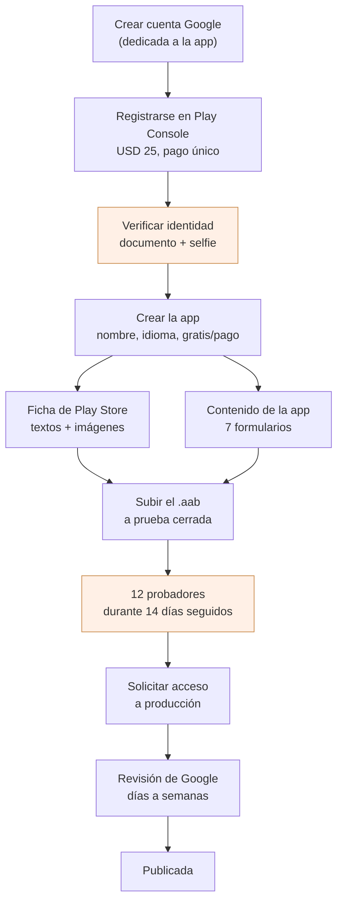
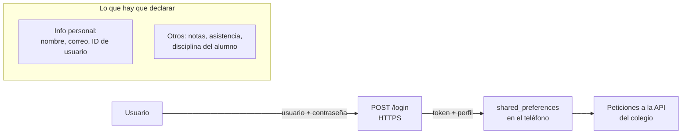
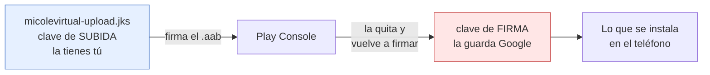

# Publicar Mi Cole Virtual en Google Play

Cómo se saca la cuenta de Play Console y cómo se sube la app. Escrito para una
**cuenta personal** (a nombre de una persona, no del colegio), que es la que se
eligió; al final está qué cambia si algún día se pasa a cuenta de organización.

Los diagramas son [Mermaid](https://mermaid.js.org). Para verlos dibujados en VS Code,
extensión `bierner.markdown-mermaid` y vista previa con `⌘K V`; en GitHub se ven solos.

## El camino completo



Las dos cajas naranjas son las que marcan el calendario real. Lo demás se hace
en una tarde.

## 1. La cuenta de Google

**Crea una cuenta nueva, no uses la personal del día a día.** La cuenta que
registra la consola es la dueña de la app: si mañana la administra otra persona,
o si esa cuenta se pierde, se pierde la app. Algo como
`desarrollo@micolevirtual.com` o `micolevirtual.dev@gmail.com`.

Actívale la verificación en dos pasos antes de seguir. Play Console la exige
para publicar, y activarla después de tener la app subida es más incómodo.

## 2. Registro en Play Console

En [play.google.com/console/signup](https://play.google.com/console/signup):

1. **Tipo de cuenta: «Yourself» / «Uno mismo»**. Es la personal.
2. **Nombre del desarrollador** — es *público*, aparece bajo el nombre de la app
   en la ficha. Puede ser tu nombre o «Mi Cole Virtual»; se puede cambiar después.
3. **Datos de contacto** — correo y teléfono. El teléfono se verifica por SMS.
4. **Verificación de identidad** — documento de identidad y una foto tuya.
   Tarda de unas horas a unos días. Hasta que no pase, la cuenta existe pero no
   deja publicar.
5. **Pago: USD 25**, una sola vez, de por vida, no reembolsable. Tarjeta de
   crédito o débito internacional.

> **Dirección física:** la cuenta personal publica tu dirección en la ficha de
> la app. Es requisito de Google y no hay forma de ocultarla. Si eso incomoda,
> es el argumento más fuerte para pasarse a cuenta de organización.

## 3. El cuello de botella: 12 probadores × 14 días

Toda cuenta personal creada después de noviembre de 2023 tiene que correr una
**prueba cerrada** antes de poder pedir acceso a producción:

- Mínimo **12 probadores** que hayan *aceptado* la invitación (no basta con
  invitarlos: cada uno tiene que abrir el enlace y darle a «Become a tester»).
- Tienen que seguir dentro **14 días seguidos**. Si uno se sale el día 10, el
  contador de ese hueco se rompe.
- Recién ahí aparece el botón **«Apply for production access»**, y ahí Google
  te pregunta a mano cómo probaste y qué aprendiste. Se responde en serio.

**Empieza por aquí.** Junta los 12 correos de Gmail *antes* de tocar nada más
—docentes, tú, familia, compañeros— porque esos 14 días corren solos mientras
tú preparas la ficha. Si esperas a tener todo listo para lanzar la prueba,
sumas dos semanas al final en vez de solaparlas.

En Play Console: **Test and release → Testing → Closed testing → Create track**,
lista de correos por email o por grupo de Google, y compartes el enlace de
opt-in que te da la consola.

> Google ha cambiado este número (fueron 20 probadores en su momento). Mira el
> aviso que la propia consola te muestra en «Production» antes de armar la
> lista, por si a día de hoy pide otra cosa.

## 4. Crear la app

**All apps → Create app**:

| Campo | Valor |
|---|---|
| Nombre | `Mi Cole Virtual` (máx. 30 caracteres) |
| Idioma predeterminado | Español (Colombia) |
| App o juego | App |
| Gratis o de pago | **Gratis** — y ojo, de gratis a pago *no se puede cambiar* después |

El `applicationId` no se escribe aquí: sale del primer `.aab` que subas, y es
**`com.micolevirtual.app`**. **Es irreversible.** Una vez subido el primer
bundle, esa app en Play queda casada con ese identificador para siempre;
cambiarlo significa publicar una app distinta y perder instalaciones y reseñas.

Nació siendo `com.app.micolevirtual.myvc_flutter` y se cambió antes de la
primera subida por dos razones. La convención es DNS invertido —un dominio que
controlas, escrito de atrás para adelante— y `com.app.micolevirtual` afirmaba
ser dueño de `app.com`, que es de otro; el dominio real es `micolevirtual.com`,
que invertido da `com.micolevirtual`. Y el sufijo `myvc_flutter` delataba la
herramienta: si algún día la app se rehace en otra cosa, ese nombre se queda
ahí para siempre, porque no se puede cambiar.

El identificador de iOS quedó igual (`com.micolevirtual.app`, en
`ios/Runner.xcodeproj/project.pbxproj`), que también es irreversible una vez
publicada en la App Store. El `name: myvc_flutter` de `pubspec.yaml` es otra
cosa —el paquete Dart, solo visible en los `import`— y no llega a ninguna
tienda.

## 5. La ficha de Play Store

**Grow → Store presence → Main store listing**. Lo que hay que tener:

- **Descripción corta** (80 caracteres) — la que se ve sin desplegar.
- **Descripción larga** (4.000 caracteres).
- **Ícono**: 512 × 512 px, PNG de 32 bits, **sin transparencia**. ⚠️ El original
  del repo, `assets/images/MyVc.png`, mide **360 × 360 y tiene canal alfa**: no
  sirve tal cual. Estirarlo a 512 se ve mal en la ficha. Hay que conseguir el
  logo original en 512 o más, y aplanarlo sobre un fondo sólido. Ese ícono de
  ficha es aparte del que va dentro de la app (ese lo genera
  `flutter_launcher_icons` desde el mismo PNG y ahí sí basta con 360).
- **Gráfico destacado**: 1024 × 500 px, PNG o JPG. Obligatorio.
- **Capturas de teléfono**: mínimo 2, máximo 8. Entre 320 y 3840 px de lado, y
  el lado largo no más del doble del corto. Se sacan con
  `flutter run --release` en un emulador y ⌘S, o con `adb shell screencap`.
- **Categoría**: Educación.
- **Correo de contacto**: público, sale en la ficha.
- **URL de política de privacidad**: **obligatoria**, y tiene que estar viva
  antes de enviar a revisión. Como el backend ya vive en `micolevirtual.com`,
  lo natural es `https://micolevirtual.com/privacidad`. Ver §7.

Capturas de tablet no son obligatorias, pero sin ellas Play marca la app como
«no optimizada para tablets» y la esconde en esos dispositivos.

## 6. Contenido de la app: qué contestar

**Policy → App content**. Son siete formularios; estos son los que tienen
respuesta no obvia en esta app:

**Seguridad de los datos (Data Safety).** La app *sí* recoge datos. Lo que
manda al servidor y guarda en el teléfono:



Las respuestas: **sí recoge** datos → se **transmiten cifrados** (todo va por
HTTPS) → **no se comparten con terceros** (solo con el servidor del colegio) →
el usuario **puede pedir que se borren** (a través del colegio; dilo así en la
política de privacidad) → **no** hay recolección opcional.

Ojo con una casilla concreta: la sesión guarda el token, no la contraseña, y
solo si el usuario deja marcada la casilla de recordar (ver
`lib/Utils/SesionGuardada.dart`). Eso se declara como recolección de
credenciales igualmente, porque el usuario las teclea.

**Público objetivo y contenido.** Aquí está la trampa. Si declaras que la app
va dirigida a **menores de 13 años**, entras en la *Families Policy*: requisitos
extra de publicidad, de contenido, y una revisión más lenta y más estricta.
Esta app la usan docentes, acudientes y alumnos de bachillerato, y el alumno de
primaria no es quien la instala. **Declara 13+ (o 18+)** y en la ficha deja
claro que es una herramienta para la comunidad educativa. Si algún día se
apunta a primaria de verdad, se revisa esta respuesta.

**Clasificación de contenido.** Cuestionario IARC. Categoría «Referencia,
noticias o educativa», y a todo lo de violencia, sexo, drogas, apuestas y
compras: no. Sale una clasificación «para todos».

**Lo demás:** sin anuncios · no es app de noticias · no es de una entidad
gubernamental · no maneja datos de salud ni criptomonedas · no hay compras
dentro de la app · sí tiene contenido generado por usuarios si el muro deja
publicar (mira `lib/Widgets/Publicacion.dart` antes de contestar; si los
acudientes pueden escribir, hay que declararlo y describir cómo se modera).

## 7. La política de privacidad

No es papeleo opcional: sin una URL que cargue, la revisión se rechaza. Tiene
que decir, como mínimo:

- Quién es el responsable (el colegio / Mi Cole Virtual) y cómo contactarlo.
- Qué datos se recogen: credenciales de acceso, nombre, y los datos académicos
  del alumno (notas, asistencia, disciplina).
- Para qué: dar el servicio académico, nada más.
- Con quién se comparten: con nadie fuera del colegio.
- Cuánto se guardan y cómo se pide el borrado.
- Que hay menores de por medio y quién autoriza (el acudiente, al matricular).

Si en Colombia aplica la Ley 1581 de 2012 (habeas data), la política debería
mencionarla y remitir al aviso de privacidad que el colegio ya tenga firmado
por los acudientes. Eso no lo decide la app: pregúntaselo al colegio.

## 8. Compilar y subir

La firma ya está montada en el repo. `android/app/build.gradle.kts` lee
`android/key.properties`, que **no está en git** y que cada quien crea en su
máquina:

```properties
storeFile=/Users/tu-usuario/claves-android/micolevirtual-upload.jks
storePassword=...
keyAlias=upload
keyPassword=...
```

Si ese archivo falta, el build de release imprime un aviso en rojo y firma con
la clave de depuración; Play rechaza ese bundle.

Para generar el almacén, si hay que rehacerlo:

```bash
JDK="/Applications/Android Studio.app/Contents/jbr/Contents/Home/bin"
"$JDK/keytool" -genkeypair -v \
  -keystore ~/claves-android/micolevirtual-upload.jks \
  -storetype PKCS12 -keyalg RSA -keysize 2048 -validity 10000 \
  -alias upload
```

Y el bundle:

```bash
flutter build appbundle --release
# sale en build/app/outputs/bundle/release/app-release.aab
```

El `.aab` pesa unos 55 MB, y eso asusta al verlo. No es lo que descarga el
usuario: dentro van las tres arquitecturas (`arm64-v8a`, `armeabi-v7a`,
`x86_64`, ~19 MB cada una) y Play le manda a cada teléfono solo la suya. La
descarga real ronda los 20 MB. Ese número —«Download size»— se ve en la propia
consola después de subir.

**El `versionCode` sube en cada subida, siempre.** Es el `+N` de `version:` en
`pubspec.yaml`. Play rechaza un bundle con un `versionCode` que ya vio, aunque
lo hayas borrado. Hoy va en `1.0.0+1`; la siguiente subida es `1.0.0+2` (o
`1.0.1+2` si además cambia lo que ve el usuario).

### Las dos claves que no hay que confundir



Con **Play App Signing** (activado por defecto), Google guarda la clave de
firma real y tú solo manejas la de subida. Eso significa que si pierdes
`micolevirtual-upload.jks`, **no se pierde la app**: se pide a Google un
reemplazo de la clave de subida. Aun así, guárdala en un gestor de contraseñas
junto con su contraseña, y haz una copia fuera del portátil. Nunca la metas al
repositorio: `android/.gitignore` ya excluye `key.properties`, `*.jks` y
`*.keystore`.

### Cómo está ahora mismo

La clave ya existe en `~/claves-android/micolevirtual-upload.jks` (alias
`upload`, PKCS12, válida hasta 2054) y `android/key.properties` ya apunta a
ella. El bundle de `build/app/outputs/bundle/release/app-release.aab` está
firmado con esa clave —no con la de depuración—, huella SHA1
`BC:89:D3:CF:DE:C2:3C:88:82:3F:36:6C:2F:1D:35:71:2F:79:06:D6`. Esa huella es la
que Play Console te mostrará como «clave de subida» cuando subas el primero.

## 9. Requisitos técnicos, a día de hoy

| Requisito de Google | Cómo está el proyecto |
|---|---|
| `targetSdk` reciente (API 35+) | **36** — lo pone el SDK de Flutter 3.44 |
| Formato App Bundle, no APK | ✅ `flutter build appbundle` |
| 64 bits | ✅ Flutter compila arm64 y x86_64 |
| Permisos justificados | `INTERNET`, y tres que trae Firebase — ver abajo |
| Firma con clave propia | ✅ configurada |

`minSdk` es 24 (Android 7). Nada que declarar, pero deja fuera teléfonos muy
viejos; si en el colegio los hay, hay que bajarlo a mano y probar.

### Los permisos, ahora que entró Firebase

Esta tabla decía «solo `INTERNET`» y **dejó de ser verdad al añadir la
analítica**. Medido en el manifiesto fusionado del *build*, no supuesto:

| Permiso | De dónde | ¿Se queda? |
|---|---|---|
| `INTERNET` | nuestro | sí |
| `ACCESS_NETWORK_STATE` | Firebase | **sí** — mirar si hay red antes de subir eventos |
| `WAKE_LOCK` | Firebase | **sí** — no dormirse a mitad de una subida |
| `…finsky…BIND_GET_INSTALL_REFERRER_SERVICE` | Firebase | sí — de dónde vino la instalación |
| `…DYNAMIC_RECEIVER_NOT_EXPORTED_PERMISSION` | Flutter | sí, es interna y ya estaba |
| `com.google.android.gms.permission.AD_ID` | Firebase | **quitado** |
| `ACCESS_ADSERVICES_AD_ID` | Firebase | **quitado** |
| `ACCESS_ADSERVICES_ATTRIBUTION` | Firebase | **quitado** |

**Los tres quitados son los de publicidad**, y se van porque esta app no tiene
anuncios y es de menores; el cómo está en [analitica.md](analitica.md) → «Lo que
se apaga a propósito». Los que se quedan son funcionales o internos, **ninguno
es de los que Android pide al usuario** —todos son de nivel normal, sin diálogo
de permiso—, así que en el teléfono no se nota ningún cambio.

Aun así, ya no se puede contestar «solo internet» en el formulario de seguridad
de datos: hay que declarar los datos de uso y diagnóstico que recoge Analytics.

## 10. Cuánto se demora

| Paso | Tiempo |
|---|---|
| Registro + pago | 1 hora |
| Verificación de identidad | horas a 3 días |
| Ficha e imágenes | media jornada |
| Prueba cerrada | **14 días, mínimo** |
| Revisión de acceso a producción | días a 2 semanas |
| Revisión de cada actualización después | horas a 3 días |

De cero a publicada, cuenta con **entre 3 semanas y mes y medio**. La primera
vez es la lenta; las actualizaciones posteriores salen en un día.

## Si algún día se pasa a cuenta de organización

Es una cuenta *distinta*: no se convierte la personal, hay que crear otra,
pagar otros USD 25 y transferir la app. Vale la pena si:

- No quieres tu dirección personal publicada en la ficha.
- Quieres saltarte los 12 probadores × 14 días (las cuentas de organización no
  lo tienen).
- El colegio quiere aparecer como el editor de la app.

Requiere un **número D-U-N-S** a nombre del colegio (gratis en Dun & Bradstreet,
de unos días a 4 semanas) y verificar el sitio web y el teléfono de la entidad.
