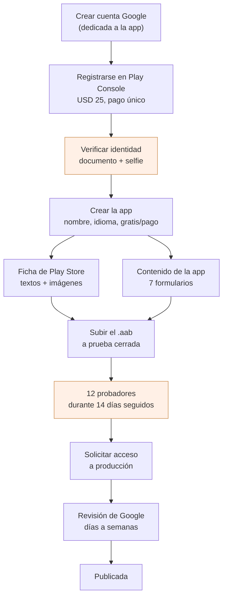
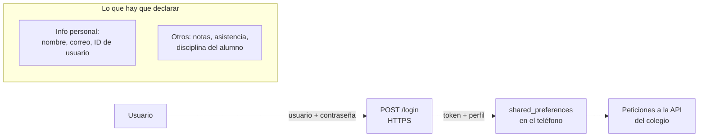
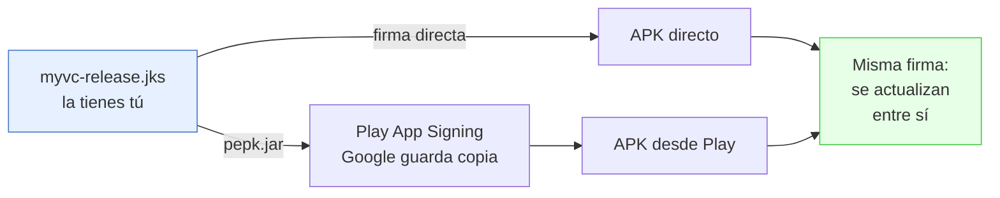
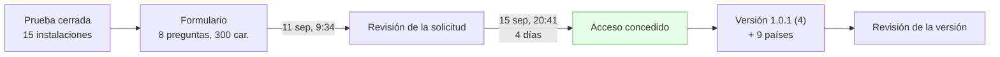

# Publicar Mi Cole Virtual en Google Play

Cómo se saca la cuenta de Play Console y cómo se sube la app. Escrito para una
**cuenta personal** (a nombre de una persona, no del colegio), que es la que se
eligió; al final está qué cambia si algún día se pasa a cuenta de organización.

> **Estado a 15 de septiembre de 2026.** Acceso a producción **concedido** el 15
> de septiembre, cuatro días después de solicitarlo. La versión `1.0.1 (4)` está
> **enviada a revisión** para el canal de producción, con 9 países y lanzamiento
> completo. Lo que se contestó en el formulario y cómo se lanzó, en §10.

Los diagramas son [Mermaid](https://mermaid.js.org). Para verlos dibujados en VS Code,
extensión `bierner.markdown-mermaid` y vista previa con `⌘K V`; en GitHub se ven solos.

## El camino completo



Las dos cajas naranjas son las que marcan el calendario real. Lo demás se hace
en una tarde.

## 1. La cuenta de Google

**Este documento recomendaba crear una cuenta nueva** —la que registra la
consola es la dueña de la app: si mañana la administra otra persona, o si esa
cuenta se pierde, se pierde la app—, y proponía algo como
`desarrollo@micolevirtual.com` o `micolevirtual.dev@gmail.com`.

**No fue lo que se hizo, y aquí queda el dato real.** La cuenta de Play Console
es la personal de Joseth: `davidguerrero777@gmail.com`. Se escribe porque es
justo lo que hacía falta para recuperar la cuenta y no estaba en ninguna parte
del repo: la recomendación de arriba se redactó *antes* de hacerlo y se leía
como si fuera lo ocurrido.

Es además el correo del Apple ID de la App Store —ver
[publicacion-app-store.md](publicacion-app-store.md) §3—, así que **las dos
tiendas cuelgan de esa única cuenta de Gmail**.

Lo que lo mitiga, y no cuesta nada: verificación en dos pasos **con teléfono de
confianza y clave de recuperación guardada fuera del portátil**. Play Console
exige el segundo factor para publicar, y activarlo después de tener la app
subida es más incómodo.

## 2. Registro en Play Console

En [play.google.com/console/signup](https://play.google.com/console/signup):

1. **Tipo de cuenta: «Yourself» / «Uno mismo»**. Es la personal.
2. **Nombre del desarrollador** — es *público*, aparece bajo el nombre de la app
   en la ficha. Puede ser tu nombre o «Mi Cole Virtual»; se puede cambiar después.
3. **Datos de contacto** — correo y teléfono. El teléfono se verifica por SMS.
4. **Verificación de identidad** — documento de identidad y una foto tuya.
   Tarda de unas horas a unos días. Hasta que no pase, la cuenta existe pero no
   deja publicar.
5. **Pago: USD 25**, una sola vez, de por vida, no reembolsable. Tarjeta de
   crédito o débito internacional.

> **Dirección física:** la cuenta personal publica tu dirección en la ficha de
> la app. Es requisito de Google y no hay forma de ocultarla. Si eso incomoda,
> es el argumento más fuerte para pasarse a cuenta de organización.

## 3. El cuello de botella: 12 probadores × 14 días

Toda cuenta personal creada después de noviembre de 2023 tiene que correr una
**prueba cerrada** antes de poder pedir acceso a producción:

- Mínimo **12 probadores** que hayan *aceptado* la invitación (no basta con
  invitarlos: cada uno tiene que abrir el enlace y darle a «Become a tester»).
- Tienen que seguir dentro **14 días seguidos**. Si uno se sale el día 10, el
  contador de ese hueco se rompe.
- Recién ahí aparece el botón **«Apply for production access»**, y ahí Google
  te pregunta a mano cómo probaste y qué aprendiste. Se responde en serio.

**Empieza por aquí.** Junta los 12 correos de Gmail *antes* de tocar nada más
—docentes, tú, familia, compañeros— porque esos 14 días corren solos mientras
tú preparas la ficha. Si esperas a tener todo listo para lanzar la prueba,
sumas dos semanas al final en vez de solaparlas.

En Play Console: **Test and release → Testing → Closed testing → Create track**,
lista de correos por email o por grupo de Google, y compartes el enlace de
opt-in que te da la consola.

> Google ha cambiado este número (fueron 20 probadores en su momento). Mira el
> aviso que la propia consola te muestra en «Production» antes de armar la
> lista, por si a día de hoy pide otra cosa.

### Dónde está el enlace, y cuál de los dos

**Prueba y lanza → Pruebas → Prueba cerrada** → abrir el canal (aquí se llama
**Alpha**) → sección **«Cómo se unen los verificadores a tu prueba»**, al final
de la página. Hay **dos** botones de *Copiar vínculo*, y no dan lo mismo:

| | Qué abre | El paso que ve la persona |
|---|---|---|
| **Unirse en Android** | la ficha en la app de Play Store del celular | **Instalar** |
| **Unirse desde la Web** | una página de opt-in en el navegador | **«Convertirme en probador»** |

**Se manda el de Android**, `play.google.com/store/apps/details?id=com.micolevirtual.app`,
por dos razones: un enlace de tienda no despierta desconfianza como uno de
«testing», y al abrirse desde el celular **la cuenta es automáticamente la del
Play Store**, que es justo donde falla el otro. El de la web obliga a advertir
«ábrelo con el mismo Gmail» y aun así hay quien lo abre con otro y no se entera.

El precio de esa elección: quien **no** esté en la lista no ve un mensaje claro,
ve «no se encontró la app». Por eso el mensaje pide que avisen si les pasa.

Dos formas de perder la tarde:

- **«Supervisa y mejora» no es.** Ahí están métricas y políticas; la prueba
  cerrada cuelga de «Prueba y lanza».
- **Si la sección no aparece, el canal todavía no tiene versión disponible.**
  Mientras la versión esté en revisión no hay enlace. No es que la lista de
  correos haya quedado mal cargada.

Y lo que la consola **no** hace: **cargar la lista no invita a nadie.** Play no
manda ningún correo. Los 27 de la lista cuentan 0 hasta que tú les pases el
enlace y cada uno lo abra.

**Ábrelo tú primero, desde tu propio celular.** Es la prueba de que el canal
está activo, la lista cargada y la versión fuera de revisión, las tres de golpe.
Si a ti te sale «no se encontró», no lo mandes todavía.

### El mensaje para invitar

Se escribió una vez y se perdió por no estar aquí. Va en bloque de código para
que los asteriscos de negrita de WhatsApp se puedan copiar tal cual:

```
Hola 👋 Estoy publicando *Mi Cole Virtual* en Google Play y necesito que prueben la app durante 14 días. ¡Es fácil!

📱 Ábrelo desde el celular (no desde el computador):
https://play.google.com/store/apps/details?id=com.micolevirtual.app

Se abre el Play Store, tocas *Instalar* y listo 🙏
Si te dice que no encuentra la app, avísame — es que me falta agregar tu correo.

Y un favor: *déjala instalada las dos semanas*. No tienes que usarla ni abrirla todos los días, solo no la borres hasta que yo te avise — si alguien la desinstala, *el conteo vuelve a empezar para todos* 😢
```

Tres decisiones que parecen de redacción y no lo son:

- **«No tienes que usarla»** baja la barrera para que acepten, que es lo único
  que se necesita de los 27. Lo que Google cuenta es estar *inscrito* 14 días
  seguidos, no el uso: quien instala y no vuelve a abrirla cuenta igual.
- **No dice «no te salgas de la prueba».** Se lee como «no cierres la app», y
  hace pensar que hay que tenerla abierta todo el día.
- **El fallo se convierte en un aviso.** «Si no encuentra la app, avísame»
  recupera a quien tenga el celular con otra cuenta; sin esa línea, esa persona
  abandona en silencio y tú nunca te enteras.

**Y el recordatorio, día 12 o 13** — se manda antes de que termine, no después:

```
Hola, ya casi terminamos los 14 días 🙌 Solo un favor: no borres la app hasta que te avise, falta poquito. Gracias de verdad, sin esto no se puede publicar.
```

### La retroalimentación, que es otra cosa

Al pedir acceso a producción, Google pregunta **a mano** cómo probaste y qué
aprendiste, y ahí no sirve «se instalaron 12». Eso se resuelve aparte: a cuatro
o cinco de confianza —docentes, sobre todo— se les pide que la usen unos días y
cuenten. No va en el mensaje de los 27; pedirlo a todos sube la barrera para
aceptar, que es lo que no conviene.

En esa misma pantalla hay un campo **«URL o dirección de correo para
comentarios»**, hoy vacío. Es opcional y no bloquea nada, pero poner ahí un
correo es gratis y da algo que responder en esa pregunta.

> **Y pasó exactamente lo que avisa este párrafo.** Llegó el día del formulario
> sin una sola frase de verificador guardada en ninguna parte, y esa es la única
> pregunta de las ocho que no se puede reconstruir desde el repositorio. El
> relato completo, en §10.

### El contador es lo único que dice la verdad

El Panel muestra *«Actualmente, N verificadores aceptaron participar»*. Esa
cifra, y no la lista de correos, es la que Google mira.

- **Tarda horas en refrescarse.** Que no suba la misma tarde en que alguien
  instaló no significa que lo haya hecho mal.
- **Pide que los primeros dos o tres te avisen.** Si el contador no se mueve con
  ellos, algo está mal en el enlace o en la lista, y lo descubres hoy y no el
  día 6.
- **Invita de más.** Hacen falta 12 y la lista tiene 27; ir justo significa
  reiniciar los 14 días si uno se cae el día 9.
- **El día 1 es el día en que el contador llega a 12**, no el día que mandaste
  los mensajes. Anota la fecha.

## 4. Crear la app

**All apps → Create app**:

| Campo | Valor |
|---|---|
| Nombre | `Mi Cole Virtual` (máx. 30 caracteres) |
| Idioma predeterminado | **Español (Latinoamérica), es-419** — el que la consola trae por defecto. «Español (Colombia)» no existe en el catálogo de Play: solo hay es-419, España y Estados Unidos |
| App o juego | App |
| Gratis o de pago | **Gratis** — y ojo, de gratis a pago *no se puede cambiar* después |

El `applicationId` **se escribe en este mismo formulario** —campo «Nombre del
paquete», con un botón de *Comprobar disponibilidad*— y es
**`com.micolevirtual.app`**. (La consola cambió: antes se deducía del primer
`.aab` que subieras.) Tiene que quedar idéntico al del bundle y al registrado en
la verificación, o Play rechaza la subida. **Es irreversible.** Esa app en Play
queda casada con ese identificador para siempre;
cambiarlo significa publicar una app distinta y perder instalaciones y reseñas.

Nació siendo `com.app.micolevirtual.myvc_flutter` y se cambió antes de la
primera subida por dos razones. La convención es DNS invertido —un dominio que
controlas, escrito de atrás para adelante— y `com.app.micolevirtual` afirmaba
ser dueño de `app.com`, que es de otro; el dominio real es `micolevirtual.com`,
que invertido da `com.micolevirtual`. Y el sufijo `myvc_flutter` delataba la
herramienta: si algún día la app se rehace en otra cosa, ese nombre se queda
ahí para siempre, porque no se puede cambiar.

El identificador de iOS quedó igual (`com.micolevirtual.app`, en
`ios/Runner.xcodeproj/project.pbxproj`), que también es irreversible una vez
publicada en la App Store. El `name: myvc_flutter` de `pubspec.yaml` es otra
cosa —el paquete Dart, solo visible en los `import`— y no llega a ninguna
tienda.

## 5. La ficha de Play Store

**Grow → Store presence → Main store listing**. Lo que hay que tener:

- **Descripción corta** (80 caracteres) — la que se ve sin desplegar.
- **Descripción larga** (4.000 caracteres).
- **Ícono**: 512 × 512 px, PNG de 32 bits, **sin transparencia**. ⚠️ El original
  del repo, `assets/images/MyVc.png`, mide **360 × 360 y tiene canal alfa**: no
  sirve tal cual. Estirarlo a 512 se ve mal en la ficha. Hay que conseguir el
  logo original en 512 o más, y aplanarlo sobre un fondo sólido. Ese ícono de
  ficha es aparte del que va dentro de la app (ese lo genera
  `flutter_launcher_icons` desde el mismo PNG y ahí sí basta con 360).
- **Gráfico destacado**: 1024 × 500 px, PNG o JPG. Obligatorio.
- **Capturas de teléfono**: mínimo 2, máximo 8. Entre 320 y 3840 px de lado, y
  el lado largo no más del doble del corto. Se sacan con
  `flutter run --release` en un emulador y ⌘S, o con `adb shell screencap`.
- **Categoría**: Educación.
- **Correo de contacto**: público, sale en la ficha.
- **URL de política de privacidad**: **obligatoria**, y tiene que estar viva
  antes de enviar a revisión. Como el backend ya vive en `micolevirtual.com`,
  lo natural es `https://micolevirtual.com/privacidad.html`. Ver §7.

Capturas de tablet no son obligatorias, pero sin ellas Play marca la app como
«no optimizada para tablets» y la esconde en esos dispositivos.

### La casilla de IA, al guardar la ficha

Al enviar la ficha, Play pide una **«Declaración de recursos de IA»** con dos
opciones: *No etiquetar recursos* o *Etiquetar los recursos como creados o
editados con IA*. **Pregunta por las imágenes de la ficha —ícono, capturas,
gráfico destacado, vídeo—, no por lo que hace la app por dentro.** Un texto de
descripción escrito con ayuda de un modelo no cuenta; una imagen generada o
retocada con IA, sí, aunque sea solo el fondo del gráfico destacado.

Aquí: las capturas son fotos de la app corriendo en un emulador y el ícono sale
del de iOS, así que por ese lado no había nada que etiquetar. **El gráfico
destacado sí se hizo con IA**, así que la ficha va con *«Etiquetar los recursos
como creados o editados con IA»* y ese recurso marcado, y solo ese (25 ago
2026). Declarar de más no penaliza; declarar de menos sí.

## 6. Contenido de la app: qué contestar

**Supervisa y mejora → Política y programas → Contenido de la app.** Está
enterrado dos niveles y bajo un grupo que no suena a esto, que es por lo que
cuesta encontrarlo. La otra puerta, y la que además lista de una vez todo lo
hecho y todo lo pendiente, es **«Descripción general de la publicación»**: los
enlaces azules «Contenido de la app» del bloque *«Cambios que indicaste»*, al
final de la página.

**Lo que NO funciona**, probado el 25 y 26 de agosto de 2026: el menú «Política»
ya no existe, «Contenido de la app» no cuelga de «Prueba y lanza», el «Mostrar
más» del Panel solo abre un texto explicativo, y la URL `.../app-content`
devuelve a la lista de apps.

### El ID de publicidad: se contesta «No»

Una de las verificaciones previas al envío para la declaración de ID de
publicidad. **La respuesta es «No»**, y está forzada en el código: el SDK de
Analytics mete tres permisos de publicidad por su cuenta y los tres salen del
manifiesto fusionado con `tools:node="remove"` —`AD_ID`,
`ACCESS_ADSERVICES_AD_ID` y `ACCESS_ADSERVICES_ATTRIBUTION`—, más el meta-data
que apaga la recogida. Ver
[AndroidManifest.xml](../android/app/src/main/AndroidManifest.xml) y
[analitica.md](analitica.md) → «Lo que se apaga a propósito».

Contestar «Sí» obligaría a declarar el identificador en seguridad de datos y
contradiría la ficha. Si algún día entra publicidad —que no es el plan—, hay que
volver aquí.

Son siete formularios; estos son los que tienen respuesta no obvia en esta app:

**Acceso a la app.** ⚠️ **El que tumba esta app si se contesta mal.** Aquí no
hay nada que ver sin iniciar sesión: el revisor de Google abre la app, se topa
con usuario y contraseña, no puede entrar y **rechaza por contenido
inaccesible**. Hay que marcar «todas o algunas funciones tienen acceso
restringido» y darle **credenciales que funcionen de verdad**.

Eso obliga a **crear una cuenta de prueba** en algún colegio —un docente, con un
grupo pequeño y datos que no sean de alumnos reales, porque el revisor va a ver
todo lo que esa cuenta vea— y a **mantenerla viva mientras la app esté
publicada**: cada actualización se vuelve a revisar, y si alguien borra esa
cuenta, la siguiente versión rebota.

Hay una cuenta de docente en el **colegio Demo** (`demo.micolevirtual.com`),
comprobada el 25 de agosto de 2026. **El usuario y la contraseña no se escriben
aquí** —este repositorio está en GitHub—: viven en «Acceso a la app» de Play
Console y en el gestor de contraseñas.

Y las instrucciones para el revisor **no pueden ser solo usuario y contraseña**:
la app arranca pidiendo elegir colegio de una lista, y el revisor no tiene cómo
adivinar cuál. El primer paso escrito tiene que ser *«elige Demo en la lista de
colegios»*. Sin eso no entra aunque las credenciales sean perfectas.

**Seguridad de los datos (Data Safety).** La app *sí* recoge datos. Lo que
manda al servidor y guarda en el teléfono:



Las respuestas: **sí recoge** datos → se **transmiten cifrados** (todo va por
HTTPS) → **no se comparten con terceros** (solo con el servidor del colegio) →
el usuario **puede pedir que se borren** (a través del colegio; dilo así en la
política de privacidad) → **no** hay recolección opcional.

Ojo con una casilla concreta: la sesión guarda el token, no la contraseña, y
solo si el usuario deja marcada la casilla de recordar (ver
`lib/Utils/SesionGuardada.dart`). Eso se declara como recolección de
credenciales igualmente, porque el usuario las teclea.

**Público objetivo y contenido.** Aquí está la trampa. Si declaras que la app
va dirigida a **menores de 13 años**, entras en la *Families Policy*: requisitos
extra de publicidad, de contenido, y una revisión más lenta y más estricta.
Esta app la usan docentes, acudientes y alumnos de bachillerato, y el alumno de
primaria no es quien la instala. **Declara 13+ (o 18+)** y en la ficha deja
claro que es una herramienta para la comunidad educativa. Si algún día se
apunta a primaria de verdad, se revisa esta respuesta.

**Clasificación de contenido.** Cuestionario IARC. Categoría «Referencia,
noticias o educativa», y a todo lo de violencia, sexo, drogas, apuestas y
compras: no. Sale una clasificación «para todos».

**Lo demás:** sin anuncios · no es app de noticias · no es de una entidad
gubernamental · no maneja datos de salud ni criptomonedas · no hay compras
dentro de la app · sí tiene contenido generado por usuarios si el muro deja
publicar (mira `lib/Widgets/Publicacion.dart` antes de contestar; si los
acudientes pueden escribir, hay que declararlo y describir cómo se modera).

## 7. La política de privacidad

No es papeleo opcional: sin una URL que cargue, la revisión se rechaza. Tiene
que decir, como mínimo:

- Quién es el responsable (el colegio / Mi Cole Virtual) y cómo contactarlo.
- Qué datos se recogen: credenciales de acceso, nombre, y los datos académicos
  del alumno (notas, asistencia, disciplina).
- Para qué: dar el servicio académico, nada más.
- Con quién se comparten: con nadie fuera del colegio.
- Cuánto se guardan y cómo se pide el borrado.
- Que hay menores de por medio y quién autoriza (el acudiente, al matricular).

Si en Colombia aplica la Ley 1581 de 2012 (habeas data), la política debería
mencionarla y remitir al aviso de privacidad que el colegio ya tenga firmado
por los acudientes. Eso no lo decide la app: pregúntaselo al colegio.

## 8. Compilar y subir

La firma ya está montada en el repo. `android/app/build.gradle.kts` lee
`android/key.properties`, que **no está en git** y que cada quien crea en su
máquina:

```properties
storeFile=/Users/tu-usuario/myvc-release.jks
storePassword=...
keyAlias=myvc
keyPassword=...
```

Si ese archivo falta, el build de release imprime un aviso en rojo y firma con
la clave de depuración; Play rechaza ese bundle.

Para generar el almacén, si hay que rehacerlo:

```bash
JDK="/Applications/Android Studio.app/Contents/jbr/Contents/Home/bin"
"$JDK/keytool" -genkeypair -v \
  -keystore ~/myvc-release.jks \
  -storetype PKCS12 -keyalg RSA -keysize 2048 -validity 10000 \
  -alias myvc
```

Y el bundle:

```bash
flutter build appbundle --release
# sale en build/app/outputs/bundle/release/app-release.aab
```

El `.aab` pesa unos 55 MB, y eso asusta al verlo. No es lo que descarga el
usuario: dentro van las tres arquitecturas (`arm64-v8a`, `armeabi-v7a`,
`x86_64`, ~19 MB cada una) y Play le manda a cada teléfono solo la suya. La
descarga real ronda los 20 MB. Ese número —«Download size»— se ve en la propia
consola después de subir.

**El `versionCode` sube en cada subida, siempre.** Es el `+N` de `version:` en
`pubspec.yaml`. Play rechaza un bundle con un `versionCode` que ya vio, aunque
lo hayas borrado. El número vigente es el de `pubspec.yaml`, no el de este
documento; la última subida a producción fue `1.0.1 (4)`. Súbelo en uno siempre,
y sube también la parte `x.y.z` si cambia lo que ve el usuario.

### Una sola clave, a propósito

Play App Signing, por defecto, funciona con **dos** claves: tú firmas el `.aab`
con una de *subida*, Play se la quita y vuelve a firmar la app con la clave de
*firma* real, que guarda Google. Eso tiene una ventaja: si pierdes la de subida,
no pierdes la app.

**Aquí no se usa así**, y la razón es que Mi Cole Virtual se reparte por **dos
canales**: Google Play y APK directo (enlace en la web del colegio, WhatsApp).
Si Play firmara con una clave suya, el APK de Play y el APK directo llevarían
firmas distintas para el mismo `com.micolevirtual.app`. Android trata eso como
apps incompatibles: quien instaló el directo no puede actualizar desde Play sin
desinstalar —perdiendo sesión y datos locales— y al revés igual.



Por eso, **al crear la app en Play Console hay que subir esta misma clave** con
`pepk.jar` — *Firma de la app → «Exportar y subir una clave desde un almacén de
claves de Java»*— en vez de dejar que Google genere una. Esa opción **solo se
ofrece al crear la app**; después es muy engorroso cambiarla.

El precio de la decisión: como la clave de subida y la de firma pasan a ser la
misma, perder `myvc-release.jks` sí duele. El canal de Play se salvaría —Google
tiene su copia— pero el de APK directo no: no podrías firmar una actualización
que acepten los teléfonos que instalaron por fuera. Copia del `.jks` y de sus
contraseñas en un gestor de contraseñas, y otra fuera del portátil.

### Verificación de desarrolladores de Android

Aparte de Play, Google exige registrar el nombre del paquete en *Play Console →
Verificación de desarrolladores de Android*, para que la app pueda instalarse en
dispositivos Android certificados. Se hace una vez:

1. **Nombre del paquete**: `com.micolevirtual.app`; **nombre descriptivo**:
   `Mi Cole Virtual`.
2. **Agrega una clave** → pega el SHA-256. El campo es un `textarea` y **no
   tolera saltos de línea ni espacios finales**: si pegas de más, responde
   «Huella digital del certificado SHA-256 no válida» aunque el valor sea bueno.

Hecho el 24 de agosto de 2026: paquete registrado y huella verificada.

### Subir tu propia clave a Play App Signing (`pepk`)

**Dónde está.** Google ha movido esta pantalla varias veces; a agosto de 2026 la
ruta es **Protegido con Play → Protección de Play Store → Firma de apps**. No
está en «Configuración avanzada» ni en «Integridad de la app», aunque el menú
sugiera lo contrario. En la documentación en inglés esa sección se llama *Play
Store distribution*, traducida en la consola como «Protección de Play Store».

**Hasta cuándo se puede.** Las apps nuevas quedan inscritas automáticamente con
una clave generada por Google (clásica + poscuántica). Se puede reemplazar con
**«Cambiar clave»** mientras **ninguna versión haya llegado a pruebas abiertas
ni a producción**. Las pruebas internas y cerradas *no* cierran la puerta: se
puede arrancar la prueba cerrada de 14 días sin haber resuelto todavía la clave.

**El comando.** En *Preferencias de firma de apps* → «Exportar y subir una clave
desde un almacén de claves Java», descarga la clave pública de encriptación y
`pepk.jar`. El ejemplo que muestra la consola usa `foo.keystore` / `foo` como
marcadores; el real es:

```bash
JAVA="/Applications/Android Studio.app/Contents/jbr/Contents/Home/bin/java"
"$JAVA" -jar ~/Downloads/pepk.jar \
  --keystore="$HOME/myvc-release.jks" \
  --alias=myvc \
  --keystore-pass="..." --key-pass="..." \
  --output="$HOME/Downloads/myvc-signing-key.zip" \
  --include-cert \
  --rsa-aes-encryption \
  --encryption-key-path="$HOME/Downloads/encryption_public_key.pem"
```

⚠️ **`pepk` no acepta contraseñas por tubería.** Sin `--keystore-pass` /
`--key-pass` las pide por `System.console()`, y eso revienta con
`NullPointerException` en cualquier terminal sin TTY (un script, un agente).
Pasarlas por argumento es la única vía no interactiva.

Antes de subir el ZIP conviene comprobar que el certificado que lleva dentro es
el que crees:

```bash
unzip -o -q ~/Downloads/myvc-signing-key.zip -d /tmp/pepkcheck
openssl x509 -in /tmp/pepkcheck/certificate.pem -noout -fingerprint -sha256
```

**Sin clave de carga separada, a propósito.** El diálogo ofrece, como paso 5
opcional, crear una clave de carga distinta de la de firma. Aquí **no se hizo**,
y la razón es la misma que obligó a subir la clave propia: como hay canal de APK
directo, la clave de firma se necesita a mano en cada build y nunca va a estar
guardada offline. Una clave de carga aparte no protegería de nada real. Además
ese paso 5 solo se ofrece *antes* de guardar; después queda únicamente el
trámite de «solicitar que se restablezca la clave de carga», con soporte de por
medio.

Consecuencia directa: **`myvc-release.jks` es la única copia que existe fuera de
Google.** Perderla no tumba el canal de Play —Google tiene la suya— pero sí deja
el canal de APK directo sin forma de publicar una actualización que acepten los
teléfonos ya instalados. Gestor de contraseñas con el archivo adjunto, y copia
en otro sitio.

### Ojo con «Verificación del instalador»

En *Protegido con Play → Protección automática* hay un interruptor,
**«Verificación del instalador»**, **activado por defecto**. Le muestra un aviso
a quien instale la app desde una fuente que no sea Play, pidiéndole que la baje
de la ficha de Play Store.

Con distribución por APK directo eso estorba: cada acudiente que instale desde
la web del colegio o por WhatsApp vería ese aviso.

**Decidido el 25 de agosto de 2026: el canal directo se mantiene, así que se
apaga.** En *Protegido con Play → Protección automática → Administrar*.

En esa misma pantalla está la **API de Play Integrity**, en 0 de 7 servicios y
**así se queda**: verificar sus tokens es una llamada a Google desde el servidor
por cada validación, y el backend es de solo lectura sobre un hosting
compartido. Tenerla apagada no penaliza la publicación.

### Cómo está ahora mismo

| | |
|---|---|
| Keystore | `~/myvc-release.jks`, alias `myvc`, PKCS12, permisos `600` |
| Validez | hasta el 9 de enero de 2054 |
| `android/key.properties` | apunta a él, fuera de git |
| Certificado público | `~/myvc-cert.der` y `~/myvc-cert.pem` |
| SHA-1 | `BF:BC:95:1C:D1:2A:19:1A:2C:12:60:2D:42:8A:3F:2A:AC:A9:42:CA` |
| SHA-256 | `61:44:AF:9F:7D:C9:48:86:AE:47:9C:8B:2B:90:06:36:17:BD:BE:93:3F:AF:27:FD:AE:A8:B7:37:11:B9:8E:81` |
| Bundle | `build/app/outputs/bundle/release/app-release.aab`, 58 MB, firmado y verificado contra esa huella |
| Verificación de desarrolladores | ✅ paquete registrado, huella verificada (24 ago 2026) |
| Play App Signing | ✅ usa **esta misma clave**, subida con `pepk` el 24 ago 2026 |
| Clave de carga | la misma que la de firma (ver arriba) |

> **Hubo un keystore anterior**, `~/claves-android/micolevirtual-upload.jks`
> (alias `upload`, del 20 de agosto), que es el que describía este documento
> antes. Quedó **descartado** el 24 de agosto de 2026 a favor del de arriba. No
> se borró, pero no se usa: no lo confundas al escribir `key.properties`.

## 9. Requisitos técnicos, a día de hoy

| Requisito de Google | Cómo está el proyecto |
|---|---|
| `targetSdk` reciente (API 35+) | **36** — lo pone el SDK de Flutter 3.44 |
| Formato App Bundle, no APK | ✅ `flutter build appbundle` |
| 64 bits | ✅ Flutter compila arm64 y x86_64 |
| Permisos justificados | `INTERNET`, y tres que trae Firebase — ver abajo |
| Firma con clave propia | ✅ configurada |

`minSdk` es 24 (Android 7). Nada que declarar, pero deja fuera teléfonos muy
viejos; si en el colegio los hay, hay que bajarlo a mano y probar.

### Los permisos, ahora que entró Firebase

Esta tabla decía «solo `INTERNET`» y **dejó de ser verdad al añadir la
analítica**. Medido en el manifiesto fusionado del *build*, no supuesto:

| Permiso | De dónde | ¿Se queda? |
|---|---|---|
| `INTERNET` | nuestro | sí |
| `ACCESS_NETWORK_STATE` | Firebase | **sí** — mirar si hay red antes de subir eventos |
| `WAKE_LOCK` | Firebase | **sí** — no dormirse a mitad de una subida |
| `…finsky…BIND_GET_INSTALL_REFERRER_SERVICE` | Firebase | sí — de dónde vino la instalación |
| `…DYNAMIC_RECEIVER_NOT_EXPORTED_PERMISSION` | Flutter | sí, es interna y ya estaba |
| `com.google.android.gms.permission.AD_ID` | Firebase | **quitado** |
| `ACCESS_ADSERVICES_AD_ID` | Firebase | **quitado** |
| `ACCESS_ADSERVICES_ATTRIBUTION` | Firebase | **quitado** |

**Los tres quitados son los de publicidad**, y se van porque esta app no tiene
anuncios y es de menores; el cómo está en [analitica.md](analitica.md) → «Lo que
se apaga a propósito». Los que se quedan son funcionales o internos, **ninguno
es de los que Android pide al usuario** —todos son de nivel normal, sin diálogo
de permiso—, así que en el teléfono no se nota ningún cambio.

Aun así, ya no se puede contestar «solo internet» en el formulario de seguridad
de datos: hay que declarar los datos de uso y diagnóstico que recoge Analytics.

## 10. El acceso a producción, contestado y concedido

Los 14 días se cumplieron y el botón **«Solicitar acceso a producción»**
apareció solo. Lo que abre es un formulario de tres pantallas con ocho preguntas
escritas a mano, casi todas con tope de **300 caracteres** que la consola cuenta
en vivo y no deja pasar.



### «Aplicar» envía la solicitud, no la guarda

Es la trampa del trámite. El botón azul del final del formulario dice
**Aplicar**, al lado de un **Descartar**, y parece que guarda un borrador. No:
manda la solicitud a Google en ese momento. No hay pantalla de confirmación ni
segundo paso, y **una vez enviada no se puede editar ni una coma**.

Consecuencia práctica: cada respuesta tiene que ser verdad **el día que se
escribe**, no el día que planeabas hacerla verdad. Si una frase dependía de
subir un build que todavía no subiste, esa frase no va.

### Las ocho preguntas, y lo que se contestó

Se dejan escritas porque **App Store pregunta lo mismo** y porque una segunda
app con esta misma cuenta volvería a pasar por aquí. Las dos últimas están
literales, comprobadas en pantalla antes de enviar.

**1. Acerca de la prueba cerrada**

| Pregunta | Respuesta |
|---|---|
| Cómo reclutaste a los verificadores | Invitación personal por WhatsApp a docentes y directivos del colegio, familiares y compañeros. **Sin proveedor de pruebas pagado**, y 27 correos cargados para asegurar los 12 |
| Qué tan fácil fue reclutarlos | **Difícil** — es la escala honesta cuando hay que invitar a 27 para conseguir 12, y Google la usa para medir fricción, no para juzgar |
| Nivel de participación | La mayoría instaló y mantuvo instalada; el uso real vino de los docentes del colegio, con datos reales. Lo que la prueba no ejercitó: el rol de acudiente a escala y el uso simultáneo desde varios colegios |
| Resumen de comentarios y método | Recogidos por canal directo —WhatsApp, llamada y conversación en el colegio—, no por formulario |

**2. Acerca de tu app**

| Pregunta | Respuesta |
|---|---|
| Público objetivo | Solo quien tiene credenciales de un colegio cliente; quince instituciones de Colombia; docentes, acudientes y alumnos de 13 años en adelante |
| Cómo ofrece valor | Acaba con la espera al boletín impreso: notas, asistencia y disciplina el mismo día; y el docente registra asistencia en segundos, sin planillas |
| Instalaciones esperadas el primer año | **entre 0 y 10.000** |

Sobre la última: el techo real son quince colegios, y el más grande medido tiene
2.279 personas. Inflar la cifra no da ninguna ventaja —es dimensionamiento, no
ambición— y desentona con la app cerrada que describen las dos respuestas
anteriores. **«No lo sé» tampoco**: en un formulario que evalúa si estás listo
para producción, no conocer tu propio mercado se lee solo de una manera.

**3. Nivel de preparación**, las dos literales:

> **¿Qué cambios hiciste según lo que aprendiste durante la prueba cerrada?**
>
> Corregí los fallos que salieron en esas dos semanas. El más grave: la app
> decía «Hoy no tienes clases» a todos los docentes, porque un horario vacío y
> uno sin publicar llegaban iguales. Y las notas dejaron de redondearse a
> entero, se corrigió el promedio y el arranque dejó de rebajar fotos.

> **¿Cómo decidiste que tu app está lista para producción?**
>
> Cuando no quedaron fallos conocidos sin corregir. Los que aparecieron durante
> la prueba ya están arreglados y verificados contra los servidores reales de
> los quince colegios, con datos reales de clase, y la app pasa 510 pruebas
> automatizadas en cada cambio antes de compilar una versión.

Fíjate en lo que la segunda **no** dice: que esos arreglos estuvieran ya en el
canal cerrado. No lo estaban —el canal seguía con `1.0.0 (3)`— y por eso la
frase se escribió así. La versión fuerte («la versión que pido publicar es la
misma que llevan instalada los verificadores») era mentira ese día, y se
descartó.

### La lección que costó: los comentarios no estaban escritos

Esta guía ya avisaba en §3 que la retroalimentación «es otra cosa» y que había
que pedírsela aparte a cuatro o cinco docentes. Llegó el día del formulario y
**no había ni una frase de verificador guardada en ninguna parte**. El git log
tenía cuatro arreglos de esas dos semanas, pero al mirarlos de cerca ninguno
venía de un tester: el del horario lo dice él mismo —«nadie lo reportó, salió al
medir el radio de impacto»— y el del promedio lo destapó la sesión del front web.

De ahí que la respuesta de la sección 3 hable de «los fallos que salieron»
—cierto— y no de «lo que pidieron los verificadores», que habría sido inventado.

**Para la próxima**: un archivo de texto donde se pegue cada frase que diga un
probador, con fecha y quién. Cuesta nada y es el único campo del formulario que
no se puede reconstruir desde el repositorio.

### Cuatro días, no siete

El correo prometía «7 días o menos» y llegó en **4**: enviada el 11 de
septiembre a las 9:34, concedida el 15 a las 20:41, con asunto *«Congratulations!
Your app has been granted Google Play production access»*.

Lo que **no** hace esa aprobación: publicar nada. Es un permiso. La app seguía
en «Producción: Inactivo» y el lanzamiento es un trámite aparte, el de abajo.

### Lanzar la versión, y las tres piedras del camino

Con el acceso concedido: **Prueba y lanza → Producción → Crear versión nueva**.

1. **El botón sale gris si hay un borrador a medias.** El tooltip lo explica
   —«lanza o descarta la versión en borrador actual»— pero el borrador no se
   retoma desde ahí: está en la pestaña **Versiones**, con su botón *Editar*.
2. **Los países arrancan en 0 y sin ellos no se lanza.** Pestaña
   **Países/regiones**. Se eligieron **9**, Colombia entre ellos; abrir de más no
   cuesta nada porque sin credenciales de un colegio nadie pasa del login.
3. **Las notas de la versión van en `es-419`, no en `es-CO`.** La etiqueta la
   propone la propia consola y es el idioma de la ficha (§4: «Español (Colombia)»
   no existe en el catálogo de Play). Con la etiqueta equivocada, las notas no se
   muestran. Debajo del cuadro tiene que leerse *«disponibles en 1 idioma»*.

Y un aviso que sí importa antes de darle a publicar: **«tu elección de clave de
firma se corregirá una vez que la publiques»**. Es irreversible, así que se
comprobó en *Protegido con Play → Firma de apps* que la huella en uso fuera la
de `myvc-release.jks` —`61:44:AF:9F:7D:C9…`— y no una generada por Google. Lo
era, igual que la clave de carga. Si hubiera salido otra, ese habría sido el
último momento de cambiarla, y el canal de APK directo se habría quedado sin
poder actualizar los teléfonos ya instalados.

El resto de avisos de esa pantalla se dejaron como estaban, a propósito:
verificación del instalador apagada (§8), Play Integrity en 0 de 7 (§8) y las
**preferencias de acceso al catálogo** sin tocar —si no decides, la ficha entra
por defecto en las exportaciones del catálogo de Play, que son metadatos
públicos: nombre, ícono, descripción. Nada de usuarios.

### Subir una actualización: los clics, como están el 23 sep 2026

La consola cambia de menú sin avisar. Esto es lo que se vio en pantalla ese día
y no lo que dice la ayuda de Google; si algo no coincide, se corrige aquí.

1. **Inicio de la app** (la que tiene *Descripción general de la publicación*
   arriba) → la flecha de la tarjeta **Prueba y lanza**.
2. En *Prueba y lanza*, la flecha de la fila **Versión de producción más
   reciente** (muestra la versión vigente, p. ej. `4 (1.0.1)`). **No** son las
   tarjetas de abajo: *Prueba abierta*, *Prueba interna* y *Prueba cerrada ·
   alpha* son otros canales.
3. En *Producción*: **Crear versión nueva**. Si está gris, hay un borrador: se
   retoma en la pestaña *Versiones* → *Editar*.
4. **App bundles** → subir `build/app/outputs/bundle/release/app-release.aab`.
   Tiene que aparecer como `N (x.y.z)` con el `N` de `pubspec.yaml`.
5. **Notas de la versión** en `es-419`, y debajo *«disponibles en 1 idioma»*.
6. **Siguiente** → revisar avisos → **Guardar**.
7. **Nada llega a Google todavía.** Se envía desde **Descripción general de la
   publicación**, que ahora dirá que hay cambios sin publicar, junto con lo que
   se haya cambiado en la ficha o en *Contenido de la app*: todo sale en un
   solo envío.

**Solo para `1.1.0 (5)`, la que estrena los avisos**, antes del paso 7 y en el
mismo envío:

- **Contenido de la app → Seguridad de los datos**: la fila *ID del
  dispositivo* pasa a «Estadísticas y Funciones de la app», sigue opcional
  (`seguridad-datos-play.md:98`).
- **Ficha principal de la tienda**: el bloque *AVISOS CUANDO HAY ALGO NUEVO* y
  el párrafo de Firebase Cloud Messaging (`ficha-play.md:104-130`).
- **Fuera de Play, el mismo día**: `docs/privacidad.html` a
  `https://micolevirtual.com/privacidad.html`, a mano.

### El tamaño real de la descarga

| | |
|---|---|
| Bundle que se sube | **58 MB** |
| Instalación nueva | **10,9 MB** |
| Tiempo de descarga estimado | 6 s |

Este documento decía «la descarga real ronda los 20 MB». **Es la mitad**: 10,9 MB,
medido por la propia consola en la vista previa de la versión. Es el número que
sirve para contestarle a un acudiente que pregunta cuánto ocupa.

### Cómo quedó enviado

**15 de septiembre de 2026**, dos cambios en un solo envío desde *Descripción
general de la publicación* —que es el buzón de salida de Play: nada llega a
Google hasta que se pulsa ahí—:

| Elemento | Detalle |
|---|---|
| Producción | `4 (1.0.1)`, **lanzamiento completo** (100%, sin despliegue por fases) |
| Países/regiones | 9, con Colombia |
| Notas | `es-419`, primera versión pública |
| Bundle | el mismo `app-release.aab` compilado y verificado el 11 de septiembre |

Sin despliegue por fases a propósito: con quince colegios, un rollout al 20%
solo genera llamadas de «a mí no me aparece la actualización».

## 11. Cuánto se demora

La columna de la derecha ya no es una estimación: es lo que tardó de verdad,
medido entre el 24 de agosto y el 15 de septiembre de 2026.

| Paso | Estimado | Lo que tardó |
|---|---|---|
| Registro + pago | 1 hora | ✅ |
| Verificación de identidad | horas a 3 días | ✅ |
| Ficha e imágenes | media jornada | ✅ |
| Prueba cerrada | **14 días, mínimo** | 14 días |
| Revisión de acceso a producción | días a 2 semanas | **4 días** (11 → 15 sep) |
| Revisión de cada actualización después | horas a 3 días | — |

De cero a publicada, cuenta con **entre 3 semanas y mes y medio**. La primera
vez es la lenta; las actualizaciones posteriores salen en un día.

Los 14 días de la prueba cerrada son el 60 % del calendario, y **corren solos**:
la ficha, los formularios de contenido y la política se preparan mientras tanto.
Esperar a tenerlo todo listo para arrancar la prueba es sumar dos semanas al
final en vez de solaparlas.

## Si algún día se pasa a cuenta de organización

Es una cuenta *distinta*: no se convierte la personal, hay que crear otra,
pagar otros USD 25 y transferir la app. Vale la pena si:

- No quieres tu dirección personal publicada en la ficha.
- Quieres saltarte los 12 probadores × 14 días (las cuentas de organización no
  lo tienen).
- El colegio quiere aparecer como el editor de la app.

Requiere un **número D-U-N-S** a nombre del colegio (gratis en Dun & Bradstreet,
de unos días a 4 semanas) y verificar el sitio web y el teléfono de la entidad.
