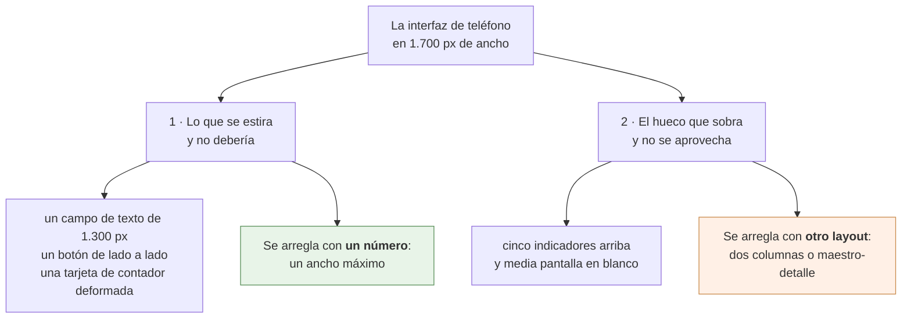
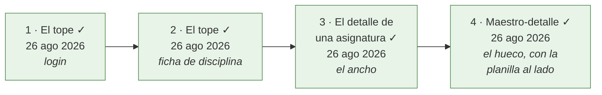
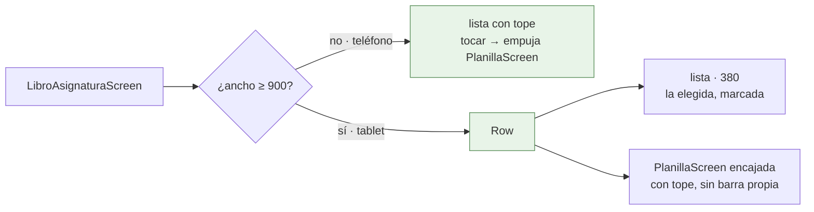

# Tablets

La app **funciona** en una tablet desde el primer día: nada se rompe, nada da
error, todo se puede tocar. Lo que no tiene es **un layout propio** — es la
interfaz de teléfono ocupando todo el ancho.

Este documento existe porque «se ve raro en tablet» no es una tarea: hay que
saber *dónde* se ve raro, *por qué*, y cuál de los dos problemas distintos que
se esconden ahí dentro es el que toca resolver.

Los diagramas son [Mermaid](https://mermaid.js.org). Para verlos dibujados en VS
Code, extensión `bierner.markdown-mermaid` y vista previa con `⌘K V`; en GitHub
se ven solos.

## Son dos problemas, no uno

Y confundirlos es la forma de hacer el doble de trabajo del necesario.



**El primero es barato y el segundo no.** El primero es un tope: se escribe una
vez, no cambia nada en el teléfono y se puede comprobar con una prueba. El
segundo es rediseñar una pantalla, y hay que hacerlo pantalla por pantalla
porque cada una aprovecha el hueco de una forma distinta.

Por eso el orden es ése, y por eso el primero no espera al segundo.

## Dónde se nota, medido y no supuesto

Salió al sacar las capturas de la ficha de Play el 25 de agosto de 2026, en un
emulador de Pixel Tablet.

| Pantalla | Cómo queda | Cuál de los dos problemas |
|---|---|---|
| Detalle de una asignatura | **Mal.** Cinco indicadores arriba y media pantalla en blanco debajo | los **dos** — **hechos**: el 1 en la fase 3, el 2 en la fase 4 |
| Login | Regular. Los campos ocupan todo el ancho y quedan desproporcionados | el 1 — **hecho**, fase 1 |
| Ficha de disciplina de un alumno | Regular. Las tarjetas de contadores se estiran de más | el 1 — **hecho**, fase 2 |
| Notas «por alumno» | Se anotó **«bien»**, y era media verdad. Ver abajo | el 1 — **hecho**, fase 3 |
| Asistencia, listado de disciplina | **Bien.** Son listas y a lo ancho caben 15 alumnos en vez de 7 | ninguno |

### La medida de «por alumno» estaba incompleta, y se vio al mirarla de verdad

La tabla de arriba decía que «notas por alumno» quedaba **bien** en tablet,
porque a lo ancho caben quince alumnos en vez de siete. Eso es cierto y es una
medida **vertical**: cuántas filas se ven.

Puesta la pantalla delante, en horizontal está mal: **el nombre del alumno queda
a 1.900 px de su nota**. Es una fila de dos extremos —etiqueta a la izquierda,
dato a la derecha— y estirada obliga al ojo a cruzar la pantalla entera para
emparejar las dos mitades. Lo mismo le pasaba al lápiz de cada indicador
respecto de su título.

Es el aviso más útil que ha dado este frente: **«caben más» y «se lee bien» son
dos preguntas distintas**, y la primera se contesta de un vistazo mientras que
la segunda pide mirar una fila. La primera medida se hizo sacando capturas para
Play, o sea mirando la pantalla como una imagen y no como algo que alguien usa.

**Las listas de asistencia y el listado de disciplina siguen sin tocarse**, pero
conviene mirarlas con esta pregunta el día que se pase por ellas.

## Las fases



### Fase 1 — el tope, y el login. Hecha

**26 de agosto de 2026.** [Anchos](../lib/Utils/Anchos.dart), y los tres
controles del login pasan a pedirle a él cuánto miden.

La regla no es «proporcional» ni «fijo» sino **proporcional con tope**: en un
teléfono manda la proporción y **no cambia absolutamente nada**; en una tablet
manda el tope y el control se queda centrado con aire a los lados. El tope son
420 px, que es aproximadamente un teléfono grande — o sea que en tablet el
formulario se ve como se diseñó, centrado, en vez de como una versión estirada
de sí mismo.

De paso arregla algo que ya estaba mal antes de las tablets: **la banda del
login estaba escrita tres veces**. `InputContainer`, `RoundedButton` y la
casilla de «recordar mis datos» ponían cada uno su `size.width * 0.8`, y el
comentario de uno de ellos avisaba de que los otros dos hacían lo mismo. Los
tres tienen que medir igual o se ve un escalón entre ellos, así que eran tres
sitios donde cambiar una decisión que es una.

Cinco pruebas en [anchos_test](../test/anchos_test.dart), y la que más importa
es la primera: **en un teléfono la banda sigue siendo el 80% exacto de antes**.
Esto no puede tocar la pantalla que usa todo el mundo.

### Fase 2 — el tope en la ficha de disciplina. Hecha

**26 de agosto de 2026.** [ColumnaDeFicha](../lib/Widgets/ColumnaDeFicha.dart)
envolviendo el `ListView` de [FichaDisciplinaScreen](../lib/Screens/FichaDisciplinaScreen.dart),
con su propio tope: `Anchos.ficha`, 720 px.

**Una ficha no es un formulario y no lleva el mismo número.** 420 px es el ancho
de un campo de texto; una ficha aguanta casi el doble porque lo que lleva dentro
son bloques —una fila de tres contadores, una lista de situaciones con su fecha
y su docente— y no un renglón que el ojo tenga que seguir de punta a punta.
Apretarla a 420 desperdiciaría la tablet en la dirección contraria. Hay una
prueba que se pone en rojo si alguien unifica las dos constantes, para que tenga
que leer este párrafo antes.

**Y aquí se descartó una idea que este documento traía escrita.** La fase 2
decía que las tarjetas de contadores «probablemente» quedaban mejor con un
`Wrap` que las dejara fluir. Es falso: **son exactamente tres y siempre tres**
—uniforme, tardanzas, ausencias—, así que un `Wrap` no las reacomoda, no hay
cuartas que quepan y lo único que haría es no arreglar nada. El `Wrap` es la
respuesta cuando la colección crece; ésta no crece.

El tope, además, arregla de paso algo que no estaba en la lista de lo medido: la
**descripción de una situación** sí es un renglón corrido, y a 1.700 px no se
lee. Se ganó envolviendo la lista entera en vez de solo la fila de contadores —
que es también por qué el envoltorio va por fuera del scroll y no por dentro: si
se pone por dentro, cada fila se centra por su cuenta y los separadores siguen
yendo de punta a punta, que se ve peor que no hacer nada.

**Las otras fichas no se tocan**, y no por falta de tiempo: «notas por alumno» y
«asistencia» se midieron **bien** en el Pixel Tablet. Cambiar algo medido como
bueno porque se parece a algo medido como regular es exactamente lo que este
documento existe para evitar.

### Fase 3 — el detalle de una asignatura, el ancho. Hecha

**26 de agosto de 2026.** Esta fase se abordó **mirando la pantalla en un Pixel
Tablet**, no leyendo el código, y eso cambió lo que había que hacer.

**Lo que se encontró es que esta pantalla tiene los dos problemas, no solo el
segundo.** El documento la tenía anotada como «media pantalla en blanco debajo»,
que es el problema 2. Pero el defecto que más molesta es el 1, y estaba sin
anotar: el lápiz de cada indicador quedaba a 1.900 px de su título, y en la otra
pestaña el nombre de un alumno a esa misma distancia de su nota.

**Hecho: el problema 1.** El mismo `ColumnaDeFicha` de la fase 2, con prueba de
regresión en [libro_en_tablet_test](../test/libro_en_tablet_test.dart).

Esta fase envolvió el `TabBarView` entero —las dos pestañas con el mismo tope,
para que cambiar de pestaña no moviera el contenido de sitio—, y **la fase 4 lo
deshizo un día después**: desde que la pestaña de indicadores usa el ancho
entero para poner la planilla al lado, las dos pestañas ya no son el mismo
layout, y forzarlas a medir igual sería estrechar la que sí aprovecha la
pantalla. Ahora el tope va por pestaña.

**El problema 2**, el hueco vertical, es la fase 4. Aquí se descartaron dos
caminos que este documento daba por buenos:

- **Dos columnas no sirven.** Con dos tarjetas de unidad, ponerlas lado a lado
  ocupa la mitad de alto que apiladas: el blanco de abajo **crece**. Dos
  columnas arreglan el ancho, y el ancho ya está arreglado con el tope.
- **Un tope tampoco arregla el blanco** — de hecho también lo aumenta un poco.
  Se aplicó igual porque resuelve el otro problema, que es el que se nota al
  usarla.

Lo único que llena ese hueco con algo útil es **maestro-detalle**: la lista de
indicadores a un lado y la planilla de los treinta alumnos al otro. Y no es
casualidad: es literalmente el trabajo diario del docente —se acaba la clase, se
entra al indicador del quiz y se pasan las treinta notas—, que hoy son dos
pantallas y en una tablet caben en una. O sea que **la fase 4 no era opcional
para esta pantalla**, y por eso se hizo a continuación.

### Fase 4 — maestro-detalle. Hecha, para la pareja que importa

**26 de agosto de 2026.** La lista de indicadores a la izquierda y la planilla
del elegido a la derecha, sin navegar. **Es el trabajo diario del docente en una
sola pantalla**: se acaba la clase, se entra al indicador del quiz y se pasan
las treinta notas. En un teléfono eso son dos pantallas y una ida y vuelta por
cada casilla.

No cuesta ni una petición más: `notas/detailed` ya está pedido y sirve a las dos
mitades. Por eso se eligió esta pareja y no grupo → alumno → ficha.

**Por debajo de `Anchos.maestroDetalle` (900) no cambia nada**: se navega como
siempre. Con la lista en 380, por debajo de eso al detalle le quedarían menos de
520 px, y el detalle es una planilla de treinta alumnos con su campo de nota.
Una tablet de 10" entra en horizontal (1.280) y en vertical (800), y eso es a
propósito: **girar la tablet no cambia de patrón**, porque cambiar de patrón a
media clase es peor que un layout imperfecto.

Cómo quedó repartido:



**Lo que hubo que darle a `PlanillaScreen`, y por qué no se escribió otra.**
Pasar treinta notas tiene que costar lo mismo en un teléfono y en una tablet
—el teclado numérico, «Siguiente» que baja sin cerrar el teclado, «A todos»—,
así que es la misma pantalla en dos sitios y no dos pantallas parecidas. Encajada
cambia solo lo que deja de tener sentido:

- **Sin `AppBar` propia.** Dos barras apiladas serían dos títulos diciendo casi
  lo mismo y una franja menos de sitio. El título del indicador lo pone una
  cabecera dentro del panel, que hace falta: sin ella la mitad derecha empieza
  por «A todos» y no dice de qué casilla son las notas.
- **Sin `PopScope`.** De una planilla encajada no se sale por el botón atrás, se
  sale tocando otro indicador. Un `PopScope` ahí secuestraría el atrás de la
  pantalla entera.
- **Avisa de lo guardado según entra**, con `alGuardar`, en vez de al salir. La
  lista de indicadores está a un palmo con su «faltan 30»: si esperara al final,
  ese número mentiría mientras el docente lo está mirando.
- **Su estado se pregunta desde fuera.** Cambiar de indicador con notas escritas
  sin guardar tiene que avisar, y ese diálogo ya existe. En vez de duplicarlo,
  `PlanillaScreenState` es público y expone `puedeSalir()`.

**Dos decisiones que parecen detalles y no lo son:**

1. **No se elige una casilla sola al entrar**, aunque llenaría el hueco de un
   golpe. Abrir una planilla dispara `planilla_abierta`, y ese evento contesta
   una pregunta concreta —¿se usa en clase o corrigiendo en casa?, por la hora—
   que se falsearía si la app la abriera sola cada vez. Ver
   [analitica.md](analitica.md).
2. **El panel derecho también lleva tope.** La fila de la planilla es nombre a
   la izquierda y campo de nota a la derecha: el mismo par de extremos que se
   arregló en todo lo demás. Sin el tope, partir en dos columnas habría cambiado
   un renglón de 1.900 px por uno de 1.200.

**Y el aviso vacío no nombra la palabra del colegio.** Cada uno renombra esto
—«indicador», «logro», «subunidad»— y el artículo que le toca no es el mismo, así
que «Elige {palabra}» sale mal escrito en la mitad de los colegios. La lista está
al lado; no hace falta nombrarla.

### Lo que queda de este frente

Nada urgente. Si algún día se quiere más:

- **La otra pestaña, «Por alumno»**, podría ser maestro-detalle con la ficha del
  alumno al lado. No se hizo porque no es trabajo diario —es el acudiente que
  pregunta y el nivelar de fin de periodo— y porque el patrón ya está probado en
  la pestaña que sí lo es.
- **El listado de disciplina** tiene la misma forma —grupo → alumno → ficha— y
  el mismo patrón le serviría.

## Cómo se mira una pantalla en tablet, sin cuenta y sin red

Esto costó más que el código, así que queda escrito.

Decidir un layout **exige verlo**, y ver esta app exigía entrar. Las
credenciales del colegio Demo **no están en el repositorio y no van a estarlo**
—ver [publicacion-play.md](publicacion-play.md)—, y aunque estuvieran, mirar
datos de alumnos reales para decidir un ancho es una mala idea.

La salida es [main_lab.dart](../lib/main_lab.dart): un punto de entrada aparte
que abre **una pantalla sola, con datos escritos a mano y un `Server` de
mentira**. No entra en la app publicada —`flutter build` usa `lib/main.dart`— y
se lanza así:

```
flutter emulators --launch myvc_tablet
adb shell wm size reset      # el emulador guarda el override de las capturas de teléfono
flutter run -d emulator-5554 -t lib/main_lab.dart
adb exec-out screencap -p > pantalla.png
```

**El `wm size reset` no es opcional**: el emulador de tablet quedó con un
override de `1200x1920` de cuando se sacaron las capturas de teléfono para Play.
Sin resetearlo se está mirando un teléfono con otro nombre, y no se ve ninguno
de los dos problemas.

Para que esto funcionara, `LibroAsignaturaScreen` ganó un parámetro opcional
`servidor`. Es una costura de tres líneas y paga dos cosas: mirar el layout sin
red, y **poder probar la pantalla**, que hasta ahora no tenía ni una prueba
porque construía su propio `Server` por dentro.

## Lo que este frente NO va a hacer

- **Un sistema de *breakpoints*.** `Anchos` es un número máximo, no un
  framework, y no hay que convertirlo en uno. La app tiene un problema concreto
  en un sitio concreto; un sistema de puntos de ruptura es la solución a un
  problema que esta app no tiene, y se paga en cada pantalla que se escriba
  después.
- **Tocar las listas.** Ya quedan bien. A lo ancho caben 15 alumnos en vez de 7,
  que es exactamente lo que se quiere de una tablet.
- **Un layout de escritorio.** La app es de teléfono y de tablet. La web
  administrativa es otra cosa y existe.

## Por qué esto no bloquea nada

Ninguna de las cuatro fases es condición de nada: ni de la publicación en Play,
ni del backend, ni de las notificaciones. La app funciona en tablet hoy. Esto es
mejorar algo que ya sirve, y por eso puede esperar y por eso se puede hacer a
trozos.
