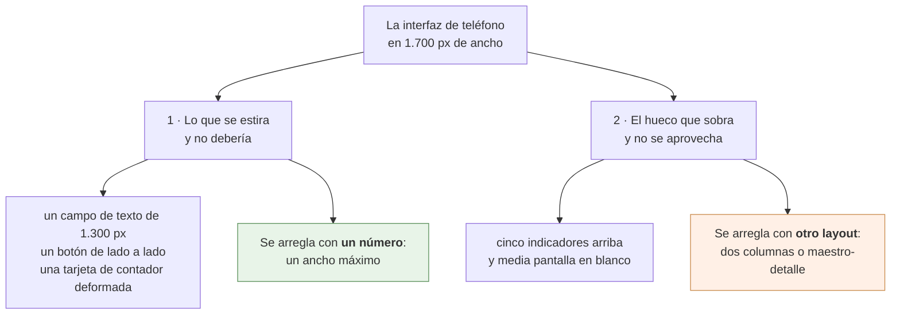
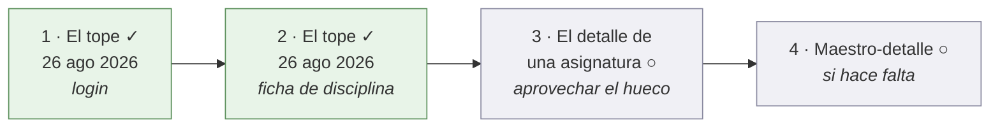

# Tablets

La app **funciona** en una tablet desde el primer día: nada se rompe, nada da
error, todo se puede tocar. Lo que no tiene es **un layout propio** — es la
interfaz de teléfono ocupando todo el ancho.

Este documento existe porque «se ve raro en tablet» no es una tarea: hay que
saber *dónde* se ve raro, *por qué*, y cuál de los dos problemas distintos que
se esconden ahí dentro es el que toca resolver.

Los diagramas son [Mermaid](https://mermaid.js.org). Para verlos dibujados en VS
Code, extensión `bierner.markdown-mermaid` y vista previa con `⌘K V`; en GitHub
se ven solos.

## Son dos problemas, no uno

Y confundirlos es la forma de hacer el doble de trabajo del necesario.

**El primero es barato y el segundo no.** El primero es un tope: se escribe una
vez, no cambia nada en el teléfono y se puede comprobar con una prueba. El
segundo es rediseñar una pantalla, y hay que hacerlo pantalla por pantalla
porque cada una aprovecha el hueco de una forma distinta.

Por eso el orden es ése, y por eso el primero no espera al segundo.

## Dónde se nota, medido y no supuesto

Salió al sacar las capturas de la ficha de Play el 25 de agosto de 2026, en un
emulador de Pixel Tablet.

| Pantalla | Cómo queda | Cuál de los dos problemas |
|---|---|---|
| Notas «por alumno», asistencia, disciplina | **Bien.** Son listas, y a lo ancho caben 15 alumnos en vez de 7 | ninguno |
| Detalle de una asignatura | **Mal.** Cinco indicadores arriba y media pantalla en blanco debajo | el 2 — **queda**, fase 3 |
| Login | Regular. Los campos ocupan todo el ancho y quedan desproporcionados | el 1 — **hecho**, fase 1 |
| Ficha de disciplina de un alumno | Regular. Las tarjetas de contadores se estiran de más | el 1 — **hecho**, fase 2 |

**Las listas quedan bien y no hay que tocarlas.** Merece decirlo porque la
tentación al abordar «tablets» es rediseñarlo todo: una lista de alumnos a lo
ancho es *mejor* en tablet que en teléfono, sin hacer nada. Las capturas que se
subieron a Play son de las tres pantallas que ya quedan bien, a propósito — pero
eso quitó una etiqueta, no resolvió el fondo.

## Las fases

### Fase 1 — el tope, y el login. Hecha

**26 de agosto de 2026.** [Anchos](../lib/Utils/Anchos.dart), y los tres
controles del login pasan a pedirle a él cuánto miden.

La regla no es «proporcional» ni «fijo» sino **proporcional con tope**: en un
teléfono manda la proporción y **no cambia absolutamente nada**; en una tablet
manda el tope y el control se queda centrado con aire a los lados. El tope son
420 px, que es aproximadamente un teléfono grande — o sea que en tablet el
formulario se ve como se diseñó, centrado, en vez de como una versión estirada
de sí mismo.

De paso arregla algo que ya estaba mal antes de las tablets: **la banda del
login estaba escrita tres veces**. `InputContainer`, `RoundedButton` y la
casilla de «recordar mis datos» ponían cada uno su `size.width * 0.8`, y el
comentario de uno de ellos avisaba de que los otros dos hacían lo mismo. Los
tres tienen que medir igual o se ve un escalón entre ellos, así que eran tres
sitios donde cambiar una decisión que es una.

Cinco pruebas en [anchos_test](../test/anchos_test.dart), y la que más importa
es la primera: **en un teléfono la banda sigue siendo el 80% exacto de antes**.
Esto no puede tocar la pantalla que usa todo el mundo.

### Fase 2 — el tope en la ficha de disciplina. Hecha

**26 de agosto de 2026.** [ColumnaDeFicha](../lib/Widgets/ColumnaDeFicha.dart)
envolviendo el `ListView` de [FichaDisciplinaScreen](../lib/Screens/FichaDisciplinaScreen.dart),
con su propio tope: `Anchos.ficha`, 720 px.

**Una ficha no es un formulario y no lleva el mismo número.** 420 px es el ancho
de un campo de texto; una ficha aguanta casi el doble porque lo que lleva dentro
son bloques —una fila de tres contadores, una lista de situaciones con su fecha
y su docente— y no un renglón que el ojo tenga que seguir de punta a punta.
Apretarla a 420 desperdiciaría la tablet en la dirección contraria. Hay una
prueba que se pone en rojo si alguien unifica las dos constantes, para que tenga
que leer este párrafo antes.

**Y aquí se descartó una idea que este documento traía escrita.** La fase 2
decía que las tarjetas de contadores «probablemente» quedaban mejor con un
`Wrap` que las dejara fluir. Es falso: **son exactamente tres y siempre tres**
—uniforme, tardanzas, ausencias—, así que un `Wrap` no las reacomoda, no hay
cuartas que quepan y lo único que haría es no arreglar nada. El `Wrap` es la
respuesta cuando la colección crece; ésta no crece.

El tope, además, arregla de paso algo que no estaba en la lista de lo medido: la
**descripción de una situación** sí es un renglón corrido, y a 1.700 px no se
lee. Se ganó envolviendo la lista entera en vez de solo la fila de contadores —
que es también por qué el envoltorio va por fuera del scroll y no por dentro: si
se pone por dentro, cada fila se centra por su cuenta y los separadores siguen
yendo de punta a punta, que se ve peor que no hacer nada.

**Las otras fichas no se tocan**, y no por falta de tiempo: «notas por alumno» y
«asistencia» se midieron **bien** en el Pixel Tablet. Cambiar algo medido como
bueno porque se parece a algo medido como regular es exactamente lo que este
documento existe para evitar.

### Fase 3 — el detalle de una asignatura

**La única que está francamente mal**, y la única que no se arregla con un
número. Cinco indicadores arriba y media pantalla en blanco debajo: el problema
no es que algo se estire, es que el hueco no se usa.

Dos caminos, y hay que elegir mirando la pantalla y no en abstracto: dos
columnas, o el patrón maestro-detalle. La navegación de esta app
—grupo → alumno → ficha— pide a gritos el segundo, pero eso es la fase 4 y es
mucho más grande.

### Fase 4 — maestro-detalle, si hace falta

Enseñar la lista a la izquierda y la ficha del seleccionado a la derecha, en vez
de navegar de una pantalla a otra. Es lo que mejor aprovecha una tablet y es,
con diferencia, lo más caro: cambia la navegación, no el layout, así que toca el
router y el estado de cada pantalla que lo adopte.

**No se empieza sin haber hecho la 3.** Puede que con dos columnas ya sobre.

## Lo que este frente NO va a hacer

- **Un sistema de *breakpoints*.** `Anchos` es un número máximo, no un
  framework, y no hay que convertirlo en uno. La app tiene un problema concreto
  en un sitio concreto; un sistema de puntos de ruptura es la solución a un
  problema que esta app no tiene, y se paga en cada pantalla que se escriba
  después.
- **Tocar las listas.** Ya quedan bien. A lo ancho caben 15 alumnos en vez de 7,
  que es exactamente lo que se quiere de una tablet.
- **Un layout de escritorio.** La app es de teléfono y de tablet. La web
  administrativa es otra cosa y existe.

## Por qué esto no bloquea nada

Ninguna de las cuatro fases es condición de nada: ni de la publicación en Play,
ni del backend, ni de las notificaciones. La app funciona en tablet hoy. Esto es
mejorar algo que ya sirve, y por eso puede esperar y por eso se puede hacer a
trozos.
