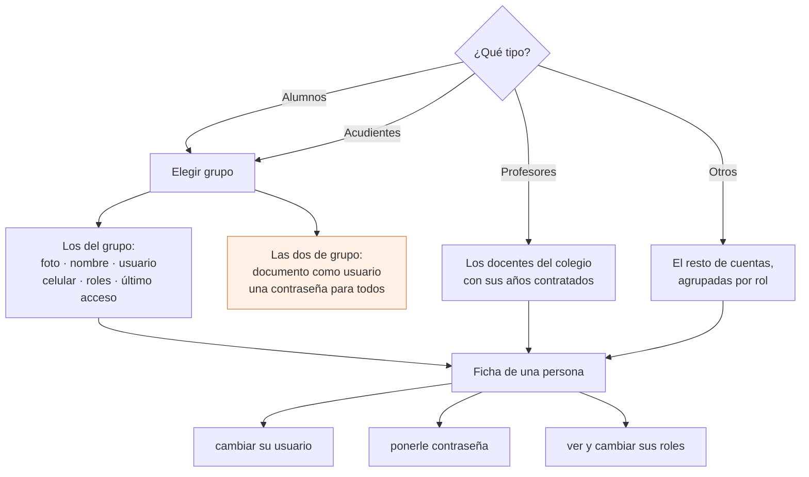

# Las cuentas del colegio

La pantalla con la que un superusuario o un secretario arregla lo que se rompe
todos los días: «no me deja entrar», «se me olvidó la clave», «este niño no
tiene usuario». Hoy eso se hace desde la plataforma web, y es **la única tarea
administrativa que sí es diaria** —por eso viene a la app y los ordinales del
manual no, ver [configuracion.md](configuracion.md)—.

**Estado: fase 1 hecha, y desde el 26 de agosto de 2026 con el nombre de usuario
encendido.** Quedan tres cosas apagadas esperando al servidor; lo apagado y el
porqué, en «[Lo que está apagado](#lo-que-está-apagado-y-por-qué)». Nada se
enciende hasta que lo que espera esté **desplegado en los quince colegios**, que
no es lo mismo que escrito ni que fusionado.

**Son quince y no dieciséis desde el 25 de agosto de 2026**: uno se dio de baja y
se borró del servidor, y además nunca estuvo en ninguna tanda porque no tenía ni
repositorio git ni aplicación. La cifra no es un detalle de redacción: es la
condición de encendido, y escrita como «los dieciséis» no se puede cumplir nunca.

## La pantalla que se viene a sustituir

En el front web es `UsuariosCtrl`, y es una rejilla con **las 2.279 personas del
colegio en una sola tabla**, sin distinguir un alumno de un rector. La trae
`GET perfiles/usuariosall`, que hace la unión de cuatro consultas y después,
**fila a fila**, un `User::find()`, un `roles()->get()` y un `permissions()`
(`PerfilesController.php:820-832`). Son tres consultas por persona: **unas 6.800
por pantallazo**, en un hosting compartido, para pintar una tabla en la que hay
que buscar con el filtro de columna porque no cabe de otra forma.

Medido y confirmado con la sesión del backend el 23 de agosto de 2026. Esta
pantalla no repite eso: **nunca pide más de un grupo a la vez**, que son treinta
o cuarenta personas.

### De dónde salen estas cifras, y qué no sostienen

`2.279`, `6.800`, `1.280`, `51 docentes` y `2.355 nombres de usuario` aparecen
repetidos por este documento y por `lib/`. Los cinco vienen de **la misma
medición del 23 de agosto de 2026**, hecha sobre **un colegio**, y este
documento nunca dijo cuál. Son quince, de tamaños distintos: en uno pequeño
esos números son otros.

Se recuentan así, y por eso se dejan escritos aquí en vez de en catorce sitios:

| Cifra | De dónde |
|---|---|
| 2.279 personas | lo que devuelve `GET perfiles/usuariosall` |
| ~6.800 consultas | tres por fila —`User::find()`, `roles()->get()`, `permissions()`— en `PerfilesController.php:820-832`, por 2.279 |
| 1.280 alumnos | el alcance de `cambiar-usuarios/*`, el de colegio entero |
| 51 docentes | los que podían renombrar cualquier cuenta antes de la guarda de `0e7208c` |

**Y lo que hay que entender antes de citar cualquiera de ellas: el argumento no
depende del número.** Lo que hace correcto no pedir nunca más de un grupo no es
que sean 2.279: es que **es el colegio entero contra treinta**. Un colegio de
400 personas tiene el mismo problema con otro número, y si mañana ese colegio
crece a 3.000 no hay que corregir nada más que estas filas.

Así que las cifras están para dar la escala, no para sostener la decisión — y
citarlas como si fueran una constante de los quince es un error que este
documento cometió catorce veces antes de escribir este apartado.

## Por dónde se entra

Los cuatro tipos son chips y no un desplegable, y el grupo se elige con
`CampoGrupo`, el mismo de disciplina y de notas. **Elegir a una persona sí es con
foto** —es la regla del proyecto— pero aquí no se elige a una persona: se elige
un montón para mirarlo, y eso es una lista.

El grupo solo aparece con Alumnos y con Acudientes. Un docente no pertenece a un
grupo y las cuentas de «Otros» tampoco.

### Qué se ve de cada quien

| | Alumnos | Acudientes | Profesores | Otros |
|---|---|---|---|---|
| Foto, nombre completo, usuario | sí | sí | sí | sí (sin foto ni nombre: no tienen ficha) |
| Celular | sí | sí | sí | — |
| Documento | sí | sí | — | — |
| Roles y último acceso | sí | sí | sí | sí |
| Además | | **sus acudidos, con foto** | **los años contratados** | agrupados por rol |

Lo de los acudidos no es adorno. Un acudiente se llama «Luz Marina Ospina» y eso
no le dice nada a nadie en secretaría; «la mamá de Sara y de Juan David» sí. Y
son **todos** sus acudidos, no solo los del grupo por el que se llegó: quien
tiene un hijo en 3-A y otro en 9-B es la misma persona con la misma cuenta.

### Las dos operaciones de grupo

Solo con Alumnos y con Acudientes, y solo para quien administra cuentas:

1. **Poner el documento como usuario.** Copia `documento` en `username` para todo
   el grupo. Es lo que se hace al empezar el año, cuando llegan los nuevos con
   usuarios inventados.
2. **Una contraseña para todo el grupo.** Se escribe una y queda esa para los
   treinta.

Las dos piden confirmación diciendo **el nombre del grupo y cuántas personas**,
porque las dos son irreversibles: el hash anterior no se guarda en ninguna parte.
Y las dos tienen que contestar **cuántas cambiaron de cuántas**, no «Listo»: en la
del documento, el `UPDATE IGNORE` del servidor se salta en silencio a quien no
tiene documento y a quien chocaría con el `UNIQUE` de `users.username`, y en un
grupo de treinta eso son varios. Un «Listo» que en realidad dejó a tres sin tocar
es peor que un error, porque nadie va a comprobarlo.

**No están para profesores ni para Otros**, y eso lo pidió Joseth. La razón se
sostiene sola: son operaciones de matrícula, sobre gente que entra en bloque cada
año. Un docente tiene su cuenta desde hace ocho años.

## Quién entra

En la app, el menú la enseña a quien administra cuentas: superusuario, rol
`Admin` o rol `Secretario`, que es el mismo criterio que
`Autoriza::esAdministrativo` en el servidor.

**Y como siempre: esto es alcance, no permiso.** Esconder un botón no niega nada;
lo que niega es la guarda del servidor. Aquí eso importa más que en otras
pantallas, porque hay una asimetría real entre dos guardas que ya existen:

| Operación | Hoy la puede hacer |
|---|---|
| `alumnos/cambiar-claves` — un grupo | superusuario |
| `cambiar-usuarios/*` — el colegio entero | superusuario **o** secretario |

O sea que el día que exista un secretario —el rol se creó el 21 de agosto de 2026
y no lo tiene nadie— va a poder reescribir la contraseña de los 1.280 alumnos del
colegio y no la de los treinta de un grupo.

**Y al llevárselo al backend pasaron dos cosas, en este orden.** La primera fue
que barrieron los dos criterios por todo `app/` y encontraron el patrón escrito
tres veces con las mismas palabras —en grupos, en profesores y en years—: ante
la duda, `esSuperusuario`, porque subir a `esAdministrativo` le regala a un rol
futuro algo que nadie concedió. Con eso, la lectura pasó a ser la contraria a la
mía: no es que la de grupo esté injustamente cerrada, sino que las cuatro de
colegio entero estarían abiertas de más. Y encima su propio comentario cita como
precedente la papelera de grupos y profesores, que usa el criterio contrario al
que ellas llevan.

**La segunda fue que eso resultó ser falso, y merece quedar escrito porque el
método falló de una forma que se repite.** Al ir a bajarlas apareció una frase
de Joseth del 21 de agosto de 2026:

> «Puede cambiarle la contraseña/username a los alumnos y acudientes solamente»

Las cuatro `cambiar-usuarios/*` son exactamente eso. Su `esAdministrativo` **no
es un descuido: es esa decisión, implementada.** Lo que nadie había mirado es
dónde vivía la frase: **en un test** —`SecretarioTest`—, no en el código que la
aplica ni en ningún docblock. Se barrieron `Autoriza`, los controladores y sus
comentarios, y se midió bien sobre la población equivocada. En este repositorio
una decisión puede estar viva en una prueba y en ningún otro sitio.

Lo que sí era un desliz, y solo eso, es el comentario que cita mal el
precedente. Ya está corregido; el guard no se tocó.

**Cómo quedó.** Joseth eligió repartir por alcance, y de las dos mitades se hizo
la de abajo:

| | Quién puede |
|---|---|
| **Un grupo** — `cambiar-claves` y las por-grupo que se escriban | superusuario **o** secretario ✓ hecho |
| **El colegio entero** — `cambiar-usuarios/*` | superusuario o secretario hoy; pendiente de confirmar |

O sea que lo que esta pantalla necesitaba —que un secretario pueda arreglar las
cuentas de un grupo— **ya está resuelto y desplegado**: va en el commit
`0e7208c`, dentro de la tanda `eb95cbc` que corre en los quince desde el 25 ago
2026. Y no pasó de superusuario a «superusuario o secretario» sino a
**`esAdministrativo`**, que es el criterio ordenado por alcance: la de un grupo
pedía más que la del colegio entero, que son 1.280 alumnos.

Hoy eso no le da el botón a nadie nuevo —cero `Secretario` en la base, y los diez
`Admin` son los mismos diez `is_superuser`—, pero **la app no debe cablear
`is_superuser` para pintarlo**. No lo hace: usa `administraCuentas`, que es
superusuario, `admin` o `secretario`.

La app no lo decide ni lo puede arreglar, y por eso **la pantalla ya no escribe
en su código quién puede hacer cada cosa**: cuando el servidor dice que no, lo
dice con el criterio exacto dentro del 403 —`Autoriza::exigir` corta con su
mensaje— y la app enseña ese, no uno suyo. Una frase escrita en la app envejece
sin avisar el día que se despliega un cambio de guarda, y los quince colegios no
se actualizan a la vez. La nuestra queda de respaldo, para cuando el servidor no
explica nada.

### Y hoy la contraseña de grupo alcanza a más gente de la que se ve

`alumnos/cambiar-claves` no filtraba ni el estado de la matrícula ni las cuentas
en la papelera, al contrario que su vecina de colegio entero, que sí lleva
`u.deleted_at is null`. O sea que además de los treinta que la pantalla enseña,
le cambia la contraseña **a los retirados de ese grupo y a las cuentas
borradas**. Que no era intención lo demuestra el vecino y no una opinión: el
docblock de esa función argumenta largo sobre *quién* puede llamarla y ni una
línea sobre *a quién* alcanza.

**Arreglado y desplegado desde el 25 de agosto de 2026** —commit `0e7208c`,
dentro de la tanda `eb95cbc`—: filtra MATR/ASIS, deja fuera las borradas y
contesta `{"resultado": "Cambiadas", "cambiadas": 31}`, con lo que **el número
cuadra con la lista que la pantalla pinta**: era justo el caso de «31 de 34».

`PendientesUsuarios.cambiarClavesArreglado` **se encendió el 26 ago 2026**, y lo
único que cambia es una frase: la confirmación ya no avisa de a quién más
alcanza, porque ya no alcanza a nadie más. El número, en cambio, nunca colgó de
un interruptor: se lee de la respuesta si viene, así que aparece solo cuando el
servidor lo manda.

## De dónde sale cada dato

Lo que ya existe y la app llama:

| Para qué | Endpoint | Trae |
|---|---|---|
| Los grupos del año | `GET grupos` | id, nombre, abreviatura, grado, titular |
| Alumnos de un grupo | `GET grupos/listado/{grupo_id}` | usuario, nombre, foto |
| Acudientes de un grupo | `PUT acudientes/datos` con `{grupo_actual:{id}}` | usuario, nombre, foto, celular, documento, parentesco y **sus acudidos** |
| Los docentes | `GET profesores/conyears` | nombre, foto, y los años contratados |
| El catálogo de roles | `GET roles` | id y nombre |
| Ponerle contraseña a alguien | `PUT perfiles/reset-password/{id}` con `{password}` | |
| Contraseña a un grupo de alumnos | `PUT alumnos/cambiar-claves` con `{clave, grupo_id}` | cuántas cambió, cuando el servidor esté al día |
| Poner y quitar un rol | `PUT roles/addroletouser/{id}` y `removeroletouser/{id}` con `{user_id}` | |
| ¿Está libre este usuario? | `GET perfiles/comprobarusername/{username}` | |

Dos trampas de los que ya existen, y las dos están anotadas donde se leen:

- **`acudientes/datos` trae los acudidos dentro de la maqueta de la rejilla de
  Angular.** Cada acudiente llega con un `subGridOptions` que son los
  `columnDefs` del front web —anchos de columna y rutas de plantillas
  `.tpl.html`—, y los acudidos están en su `data`. La app los lee de ahí porque
  es donde están hoy, con el comentario puesto: el día que el servidor los mande
  como lista llana, se cambia una línea. Es además un N+1 —una consulta por
  acudiente— y está pedido.
- **`grupos/listado` no trae celular ni documento**, así que en Alumnos esas dos
  columnas salen vacías hasta que el servidor las añada. Los únicos sitios que
  hoy tienen el celular de un alumno son `GET alumnos` y `alumnos/sin-matriculas`,
  y los dos son del colegio entero: pedir 1.280 filas para pintar treinta es
  exactamente lo que esta pantalla existe para no hacer.

## Lo que falta en el servidor

Hablado con la sesión del backend el 23 de agosto de 2026, punto por punto. El
backend es de solo lectura para esta app —ver
[backend-pendiente.md](backend-pendiente.md)—, así que esto es una petición y
**los ocho siguen sin autorizar**: de las tres cosas que se le llevaron a Joseth
ese día contestó las dos primeras —la guarda de `guardar-username` y el reparto
de las masivas—, y las rutas nuevas no. Están anotadas en el
`09-pendientes.md` §12 del backend con esta misma lista.

1. **El último acceso.** No hay columna ni endpoint. La respuesta del backend
   corrigió el planteamiento: `historiales` sí lo escriben las tres puertas de
   login —`auth/login`, `login` y `login/credentials` pasan todas por
   `Login::entrar() → anotarEntrada()`—, **pero anota cuándo alguien tecleó la
   contraseña, no cuándo usó el sistema**. El refresco dura catorce días y rota
   en cada uso, así que quien abre la app cada semana no vuelve a hacer login
   nunca: su fila puede tener cuatro meses mientras entra a diario. En la app,
   que es la que menos login hace, ese es el caso mayoritario. Lo que se pidió:

       ultimo_acceso = GREATEST(MAX(historiales.created_at),
                                MAX(personal_access_tokens.last_used_at))

   `last_used_at` se escribe con un freno de cinco minutos y sobrevive unos
   veintiún días desde el último uso; pasado eso queda `historiales` de suelo.
   **La pantalla enseña un solo dato y lo llama «Última vez»**, no dos: en una
   ficha de teléfono, «último login» y «última actividad» uno encima del otro se
   leen como un error de la app, y quien mira esto quiere saber una cosa —si esa
   cuenta se usa— y no auditar sesiones.
2. **Los roles de un listado.** Hoy solo salen por `usuariosall`, con las tres
   consultas por fila. Queda como endpoint suelto —`PUT usuarios/roles-de` con
   `{user_ids: []}`— y no como campo dentro de los listados: así no se tocan
   cuatro respuestas que hoy consume el front web, y es exactamente la consulta
   con `IN` que hace falta.
3. **Los acudidos como lista llana** y sin el `subGridOptions`, y sin el N+1.
4. **`celular` y `documento`** en el listado de alumnos del grupo.
5. **`username`, `celular` y `ultimo_acceso`** en `profesores/conyears`, y sus
   años con un `IN` en vez de una consulta por profesor.
6. **Documento como usuario, acotado al grupo**, para alumnos y para acudientes.
   No existe en ninguna forma: las de `cambiar-usuarios/*` son de colegio entero.
7. **Una contraseña para los acudientes de un grupo**, la gemela de
   `alumnos/cambiar-claves`.
8. **«Otros»**: las cuentas que no son profesor, alumno ni acudiente, con sus
   roles. Es el tercer bloque del `union` de `usuariosall`, y son pocas.

De los dos, **`grupo_id` va obligatorio y en rutas nuevas**, no como parámetro
opcional de las de hoy. El motivo lo puso el backend y es mejor que el que yo
llevaba: un `grupo_id` opcional deja el comportamiento peligroso —el colegio
entero— como valor por defecto de un campo ausente, que es la trampa que este
repo ya tiene catalogada dos veces («un campo que no se manda no es un campo que
no cambia, es un campo que se pisa»). Y las dos devuelven
`{intentadas, cambiadas, omitidas: [{persona_id, nombre, motivo}]}`, con motivo
`sin_documento` o `username_ocupado`: sin la lista, la pantalla puede decir «31
de 34» pero no cuáles tres, que es justo lo que va a preguntar quien lo hizo.

## Lo que está apagado, y por qué

Cinco interruptores en un solo sitio, [PendientesUsuarios](../lib/Http/UsuariosApi.dart).
Cada uno se enciende con una palabra el día que su motivo desaparezca — y ese
día no es cuando el backend lo escriba **ni cuando lo fusione**, sino **cuando
esté desplegado en los quince colegios**: `app/` es copia por colegio y
myvc_flutter es una sola app para todos.

Y «desplegado» se comprueba por el **hash de la tanda**, no por `main`: lo que
corre en los quince es el commit que Joseth verificó igual en todos, y `main` va
por delante. Preguntar «¿está en `main`?» es la pregunta equivocada, y es la que
tuvo dos de estos apagados tres días de más.

| Interruptor | Motivo por el que se apagó | Estado |
|---|---|---|
| Cambiar el nombre de usuario | **Era una puerta abierta en el servidor** (abajo) | **encendido** 26 ago 2026 |
| El aviso de a quién más alcanza la contraseña de grupo | alcanzaba a retirados y borrados | **encendido** 26 ago 2026 |
| Los roles de cada persona | no hay de dónde sacarlos sin traer las 2.279 | apagado — falta el punto 2 |
| El último acceso | no existe | apagado — falta el punto 1 |
| Documento como usuario, y contraseña a un grupo de acudientes | no existen | apagado — faltan los puntos 6 y 7 |

Lo que **no** lleva interruptor, a propósito: el número de cuántas contraseñas
cambiaron y el motivo con el que el servidor rechaza algo. Los dos se leen de la
respuesta si vienen, así que valen igual antes y después del despliegue y no hay
nada que acordarse de encender.

**Lo del nombre de usuario merece su párrafo, porque fue lo único que se apagó
por una razón que no era «todavía no existe».** `PUT perfiles/guardar-username/{id}`
estaba desplegado y funcionaba, y lleva `persona.propia:user_id`; ese guard deja
pasar de largo a todo el que no sea alumno ni acudiente
(`ExigirPersonaPropia.php:80-82`), y el controlador solo comprobaba que el nombre
no viniera vacío. O sea que **cualquiera de los 51 docentes le cambiaba el nombre
de usuario a cualquier cuenta, incluida la de un superusuario**, y como
`users.username` es `UNIQUE`, eso dejaba a alguien fuera del sistema en una
petición. Es el hermano de `reset-password`, donde la revisión sí ancló el
objetivo, y que se había quedado sin hacer.

Lo encontró esta sesión leyendo el backend para escribir la pantalla, lo confirmó
línea por línea la sesión del backend, y fue a Joseth **como cosa aparte y por
delante de esta pantalla**.

**Arreglado y desplegado desde el 25 de agosto de 2026**, commit `0e7208c` dentro
de la tanda `eb95cbc`. Quedó anclado al objetivo, copiando el criterio del
hermano `reset-password`: un superusuario a cualquiera; cada quien el suyo —un
alumno sigue pudiendo cambiarse el nombre de usuario—; un docente con
`profes_can_edit_alumnos`, solo el de un alumno; y 403 para todo lo demás. Y de
paso, **un nombre ocupado contesta 422** en vez del 500 de MySQL que salía antes
—mirando también entre los borrados, porque el nombre de una cuenta borrada sigue
ocupado—, que es lo que hace falta para enseñar «ese nombre ya está en uso» en
lugar de un error genérico.

**El botón se encendió el 26 de agosto de 2026.** Y hay una trampa que conviene
dejar escrita, porque es la que lo tuvo apagado tres días de más: **la ruta sigue
diciendo `persona.propia:user_id`**. No es un olvido — lo que cierra el agujero
está dentro del método, no en el middleware. Quien vaya a comprobar la guarda
leyendo `routes/` verá el guard viejo y sacará la conclusión falsa.

## Las fases

| Fase | Qué | Estado |
|---|---|---|
| 1 | El armazón: tipos, grupo, listados de alumnos, acudientes y docentes, ficha con contraseña, y la contraseña para un grupo de alumnos | hecha |
| 2 | Roles y último acceso en la ficha y en la lista | esperando los puntos 1 y 2 |
| 3 | «Otros», agrupados por rol | esperando el punto 8 |
| 4 | Las dos de grupo que faltan, y el nombre de usuario | el nombre de usuario, hecho ✓; las dos de grupo esperan los puntos 6 y 7 |

## Lo que esta pantalla no hace, a propósito

- **No crea cuentas ni las borra.** Crear va con la matrícula y borrar es
  `forcedelete`, que en el servidor arrastra veinte tablas en cascada y está
  anclado a superusuario por escrito. Ninguna de las dos es una tarea de estar de
  pie.
- **No edita la ficha de la persona** —dirección, correo, fecha de nacimiento—.
  Eso es la plataforma web. Aquí se toca la **cuenta**: usuario, contraseña,
  roles.
- **No enseña los permisos, solo los roles.** Los permisos cuelgan del rol y se
  configuran una vez; verlos aquí sería enseñar un árbol para no tocarlo.
